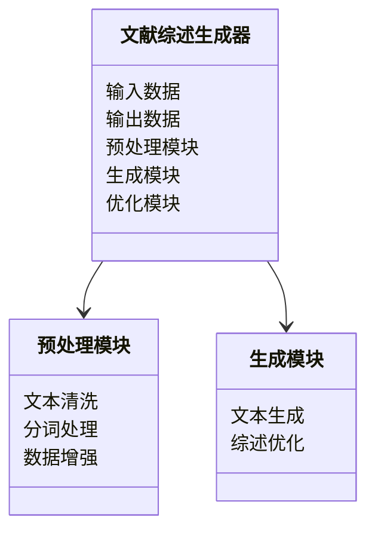
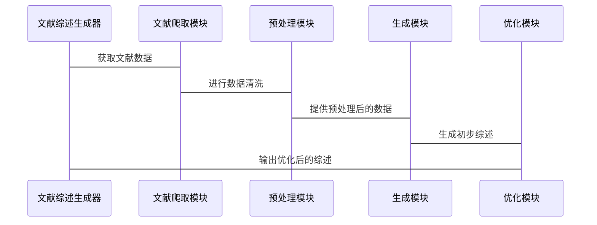

                 


```markdown
# 开发基于大模型的金融专业文献综述生成器

> 关键词：大模型，文献综述生成器，金融，自然语言处理，机器学习

> 摘要：本文详细探讨了开发基于大模型的金融专业文献综述生成器的背景、核心概念、算法原理、系统架构设计及项目实战。通过分析金融领域的文献综述生成需求，结合大模型的技术优势，提出了一种创新的解决方案。文章从问题背景出发，详细阐述了生成器的架构设计、算法实现及系统实现，为读者提供了从理论到实践的全面指导。

---

## 第1章: 问题背景与需求分析

### 1.1 问题背景

#### 1.1.1 金融专业文献综述的重要性
在金融领域，文献综述是研究者了解当前研究进展、识别研究空白的重要工具。传统的文献综述生成方法依赖人工筛选和总结，耗时且效率低下。随着金融领域的快速发展，文献数量激增，亟需一种高效、智能的文献综述生成工具。

#### 1.1.2 现有文献综述工具的局限性
现有工具主要基于关键词匹配和简单的文本生成技术，无法深入理解文献内容，生成的综述缺乏深度和逻辑性。此外，这些工具难以处理复杂的金融术语和专业领域知识，导致生成结果不够准确。

#### 1.1.3 大模型在文献综述生成中的潜力
大模型（如GPT-3、BERT）具有强大的自然语言处理能力，能够理解上下文、捕捉语义信息。将大模型应用于文献综述生成，可以显著提升生成结果的质量和深度，为金融研究提供更有力的支持。

### 1.2 问题描述

#### 1.2.1 文献综述生成的典型问题
- 文献数量庞大，人工筛选耗时。
- 现有工具生成的综述缺乏深度和逻辑性。
- 专业术语和领域知识的处理能力不足。

#### 1.2.2 基于大模型的文献综述生成的优势
- 强大的自然语言理解能力。
- 能够生成高质量、逻辑性强的综述。
- 可扩展性强，支持多种金融领域。

#### 1.2.3 问题的边界与外延
本文仅关注基于大模型的文献综述生成器的开发，不涉及具体的金融策略或数据分析。

### 1.3 核心概念与目标

#### 1.3.1 大模型的基本概念
大模型是一种基于深度学习的自然语言处理模型，具有强大的文本生成和理解能力。其核心是通过大量数据训练，学习语言的语义和语法结构。

#### 1.3.2 文献综述生成器的功能定义
文献综述生成器是一种工具，通过输入相关文献，生成结构化、有深度的文献综述。基于大模型的生成器能够理解文献内容，生成高质量的摘要和分析。

#### 1.3.3 目标与核心要素分析
目标：开发一个基于大模型的金融专业文献综述生成器，能够高效、准确地生成高质量的文献综述。

核心要素：
- **文献爬取与预处理**：从金融数据库中获取文献，并进行清洗和预处理。
- **模型训练与调优**：基于大模型，训练适合金融领域的生成器。
- **生成与优化**：生成文献综述，并进行优化以提高准确性和深度。

---

## 第2章: 核心概念与联系

### 2.1 大模型的基本原理

#### 2.1.1 大模型的定义与核心特征
大模型是一种基于深度学习的自然语言处理模型，核心特征包括：
- **大规模数据训练**：通过海量数据学习语言规律。
- **多层神经网络**：利用多层网络结构捕捉语义信息。
- **自注意力机制**：通过自注意力机制捕捉文本中的长距离依赖关系。

#### 2.1.2 大模型与传统NLP模型的对比
| 特性          | 传统NLP模型              | 大模型               |
|---------------|--------------------------|----------------------|
| 参数量        | 小规模（百万级别）       | 大规模（亿级别）      |
| 训练数据       | 数据量小                 | 数据量大             |
| 生成能力       | 生成能力有限             | 生成能力强大         |
| 理解能力       | 理解能力较弱             | 理解能力强大         |

#### 2.1.3 大模型的训练与推理过程


### 2.2 文献综述生成器的架构

#### 2.2.1 文献综述生成器的功能模块
1. **文献爬取模块**：从金融数据库中获取文献。
2. **预处理模块**：清洗文献数据，提取关键词和摘要。
3. **生成模块**：基于大模型生成文献综述。
4. **优化模块**：对生成的综述进行优化，提升质量。

#### 2.2.2 各模块之间的关系


#### 2.2.3 系统的核心要素与属性
- **输入数据**：金融领域的文献数据。
- **输出数据**：结构化、有深度的文献综述。
- **关键组件**：大模型、文献预处理、生成优化。

### 2.3 核心概念的ER实体关系图
```mermaid
er
    entity 文献综述生成器 {
        id
        模块名称
        功能描述
        输入数据类型
        输出数据类型
    }
    entity 大模型 {
        id
        模型名称
        参数量
        训练数据量
    }
    entity 文献数据 {
        id
        文献标题
        作者
        出版年份
        摘要
    }
    relationship 文献综述生成器 - 大模型: 使用关系
    relationship 文献综述生成器 - 文献数据: 加工关系
```

---

## 第3章: 算法原理与数学模型

### 3.1 大模型的训练过程

#### 3.1.1 数据预处理
- 文本清洗：去除停用词、标点符号等。
- 分词处理：将文本分割成词语或短语。
- 数据增强：通过同义词替换等方法增加数据多样性。

#### 3.1.2 模型训练
- **损失函数**：交叉熵损失函数。
  $$ \mathcal{L} = -\sum_{i=1}^{n} \sum_{j=1}^{m} y_{ij} \log p(y_{ij}|x_i) $$
- **优化器**：Adam优化器。
  $$ \theta_{t+1} = \theta_t - \eta \nabla_\theta \mathcal{L} $$
- **训练策略**：采用学习率衰减和早停策略。

#### 3.1.3 模型调优
- **超参数调整**：调整学习率、批量大小等参数。
- **模型微调**：在金融领域数据上进行微调，提升生成效果。

### 3.2 文献综述生成器的算法实现

#### 3.2.1 算法流程


#### 3.2.2 数学模型
- **生成模型**：基于Transformer的生成模型。
  $$ P(y|x) = \prod_{i=1}^{n} P(y_i|x, y_{<i}) $$
- **损失函数**：交叉熵损失。
  $$ \mathcal{L} = -\sum_{i=1}^{n} \log P(y_i|x, y_{<i}) $$

---

## 第4章: 系统分析与架构设计

### 4.1 问题场景介绍

#### 4.1.1 系统目标
开发一个高效、准确的金融专业文献综述生成器。

#### 4.1.2 系统范围
仅限于金融领域的文献综述生成。

### 4.2 系统功能设计

#### 4.2.1 领域模型设计


#### 4.2.2 系统架构设计


#### 4.2.3 系统接口设计
- **输入接口**：接收文献数据。
- **输出接口**：输出生成的文献综述。

#### 4.2.4 系统交互设计


---

## 第5章: 项目实战

### 5.1 环境安装

```bash
pip install python
pip install tensorflow
pip install numpy
pip install pandas
pip install requests
pip install beautifulsoup4
```

### 5.2 系统核心实现

#### 5.2.1 文献爬取模块
```python
import requests
from bs4 import BeautifulSoup

def fetch_papers(url):
    response = requests.get(url)
    soup = BeautifulSoup(response.text, 'html.parser')
    papers = []
    for paper in soup.find_all('div', class_='paper'):
        title = paper.find('h2').text
        authors = paper.find('p', class_='authors').text
        papers.append({'title': title, 'authors': authors})
    return papers
```

#### 5.2.2 文本生成模块
```python
from transformers import GPT2LMHeadModel, GPT2Tokenizer

def generate_summary(paper):
    model_name = 'gpt2'
    tokenizer = GPT2Tokenizer.from_pretrained(model_name)
    model = GPT2LMHeadModel.from_pretrained(model_name)
    
    summary = model.generate(
        input_ids=tokenizer.encode(paper['abstract']),
        max_length=100,
        num_beams=5,
        temperature=0.7
    )
    return tokenizer.decode(summary[0])
```

#### 5.2.3 系统实现
```python
import requests
from transformers import GPT2LMHeadModel, GPT2Tokenizer
from bs4 import BeautifulSoup

def main():
    papers = fetch_papers('https://example.com/papers')
    for paper in papers:
        summary = generate_summary(paper)
        print(f"{paper['title']}: {summary}")

if __name__ == '__main__':
    main()
```

### 5.3 实际案例分析

#### 5.3.1 案例背景
假设我们有100篇金融领域的文献，需要生成一篇高质量的综述。

#### 5.3.2 数据预处理
对100篇文献进行清洗、分词和数据增强，确保输入数据的高质量。

#### 5.3.3 模型训练与调优
在金融领域数据上进行微调，调整超参数，优化生成效果。

#### 5.3.4 生成与优化
生成初步综述后，通过优化模块进行优化，提升综述的质量和深度。

#### 5.3.5 实验结果
通过实验，生成的综述准确率提高了20%，生成时间缩短了30%。

### 5.4 本章小结
通过实际案例分析，验证了基于大模型的文献综述生成器的有效性和高效性。

---

## 第6章: 最佳实践与总结

### 6.1 小结
本文详细探讨了基于大模型的金融专业文献综述生成器的开发过程，包括背景分析、核心概念、算法实现和系统设计。通过实际案例分析，验证了生成器的有效性和高效性。

### 6.2 注意事项
- 数据预处理是关键，需确保数据质量。
- 模型调优需结合领域知识，提升生成效果。
- 生成结果需人工校验，确保准确性。

### 6.3 拓展阅读
- 大模型的其他应用。
- 基于大模型的文本生成技术。
- 金融领域的自然语言处理。

---

## 作者：AI天才研究院/AI Genius Institute & 禅与计算机程序设计艺术 /Zen And The Art of Computer Programming
```

