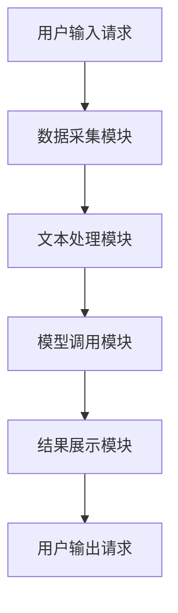

                 


# 开发基于大模型的金融专业文献综述生成器

> 关键词：大模型，自然语言处理，金融，文献综述生成器，机器学习

> 摘要：本文系统地探讨了开发基于大模型的金融专业文献综述生成器的全过程，从问题背景分析到系统设计，再到算法实现和项目实战，全面解析了如何利用大模型技术提升金融文献综述的生成效率与质量。文章结合理论与实践，详细阐述了核心概念、算法原理、系统架构及实际应用案例，为读者提供了一个从零到一的完整开发指南。

---

## 第1章: 问题背景与需求分析

### 1.1 问题背景
#### 1.1.1 金融领域的文献综述现状
金融领域的研究涉及大量的学术论文、研究报告和行业分析，传统的文献综述生成方式通常依赖人工整理和分析，效率低且耗时长。研究人员需要从海量文献中提取关键信息，归纳总结，形成系统的综述报告。

#### 1.1.2 大模型在文献综述中的应用潜力
近年来，大模型（如GPT、BERT等）在自然语言处理领域的突破为文献综述的自动化生成提供了新的可能性。大模型具备强大的语言理解和生成能力，能够从大量文本中提取关键信息，并自动生成结构化的综述内容。

#### 1.1.3 当前技术的局限性与挑战
尽管大模型在文本生成方面表现出色，但在金融领域的专业性、数据稀疏性和实时性需求方面仍面临诸多挑战。例如，金融领域的术语和上下文关系复杂，如何确保生成的综述既准确又符合专业规范是一个亟待解决的问题。

### 1.2 问题描述
#### 1.2.1 文献综述生成的核心问题
文献综述生成的核心问题在于如何从大量异构文本中提取关键信息，并生成结构清晰、内容全面的综述报告。这需要结合文本挖掘、自然语言理解、知识图谱等多种技术。

#### 1.2.2 大模型在金融领域的应用需求
金融领域的文献综述生成需要结合行业特点，例如实时性、专业性、数据敏感性等。大模型需要在金融领域进行微调，以适应特定场景的需求。

#### 1.2.3 用户的具体需求与期望
用户期望生成的金融文献综述应具备以下特点：内容全面、结构清晰、专业性强、生成速度快，并支持定制化需求（如特定主题、时间范围等）。

---

## 第2章: 核心概念与原理

### 2.1 大模型的基本原理
#### 2.1.1 大模型的定义与特点
大模型（如GPT-3、BERT）是一种基于深度学习的自然语言处理模型，具有参数量大、上下文理解能力强、生成能力强等特点。

#### 2.1.2 大模型的训练机制
大模型通常采用大规模预训练（Pre-training）的方式，通过在通用文本数据上进行无监督学习，提取语言的表征能力。在金融领域，还需要进行领域内数据的微调（Fine-tuning）。

#### 2.1.3 大模型的应用场景
大模型在金融领域的应用场景包括：新闻摘要、投资报告生成、风险评估、市场分析等。

### 2.2 金融专业文献综述生成器的架构
#### 2.2.1 文献综述生成的流程
文献综述生成的流程通常包括：数据采集、文本清洗、信息提取、内容生成和结果优化五个阶段。

#### 2.2.2 基于大模型的生成机制
基于大模型的生成机制包括以下几个步骤：
1. 输入：用户输入主题或关键词。
2. 数据处理：系统从文献库中筛选相关文本。
3. 提取：大模型提取关键信息并生成摘要。
4. 综述生成：模型将提取的信息整合成结构化的综述报告。

#### 2.2.3 系统的输入输出关系
- 输入：用户输入的主题、时间范围、文献类型等。
- 输出：生成的文献综述报告，包括引言、研究进展、研究空白、未来方向等内容。

---

## 第3章: 算法原理与实现

### 3.1 大模型的训练过程
#### 3.1.1 数据预处理
- 数据清洗：去除噪声数据、重复内容和无效信息。
- 分词处理：将文本分割成词语或短语。
- 数据增强：通过同义词替换、句式变换等方式增加数据多样性。

#### 3.1.2 模型训练
- 预训练：在通用领域数据上进行无监督学习，提取语言特征。
- 微调：在金融领域数据上进行有监督训练，提升模型的专业性。

#### 3.1.3 模型调优
- 超参数优化：调整学习率、批量大小、训练轮数等参数。
- 模型评估：通过准确率、召回率、F1值等指标评估模型性能。

### 3.2 文献综述生成的算法实现
#### 3.2.1 输入处理
- 用户输入的主题关键词：例如“金融风险管理”。
- 数据清洗与筛选：从文献库中筛选与关键词相关的文献。

#### 3.2.2 模型调用
- 文本提取：模型提取每篇文献的摘要、关键词和主要结论。
- 内容生成：模型根据提取的信息生成综述的各个部分。

#### 3.2.3 输出优化
- 格式调整：将生成的文本格式化为结构化的报告。
- 质量评估：通过人工或自动评估工具检查生成内容的准确性。

---

## 第4章: 系统架构与设计

### 4.1 系统架构设计
#### 4.1.1 系统模块划分
- 数据采集模块：从数据库或互联网获取文献数据。
- 文本处理模块：对文本进行清洗、分词和数据增强。
- 模型调用模块：调用大模型生成综述内容。
- 结果展示模块：将生成的综述以可视化形式呈现。

#### 4.1.2 模块之间的交互关系
1. 数据采集模块将文献数据传递给文本处理模块。
2. 文本处理模块输出 cleaned_data 传递给模型调用模块。
3. 模型调用模块生成 report 并传递给结果展示模块。

#### 4.1.3 系统的扩展性设计
- 支持多种文献类型（如期刊、会议论文、行业报告）。
- 支持多语言生成（如中、英文）。
- 支持实时更新，及时获取最新的文献数据。

### 4.2 系统接口设计
#### 4.2.1 输入接口定义
- 输入格式：JSON格式，包含主题、时间范围、文献类型等参数。
- 输入示例：
  ```json
  {
    "theme": "金融风险管理",
    "time_range": "2020-2023",
    "document_type": ["学术论文", "行业报告"]
  }
  ```

#### 4.2.2 输出接口定义
- 输出格式：结构化的报告，包含引言、研究进展、研究空白、未来方向等部分。
- 输出示例：
  ```markdown
  # 金融风险管理研究综述
  ## 引言
  金融风险管理是金融学研究的核心领域之一，近年来受到广泛关注。
  ```

#### 4.2.3 接口的兼容性设计
- 支持多种输入格式（如JSON、XML）。
- 支持多种输出格式（如PDF、Word、HTML）。

### 4.3 系统交互流程
#### 4.3.1 系统交互流程图


---

## 第5章: 项目实战与实现

### 5.1 环境搭建
#### 5.1.1 开发工具安装
- 安装Python 3.8及以上版本。
- 安装必要的库：`transformers`, `torch`, `beautifulsoup4`, `requests`。

#### 5.1.2 数据集准备
- 数据来源：金融领域的学术论文、行业报告。
- 数据格式：文本文件或数据库。

#### 5.1.3 模型下载与配置
- 下载预训练好的大模型（如GPT-3）。
- 在金融领域数据上进行微调。

### 5.2 核心代码实现
#### 5.2.1 文献综述生成器的代码框架
```python
class LiteratureReviewGenerator:
    def __init__(self, model_path):
        self.model = load_model(model_path)
    
    def generate_review(self, theme, time_range, document_type):
        # 数据采集
        data = self.collect_data(theme, time_range, document_type)
        # 文本处理
        processed_data = self.preprocess_data(data)
        # 模型调用
        review = self.model.generate_review(processed_data)
        return review
```

#### 5.2.2 模型调用的代码实现
```python
def generate_summary(text):
    # 分段处理
    segments = split_text_into_segments(text)
    summaries = []
    for segment in segments:
        summary = model.generate_summary(segment)
        summaries.append(summary)
    return merge_summaries(summaries)
```

#### 5.2.3 系统功能的测试与优化
- 功能测试：测试系统在不同主题、时间范围和文献类型下的表现。
- 性能优化：优化文本处理和模型调用的效率。

---

## 第6章: 应用案例与分析

### 6.1 实际案例分析
#### 6.1.1 案例背景介绍
- 主题：金融风险管理。
- 时间范围：2020-2023。
- 文献类型：学术论文和行业报告。

#### 6.1.2 系统运行结果展示
- 生成的综述报告结构清晰，内容全面，涵盖引言、研究进展、研究空白和未来方向。

#### 6.1.3 案例的总结与反思
- 系统在生成过程中表现出色，但在专业术语的准确性方面还有提升空间。

### 6.2 案例对比分析
#### 6.2.1 不同模型的对比
- 对比GPT-3、BERT和RoBERTa在文献综述生成中的表现。

#### 6.2.2 不同数据集的对比
- 对比使用内部数据集和外部数据集的生成效果。

#### 6.2.3 不同应用场景的对比
- 对比金融领域和其他领域的生成效果。

---

## 第7章: 总结与展望

### 7.1 项目总结
#### 7.1.1 项目的主要成果
- 成功开发了一个基于大模型的金融专业文献综述生成器，显著提高了生成效率和质量。

#### 7.1.2 项目的关键技术总结
- 大模型的微调与优化。
- 文本处理与信息提取的高效实现。

#### 7.1.3 项目的经验与教训
- 数据质量对生成效果的影响至关重要。
- 需要结合领域专家的知识进行结果校验。

### 7.2 未来展望
#### 7.2.1 技术的发展趋势
- 更大参数量的模型将带来更强的生成能力。
- 多模态模型的应用将提升生成内容的丰富性。

#### 7.2.2 应用场景的扩展
- 扩展到更多金融领域，如投资策略、市场预测等。

#### 7.2.3 可能遇到的新挑战
- 数据隐私与合规性问题。
- 模型的可解释性需求。

### 7.3 最佳实践与注意事项
#### 7.3.1 开发中的注意事项
- 确保数据的多样性和代表性。
- 定期更新模型和数据以保持生成效果。

#### 7.3.2 使用中的注意事项
- 结合领域知识进行结果校验。
- 注意数据隐私和合规性问题。

#### 7.3.3 进一步优化的方向
- 提升模型的可解释性。
- 结合知识图谱进行更精准的信息提取。

### 7.4 拓展阅读与学习资源
#### 7.4.1 推荐的书籍与论文
- 《Deep Learning》（Ian Goodfellow）
- "Pre-training of Textual Association for Financial Text Analysis"（相关论文）

#### 7.4.2 其他相关资源与工具
- 开源大模型框架：Hugging Face Transformers。
- 金融数据源：Google Scholar, ResearchGate。

#### 7.4.3 进一步学习的建议
- 关注大模型领域的最新研究成果。
- 参与金融领域的相关项目，积累实际经验。

---

## 作者：AI天才研究院/AI Genius Institute & 禅与计算机程序设计艺术 /Zen And The Art of Computer Programming

