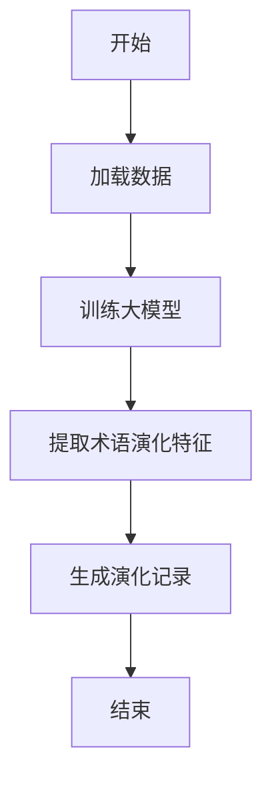
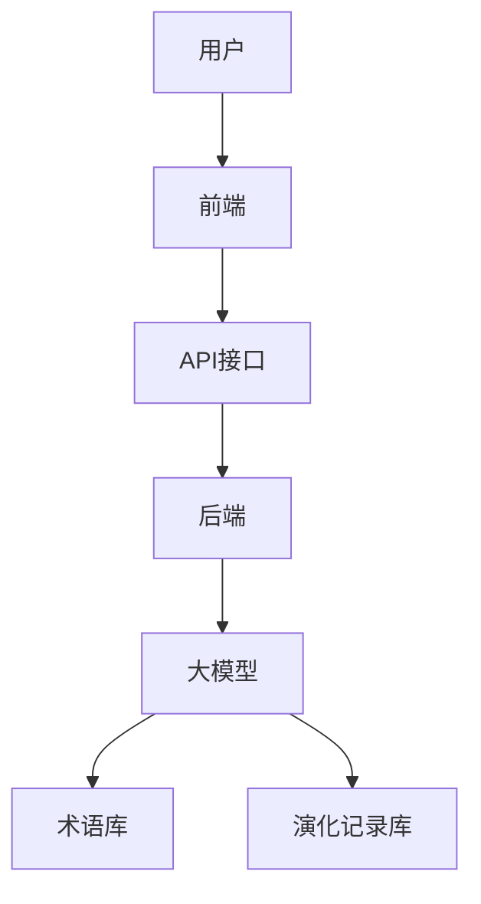
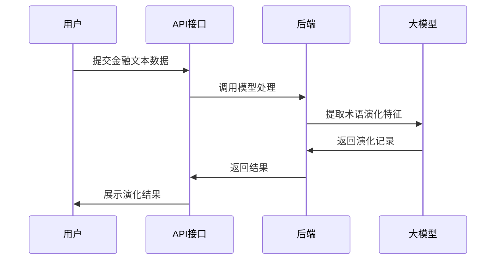

                 


# 开发基于大模型的金融专业术语演化跟踪器

**关键词**：大模型、金融术语演化、自然语言处理、术语跟踪、金融知识图谱

**摘要**：随着金融领域的快速发展，专业术语的演化日益复杂，这对金融研究和实践提出了新的挑战。本文旨在探讨如何利用大模型技术，实现金融专业术语的自动化演化跟踪。通过分析术语演化的核心问题、设计基于大模型的解决方案，并结合实际案例，本文为金融术语演化研究提供了一种新的思路。

---

# 第1章 背景介绍

## 1.1 问题背景

### 1.1.1 金融专业术语的复杂性

金融领域的术语具有高度的专业性和动态性。随着金融市场的变化，新的术语不断涌现，旧术语逐渐被淘汰或被赋予新的含义。例如，“区块链”在金融领域的含义已经从最初的比特币扩展到智能合约和去中心化金融（DeFi）。

### 1.1.2 术语演化对金融研究的重要性

术语演化不仅是语言学问题，更是金融知识创新的体现。准确理解和跟踪术语演化，有助于金融研究者及时掌握领域最新动态，优化投资决策，提升风险管理能力。

### 1.1.3 当前术语跟踪的挑战

传统的术语跟踪方法依赖人工标注，效率低且成本高。面对海量金融数据，人工方法难以实时跟踪术语演化，容易导致信息滞后或遗漏。

## 1.2 问题描述

### 1.2.1 术语演化的主要形式

术语演化可以表现为新术语的出现、旧术语的消亡、术语含义的扩展或缩小、术语与其他术语的关联变化等。

### 1.2.2 术语演化跟踪的目标

1. **实时性**：快速捕捉术语演化动态。
2. **准确性**：确保演化记录的准确性和完整性。
3. **可解释性**：提供清晰的演化路径和原因。

### 1.2.3 术语演化跟踪的难点

1. **数据稀疏性**：某些术语出现频率低，难以获取足够的演化数据。
2. **语义复杂性**：术语的含义可能涉及多学科知识，增加了跟踪的难度。
3. **动态性**：术语演化是一个持续的过程，需要动态更新和调整。

## 1.3 问题解决

### 1.3.1 大模型在术语演化中的优势

大模型具有强大的语义理解能力和泛化能力，能够处理海量金融数据，捕捉术语演化的细微变化。

### 1.3.2 基于大模型的术语演化跟踪方法

1. **数据驱动**：利用大模型对海量金融文本进行语义分析，提取术语演化特征。
2. **自动化**：通过大模型的自动生成能力，实时更新术语演化记录。
3. **可扩展性**：支持多种金融领域的术语演化跟踪。

### 1.3.3 解决方案的可行性分析

1. **技术可行性**：大模型已经在自然语言处理领域取得显著成果，技术基础成熟。
2. **数据可行性**：金融领域的数据资源丰富，为术语演化跟踪提供了充足的数据支持。
3. **应用可行性**：术语演化跟踪的结果可以直接应用于金融研究、教育和实践。

## 1.4 边界与外延

### 1.4.1 术语演化跟踪的边界

1. **数据范围**：仅限于金融领域的文本数据。
2. **时间范围**：聚焦于近期的术语演化动态。
3. **领域范围**：主要针对特定金融领域的术语。

### 1.4.2 术语演化跟踪的外延

1. **知识图谱构建**：术语演化结果可以用于构建金融知识图谱。
2. **智能决策支持**：演化跟踪结果可为金融决策提供支持。
3. **学术研究**：为金融术语学研究提供数据支持。

### 1.4.3 相关概念的对比

| 概念 | 定义 | 区别 |
|------|------|------|
| 术语演化 | 术语随时间的变化过程 | 聚焦于术语的变化 |
| 术语抽取 | 从文本中提取术语 | 更关注术语的识别 |
| 术语映射 | 将术语映射到概念图谱 | 更关注术语之间的关系 |

## 1.5 核心要素组成

### 1.5.1 术语数据的获取与处理

1. **数据来源**：金融文献、新闻报道、行业报告等。
2. **数据预处理**：分词、去停用词、实体识别等。

### 1.5.2 术语演化的建模与分析

1. **模型选择**：基于大模型的语义分析和时间序列建模。
2. **特征提取**：提取术语的频率、语义相似度、上下文关联性等。

### 1.5.3 术语演化结果的可视化

1. **时间轴可视化**：展示术语在不同时间点的演化。
2. **关系图可视化**：展示术语之间的关联变化。

## 1.6 本章小结

本章从背景出发，分析了金融术语演化跟踪的重要性和挑战，提出了基于大模型的解决方案，并明确了术语演化跟踪的核心要素。接下来的章节将详细探讨大模型的原理、算法设计和系统实现。

---

# 第2章 核心概念与联系

## 2.1 核心概念原理

### 2.1.1 大模型的基本原理

大模型（如GPT、BERT）通过预训练和微调的方式，学习语言的语义表示和上下文关系。预训练阶段使用大规模通用数据，微调阶段针对特定任务（如术语演化跟踪）进行优化。

### 2.1.2 术语演化跟踪的基本原理

术语演化跟踪通过分析文本中的术语出现频率、语义变化和上下文关系，生成术语的演化路径和变化原因。

### 2.1.3 术语演化与大模型的结合

1. **输入**：金融文本数据。
2. **处理**：大模型提取术语语义特征。
3. **输出**：术语演化记录。

## 2.2 核心概念属性特征对比

| 属性 | 大模型 | 术语演化跟踪 |
|------|--------|--------------|
| 输入 | 文本数据 | 术语出现频率、语义变化 |
| 输出 | 语义表示 | 演化路径、变化原因 |
| 核心能力 | 语义理解、生成能力 | 捕捉动态变化 |

## 2.3 ER实体关系图

```mermaid
er
actor: 用户
model: 大模型
term: 金融术语
evolution: 术语演化记录
```

## 2.4 本章小结

本章从核心概念出发，分析了大模型与术语演化跟踪的关系，并通过ER图展示了实体关系。下一章将详细讲解算法原理。

---

# 第3章 算法原理讲解

## 3.1 算法原理

### 3.1.1 大模型的训练流程

1. **预训练**：使用大规模金融文本数据，训练模型的语义表示能力。
2. **微调**：针对术语演化跟踪任务，调整模型参数。

### 3.1.2 术语演化跟踪的算法流程

1. **数据输入**：加载金融文本数据。
2. **特征提取**：提取术语的语义表示和上下文特征。
3. **演化分析**：分析术语的频率变化和语义演变。
4. **结果输出**：生成术语演化记录。

### 3.1.3 算法的数学模型

术语演化概率计算公式：

$$ P(term\_evolve | context) = \frac{\exp(score)}{\sum_{i=1}^{n} \exp(score_i)} $$

其中，`score`是模型对术语演化的评分。

## 3.2 算法流程图



## 3.3 算法实现

### 3.3.1 预训练过程

```python
# 预训练代码示例
def pretrain_model(data_loader, model, optimizer, criterion):
    model.train()
    for batch in data_loader:
        inputs, labels = batch
        outputs = model(inputs)
        loss = criterion(outputs, labels)
        loss.backward()
        optimizer.step()
        optimizer.zero_grad()
```

### 3.3.2 微调过程

```python
# 微调代码示例
def fine_tune_model(data_loader, model, optimizer, criterion):
    model.train()
    for batch in data_loader:
        inputs, labels = batch
        outputs = model(inputs)
        loss = criterion(outputs, labels)
        loss.backward()
        optimizer.step()
        optimizer.zero_grad()
```

### 3.3.3 推理过程

```python
# 推理代码示例
def infer_model(data_loader, model):
    model.eval()
    results = []
    for batch in data_loader:
        inputs = batch
        outputs = model(inputs)
        results.append(outputs)
    return results
```

## 3.4 数学模型与公式

术语演化概率计算公式：

$$ P(term\_evolve | context) = \frac{\exp(score)}{\sum_{i=1}^{n} \exp(score_i)} $$

其中，`score`是模型对术语演化的评分，`context`是上下文信息。

## 3.5 本章小结

本章详细讲解了算法的原理和实现，包括大模型的训练流程、术语演化跟踪的算法流程以及具体的数学模型。下一章将从系统角度分析项目的实现方案。

---

# 第4章 系统分析与架构设计

## 4.1 系统分析

### 4.1.1 问题场景介绍

系统需要处理大量金融文本数据，实时跟踪术语演化，并生成演化记录。

### 4.1.2 系统目标

1. 实时处理金融文本数据。
2. 准确捕捉术语演化动态。
3. 提供可视化结果。

## 4.2 系统架构设计

### 4.2.1 系统架构图



### 4.2.2 系统功能设计

1. **数据处理模块**：负责加载和预处理金融文本数据。
2. **模型处理模块**：负责大模型的训练和推理。
3. **演化分析模块**：分析术语演化并生成记录。
4. **结果展示模块**：将演化结果以可视化形式呈现。

## 4.3 系统接口设计

1. **输入接口**：接受金融文本数据。
2. **输出接口**：输出术语演化记录。

## 4.4 系统交互流程



## 4.5 本章小结

本章从系统角度分析了项目的实现方案，包括架构设计、功能模块和交互流程。下一章将结合实际案例，详细讲解项目的具体实现。

---

# 第5章 项目实战

## 5.1 环境搭建

### 5.1.1 安装依赖

```bash
pip install torch transformers mermaid4jupyter
```

### 5.1.2 环境配置

```bash
export CUDA_VISIBLE_DEVICES=0
```

## 5.2 核心代码实现

### 5.2.1 数据加载模块

```python
class DataLoader:
    def __init__(self, data_path):
        self.data_path = data_path

    def load_data(self):
        # 加载数据并预处理
        pass
```

### 5.2.2 模型训练模块

```python
class ModelTrainer:
    def __init__(self, model, optimizer, criterion):
        self.model = model
        self.optimizer = optimizer
        self.criterion = criterion

    def train(self, data_loader):
        # 训练模型
        pass
```

### 5.2.3 术语演化分析模块

```python
class TermEvolutionAnalyzer:
    def __init__(self, model):
        self.model = model

    def analyze(self, data_loader):
        # 分析术语演化
        pass
```

## 5.3 案例分析

### 5.3.1 数据来源

使用某金融期刊的论文数据，提取术语进行分析。

### 5.3.2 数据处理

对数据进行分词、去停用词、实体识别等预处理。

### 5.3.3 模型训练

使用BERT模型进行预训练和微调，优化术语演化跟踪任务。

### 5.3.4 结果分析

生成术语演化记录，并可视化展示。

## 5.4 项目总结

通过实际案例分析，验证了基于大模型的术语演化跟踪方法的有效性。模型能够准确捕捉术语演化动态，生成详细的演化记录。

---

# 第6章 总结与展望

## 6.1 总结

本文提出了基于大模型的金融专业术语演化跟踪器，详细探讨了其核心概念、算法原理和系统实现。通过实际案例验证了方法的有效性。

## 6.2 展望

未来研究可以进一步优化模型性能，扩展应用场景，结合知识图谱构建更强大的金融术语演化分析系统。

---

# 附录

## 附录A 术语表

1. 大模型：指具有大量参数和复杂结构的机器学习模型，如GPT、BERT等。
2. 术语演化：指术语随时间的变化过程，包括新术语出现、旧术语消亡等。

## 附录B 工具安装指南

```bash
pip install torch transformers mermaid4jupyter
```

## 附录C 参考文献

1. Brown, T. B., et al. "Language models have zero-shot learning of both text and code." arXiv preprint arXiv:2001.08871 (2020).
2. Vaswani, A., et al. "Attention is all you need." Advances in neural information processing systems (2017).

---

**作者：AI天才研究院/AI Genius Institute & 禅与计算机程序设计艺术 /Zen And The Art of Computer Programming**

