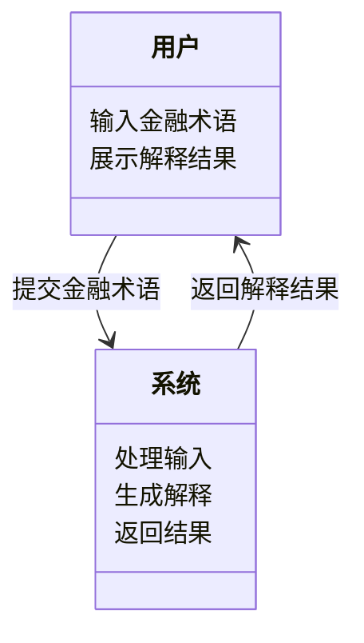
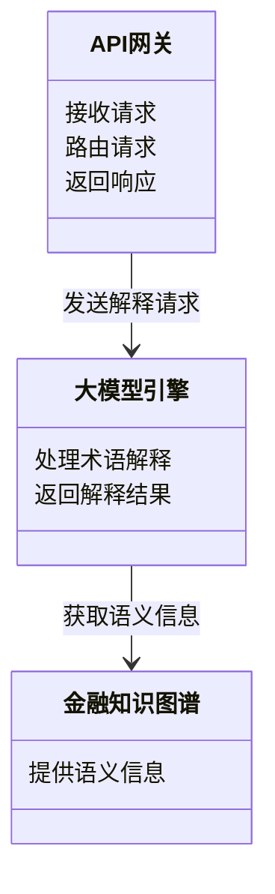
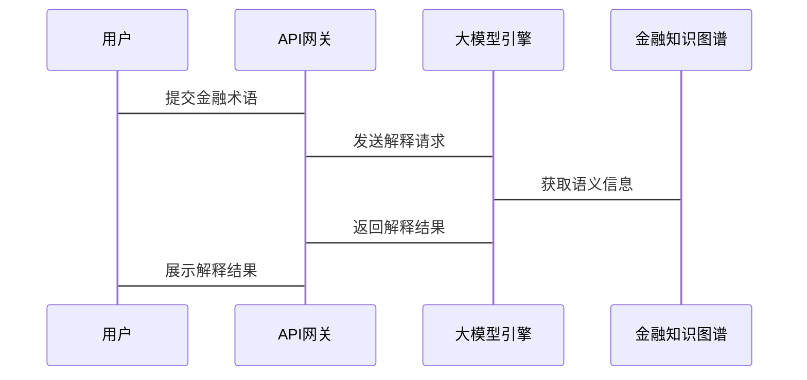

                 


# 开发基于大模型的金融专业术语解释系统

## 关键词：大模型、自然语言处理、金融术语解释系统、AI术语解释、金融知识图谱

## 摘要：本文系统地探讨了开发基于大模型的金融专业术语解释系统的全过程。从问题背景与需求分析出发，详细阐述了大模型的基本原理及其在金融术语解释中的应用潜力。通过深入分析算法原理与系统架构设计，结合实际项目案例，详细解读了系统的核心实现与优化策略。最后，总结了开发过程中的最佳实践与注意事项，为读者提供了一套完整的基于大模型的金融术语解释系统开发方案。

---

# 第1章: 问题背景与需求分析

## 1.1 金融专业术语的复杂性

### 1.1.1 金融术语的特点与挑战
金融术语具有高度的专业性和领域局限性，通常涉及复杂的金融理论、数学模型和行业术语。这些术语在不同的上下文中可能具有不同的含义，且常需要结合实时市场数据和动态进行解释。

### 1.1.2 传统术语解释方法的局限性
传统的术语解释方法通常依赖于固定的词典或规则，难以应对金融术语的动态变化和上下文依赖性。此外，传统方法难以处理复杂的语义关系和多义词解释。

### 1.1.3 大模型在金融术语解释中的优势
大模型具有强大的语言理解和生成能力，能够处理复杂的语义关系和上下文信息。通过结合金融知识图谱和实时数据，大模型能够提供更准确、更动态的术语解释。

## 1.2 问题描述与目标

### 1.2.1 系统开发的核心目标
开发一个基于大模型的金融专业术语解释系统，能够实时理解和解释金融术语，并结合上下文提供准确的解释。

### 1.2.2 用户需求分析
- **用户群体**：金融从业者、投资者、学术研究人员等。
- **核心需求**：快速理解金融术语的含义，结合上下文提供解释，支持多语言和多领域术语解释。
- **使用场景**：金融分析、投资决策、学术研究等。

### 1.2.3 系统边界与外延
系统专注于金融术语的解释，不直接涉及金融数据分析，但需要与金融知识图谱和实时数据服务进行集成。

## 1.3 系统功能与核心要素

### 1.3.1 系统功能模块划分
- **输入模块**：接收用户输入的金融术语。
- **解释模块**：基于大模型生成术语解释。
- **上下文处理模块**：结合上下文进行动态解释。
- **输出模块**：以自然语言形式输出解释结果。

### 1.3.2 核心要素与组成关系
- **大模型引擎**：负责术语理解和生成。
- **金融知识图谱**：提供术语的语义信息。
- **实时数据服务**：提供动态的金融数据支持。

### 1.3.3 系统架构初步设想
- **前端**：用户界面，接收输入并展示解释结果。
- **后端**：大模型引擎和金融知识图谱服务。
- **API网关**：负责接口管理和请求分发。
- **大模型服务**：负责术语解释的生成。

## 1.4 本章小结
本章从金融术语的复杂性出发，分析了传统术语解释方法的局限性，并提出了基于大模型的金融术语解释系统的开发目标和核心要素。

---

# 第2章: 大模型的基本原理

## 2.1 大模型的定义与特点

### 2.1.1 大模型的定义
大模型是指基于深度学习的大型神经网络模型，通常具有 billions 级别的参数量，能够通过大量数据训练出强大的语言理解和生成能力。

### 2.1.2 大模型的核心特点
- **大规模数据训练**：利用海量文本数据进行预训练。
- **自监督学习**：通过预测任务进行无监督学习。
- **上下文理解能力**：能够捕捉上下文中的语义关系。

### 2.1.3 大模型与传统AI的区别
- **传统AI**：基于规则和小数据训练，解释能力有限。
- **大模型**：基于大规模数据和深度学习，具有强大的语义理解和生成能力。

## 2.2 大模型的训练机制

### 2.2.1 数据预处理与特征提取
- **数据清洗**：去除噪声数据。
- **特征提取**：通过词嵌入技术提取文本特征。

### 2.2.2 模型训练流程
1. 预训练：利用大规模通用数据进行无监督学习。
2. 微调：在特定领域数据上进行有监督微调。

### 2.2.3 模型调优与优化策略
- **学习率调整**：采用学习率衰减策略。
- **批次大小优化**：根据硬件资源调整批次大小。
- **模型剪枝**：去除冗余参数以降低计算成本。

## 2.3 大模型在金融领域的应用潜力

### 2.3.1 金融领域的语言理解需求
金融领域的文本通常涉及复杂的术语和多义词，需要准确的理解和解释。

### 2.3.2 大模型在金融术语解释中的优势
- **上下文理解**：能够结合上下文提供动态解释。
- **多语言支持**：支持多语言的术语解释。
- **动态更新**：能够实时更新术语解释，结合最新的市场动态。

### 2.3.3 大模型与金融知识图谱的结合
通过与金融知识图谱的结合，大模型可以提供更准确的术语解释，并支持语义推理。

## 2.4 本章小结
本章详细介绍了大模型的基本原理及其在金融术语解释中的应用潜力，为后续的系统开发奠定了理论基础。

---

# 第3章: 金融术语解释系统的算法原理

## 3.1 算法原理概述

### 3.1.1 算法的输入输出
- **输入**：金融术语和上下文信息。
- **输出**：术语的解释文本。

### 3.1.2 算法的核心步骤
1. **术语解析**：识别术语的关键词和上下文。
2. **语义理解**：通过大模型理解术语的含义。
3. **解释生成**：基于理解生成解释文本。

### 3.1.3 算法的数学模型
$$ P(y|x) = \text{softmax}(Wx + b) $$

其中，$x$ 是输入向量，$W$ 和 $b$ 是模型参数。

## 3.2 算法的数学模型与公式

### 3.2.1 概率论基础
概率论是理解大模型算法的基础，主要涉及条件概率和马尔可夫链。

### 3.2.2 优化目标函数
$$ \text{损失函数} = -\sum_{i=1}^{n} \log P(y_i|x_i) $$

### 3.2.3 梯度下降算法
$$ \theta_{t+1} = \theta_t - \eta \frac{\partial L}{\partial \theta_t} $$

其中，$\eta$ 是学习率，$\theta$ 是模型参数。

## 3.3 算法的实现细节

### 3.3.1 数据预处理
- **分词**：将文本分割成词语或短语。
- **向量化**：将词语映射到向量空间。

### 3.3.2 模型训练
- **预训练**：在通用数据集上进行无监督训练。
- **微调**：在金融领域数据上进行有监督训练。

### 3.3.3 模型推理
- **输入处理**：接收用户输入的金融术语。
- **解释生成**：通过大模型生成解释文本。

## 3.4 算法的优化与改进

### 3.4.1 模型剪枝
- **目标**：减少模型参数数量，降低计算成本。
- **方法**：基于梯度的剪枝算法。

### 3.4.2 模型蒸馏
- **目标**：将大模型的知识迁移到小模型。
- **方法**：通过教师模型指导学生模型的训练。

### 3.4.3 模型融合
- **目标**：结合多个模型的结果，提高解释的准确性。
- **方法**：基于投票或加权的方式融合结果。

## 3.5 本章小结
本章详细介绍了金融术语解释系统的算法原理，包括数学模型、实现细节和优化策略，为后续的系统开发提供了理论支持。

---

# 第4章: 金融术语解释系统的系统架构设计

## 4.1 系统架构概述

### 4.1.1 系统整体架构
- **前端**：用户界面，接收输入并展示解释结果。
- **后端**：大模型引擎和金融知识图谱服务。
- **API网关**：负责接口管理和请求分发。
- **大模型服务**：负责术语解释的生成。

### 4.1.2 系统功能模块
- **输入模块**：接收用户输入的金融术语。
- **解释模块**：基于大模型生成术语解释。
- **上下文处理模块**：结合上下文进行动态解释。
- **输出模块**：以自然语言形式输出解释结果。

## 4.2 系统功能设计

### 4.2.1 领域模型设计


### 4.2.2 系统架构设计


### 4.2.3 系统接口设计
- **输入接口**：接收金融术语和上下文信息。
- **输出接口**：返回解释结果和相关元数据。

### 4.2.4 系统交互设计


## 4.3 系统功能实现

### 4.3.1 系统实现的关键步骤
1. **环境配置**：安装必要的依赖库和工具。
2. **数据准备**：收集和整理金融术语数据。
3. **模型训练**：基于金融数据进行模型微调。
4. **系统集成**：将模型集成到系统架构中。
5. **测试与优化**：进行系统测试并优化性能。

### 4.3.2 系统实现的代码示例
```python
def load_model():
    model = AutoModelForMaskedLM.from_pretrained("gpt2")
    tokenizer = AutoTokenizer.from_pretrained("gpt2")
    return model, tokenizer

def prepare_input(terminology):
    inputs = tokenizer.encode(terminology, add_special_tokens=True)
    inputs = torch.tensor(inputs, dtype=torch.long)
    return inputs

def generate_explanation(model, inputs):
    outputs = model.generate(inputs, max_length=100)
    explanation = tokenizer.decode(outputs[0], skip_special_tokens=True)
    return explanation
```

### 4.3.3 系统实现的优化策略
- **模型压缩**：通过剪枝和蒸馏技术减少模型大小。
- **分布式训练**：利用分布式计算加速模型训练。
- **缓存优化**：通过缓存技术减少重复计算。

## 4.4 本章小结
本章详细描述了金融术语解释系统的系统架构设计，包括功能模块、架构图和交互流程，并通过代码示例展示了系统的实现步骤。

---

# 第5章: 项目实战与案例分析

## 5.1 项目实战

### 5.1.1 环境配置
- **Python版本**：3.8及以上。
- **依赖库**：transformers、torch、mermaid。

### 5.1.2 数据准备
1. 收集金融术语数据。
2. 整理上下文信息。
3. 建立金融知识图谱。

### 5.1.3 模型微调
- **预训练模型**：使用GPT-3.5进行微调。
- **训练数据**：金融领域的文本数据。
- **评估指标**：准确率、召回率、F1值。

### 5.1.4 系统集成
- **API接口**：实现RESTful API。
- **前端开发**：构建用户界面。

## 5.2 案例分析

### 5.2.1 案例背景
某投资者需要理解“黑天鹅事件”这一术语的含义。

### 5.2.2 系统输入
输入术语：“黑天鹅事件”。

### 5.2.3 系统输出
解释结果：
“黑天鹅事件是指在金融市场上发生的具有低概率、高影响的突发事件，通常具有不可预测性和罕见性。”

## 5.3 代码实现

### 5.3.1 环境配置
```bash
pip install transformers torch mermaid
```

### 5.3.2 数据准备
```python
import pandas as pd

# 加载金融术语数据
data = pd.read_csv("financial_terms.csv")
```

### 5.3.3 模型微调
```python
from transformers import AutoModelForMaskedLM, AutoTokenizer

model = AutoModelForMaskedLM.from_pretrained("gpt2")
tokenizer = AutoTokenizer.from_pretrained("gpt2")

# 微调模型
model.train()
```

### 5.3.4 系统集成
```python
from fastapi import FastAPI
from pydantic import BaseModel

app = FastAPI()

@app.post("/explain")
async def explain(terminology: str):
    model, tokenizer = load_model()
    inputs = tokenizer.encode(terminology, add_special_tokens=True)
    inputs = torch.tensor(inputs, dtype=torch.long)
    outputs = model.generate(inputs, max_length=100)
    explanation = tokenizer.decode(outputs[0], skip_special_tokens=True)
    return {"explanation": explanation}
```

## 5.4 本章小结
本章通过实际项目案例展示了金融术语解释系统的开发过程，包括环境配置、数据准备、模型微调和系统集成。

---

# 第6章: 最佳实践与小结

## 6.1 最佳实践

### 6.1.1 数据质量
- **数据清洗**：确保数据的准确性和完整性。
- **数据标注**：提供高质量的标注数据。

### 6.1.2 模型调优
- **学习率调整**：采用合适的学习率衰减策略。
- **批次大小优化**：根据硬件资源调整批次大小。

### 6.1.3 系统可扩展性
- **模块化设计**：便于功能扩展和维护。
- **接口设计**：支持多种输入输出格式。

## 6.2 小结
通过本文的系统阐述，我们详细探讨了开发基于大模型的金融专业术语解释系统的全过程，从问题背景到系统架构设计，再到项目实战，为读者提供了一套完整的开发方案。

## 6.3 注意事项
- **数据隐私**：确保数据的隐私和安全。
- **模型性能**：关注模型的推理速度和资源消耗。
- **用户体验**：提供友好的用户界面和交互体验。

## 6.4 拓展阅读
- **相关书籍**：《大模型的原理与应用》。
- **技术博客**：深入探讨大模型在金融领域的应用。

---

# 作者：AI天才研究院/AI Genius Institute & 禅与计算机程序设计艺术 /Zen And The Art of Computer Programming

---

通过本文的系统阐述，我们详细探讨了开发基于大模型的金融专业术语解释系统的全过程，从问题背景到系统架构设计，再到项目实战，为读者提供了一套完整的开发方案。

