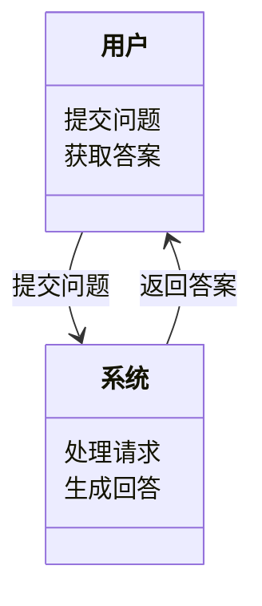
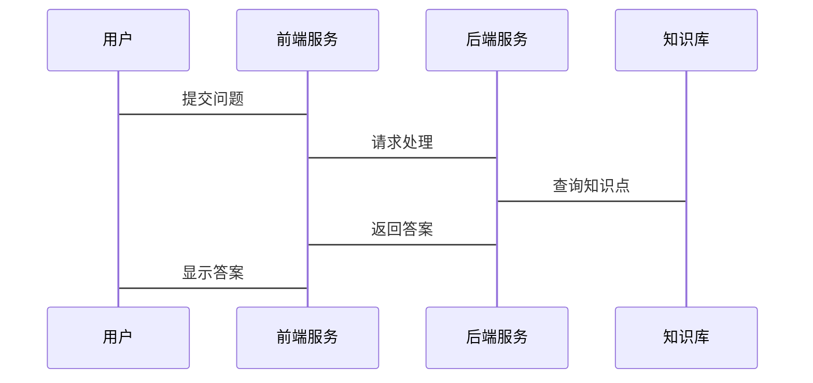

                 


# 开发基于大模型的金融专业考试答疑系统

> 关键词：大模型，自然语言处理，金融考试，智能答疑系统，系统架构设计

> 摘要：本文详细探讨了开发基于大模型的金融专业考试答疑系统的全过程，从背景分析到系统设计，再到项目实战，结合实际案例和最佳实践，为读者提供全面的技术指导。

---

## 第1章: 背景介绍

### 1.1 问题背景

#### 1.1.1 传统金融考试答疑的痛点
- **低效性**：传统金融考试答疑依赖人工，效率低下，难以满足大规模需求。
- **知识覆盖不足**：人工难以覆盖所有金融知识点，且容易出现错误。
- **用户需求多样化**：用户不仅需要解答问题，还希望获得详细的解题思路和相关知识点扩展。

#### 1.1.2 大模型技术的兴起与应用
- 大模型技术（如GPT、BERT）在自然语言处理领域的突破性进展，为智能答疑系统提供了强大的技术支持。
- 大模型的通用性和可扩展性使其成为金融考试答疑的理想选择。

#### 1.1.3 金融领域对智能答疑系统的需求
- 金融领域的复杂性和专业性要求智能系统具备深度知识理解和快速响应能力。
- 智能答疑系统能够帮助学生和从业者高效学习和解决问题，提升金融教育和培训的效果。

### 1.2 问题描述

#### 1.2.1 金融考试答疑的核心问题
- 如何高效准确地回答金融考试中的复杂问题？
- 如何确保答案的准确性和专业性？
- 如何实现个性化的学习辅助？

#### 1.2.2 用户需求分析
- **学生**：需要详细的解题思路和知识点扩展。
- **从业者**：需要快速获取专业解答和行业动态。
- **教育机构**：需要高效的辅助工具提升教学效率。

#### 1.2.3 系统目标与边界
- **目标**：开发一个基于大模型的金融考试答疑系统，能够高效、准确地回答用户问题。
- **边界**：系统仅专注于金融考试相关问题，不涉及其他领域的答疑。

### 1.3 问题解决

#### 1.3.1 大模型在金融考试答疑中的优势
- **强大的语义理解能力**：大模型能够准确理解用户的问题意图。
- **知识覆盖全面**：通过预训练，大模型掌握了大量的金融专业知识。
- **快速响应**：大模型可以实时生成答案，满足用户的即时需求。

#### 1.3.2 系统实现的关键技术
- 基于大模型的自然语言处理技术。
- 金融领域的知识图谱构建与应用。
- 多轮对话系统的实现。

#### 1.3.3 解决方案的可行性分析
- 技术可行性：大模型技术已较为成熟，能够支持金融领域的应用。
- 业务可行性：金融考试答疑需求旺盛，市场潜力巨大。
- 经济可行性：开发成本可控，具备商业化潜力。

### 1.4 问题的边界与外延

#### 1.4.1 系统功能边界
- 系统仅提供金融考试相关问题的答疑，不涉及其他领域。
- 系统不提供实时市场数据查询功能。

#### 1.4.2 与相关系统的区别与联系
- **区别**：传统问答系统依赖规则库，而大模型系统基于深度学习。
- **联系**：可以与其他金融系统（如知识库、交易系统）进行数据交互。

#### 1.4.3 系统的可扩展性
- 系统支持扩展至其他金融领域，如投资分析、风险管理等。
- 可与第三方数据源集成，提供更精准的实时信息。

---

## 第2章: 核心概念与联系

### 2.1 大模型的基本原理

#### 2.1.1 大模型的定义与特点
- **定义**：大模型是指基于深度学习构建的大型神经网络模型，具有强大的语义理解和生成能力。
- **特点**：参数量大、训练数据丰富、通用性强。

#### 2.1.2 大模型的训练机制
- **预训练**：在大规模通用数据上进行无监督学习。
- **微调**：在特定领域数据上进行有监督微调。

#### 2.1.3 大模型的应用场景
- 金融咨询、股票分析、风险评估等。

### 2.2 自然语言处理的核心概念

#### 2.2.1 NLP的基本原理
- **文本表示**：将文本转换为向量表示。
- **语义理解**：通过模型理解文本的语义含义。
- **文本生成**：基于模型生成自然语言文本。

#### 2.2.2 大模型在NLP中的应用
- 文本生成、语义理解、对话生成。

#### 2.2.3 NLP与金融领域的结合
- 金融文本分析、金融信息提取、金融对话生成。

### 2.3 金融领域的知识体系

#### 2.3.1 金融领域的核心知识点
- 金融市场、投资学、风险管理、公司财务等。

#### 2.3.2 金融领域的数据特征
- 数据复杂性高、领域术语多、知识关联性强。

#### 2.3.3 金融领域的特殊性与挑战
- 知识更新快、领域术语多、问题复杂性高。

### 2.4 核心概念的联系

#### 2.4.1 大模型与NLP的结合
- 大模型提供强大的语义理解能力，NLP技术实现具体的应用。

#### 2.4.2 NLP与金融领域的结合
- 通过NLP技术，将金融领域的知识转化为可计算的形式。

#### 2.4.3 系统整体架构的联系
- 大模型、NLP、金融知识三者的结合，构建一个完整的智能答疑系统。

---

## 第3章: 算法原理讲解

### 3.1 大模型的训练与推理机制

#### 3.1.1 大模型的训练流程
- **预训练**：在通用数据集上进行无监督学习。
- **微调**：在特定领域数据上进行有监督微调。

#### 3.1.2 大模型的推理流程
- **输入处理**：将用户问题转化为向量表示。
- **生成答案**：基于模型生成回答文本。
- **输出优化**：对生成的回答进行优化和校正。

#### 3.1.3 大模型的优化策略
- **参数调整**：通过调整模型参数提升生成质量。
- **数据增强**：通过数据增强技术提升模型的鲁棒性。

### 3.2 自然语言处理的算法原理

#### 3.2.1 基于大模型的文本生成
- **生成模型**：如GPT系列模型，通过自回归方式生成文本。
- **生成策略**：贪心搜索、随机采样等。

#### 3.2.2 基于大模型的语义理解
- **理解模型**：如BERT系列模型，通过编码器结构理解文本。
- **语义匹配**：通过计算文本相似度判断语义是否匹配。

#### 3.2.3 基于大模型的对话生成
- **对话模型**：通过记忆网络或 transformer 结构实现多轮对话。
- **对话管理**：通过状态跟踪实现上下文理解。

### 3.3 金融领域的特殊算法

#### 3.3.1 金融知识的表示与推理
- **知识图谱**：构建金融领域的知识图谱，实现知识表示。
- **推理算法**：基于知识图谱进行推理，生成相关答案。

#### 3.3.2 金融领域的语义匹配
- **领域特定的语义理解**：针对金融领域的特殊术语和表达方式进行优化。

#### 3.3.3 金融领域的多轮对话
- **上下文理解**：通过多轮对话理解用户意图。
- **领域知识调用**：根据对话内容调用相关金融知识生成回答。

### 3.4 算法的数学模型与公式

#### 3.4.1 大模型的数学模型
- **Transformer模型**：
  $$ \text{Transformer} = \text{Encoder} + \text{Decoder} $$
  其中，编码器负责将输入序列转换为向量表示，解码器负责生成输出序列。

- **自注意力机制**：
  $$ \text{Attention}(Q, K, V) = \text{softmax}(\frac{QK^T}{\sqrt{d_k}})V $$

#### 3.4.2 NLP算法的数学公式
- **交叉熵损失函数**：
  $$ \text{Loss} = -\sum_{i=1}^{n} y_i \log p(y_i|x_i) $$

- **学习率衰减**：
  $$ \text{学习率} = \text{初始学习率} \times \text{衰减因子}^{\text{步数}/\text{衰减间隔}} $$

---

## 第4章: 系统分析与架构设计

### 4.1 系统功能设计

#### 4.1.1 领域模型类图


#### 4.1.2 系统功能模块
- **用户模块**：提交问题、获取答案。
- **系统模块**：处理请求、生成回答。

### 4.2 系统架构设计

#### 4.2.1 系统架构图
```mermaid
container 金融考试答疑系统 {
    service 前端服务 {
        接收用户请求
        返回答案
    }
    service 后端服务 {
        处理请求
        生成回答
    }
    database 知识库 {
        金融知识点
        题目库
    }
}
```

#### 4.2.2 系统接口设计
- **输入接口**：接收用户提交的问题。
- **输出接口**：返回系统生成的答案。

#### 4.2.3 系统交互流程


### 4.3 系统实现的关键技术

#### 4.3.1 问题场景介绍
- 系统需要处理多种类型的金融问题，包括选择题、简答题、案例分析题等。

#### 4.3.2 项目介绍
- 项目目标：开发一个高效、准确的金融考试答疑系统。
- 项目范围：涵盖金融考试的主要知识点和题型。

---

## 第5章: 项目实战

### 5.1 环境安装

#### 5.1.1 系统运行环境
- 操作系统：Linux/Windows/MacOS
- Python版本：3.8+
- 依赖库：Transformers、PyTorch、FastAPI

#### 5.1.2 安装步骤
```bash
pip install transformers torch fastapi uvicorn
```

### 5.2 系统核心实现

#### 5.2.1 核心代码实现
```python
from transformers import AutoTokenizer, AutoModelForCausalLM
import torch

model_name = "gpt2"
tokenizer = AutoTokenizer.from_pretrained(model_name)
model = AutoModelForCausalLM.from_pretrained(model_name)

def generate_answer(question):
    inputs = tokenizer(question, return_tensors="pt")
    outputs = model.generate(
        inputs.input_ids,
        max_length=100,
        do_sample=True,
        temperature=0.7
    )
    answer = tokenizer.decode(outputs[0], skip_special_tokens=True)
    return answer
```

#### 5.2.2 代码应用解读与分析
- **输入处理**：将用户问题转化为模型可处理的输入格式。
- **生成答案**：使用大模型生成回答文本。
- **输出优化**：调整生成答案的长度和质量。

#### 5.2.3 实际案例分析
- **案例1**：用户提交一道关于股票投资的问题。
- **案例2**：用户提交一道风险管理的简答题。

### 5.3 项目小结
- **成功经验**：系统实现了高效的金融考试答疑功能。
- **遇到的问题**：部分金融术语的理解存在偏差。
- **改进建议**：增加领域知识的微调，提升回答的准确性。

---

## 第6章: 最佳实践

### 6.1 开发中的注意事项

#### 6.1.1 安全性注意事项
- **数据隐私**：确保用户数据的安全性和隐私性。
- **内容审核**：对生成的内容进行审核，避免错误信息传播。

#### 6.1.2 可扩展性注意事项
- **模块化设计**：确保系统模块化，方便后续扩展。
- **接口设计**：设计灵活的接口，方便与其他系统集成。

### 6.2 小结
- 本文详细介绍了开发基于大模型的金融专业考试答疑系统的全过程。
- 系统结合了大模型、自然语言处理和金融领域的知识，实现了高效的智能答疑功能。

### 6.3 注意事项
- 在实际应用中，需注意模型的可解释性和生成内容的准确性。
- 系统的性能优化和用户体验提升是后续工作的重点。

### 6.4 拓展阅读
- 《大模型在金融领域的应用》
- 《基于Transformer的自然语言处理技术》

---

## 作者信息

作者：AI天才研究院/AI Genius Institute & 禅与计算机程序设计艺术 /Zen And The Art of Computer Programming

---

以上是《开发基于大模型的金融专业考试答疑系统》的技术博客文章，涵盖了从背景分析到系统实现的全过程，结合实际案例和最佳实践，为读者提供了全面的技术指导。

