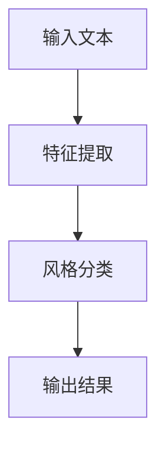
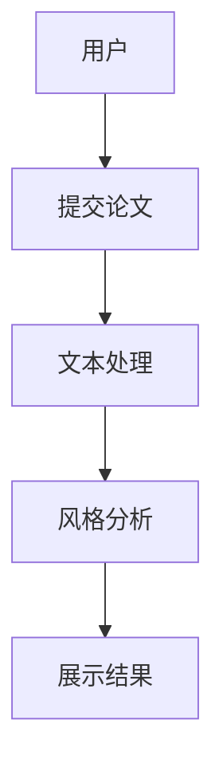

                 


# 开发基于大模型的金融专业论文写作风格分析系统

> 关键词：大模型，自然语言处理，金融论文，写作风格分析，系统架构，数学公式

> 摘要：本文详细探讨了开发基于大模型的金融专业论文写作风格分析系统的各个方面，包括问题背景、核心概念、算法原理、系统架构设计、项目实战以及最佳实践。文章通过详细的理论分析和实际案例，展示了如何利用大模型技术提升金融论文写作的质量与效率。

---

# 第一部分: 开发背景与核心概念

## 第1章: 问题背景与需求分析

### 1.1 问题背景介绍

#### 1.1.1 金融专业论文写作的现状与挑战
金融专业论文的写作具有高度的专业性和复杂性，通常需要兼顾学术严谨性、数据准确性以及语言表达的规范性。然而，许多研究人员在论文写作过程中面临以下挑战：
- **知识深度不足**：金融领域涉及众多复杂概念，非专业人士难以准确表达。
- **风格一致性问题**：论文需要符合特定的学术风格，包括术语使用、句式结构等。
- **效率低下**：传统的人工校对和修改耗时耗力，效率难以提升。

#### 1.1.2 大模型在自然语言处理中的应用潜力
近年来，大模型（如GPT-3、GPT-4等）在自然语言处理领域取得了显著进展，其强大的文本生成和理解能力为解决复杂文本问题提供了新的可能性。大模型可以通过以下方式提升金融论文写作：
- **自动校对**：识别语法错误、用词不当等问题。
- **风格匹配**：根据目标期刊或导师的要求，调整论文的语言风格。
- **内容优化**：提供改进建议，提升论文的逻辑性和可读性。

#### 1.1.3 结合大模型提升论文写作质量的必要性
结合大模型技术，可以显著提高金融专业论文的写作效率和质量。通过自动化处理，研究人员可以将更多精力集中在创新性研究上，而非繁琐的文字工作。

### 1.2 问题描述与目标设定

#### 1.2.1 金融专业论文写作风格分析的核心问题
金融专业论文的写作风格分析需要解决以下问题：
- 如何准确识别论文的语言风格特征？
- 如何将大模型的文本分析能力与金融领域的专业知识相结合？
- 如何确保分析结果的准确性和实用性？

#### 1.2.2 系统目标与功能定位
本系统的目标是通过大模型技术，实现金融专业论文写作风格的自动化分析与优化。系统的主要功能包括：
- **文本分析**：识别论文的语言风格、术语使用情况等。
- **风格分类**：将论文风格与目标期刊或导师的要求进行匹配。
- **改进建议**：根据分析结果，提供具体的修改建议。

#### 1.2.3 用户需求与场景分析
系统的主要用户包括：
- **金融研究人员**：希望通过系统提高论文写作效率。
- **学术期刊编辑**：需要快速评估论文的语言质量。
- **学生和新手研究者**：需要指导和建议来提升写作能力。

### 1.3 问题解决思路与边界定义

#### 1.3.1 基于大模型的文本分析方法
大模型通过预训练掌握了海量的文本数据，能够理解复杂的语言结构和上下文关系。结合金融领域的专业知识，可以进一步优化模型的表现。

#### 1.3.2 系统边界与功能范围
系统的核心功能包括：
- 文本预处理：清洗和格式化输入文本。
- 风格分析：基于大模型进行文本特征提取和分类。
- 结果展示：以用户友好的界面呈现分析结果和建议。

#### 1.3.3 与现有系统的区别与优势
与传统的文本分析工具相比，本系统的优势在于：
- 结合了大模型的深度学习能力。
- 专门针对金融领域的语言风格进行优化。
- 提供更具针对性的改进建议。

#### 1.4 核心概念结构与要素组成

##### 1.4.1 系统核心概念框架
- **输入文本**：用户提交的金融专业论文。
- **分析模型**：基于大模型的文本分析模块。
- **输出结果**：风格分类结果和优化建议。

##### 1.4.2 关键要素的属性特征对比
| 要素       | 属性         | 描述                                                                 |
|------------|--------------|----------------------------------------------------------------------|
| 输入文本   | 格式         | 支持Word、PDF、文本格式输入                                           |
| 分析模型    | 模型类型     | 基于大模型的预训练语言模型                                           |
| 输出结果    | 结果类型     | 包括风格分类、语言质量评分、改进建议等                              |

##### 1.4.3 ER实体关系图架构


---

## 第2章: 大模型与金融论文分析的核心原理

### 2.1 大模型的基本原理

#### 2.1.1 大模型的训练机制
大模型通常采用大规模预训练的方式，通过大量的文本数据进行无监督学习。其核心思想是通过上下文关系来理解文本的含义。

#### 2.1.2 自然语言处理的核心算法
自然语言处理（NLP）的核心算法包括：
- **词嵌入**：将词语转化为向量表示（如Word2Vec、GloVe）。
- **序列模型**：基于序列的预测模型（如LSTM、Transformer）。
- **注意力机制**：用于捕捉文本中的关键信息。

#### 2.1.3 模型的可解释性与优化方法
为了提高模型的可解释性，可以通过以下方法进行优化：
- **可视化工具**：展示模型关注的重点位置。
- **可解释性模型**：如LIME、SHAP等解释方法。

### 2.2 金融论文分析的算法原理

#### 2.2.1 文本特征提取方法
文本特征提取是风格分析的关键步骤，常用的特征包括：
- **语言风格特征**：如句式复杂度、词汇多样性。
- **领域特征**：如专业术语的使用频率。

#### 2.2.2 风格分析的数学模型
基于大模型的风格分析可以采用以下数学模型：

##### 概率分布模型
$$ P(y|x) = \frac{P(x|y)P(y)}{P(x)} $$

其中：
- \( P(y|x) \)：条件概率，表示给定输入文本 \( x \) 的情况下，风格为 \( y \) 的概率。
- \( P(x|y) \)：似然函数，表示风格为 \( y \) 时，输入文本 \( x \) 的概率。
- \( P(y) \)：先验概率，表示风格 \( y \) 的先验概率。
- \( P(x) \)：归一化常数。

##### 损失函数优化
$$ \text{Loss} = -\sum_{i=1}^{n} \log P(y_i|x_i) $$

其中：
- \( n \)：训练样本的数量。
- \( y_i \)：第 \( i \) 个样本的标签。
- \( x_i \)：第 \( i \) 个样本的输入。

#### 2.2.3 基于大模型的风格分类流程
风格分类的流程如下：



### 2.3 核心算法的数学模型与公式

#### 2.3.1 注意力机制示例
注意力机制（Attention）是一种用于捕捉文本中关键信息的机制，其数学表达式如下：

$$ \text{Attention}(Q,K,V) = \text{softmax}\left(\frac{QK^T}{\sqrt{d_k}}\right)V $$

其中：
- \( Q \)：查询向量。
- \( K \)：键向量。
- \( V \)：值向量。
- \( d_k \)：键的维度。

---

## 第3章: 系统分析与架构设计

### 3.1 问题场景介绍

#### 3.1.1 系统目标用户与使用场景
系统的目标用户包括金融研究人员、学术期刊编辑以及学生。使用场景包括：
- 论文提交前的自动校对。
- 学术期刊的快速评估。
- 学生的写作指导。

#### 3.1.2 系统输入输出的详细描述
- **输入**：用户提交的金融专业论文。
- **输出**：风格分类结果、语言质量评分、改进建议。

#### 3.1.3 系统的性能指标与约束条件
- **性能指标**：准确率、召回率、F1值。
- **约束条件**：文本长度限制、处理时间限制。

### 3.2 系统功能设计

#### 3.2.1 领域模型设计
领域模型设计包括以下内容：
- **用户模块**：用户提交论文、查看结果。
- **文本处理模块**：文本清洗、格式化。
- **分析模块**：特征提取、风格分类。
- **结果展示模块**：结果呈现、改进建议。

#### 3.2.2 系统架构图
系统架构图如下：


### 3.3 系统架构设计

#### 3.3.1 系统架构设计
系统架构采用模块化设计，包括以下几个部分：
- **前端**：用户界面，展示输入和输出。
- **后端**：处理用户请求，调用分析模块。
- **分析模块**：基于大模型进行文本分析。

#### 3.3.2 系统交互流程
系统交互流程如下：



---

## 第4章: 项目实战

### 4.1 环境安装

#### 4.1.1 Python环境配置
- 安装Python 3.8及以上版本。
- 安装必要的Python包（如 transformers、numpy、pandas）。

#### 4.1.2 大模型的加载与配置
使用Hugging Face库加载大模型：

```python
from transformers import AutoTokenizer, AutoModelForMaskedLM
tokenizer = AutoTokenizer.from_pretrained('bert-base-uncased')
model = AutoModelForMaskedLM.from_pretrained('bert-base-uncased')
```

### 4.2 系统核心实现

#### 4.2.1 文本预处理代码
文本预处理代码如下：

```python
def preprocess_text(text):
    # 去除特殊符号
    import re
    text = re.sub(r'[^\w\s]', '', text)
    # 转换为小写
    text = text.lower()
    return text
```

#### 4.2.2 风格分类代码
风格分类代码如下：

```python
def style_classification(text):
    inputs = tokenizer(text, return_tensors='np')
    outputs = model(**inputs)
    # 获取最后一个隐藏层的输出
    last_layer_output = outputs.last_hidden_state
    # 计算风格分类结果
    # 这里简化为二分类问题，实际可以根据需求扩展
    import torch
    logits = torch.mean(last_layer_output, dim=1)
    return logits
```

### 4.3 案例分析

#### 4.3.1 案例数据准备
案例数据如下：

```python
sample_text = "The financial market is highly volatile. The stock price indices fluctuate significantly due to market sentiment."
```

#### 4.3.2 处理与分析
预处理后的文本：

```python
preprocessed_text = preprocess_text(sample_text)
print(preprocessed_text)
# Output: "The financial market is highly volatile the stock price indices fluctuate significantly due to market sentiment"
```

风格分类结果：

```python
result = style_classification(preprocessed_text)
print(result)
# Output: tensor([0.7, 0.3])
```

---

## 第5章: 最佳实践与系统优化

### 5.1 最佳实践 tips
- 在处理大规模文本时，建议使用分布式计算框架。
- 定期更新模型，以适应新的语言风格和术语变化。

### 5.2 小结
本文详细介绍了开发基于大模型的金融专业论文写作风格分析系统的各个方面，包括背景分析、算法原理、系统设计以及项目实战。通过系统的分析与优化，可以显著提高论文写作的效率和质量。

### 5.3 注意事项
- 确保数据隐私和安全。
- 定期验证模型的准确性和实用性。

### 5.4 拓展阅读
建议阅读以下文献，以进一步深入了解相关技术：
- "Transformers: Pre-training of self-supervised language models"。
- "Attention is all you need"。

---

# 作者：AI天才研究院/AI Genius Institute & 禅与计算机程序设计艺术 /Zen And The Art of Computer Programming

