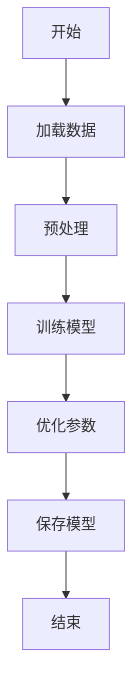
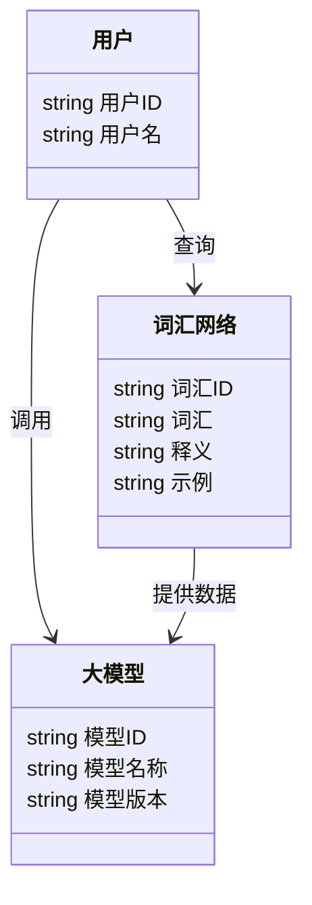
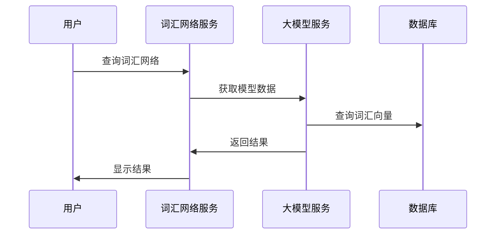

                 


# 开发基于大模型的金融专业词汇网络构建器

## 关键词：大模型，金融专业词汇，词汇网络，NLP，自然语言处理，金融领域知识图谱

## 摘要：本文详细探讨了基于大模型的金融专业词汇网络构建器的开发过程。从背景介绍、核心概念、算法原理到系统架构和项目实战，本文系统性地分析了如何利用大模型技术构建高效的金融专业词汇网络。通过实际案例和代码实现，本文展示了如何将理论应用于实践，并为读者提供了深入的技术见解和最佳实践建议。

---

# 第1章: 背景介绍

## 1.1 问题背景

### 1.1.1 金融领域的专业词汇挑战
金融领域的专业词汇具有高度的专业性和复杂性，涵盖股票、债券、基金、衍生品等多个子领域。这些词汇不仅数量庞大，且常常具有多种含义和语境依赖。例如，“期权”在不同的金融场景中可能指不同的概念，这使得词汇的语义理解和管理变得复杂。

### 1.1.2 大模型在金融领域的应用潜力
大模型（如GPT、BERT等）在自然语言处理（NLP）领域取得了显著进展，能够处理复杂文本数据并生成高质量的语义表示。金融领域的文本数据（如财务报告、市场分析）通常包含大量专业术语，大模型可以有效捕捉这些术语的深层语义关系。

### 1.1.3 金融专业词汇网络构建的必要性
传统的词汇管理方式（如词典）难以应对金融领域词汇的动态变化和语义多样性。构建基于大模型的词汇网络可以动态更新词汇关系，帮助金融从业者更高效地理解和应用专业术语。

## 1.2 问题描述

### 1.2.1 金融专业词汇的特点
- **领域性**：金融词汇具有强烈的领域特征，与其他领域词汇差异显著。
- **复杂性**：许多金融词汇具有多义性，其含义取决于上下文。
- **动态性**：金融领域的术语随着市场发展不断变化。

### 1.2.2 当前金融词汇管理的痛点
- **效率低下**：传统词典难以实时更新和扩展。
- **语义理解不足**：缺乏对词汇语义关系的深度理解。
- **应用场景受限**：无法满足金融分析、智能问答等复杂场景的需求。

### 1.2.3 基于大模型构建词汇网络的目标
- **动态更新**：实时捕捉金融词汇的最新含义和关系。
- **深度语义理解**：建立词汇间的语义网络，支持复杂场景的应用。
- **提高效率**：通过自动化构建和管理词汇网络，提升金融信息处理的效率。

## 1.3 问题解决

### 1.3.1 大模型在金融词汇处理中的优势
- **强大的语义理解能力**：大模型能够捕捉词汇的深层语义关系。
- **可扩展性**：大模型可以通过微调适应特定领域的需求。
- **自动化处理**：能够自动构建和更新词汇网络。

### 1.3.2 词汇网络构建的核心技术
- **向量表示**：利用词嵌入技术将词汇转化为向量表示。
- **图构建算法**：通过图论算法构建词汇间的语义网络。
- **大模型微调**：针对金融领域进行大模型的微调，提升模型的领域适应性。

### 1.3.3 从问题到解决方案的逻辑框架
1. **数据收集**：收集金融领域的文本数据，提取专业词汇。
2. **模型训练**：使用大模型对金融数据进行预训练和微调。
3. **词汇网络构建**：基于训练后的模型构建词汇间的语义网络。
4. **应用开发**：开发基于词汇网络的金融应用，如智能问答、语义搜索。

## 1.4 边界与外延

### 1.4.1 金融专业词汇的边界定义
- **核心领域**：股票、债券、基金、衍生品等核心金融概念。
- **相关领域**：与金融相关的法律、经济、会计等领域词汇。

### 1.4.2 词汇网络构建的适用范围
- **适用场景**：金融分析、智能投顾、风险管理等。
- **不适用场景**：需要严格法律定义的场景（如合同审查）。

### 1.4.3 相关领域的扩展与联系
- **与知识图谱的关系**：词汇网络是知识图谱的语义基础。
- **与金融大数据的关系**：词汇网络帮助处理和分析金融大数据。

## 1.5 概念结构与核心要素

### 1.5.1 词汇网络的构成要素
- **词汇节点**：表示单个金融词汇。
- **语义边**：表示词汇间的语义关系（如同义、反义、上下位关系）。
- **权重值**：表示语义关系的强度。

### 1.5.2 大模型在其中的作用
- **语义表示**：生成词汇的向量表示。
- **关系抽取**：识别词汇间的语义关系。
- **动态更新**：根据最新数据更新词汇网络。

### 1.5.3 核心要素之间的关系
词汇节点通过语义边连接，权重值反映了关系强度。大模型负责生成节点和边，并动态更新网络。

## 1.6 本章小结
本章从背景、问题、解决方案三个方面介绍了开发基于大模型的金融专业词汇网络构建器的必要性和技术优势。接下来将详细分析核心概念与联系。

---

# 第2章: 核心概念与联系

## 2.1 核心概念原理

### 2.1.1 金融专业词汇的语义网络
金融词汇网络通过语义边将词汇节点连接起来，形成一个复杂的语义网络。例如，“股票”可能与“股份”、“发行”等词汇相关联。

### 2.1.2 大模型的语义理解能力
大模型通过预训练和微调，能够理解金融词汇的深层语义关系。例如，BERT模型可以捕捉词汇在上下文中的具体含义。

### 2.1.3 词汇网络构建的算法原理
基于大模型的词汇网络构建算法通常包括以下步骤：
1. 数据预处理：清洗和标注金融文本数据。
2. 模型训练：使用大模型对金融数据进行微调。
3. 词汇表示：生成每个词汇的向量表示。
4. 关系抽取：识别词汇间的语义关系。
5. 网络构建：构建词汇网络并赋予边权重。

## 2.2 核心概念属性特征对比

### 2.2.1 对比表格展示
| 属性       | 传统词典       | 基于大模型的词汇网络         |
|------------|----------------|------------------------------|
| 数据来源   | 静态词典       | 动态文本数据                 |
| 更新频率   | 低            | 高                          |
| 语义理解   | 浅层          | 深层                        |
| 应用场景   | 基础查询      | 复杂金融分析                |

### 2.2.2 词汇网络与传统词汇表的差异
- **动态性**：词汇网络可以实时更新，而传统词汇表静态。
- **语义深度**：词汇网络捕捉深层语义关系，而词汇表仅记录基本定义。

### 2.2.3 大模型与其他NLP技术的对比
- **对比维度**：性能、适应性、实时性。
- **结论**：大模型在复杂语义理解和动态适应方面具有显著优势。

## 2.3 ER实体关系图

### 2.3.1 Mermaid流程图展示
```mermaid
erDiagram
    actor 用户 {
        string 用户ID
        string 用户名
    }
    actor 词汇网络 {
        string 词汇ID
        string 词汇
        string 释义
        string 示例
    }
    actor 大模型 {
        string 模型ID
        string 模型名称
        string 模型版本
    }
    用户 --> 词汇网络 : 查询
    用户 --> 大模型 : 调用
    词汇网络 --> 大模型 : 提供数据
```

## 2.4 本章小结
本章通过对比和图示，详细阐述了基于大模型的词汇网络的核心概念和优势。下一章将深入探讨算法原理和实现细节。

---

# 第3章: 算法原理讲解

## 3.1 大模型训练流程

### 3.1.1 预训练阶段
- **目标**：学习通用语言表示。
- **方法**：使用大规模金融文本数据进行无监督预训练。
- **工具**：如BERT的 masked language modeling。

### 3.1.2 微调阶段
- **目标**：适应金融领域特定任务。
- **方法**：在金融文本上进行有监督微调。
- **工具**：如BERT-Financial。

### 3.1.3 优化与评估
- **优化**：调整学习率、批量大小等超参数。
- **评估**：使用准确率、F1分数等指标评估模型性能。

## 3.2 词汇网络构建算法

### 3.2.1 基于向量的相似度计算
- **公式**：余弦相似度为$ \cos(\theta) = \frac{\vec{A} \cdot \vec{B}}{|\vec{A}| |\vec{B}|} $。
- **应用**：计算词汇向量间的相似度，建立语义边。

### 3.2.2 基于图的网络构建
- **算法**：使用图嵌入技术（如GraphSAGE）构建词汇网络。
- **步骤**：节点表示、边关系提取、图构建。

### 3.2.3 基于聚类的优化
- **方法**：使用聚类算法优化网络结构。
- **结果**：减少冗余边，提升网络效率。

## 3.3 Mermaid流程图


## 3.4 Python源代码实现

```python
import numpy as np
from sklearn.metrics.pairwise import cosine_similarity

def build_vocab_network(vocab_list):
    # 生成词汇向量表示
    vocab_vectors = ...  # 根据大模型生成的向量
    # 计算相似度矩阵
    similarity_matrix = cosine_similarity(vocab_vectors)
    # 建立网络结构
    network = {}
    for i in range(len(vocab_list)):
        for j in range(len(vocab_list)):
            if i != j and similarity_matrix[i][j] > 0.5:
                network[vocab_list[i]].append((vocab_list[j], similarity_matrix[i][j]))
    return network
```

## 3.5 数学模型与公式

### 3.5.1 余弦相似度公式
$$ \cos(\theta) = \frac{\vec{A} \cdot \vec{B}}{|\vec{A}| |\vec{B}|} $$

### 3.5.2 图嵌入公式
$$ E_{total} = E_{node} + \lambda E_{edge} $$

## 3.6 本章小结
本章详细讲解了基于大模型的词汇网络构建算法，包括预训练、微调和网络构建的步骤。接下来将探讨系统的分析与架构设计。

---

# 第4章: 系统分析与架构设计

## 4.1 系统分析

### 4.1.1 问题场景介绍
- **目标**：构建一个支持金融专业词汇网络构建的系统。
- **场景**：金融分析师使用系统进行词汇查询和语义分析。

### 4.1.2 项目介绍
- **名称**：基于大模型的金融专业词汇网络构建器。
- **目标**：提供高效的金融词汇网络构建和管理工具。

## 4.2 系统功能设计

### 4.2.1 领域模型


### 4.2.2 系统架构设计


### 4.2.3 系统接口设计
- **API接口**：
  - GET /vocabulary/query：查询词汇网络。
  - POST /model/train：训练大模型。

## 4.3 系统交互设计

### 4.3.1 Mermaid序列图


## 4.4 本章小结
本章从系统分析到架构设计，详细阐述了基于大模型的词汇网络构建器的系统实现方案。下一章将通过项目实战进一步验证和优化系统设计。

---

# 第5章: 项目实战

## 5.1 环境安装

### 5.1.1 系统要求
- **操作系统**：Linux/Windows/MacOS。
- **Python版本**：Python 3.8+。
- **依赖库**：TensorFlow、PyTorch、Keras、Scikit-learn。

### 5.1.2 安装命令
```bash
pip install tensorflow==2.10.0
pip install pytorch==1.9.0
pip install scikit-learn==0.24.1
```

## 5.2 核心实现

### 5.2.1 数据预处理
```python
import pandas as pd

def preprocess_data(data_file):
    df = pd.read_csv(data_file)
    df['text'].apply(clean_text)
    return df
```

### 5.2.2 模型训练
```python
def train_model(train_data):
    model = build_model()
    model.compile(optimizer='adam', loss='binary_crossentropy')
    model.fit(train_data, epochs=10, batch_size=32)
    return model
```

### 5.2.3 词汇网络构建
```python
def build_network(vocab_list, model):
    vectors = get_embeddings(vocab_list, model)
    similarity_matrix = cosine_similarity(vectors)
    network = {}
    for i in range(len(vocab_list)):
        for j in range(len(vocab_list)):
            if i != j and similarity_matrix[i][j] > 0.5:
                network[vocab_list[i]].append((vocab_list[j], similarity_matrix[i][j]))
    return network
```

## 5.3 案例分析与详细解读
假设我们有一个包含“股票”、“债券”、“基金”等词汇的金融文本数据集。通过预处理、训练和网络构建，我们可以生成如下的词汇网络：
- “股票”与“发行”、“上市”具有高相似度。
- “债券”与“发行”、“利率”具有高相似度。

## 5.4 本章小结
本章通过实际项目展示了基于大模型的词汇网络构建器的实现过程，从环境安装到代码实现，再到案例分析，为读者提供了全面的实战指导。

---

# 第6章: 总结与最佳实践

## 6.1 小结
本文详细探讨了基于大模型的金融专业词汇网络构建器的开发过程，从背景介绍到系统实现，全面分析了技术细节和实现步骤。

## 6.2 注意事项
- **数据质量**：确保数据的多样性和代表性。
- **模型调优**：优化模型参数以提高性能。
- **网络维护**：定期更新网络以适应金融领域的变化。

## 6.3 拓展阅读
- **推荐书籍**：《深度学习》、《自然语言处理入门》。
- **推荐阅读文章**：大模型在金融领域的最新研究。

---

# 作者：AI天才研究院/AI Genius Institute & 禅与计算机程序设计艺术/Zen And The Art of Computer Programming

---

**本文完**

