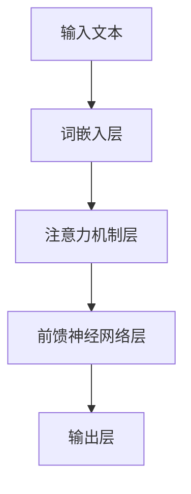
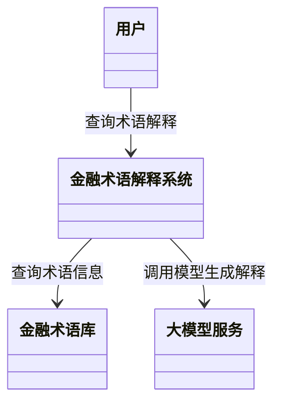
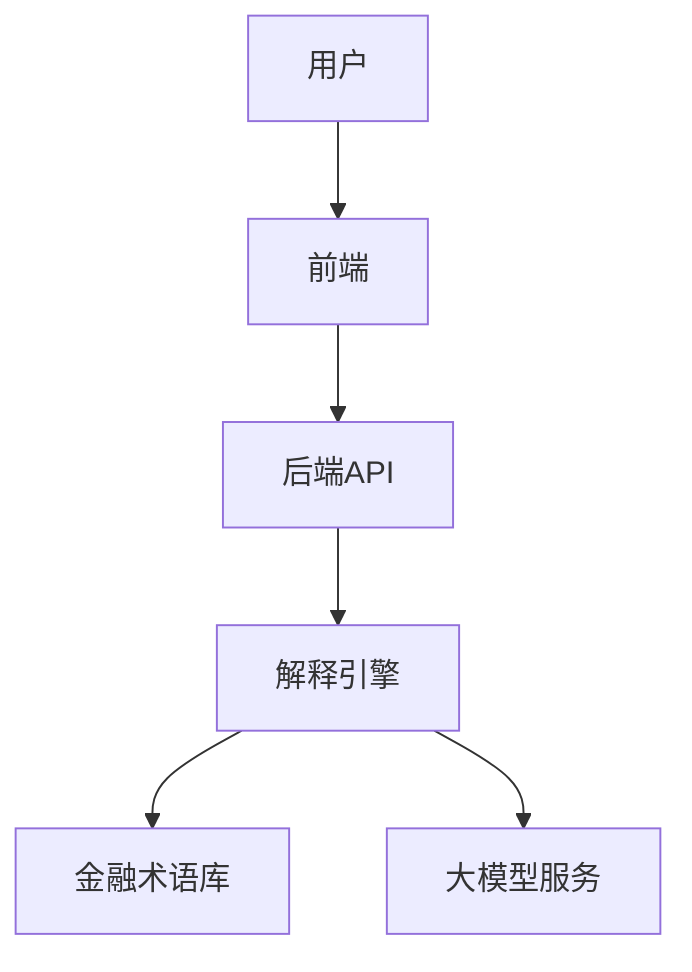
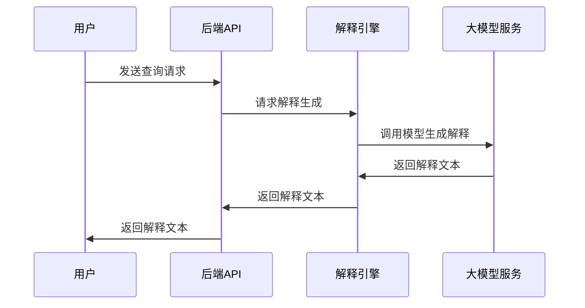

                 


# 开发基于大模型的金融专业词汇解释系统

> 关键词：大模型，金融词汇解释系统，自然语言处理，预训练语言模型，金融专业术语

> 摘要：本文详细探讨了基于大模型的金融专业词汇解释系统的开发过程，涵盖背景、算法原理、系统架构设计、项目实战等多方面内容，为读者提供从理论到实践的全面指导。

---

# 第1章: 问题背景与需求分析

## 1.1 问题背景

### 1.1.1 金融领域的专业词汇特点
金融领域充斥着大量专业术语，这些术语往往具有高度的专业性和复杂性，例如“远期合约”、“期权定价”、“黑天鹅事件”等。这些术语的理解不仅需要专业的金融知识，还需要对上下文有深刻的理解。

### 1.1.2 传统金融词汇解释系统的局限性
传统的金融词汇解释系统通常依赖于固定的词典和规则，这种方式难以应对金融领域术语的动态变化和复杂性。例如，新兴的金融产品和概念层出不穷，传统系统难以及时更新和解释。

### 1.1.3 大模型在金融词汇解释中的优势
大模型（如GPT、BERT等）具有强大的自然语言处理能力，能够通过上下文理解术语的含义，并生成准确的解释。此外，大模型可以通过微调适应金融领域的特定需求，提供更精准的服务。

## 1.2 需求分析

### 1.2.1 用户需求分析
- **用户群体**：金融从业者、学生、投资者等。
- **核心需求**：快速理解复杂金融术语，获取准确的解释。
- **隐含需求**：希望解释系统能够支持多种语言、多场景应用。

### 1.2.2 系统功能需求
- **术语查询**：用户输入术语，系统返回解释。
- **上下文理解**：系统能够根据上下文提供更精准的解释。
- **多语言支持**：支持中英文等多语言查询。
- **历史记录**：记录用户的查询历史，便于回顾。

### 1.2.3 性能需求与边界条件
- **响应时间**：系统应在合理时间内返回解释，通常不超过3秒。
- **可用性**：系统需支持高并发访问，具备良好的容错能力。
- **边界条件**：不支持完全未知术语的解释，仅限于已训练的金融术语。

## 1.3 系统目标与架构

### 1.3.1 系统核心目标
- 提供准确、高效的金融术语解释服务。
- 支持多种语言和复杂场景的应用。
- 实现大模型在金融领域的落地应用。

### 1.3.2 系统架构概述
- **用户界面**：提供简洁的查询界面。
- **解释引擎**：负责接收查询、调用大模型并返回解释。
- **知识库**：存储金融术语的上下文和相关知识。
- **大模型服务**：提供自然语言处理能力。

### 1.3.3 系统边界与外延
- **输入边界**：仅支持文本查询，不支持图片、音频等其他形式。
- **输出边界**：仅返回文本解释，不提供其他形式的输出。

## 1.4 核心概念与联系

### 1.4.1 核心概念原理
- **术语解释**：基于大模型的上下文理解能力，生成术语的解释。
- **领域适应**：通过微调使大模型适应金融领域的特定需求。

### 1.4.2 核心概念属性特征对比表格

| 特性        | 传统术语解释系统 | 基于大模型的解释系统 |
|-------------|------------------|-----------------------|
| 解释能力     | 基于固定词典     | 基于上下文理解       |
| 更新频率     | 低频更新         | 高频自适应更新       |
| 精准度       | 有限             | 更高                   |
| 可扩展性     | 低               | 高                   |

### 1.4.3 ER实体关系图架构（Mermaid流程图）

```mermaid
er
actor 用户
system 金融术语解释系统
database 金融术语库

用户 --> 金融术语解释系统: 查询术语解释
金融术语解释系统 --> database: 查询术语信息
金融术语解释系统 --> 金融术语解释系统: 处理并返回解释
```

---

# 第2章: AI大模型基础

## 2.1 预训练语言模型概述

### 2.1.1 预训练语言模型的定义
预训练语言模型是一种通过大量未标注数据进行训练的模型，旨在学习语言的通用表示。

### 2.1.2 大模型的核心特点
- **参数规模大**：通常拥有 billions级别的参数。
- **上下文理解能力强**：能够捕捉语言的细微差别。
- **多任务学习能力**：可以在多种任务上进行微调。

### 2.1.3 大模型在金融领域的适用性
- **金融文本分析**：如新闻分析、市场情绪分析。
- **术语解释**：通过上下文理解金融术语的含义。

## 2.2 大模型的训练与推理机制

### 2.2.1 预训练过程
- **目标函数**：通常采用语言模型目标，如预测下一个词的概率。
- **训练数据**：使用大规模的通用文本数据。

### 2.2.2 微调过程
- **任务适配**：在特定领域（如金融）上进行微调。
- **数据增强**：通过数据增强技术提高模型的泛化能力。

### 2.2.3 推理过程
- **输入处理**：将用户查询的术语输入模型。
- **解释生成**：模型根据上下文生成解释。

## 2.3 大模型的金融领域适应性

### 2.3.1 金融领域数据的特点
- **专业性强**：术语和概念高度专业化。
- **数据稀疏性**：某些金融术语的数据量有限。

### 2.3.2 金融领域模型的微调策略
- **领域数据增强**：使用金融领域的数据对模型进行增强训练。
- **领域特定任务适配**：针对金融术语解释任务进行微调。

### 2.3.3 金融领域模型的应用案例
- **术语解释**：解释“波动率”、“ beta系数”等术语。
- **文本摘要**：对金融新闻进行摘要和解释。

---

# 第3章: 金融专业词汇解释系统的算法原理

## 3.1 系统整体流程

### 3.1.1 数据预处理流程
- **数据收集**：收集金融领域的术语和相关文本。
- **数据清洗**：去除噪声数据，确保数据质量。
- **数据标注**：标注术语的上下文信息。

### 3.1.2 模型训练流程
- **模型选择**：选择适合的预训练模型（如GPT、BERT）。
- **微调训练**：在金融领域数据上进行微调。
- **评估与优化**：通过评估指标（如准确率、召回率）优化模型。

### 3.1.3 模型推理流程
- **输入处理**：接收用户的术语查询。
- **解释生成**：模型生成术语的解释。
- **结果输出**：返回解释结果。

## 3.2 算法原理

### 3.2.1 预训练语言模型的训练目标（使用Mermaid流程图）



### 3.2.2 模型推理的数学模型（使用Python源代码）

```python
def generate_explanation(model, tokenizer, input_term):
    inputs = tokenizer(input_term, return_tensors="pt")
    with torch.no_grad():
        outputs = model(**inputs)
    explanation = tokenizer.decode(outputs.logits.argmax(dim=-1).tolist()[0])
    return explanation
```

### 3.2.3 模型解释的算法实现
- **注意力权重分析**：通过分析模型的注意力权重，确定哪些词对解释最重要。
- **可解释性增强**：通过模型解释技术（如LIME）提高解释的可理解性。

## 3.3 算法的数学模型与公式

### 3.3.1 语言模型的目标函数
$$ P(y|x) = \frac{P(y_1|x) \cdot P(y_2|x,y_1) \cdot \ldots \cdot P(y_n|x,y_1,\ldots,y_{n-1})} $$
其中，\( x \) 表示输入文本，\( y \) 表示生成的目标文本。

### 3.3.2 损失函数
交叉熵损失函数：
$$ \mathcal{L} = -\sum_{i=1}^{n} y_i \log(p_i) $$
其中，\( y_i \) 是真实标签，\( p_i \) 是模型预测的概率。

### 3.3.3 优化算法
Adam优化器：
$$ \theta_{t+1} = \theta_t - \eta \frac{\rho_1 g_t + (1-\rho_1)g_t^2}{\sqrt{\rho_2 s_t + (1-\rho_2)s_t^2 + \epsilon}} $$
其中，\( \theta \) 表示模型参数，\( \eta \) 表示学习率，\( g_t \) 表示梯度，\( s_t \) 表示二阶矩估计。

---

# 第4章: 系统分析与架构设计方案

## 4.1 系统功能设计

### 4.1.1 领域模型Mermaid类图



### 4.1.2 系统架构设计Mermaid架构图



### 4.1.3 系统接口设计

| 接口名称       | 输入           | 输出           |
|----------------|----------------|----------------|
| 查询接口       | 用户查询术语   | 术语解释文本     |

### 4.1.4 系统交互Mermaid序列图



---

# 第5章: 项目实战

## 5.1 环境安装

### 5.1.1 安装依赖
```bash
pip install transformers torch
```

## 5.2 系统核心实现源代码

### 5.2.1 数据预处理代码

```python
import pandas as pd

def preprocess_data(data_path):
    df = pd.read_csv(data_path)
    df['processed_term'] = df['term'].apply(lambda x: x.strip().lower())
    return df
```

### 5.2.2 模型训练代码

```python
from transformers import AutoTokenizer, AutoModelForMaskedLM

def train_model(model_name, train_data):
    tokenizer = AutoTokenizer.from_pretrained(model_name)
    model = AutoModelForMaskedLM.from_pretrained(model_name)
    # 微调训练代码
    # ...
    return model, tokenizer
```

### 5.2.3 模型解释代码

```python
def generate_explanation(model, tokenizer, input_term):
    inputs = tokenizer(input_term, return_tensors="pt")
    with torch.no_grad():
        outputs = model(**inputs)
    explanation = tokenizer.decode(outputs.logits.argmax(dim=-1).tolist()[0])
    return explanation
```

## 5.3 实际案例分析

### 5.3.1 案例一：解释“波动率”

用户输入：波动率
系统输出：波动率是指金融资产价格在短时间内剧烈波动的程度，通常用于衡量市场的风险。

### 5.3.2 案例二：解释“期权定价”

用户输入：期权定价
系统输出：期权定价是指确定期权合约价格的过程，通常使用Black-Scholes模型进行计算。

## 5.4 项目小结

通过实际案例可以看出，基于大模型的金融专业词汇解释系统能够快速、准确地解释复杂的金融术语，为用户提供有价值的信息。

---

# 第6章: 总结与展望

## 6.1 最佳实践 tips
- **数据质量**：确保训练数据的多样性和高质量。
- **模型调优**：针对金融领域进行微调，提高模型的精准度。
- **用户反馈**：收集用户的反馈，不断优化解释系统。

## 6.2 小结
本文详细探讨了基于大模型的金融专业词汇解释系统的开发过程，从背景到实现，为读者提供了全面的指导。

## 6.3 注意事项
- 确保系统的安全性和稳定性。
- 保护用户的隐私数据。

## 6.4 拓展阅读
- 《大模型在金融领域的应用》
- 《自然语言处理中的可解释性增强技术》

---

# 作者：AI天才研究院/AI Genius Institute & 禅与计算机程序设计艺术 /Zen And The Art of Computer Programming

