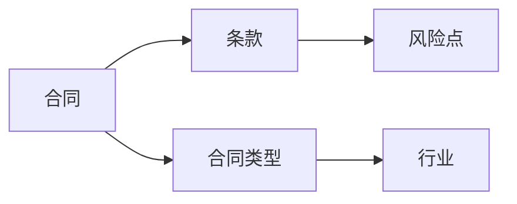

                 

# 开发基于大模型的金融合同审核系统

> 关键词：金融合同审核，大模型，NLP，系统架构，项目实战

> 摘要：本文详细探讨了基于大模型的金融合同审核系统的开发过程，从问题背景分析到系统设计，再到项目实战，全面解析了如何利用大模型技术提升金融合同审核的效率与准确性。文章通过详细的技术分析和实际案例，展示了大模型在金融领域的应用潜力，并为读者提供了从理论到实践的完整指导。

---

# 第一部分: 金融合同审核系统背景与需求

## 第1章: 金融合同审核的挑战与需求

### 1.1 金融合同审核的重要性

#### 1.1.1 金融合同的基本概念

金融合同是金融机构在日常业务中使用的重要法律文件，包括贷款合同、保险合同、投资协议等。这些合同通常包含复杂的法律条款和业务条款，需要经过严格的审核以确保合规性和风险控制。

#### 1.1.2 合同审核的关键环节

- **合法性审查**：确保合同内容符合相关法律法规。
- **风险评估**：识别合同中的潜在风险点，如违约条款、利率变动等。
- **条款理解**：准确理解合同中的专业术语和条款内容。
- **格式合规性**：确保合同格式符合行业标准和监管要求。

#### 1.1.3 传统合同审核的痛点与挑战

- **效率低下**：人工审核需要大量时间，且容易出错。
- **成本高昂**：需要专业法律人员参与，成本较高。
- **一致性不足**：不同审核人员对合同的理解可能不同，导致审核结果不一致。
- **数据孤岛**：不同部门和系统之间的数据难以共享，影响审核效率。

### 1.2 大模型技术的兴起

#### 1.2.1 人工智能技术的发展历程

人工智能技术经历了从规则驱动到数据驱动的转变，近年来，随着深度学习技术的发展，大模型在自然语言处理（NLP）领域取得了突破性进展。

#### 1.2.2 大模型在NLP领域的突破

- **预训练技术**：大模型通过大量通用文本的预训练，获得了强大的语言理解和生成能力。
- **多任务学习**：大模型可以在多种任务上同时训练，提升其泛化能力。
- **大规模参数量**：大模型通常拥有数亿甚至更多的参数，能够捕捉复杂的语言模式。

#### 1.2.3 大模型在金融领域的应用潜力

- **智能合同生成**：基于大模型生成符合业务需求的合同模板。
- **合同审核自动化**：利用大模型快速识别合同中的关键条款和潜在风险。
- **风险预警**：通过分析合同中的条款，提前发现潜在的法律风险。

### 1.3 为什么选择大模型进行金融合同审核

#### 1.3.1 大模型在合同审核中的优势

- **高效性**：大模型可以在短时间内处理大量合同，显著提高审核效率。
- **准确性**：通过深度学习技术，大模型能够准确识别合同中的关键条款和潜在风险。
- **一致性**：大模型的审核结果具有高度一致性，避免了人工审核的主观性问题。

#### 1.3.2 传统方法与大模型方法的对比

| 方法         | 优点                           | 缺点                             |
|--------------|--------------------------------|----------------------------------|
| 人工审核     | 高准确性，灵活性               | 效率低，成本高，一致性差         |
| 大模型审核   | 高效率，一致性好，成本低       | 需要大量数据训练，可能需要微调   |

#### 1.3.3 金融合同审核的边界与外延

- **边界**：金融合同审核系统主要关注合同文本的理解和风险识别，不涉及合同生成或修改。
- **外延**：大模型技术可以扩展应用于金融领域的其他任务，如智能客服、金融数据分析等。

---

## 第2章: 问题背景与需求分析

### 2.1 金融合同审核的核心问题

#### 2.1.1 合同条款的理解与识别

合同中的条款可能涉及复杂的法律术语和业务逻辑，如何准确理解这些条款是合同审核的核心问题。

#### 2.1.2 合同风险的自动化评估

识别合同中的潜在风险点，如违约责任、利率调整等，是合同审核的重要目标。

#### 2.1.3 多语言与多格式合同的处理

金融机构可能需要处理多种语言和格式的合同，如何统一处理这些合同是系统设计中的挑战。

### 2.2 问题解决的思路与目标

#### 2.2.1 基于大模型的文本处理方案

利用大模型强大的自然语言处理能力，对合同文本进行理解和分析，提取关键信息并生成审核结果。

#### 2.2.2 系统设计的目标与关键指标

- **目标**：实现合同文本的自动化理解和审核，提升审核效率和准确性。
- **关键指标**：准确率、召回率、处理速度、系统稳定性。

#### 2.2.3 系统的边界与外延

- **边界**：系统仅负责合同文本的处理和分析，不涉及合同的生成或修改。
- **外延**：系统可以与其他金融系统集成，如风险管理系统、客户关系管理系统等。

### 2.3 核心概念与联系

#### 2.3.1 核心概念原理

大模型通过预训练和微调技术，能够理解和生成自然语言文本。在金融合同审核中，大模型可以用于文本分类、信息抽取等任务。

#### 2.3.2 核心概念属性特征对比表格

| 概念         | 特征1       | 特征2       | 特征3       |
|--------------|------------|------------|------------|
| 大模型       | 参数量大     | 多任务学习能力 | 预训练能力   |
| 金融合同     | 法律条款     | 业务条款     | 风险条款     |

#### 2.3.3 实体关系图（ER图）

---

## 第3章: 大模型的算法原理

### 3.1 大模型的基本原理

#### 3.1.1 大模型的结构与特点

大模型通常基于Transformer架构，包含编码器和解码器两部分。编码器用于将输入文本转换为向量表示，解码器用于生成输出文本。

#### 3.1.2 大模型的训练方法

- **预训练**：在大规模通用文本上进行无监督训练，目标是学习文本的语义表示。
- **微调**：在特定领域数据上进行有监督训练，提升模型在该领域的性能。

#### 3.1.3 大模型的数学模型

大模型的核心是多头自注意力机制，公式如下：

$$
\text{Attention}(Q, K, V) = \text{softmax}\left(\frac{QK^T}{\sqrt{d_k}}\right)V
$$

其中，\(Q\)、\(K\)、\(V\)分别是查询、键和值向量，\(d_k\)是向量的维度。

---

接下来，我们将继续分析系统的详细设计与实现。

