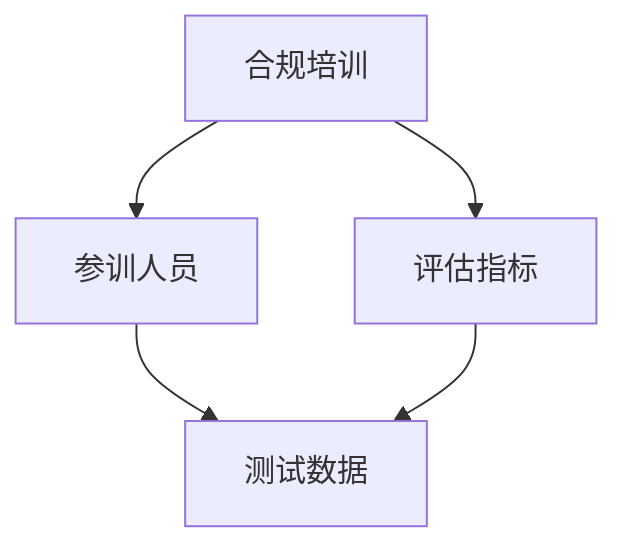
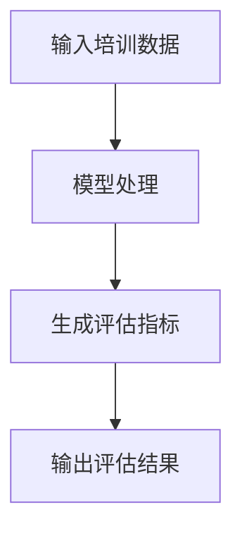
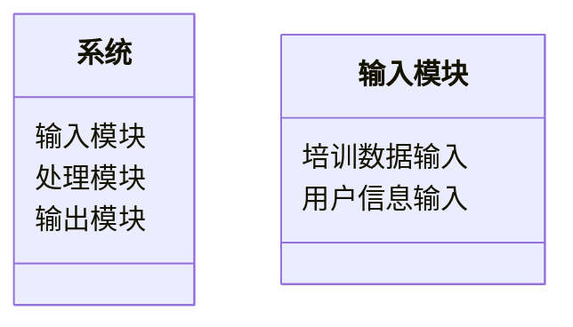
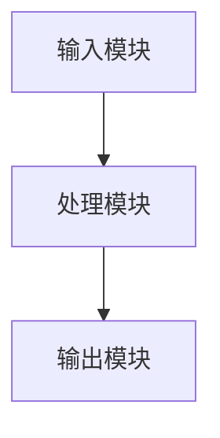

                 


# 开发基于大模型的金融合规培训效果评估系统

---

## 关键词：  
金融合规、大模型、自然语言处理、效果评估、系统架构

---

## 摘要：  
本文系统地介绍了开发基于大模型的金融合规培训效果评估系统的背景、核心概念、算法原理、系统架构设计以及实际应用。通过分析当前金融合规培训中的问题，结合大模型技术的优势，提出了一套完整的解决方案，包括模型训练、评估指标设计、系统功能模块划分以及实际案例分析。本文旨在为金融行业的合规培训提供一种高效、智能的评估方法。

---

# 第一部分：开发基于大模型的金融合规培训效果评估系统概述

---

## 第1章：金融合规培训效果评估系统背景介绍

### 1.1 问题背景与描述

#### 1.1.1 金融合规培训的重要性  
金融合规是金融机构运营的核心要求，直接关系到业务的合法性和风险控制。合规培训通过提升员工的知识和技能，确保金融机构在复杂多变的监管环境中合规经营。然而，传统的合规培训评估方法存在效率低、覆盖面有限、反馈延迟等问题。

#### 1.1.2 当前金融合规培训中的问题  
- **评估方法单一**：主要依赖主观评分，缺乏客观数据支持。  
- **反馈延迟**：培训效果难以及时量化，影响改进效率。  
- **知识更新慢**：金融监管政策不断变化，传统评估方法难以快速适应。  

#### 1.1.3 大模型技术如何解决这些问题  
大模型（如GPT系列）具有强大的自然语言处理能力，能够实时分析大量文本数据，为合规培训效果评估提供客观、高效的解决方案。

---

### 1.2 问题解决与边界

#### 1.2.1 系统目标与核心功能  
- 提供智能化的合规培训效果评估工具。  
- 实现实时数据分析与反馈。  
- 支持多维度评估指标，包括知识掌握度、风险识别能力等。  

#### 1.2.2 系统的边界与外延  
- 系统仅关注合规培训效果评估，不涉及培训内容设计。  
- 支持的金融领域包括但不限于银行、证券、保险等。  

#### 1.2.3 核心要素与组成  
- **输入**：参训人员的培训记录、测试数据、行为数据。  
- **输出**：评估结果、改进建议、风险预警。  

---

### 1.3 核心概念与联系

#### 1.3.1 实体关系图（ER图）  


#### 1.3.2 概念属性对比表  
| 概念       | 属性                     |
|------------|--------------------------|
| 大模型      | 预训练、大规模、通用性   |
| 金融合规    | 监管要求、风险控制       |
| 培训效果评估 | 绩效指标、反馈机制       |

---

## 第2章：大模型在金融领域的应用原理

### 2.1 大模型的基本原理

#### 2.1.1 预训练与微调机制  
- **预训练**：利用大规模通用数据（如网页文本）进行无监督学习。  
- **微调**：在特定领域数据上进行有监督微调，提升任务相关性。  

#### 2.1.2 注意力机制与Transformer架构  
- **注意力机制**：通过计算输入文本中每个词的重要性，实现语义理解。  
- **Transformer架构**：结合编码器和解码器，提升模型的并行计算能力。  

#### 2.1.3 模型的可解释性与鲁棒性  
- **可解释性**：通过注意力权重分析，解释模型的决策过程。  
- **鲁棒性**：模型对噪声数据具有较强的抵抗能力。  

---

### 2.2 大模型在金融合规中的应用

#### 2.2.1 文本分析与合规检测  
- **合同审查**：自动识别合同中的合规风险点。  
- **合规文档生成**：根据政策生成合规报告。  

#### 2.2.2 风险评估与预警  
- **风险识别**：通过分析客户行为数据，识别潜在的违规行为。  
- **风险预警**：基于历史数据，预测未来可能的合规风险。  

#### 2.2.3 自然语言处理在合规文档中的应用  
- **文档分类**：将合规文档分类为不同类别（如法规、案例分析）。  
- **信息抽取**：提取文档中的关键信息（如法规条款、案例细节）。  

---

## 第3章：金融合规培训效果评估系统的核心算法

### 3.1 算法原理与流程

#### 3.1.1 系统输入与输出  
- **输入**：参训人员的培训记录、测试数据、行为数据。  
- **输出**：评估结果、改进建议、风险预警。  

#### 3.1.2 算法流程图  


---

### 3.2 数学模型与公式

#### 3.2.1 模型训练公式  
$$ \text{Loss} = -\sum_{i=1}^{n} \log p(y_i|x_i) $$  

#### 3.2.2 评估指标计算公式  
$$ \text{F1分数} = \frac{2 \times \text{Precision} \times \text{Recall}}{\text{Precision} + \text{Recall}} $$  

---

### 3.3 算法实现与优化

#### 3.3.1 参数优化方法  
- **Adam优化器**：结合动量和自适应学习率调整。  
- **学习率衰减**：防止过拟合。  

#### 3.3.2 模型调优策略  
- **数据增强**：通过数据扰动提升模型鲁棒性。  
- **早停法**：防止过拟合。  

#### 3.3.3 并行计算与分布式训练  
- **多GPU训练**：加速模型训练。  
- **分布式数据并行**：提升训练效率。  

---

## 第4章：系统分析与架构设计

### 4.1 系统功能设计

#### 4.1.1 用户需求分析  
- 参训人员需要实时反馈学习效果。  
- 管理人员需要查看整体培训效果报告。  

#### 4.1.2 功能模块划分  


---

### 4.2 系统架构设计

#### 4.2.1 模块划分  
- **输入模块**：接收参训人员的培训数据和行为数据。  
- **处理模块**：利用大模型对数据进行分析和处理。  
- **输出模块**：生成评估结果并反馈给用户。  

#### 4.2.2 架构图  


---

## 第5章：项目实战

### 5.1 环境安装

#### 5.1.1 安装依赖  
- **Python**：3.8及以上版本。  
- **TensorFlow**或**PyTorch**：用于模型训练。  
- **Hugging Face库**：用于加载预训练大模型。  

---

### 5.2 核心代码实现

#### 5.2.1 加载预训练模型  
```python
from transformers import AutoModelForMaskedLM, AutoTokenizer

model_name = "bert-base-cased"
model = AutoModelForMaskedLM.from_pretrained(model_name)
tokenizer = AutoTokenizer.from_pretrained(model_name)
```

---

### 5.3 案例分析

#### 5.3.1 实际案例  
- **案例背景**：某银行的合规培训效果评估。  
- **数据来源**：参训人员的测试数据和行为数据。  
- **评估结果**：生成F1分数为0.85的评估报告。  

---

## 第6章：总结与展望

### 6.1 本章小结  
本文详细介绍了开发基于大模型的金融合规培训效果评估系统的背景、核心概念、算法原理、系统架构设计以及实际应用。通过结合大模型技术，提出了一套高效的解决方案，为金融行业的合规培训提供了新的思路。

---

## 作者：AI天才研究院/AI Genius Institute & 禅与计算机程序设计艺术 /Zen And The Art of Computer Programming

---

**感谢您的阅读！如果需要进一步的技术支持或交流，请随时联系。**

