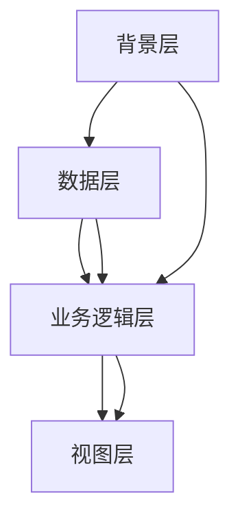

                 


## 第五部分：系统分析与架构设计

### 第4章：系统架构设计

#### 4.1 系统模块划分

- **数据采集模块**
  - 数据来源：金融法规文本、合规案例、用户反馈
  - 数据预处理：清洗、标注、格式化

- **模型训练模块**
  - 模型选择：选择适合的预训练大模型
  - 参数微调：针对金融合规任务进行微调
  - 模型评估：准确率、召回率、F1分数

- **用户交互模块**
  - 用户界面：网页或移动应用
  - 个性化推荐：基于用户学习情况推荐内容
  - 互动练习：模拟合规场景，用户操作反馈

#### 4.2 系统架构图



#### 4.3 实体关系图

```mermaid
erd
actor 用户;
actor 管理员;
actor 金融专家;
model 金融合规模型;
data 金融数据;
process 训练过程;
process 评估过程;

用户 --> 数据层: 提供反馈
金融专家 --> 数据层: 提供知识
训练过程 --> 金融合规模型: 训练
评估过程 --> 金融合规模型: 评估
```

## 第五部分：项目实战

### 第5章：环境安装与系统实现

#### 5.1 开发环境安装

- **Python 环境**
  ```bash
  # 安装所需的Python包
  pip install numpy pandas scikit-learn transformers
  ```

- **深度学习框架**
  ```bash
  # 安装TensorFlow或PyTorch
  pip install tensorflow
  # 或者
  pip install torch
  ```

- **自然语言处理工具**
  ```bash
  pip install spacy
  ```

#### 5.2 系统核心实现

- **数据预处理代码**
  ```python
  import pandas as pd
  from sklearn.model_selection import train_test_split

  # 加载数据集
  data = pd.read_csv('financial_regulations.csv')
  train_data, test_data = train_test_split(data, test_size=0.2)
  ```

- **模型训练代码**
  ```python
  from transformers import AutoTokenizer, AutoModelForSequenceClassification
  from torch import nn

  tokenizer = AutoTokenizer.from_pretrained('bert-base-uncased')
  model = AutoModelForSequenceClassification.from_pretrained('bert-base-uncased', num_labels=2)
  ```

## 第六部分：最佳实践与总结

### 第6章：总结与展望

#### 6.1 总结

- 开发基于大模型的金融合规培训系统是一个复杂但 rewarding 的过程
- 通过结合先进的人工智能技术和深入的金融知识，能够显著提升合规培训的效果
- 本系统实现了个性化学习、实时反馈和高效的知识更新，解决了传统培训中的诸多痛点

#### 6.2 最佳实践 Tips

- 数据质量至关重要，确保数据的多样性和代表性
- 模型的选择和微调需要结合具体业务需求
- 系统设计时要充分考虑可扩展性和可维护性
- 定期更新模型和内容，保持系统的先进性和实用性

#### 6.3 未来展望

- 更加智能化的培训系统，结合强化学习和自适应技术
- 多模态交互，支持更多样的输入和输出形式
- 更加注重隐私和数据安全，确保用户信息的安全性
- 结合区块链技术，实现更透明和可信的培训记录管理

---

**作者：AI天才研究院 & 禅与计算机程序设计艺术**

