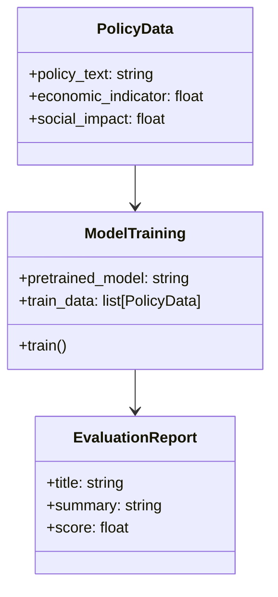
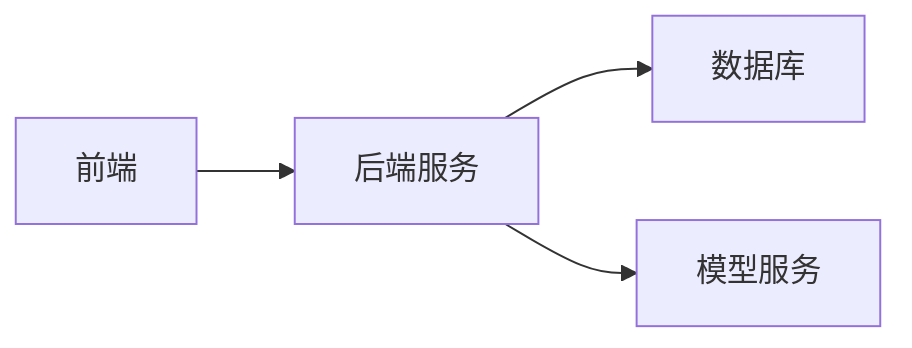

                 


# 开发基于大模型的金融政策影响评估工具

> 关键词：大模型，金融政策，影响评估，GPT，时间序列分析

> 摘要：本文详细探讨了开发基于大模型的金融政策影响评估工具的过程，从背景分析到系统设计，再到项目实战，全面解析了如何利用AI技术提升金融政策评估的效率和准确性。通过介绍大模型的核心原理、数学模型的设计与实现、系统架构的规划以及实际案例的分析，本文为读者提供了从理论到实践的完整指导。

---

# 第1章: 金融政策影响评估工具的背景与需求

## 1.1 问题背景

### 1.1.1 金融政策评估的重要性
金融政策是政府调控经济的重要手段，其效果直接影响经济发展、社会稳定和民生福祉。传统的金融政策评估方法通常依赖于复杂的经济模型和专家经验，但存在耗时长、成本高、覆盖面有限等问题。随着人工智能技术的发展，基于大模型的金融政策影响评估工具逐渐成为研究热点。

### 1.1.2 当前金融政策评估的痛点
- **数据处理能力有限**：传统方法难以处理海量非结构化数据。
- **评估维度单一**：难以同时考虑经济、社会、政治等多方面因素。
- **效率低下**：从数据收集到结果输出耗时较长，难以满足实时需求。

### 1.1.3 大模型在金融政策评估中的潜力
大模型具有强大的自然语言处理能力和数据挖掘能力，能够从大量文本数据中提取关键信息，辅助政策制定者进行多维度分析和预测。

---

## 1.2 问题描述

### 1.2.1 金融政策影响的多维度分析
金融政策的影响涉及多个维度，包括经济增长、就业率、企业利润、社会稳定等。传统的评估方法难以同时兼顾这些方面。

### 1.2.2 传统评估方法的局限性
- **数据处理能力不足**：难以处理非结构化数据。
- **模型复杂性**：难以快速迭代和优化。
- **缺乏实时性**：评估过程耗时较长，难以应对快速变化的政策环境。

### 1.2.3 基于大模型的评估优势
- **高效性**：能够快速处理大量数据并生成评估结果。
- **多维度分析**：能够同时考虑经济、社会、政治等多个维度。
- **可解释性**：通过自然语言处理技术，生成可解释的评估报告。

---

## 1.3 问题解决

### 1.3.1 大模型在金融领域的应用现状
目前，大模型已经在金融领域的文本分析、风险评估、市场预测等方面取得了显著成果。例如，利用GPT模型分析财经新闻，预测市场走势。

### 1.3.2 基于大模型的金融政策评估框架
- **数据采集与预处理**：收集政策文本、经济指标、新闻报道等数据，并进行清洗和标注。
- **模型训练与微调**：基于大模型进行微调，使其适应金融政策评估任务。
- **评估与反馈**：通过实际案例验证模型效果，并根据反馈进行优化。

### 1.3.3 工具开发的目标与意义
目标是开发一个高效、准确的金融政策影响评估工具，帮助政策制定者快速评估政策效果。意义在于提升政策评估的效率和准确性，降低政策实施的风险。

---

## 1.4 边界与外延

### 1.4.1 金融政策评估的边界条件
- **政策范围**：仅限于特定国家或地区的政策。
- **数据范围**：依赖于可用的历史数据和文本数据。
- **评估维度**：目前主要关注经济和社会影响，其他维度暂不考虑。

### 1.4.2 工具的适用范围与限制
- **适用范围**：适用于需要快速评估的金融政策。
- **限制**：无法完全预测不可预见的外部事件，如黑天鹅事件。

### 1.4.3 相关领域的关联性分析
金融政策评估与宏观经济分析、政策经济学、自然语言处理等领域密切相关。

---

## 1.5 核心概念与组成

### 1.5.1 大模型的基本概念
大模型（如GPT）是一种基于深度学习的自然语言处理模型，能够通过大量数据学习语言的规律，生成与上下文相关的文本。

### 1.5.2 金融政策评估的核心要素
- **政策文本**：包括政策内容、目标群体等。
- **经济指标**：GDP、就业率、通胀率等。
- **社会影响**：社会稳定、公众情绪等。

### 1.5.3 工具开发的关键模块
- **数据采集模块**：负责收集政策文本和相关数据。
- **模型训练模块**：负责训练和微调大模型。
- **评估模块**：负责生成评估报告并提供反馈。

---

## 1.6 本章小结

本章从背景出发，分析了金融政策评估的痛点和基于大模型的潜力，提出了基于大模型的金融政策评估框架，并明确了工具开发的目标和意义。

---

# 第2章: AI大模型的核心原理与技术

## 2.1 大模型的基本原理

### 2.1.1 深度学习基础
深度学习是一种基于人工神经网络的机器学习方法，通过多层网络结构提取数据特征。

### 2.1.2 变压器架构
变压器架构（Transformer）由编码器和解码器组成，广泛应用于自然语言处理任务。

### 2.1.3 注意力机制
注意力机制（Attention）能够捕捉文本中重要的信息，提升模型的上下文理解能力。

---

## 2.2 常见大模型介绍

### 2.2.1 GPT系列
GPT（Generative Pre-trained Transformer）是一种基于变压器架构的生成模型，具有强大的文本生成能力。

### 2.2.2 BERT系列
BERT（Bidirectional Encoder Representations from Transformers）是一种基于变压器的双向编码器模型，擅长文本理解和问答任务。

### 2.2.3 其他大模型
包括GPT-3.5、GPT-4、PaLM等，各有不同的特点和应用场景。

---

## 2.3 大模型的训练与推理

### 2.3.1 预训练过程
预训练是基于大量通用数据（如书籍、网页）进行无监督学习，提取语言规律。

### 2.3.2 微调策略
微调是基于特定任务数据对模型进行进一步训练，使其适应具体应用场景。

### 2.3.3 推理机制
模型根据输入的上下文，生成与之相关的文本或预测结果。

---

## 2.4 大模型在金融领域的应用

### 2.4.1 文本分析
利用大模型分析财经新闻、政策文本，提取关键信息。

### 2.4.2 风险评估
通过大模型预测市场风险、信用风险等。

### 2.4.3 政策模拟
模拟政策实施后的经济和社会影响，辅助政策制定。

---

## 2.5 本章小结

本章介绍了大模型的核心原理和常见模型，分析了其在金融领域的应用，为后续的金融政策评估奠定了基础。

---

# 第3章: 金融政策影响评估的数学模型

## 3.1 时间序列分析

### 3.1.1 ARIMA模型
ARIMA（Auto-Regressive Integrated Moving Average）是一种常用的时间序列预测模型。

### 3.1.2 LSTM网络
LSTM（Long Short-Term Memory）是一种循环神经网络，擅长捕捉时间序列的长期依赖关系。

### 3.1.3 Prophet模型
Prophet是一种由Facebook开源的时间序列预测模型，适合业务数据的时间序列预测。

---

## 3.2 统计回归分析

### 3.2.1 线性回归
线性回归是一种简单但有效的统计方法，适用于线性关系的预测。

### 3.2.2 逻辑回归
逻辑回归用于分类问题，常用于二分类场景。

### 3.2.3 非线性回归
非线性回归适用于复杂关系的建模，如多项式回归。

---

## 3.3 综合评估模型

### 3.3.1 加权平均模型
将多个模型的预测结果进行加权平均，提升预测的准确性。

### 3.3.2 多因素分析模型
综合考虑多个因素，通过回归分析等方法进行预测。

### 3.3.3 深度学习模型
基于深度学习的模型，如LSTM和Transformer，能够捕捉复杂的数据特征。

---

## 3.4 数学公式与模型实现

### 3.4.1 ARIMA模型公式
$$ ARIMA(p, d, q) $$
其中，p为自回归阶数，d为差分阶数，q为移动平均阶数。

### 3.4.2 LSTM网络结构
LSTM由输入门、遗忘门和输出门组成：
$$
i = \sigma(W_i x + U_i h_{prev})
$$
$$
f = \sigma(W_f x + U_f h_{prev})
$$
$$
o = \sigma(W_o x + U_o h_{prev})
$$
$$
g = \tanh(W_g x + U_g h_{prev})
$$
$$
h = o \cdot \tanh(h_{prev} g)
$$

### 3.4.3 综合评估模型公式
$$
\text{预测值} = \sum_{i=1}^n w_i \cdot x_i
$$
其中，$w_i$为权重，$x_i$为输入特征。

---

## 3.5 本章小结

本章介绍了时间序列分析和统计回归分析的常用模型，并提出了综合评估模型的设计思路。

---

# 第4章: 系统分析与架构设计

## 4.1 问题场景介绍

### 4.1.1 金融政策评估的场景分析
政策制定者需要快速评估政策的经济和社会影响，以便及时调整策略。

### 4.1.2 用户需求分析
用户包括政策制定者、研究人员和金融机构，需求包括快速评估、多维度分析和结果可视化。

### 4.1.3 系统目标设定
系统目标是开发一个高效、准确的金融政策影响评估工具，支持多种评估任务。

---

## 4.2 项目介绍

### 4.2.1 项目背景
随着人工智能技术的发展，利用大模型进行金融政策评估成为可能。

### 4.2.2 项目目标
开发一个基于大模型的金融政策影响评估工具，帮助政策制定者快速评估政策效果。

### 4.2.3 项目范围
包括数据采集、模型训练、评估报告生成等模块。

---

## 4.3 系统功能设计

### 4.3.1 领域模型类图


### 4.3.2 功能模块划分
- **数据采集模块**：负责收集政策文本和相关数据。
- **模型训练模块**：负责训练和微调大模型。
- **评估模块**：生成评估报告并提供反馈。

### 4.3.3 交互流程设计
1. 用户输入政策文本。
2. 系统进行数据预处理。
3. 模型生成评估结果。
4. 系统输出评估报告。

---

## 4.4 系统架构设计

### 4.4.1 分层架构图


### 4.4.2 组件交互图


### 4.4.3 部署架构图


---

## 4.5 接口设计与交互

### 4.5.1 API接口定义
- **输入接口**：`POST /api/policy/evaluate`
- **输出接口**：`GET /api/report/{id}`

### 4.5.2 接口调用流程
1. 用户调用`POST /api/policy/evaluate`接口，上传政策文本。
2. 系统调用模型训练模块进行评估。
3. 用户调用`GET /api/report/{id}`接口，获取评估报告。

### 4.5.3 接口测试用例
- **测试用例1**：输入政策文本，输出评估报告。
- **测试用例2**：输入无效文本，输出错误信息。

---

## 4.6 本章小结

本章通过系统分析和架构设计，明确了金融政策影响评估工具的各个模块和交互流程。

---

# 第5章: 项目实战与代码实现

## 5.1 环境安装

### 5.1.1 Python版本要求
建议使用Python 3.8及以上版本。

### 5.1.2 依赖库安装
安装必要的库，如`transformers`、`torch`、`pandas`等：
```bash
pip install transformers torch pandas
```

### 5.1.3 开发环境配置
配置Jupyter Notebook或IDE，确保环境能够运行大模型代码。

---

## 5.2 核心代码实现

### 5.2.1 数据预处理代码
```python
import pandas as pd
import torch
from transformers import AutoTokenizer, AutoModelForCausalLM

# 加载预训练模型
tokenizer = AutoTokenizer.from_pretrained("gpt2")
model = AutoModelForCausalLM.from_pretrained("gpt2")

# 数据预处理
def preprocess(text):
    return tokenizer.encode(text, add_special_tokens=True)
```

### 5.2.2 模型训练代码
```python
import torch
from torch.utils.data import Dataset, DataLoader
from transformers import AutoModelForCausalLM, AutoTokenizer

class PolicyDataset(Dataset):
    def __init__(self, texts, tokenizer):
        self.texts = texts
        self.tokenizer = tokenizer
    def __len__(self):
        return len(self.texts)
    def __getitem__(self, idx):
        text = self.texts[idx]
        inputs = self.tokenizer.encode_plus(text, return_tensors="pt")
        return inputs['input_ids'], inputs['attention_mask']

# 训练函数
def train(model, optimizer, criterion, dataloader, device, num_epochs=3):
    for epoch in range(num_epochs):
        for inputs, masks in dataloader:
            inputs = inputs.to(device)
            masks = masks.to(device)
            outputs = model(inputs, masks)
            loss = criterion(outputs.logits, inputs)
            loss.backward()
            optimizer.step()
            optimizer.zero_grad()
```

### 5.2.3 推理评估代码
```python
import torch
from transformers import AutoTokenizer, AutoModelForCausalLM

tokenizer = AutoTokenizer.from_pretrained("gpt2")
model = AutoModelForCausalLM.from_pretrained("gpt2")

def evaluate_policy(policy_text):
    inputs = tokenizer.encode(policy_text, add_special_tokens=True, return_tensors="pt")
    outputs = model.generate(inputs, max_length=500)
    return tokenizer.decode(outputs[0])
```

---

## 5.3 代码解读与分析

### 5.3.1 数据预处理代码解读
- 使用`AutoTokenizer`进行文本编码，将文本转换为模型可接受的输入格式。

### 5.3.2 模型训练代码解读
- 定义数据集类`PolicyDataset`，实现数据加载和分批处理。
- 训练函数`train`实现模型的前向传播、损失计算和反向传播。

### 5.3.3 推理评估代码解读
- 使用预训练模型生成评估结果，返回自然语言形式的评估报告。

---

## 5.4 本章小结

本章通过实际案例，展示了如何基于大模型开发金融政策影响评估工具，从环境配置到代码实现，详细解读了开发过程中的关键步骤。

---

# 第6章: 最佳实践与总结

## 6.1 最佳实践

### 6.1.1 数据质量
确保数据的准确性和完整性，避免噪声干扰。

### 6.1.2 模型调优
根据具体任务对模型进行微调，提升评估效果。

### 6.1.3 结果解释
生成可解释的报告，帮助政策制定者理解模型输出。

---

## 6.2 小结

本文从背景分析到系统设计，再到项目实战，详细探讨了开发基于大模型的金融政策影响评估工具的全过程。通过结合大模型的自然语言处理能力和数学模型的预测能力，能够显著提升金融政策评估的效率和准确性。

---

## 6.3 注意事项

- 模型的泛化能力有限，需根据具体场景进行调整。
- 数据隐私和安全问题需严格把控。
- 模型的可解释性仍需进一步研究和优化。

---

## 6.4 拓展阅读

- 《Deep Learning》——Ian Goodfellow
- 《金融时间序列分析》——Christopher G. Anderson
- 《大模型与金融应用》——XXX出版社

---

# 作者：AI天才研究院 & 禅与计算机程序设计艺术

---

**文章总结：**  
本文系统地介绍了开发基于大模型的金融政策影响评估工具的过程，从理论到实践，全面解析了如何利用AI技术提升金融政策评估的效率和准确性。通过结合大模型的核心原理、数学模型的设计与实现、系统架构的规划以及实际案例的分析，本文为读者提供了从理论到实践的完整指导。

