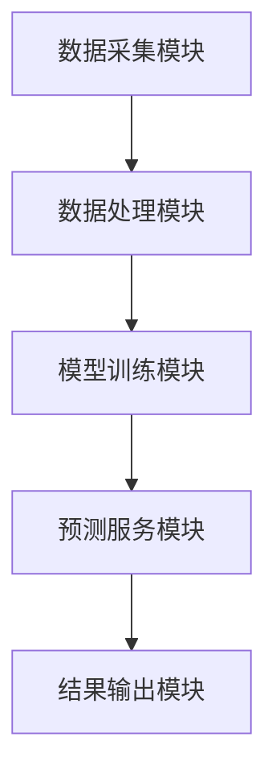
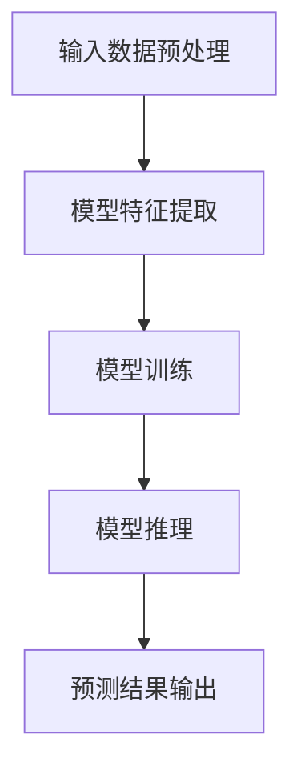

                 


# 开发基于大模型的金融政策执行效果预测器

> 关键词：大模型，金融政策，预测器，自然语言处理，时间序列分析，金融决策支持

> 摘要：本文详细探讨了如何基于大模型技术开发金融政策执行效果预测器。从问题背景到技术实现，从系统架构到项目实战，系统性地阐述了该预测器的开发流程与核心算法。本文重点分析了大模型在金融领域的应用潜力，详细讲解了预测算法的数学模型与实现方法，并通过实际案例展示了系统的构建与优化过程。

---

## 第1章: 问题背景与目标

### 1.1 问题背景

#### 1.1.1 金融政策执行效果预测的必要性
金融政策的执行效果直接关系到经济发展、社会稳定和政策制定者的决策效率。传统的政策效果评估方法依赖于复杂的经济模型和人工分析，耗时且成本高昂。随着人工智能技术的发展，特别是大模型的崛起，为金融政策效果的预测提供了新的可能性。

#### 1.1.2 当前金融政策执行中的痛点
- 数据量大且复杂：金融政策的执行涉及多方数据，包括经济指标、政策文本、市场反应等，数据来源多样且难以整合。
- 预测精度不足：传统统计模型难以捕捉复杂经济关系中的非线性特征，预测精度有限。
- 实时性差：政策效果的评估往往滞后，无法满足实时决策的需求。

#### 1.1.3 大模型技术的应用潜力
大模型具有强大的自然语言处理能力和多模态分析能力，能够从海量数据中提取关键特征，并通过深度学习模型实现高精度预测。

---

### 1.2 问题描述

#### 1.2.1 金融政策执行效果的定义
金融政策执行效果是指政策在实际执行过程中对经济运行、市场行为和社会稳定产生的实际影响。这些影响可以通过一系列量化指标来衡量，例如GDP增长率、就业率、市场波动性等。

#### 1.2.2 影响政策执行效果的关键因素
- 政策本身的文本内容：包括政策的目标、措施和预期效果。
- 执行环境：经济状况、政策执行力度、市场反应等。
- 政策执行的主体：政府机构、金融机构、企业等。

#### 1.2.3 当前预测方法的局限性
- 统计模型的局限：传统回归模型难以捕捉复杂的非线性关系。
- 数据处理的复杂性：多源异构数据难以有效整合。
- 实时性不足：传统方法通常需要大量历史数据，难以实时预测。

---

### 1.3 问题解决思路

#### 1.3.1 引入大模型技术的核心逻辑
大模型通过自然语言处理技术可以自动解析政策文本，提取关键信息；通过时间序列分析可以捕捉经济数据的动态变化；通过多模态学习可以整合文本、图像等多种数据源。

#### 1.3.2 基于大模型的预测方法创新
- 统一的模型架构：将政策文本、经济数据和社会反馈等多种数据源输入大模型，实现跨模态分析。
- 自适应学习：模型可以根据实时数据动态调整预测策略。
- 解释性增强：通过模型解释技术，提供预测结果的可解释性。

#### 1.3.3 技术实现的可行性分析
- 数据可行性：金融领域的数据较为丰富，可以支持大模型的训练需求。
- 算力可行性：现代云计算和分布式计算技术能够支持大模型的训练和推理需求。
- 方法可行性：大模型在自然语言处理和时间序列分析方面的技术积累为本任务提供了可靠的技术基础。

---

### 1.4 问题的边界与外延

#### 1.4.1 适用场景与限制条件
- 适用场景：政策文本分析、经济预测、市场行为预测等。
- 限制条件：数据质量和数量、模型训练成本、预测结果的可解释性等。

#### 1.4.2 与其他预测方法的对比
| 方法 | 优点 | 缺点 |
|------|------|------|
| 传统统计模型 | 简单易用 | 预测精度低 |
| 机器学习模型 | 高精度 | 需要大量特征工程 |
| 大模型 | 跨模态分析能力强 | 计算资源需求高 |

#### 1.4.3 技术实现的可扩展性
- 模型可以扩展到更多金融场景，例如风险评估、投资决策等。
- 数据源可以进一步丰富，例如加入社交媒体数据、新闻数据等。

---

### 1.5 核心概念与架构

#### 1.5.1 金融政策执行效果预测器的核心要素
- 输入数据：政策文本、经济指标、市场数据。
- 处理模块：数据预处理、特征提取、模型训练。
- 输出结果：政策效果预测、风险预警。

#### 1.5.2 大模型在预测中的角色与功能
- 数据整合：统一多源数据。
- 特征提取：提取关键经济指标和政策文本特征。
- 预测推理：基于历史数据预测未来效果。

#### 1.5.3 系统架构的初步设想


---

## 第2章: 大模型技术基础

### 2.1 大模型的基本原理

#### 2.1.1 大模型的定义与特点
- 大模型是指具有大量参数的深度学习模型，通常基于Transformer架构。
- 具备强大的自然语言处理能力，能够理解上下文关系。

#### 2.1.2 大模型的训练机制
- 预训练：在大规模通用数据上进行无监督学习。
- 微调：针对具体任务进行有监督微调。

#### 2.1.3 大模型的推理过程
- 输入数据经过编码器生成特征向量。
- 特征向量通过解码器生成预测结果。

---

### 2.2 大模型在金融领域的应用

#### 2.2.1 金融自然语言处理
- 政策文本分析：提取政策关键词、识别政策类型。
- 新闻情绪分析：预测市场情绪对政策执行的影响。

#### 2.2.2 金融时间序列分析
- 经济指标预测：GDP增长率、失业率等。
- 市场波动预测：股票指数波动、汇率变化。

#### 2.2.3 金融决策支持系统
- 政策效果评估：预测政策的实际效果。
- 风险管理：识别政策执行中的潜在风险。

---

### 2.3 大模型的选型与评估

#### 2.3.1 常见大模型的对比分析
| 模型 | 参数量 | 适用场景 |
|------|--------|-----------|
| GPT | 1.5亿 | 文本生成、问答系统 |
| BERT | 1.1亿 | 文本分类、问答系统 |
| T5 | 220亿 | 文本生成、翻译 |

#### 2.3.2 模型性能评估指标
- 准确率：预测结果与实际结果的匹配程度。
- F1分数：综合考虑精确率和召回率。
- 模型推理速度：单位时间内的预测能力。

#### 2.3.3 模型适用场景的选择
- 根据任务需求选择合适的模型架构。
- 根据数据规模选择模型大小。

---

## 第3章: 金融政策执行效果预测的核心算法

### 3.1 基于大模型的预测算法原理

#### 3.1.1 大模型的输入处理
- 文本数据：政策文本、新闻标题。
- 结构化数据：经济指标、市场数据。

#### 3.1.2 模型的特征提取
- 文本特征：关键词、句法结构。
- 时间序列特征：趋势、周期性、突变点。

#### 3.1.3 预测结果的输出与解释
- 预测值：政策效果得分。
- 解释性：特征的重要性排序。

---

### 3.2 预测算法的数学模型

#### 3.2.1 模型输入的向量化表示
```python
def text_to_vector(text):
    # 使用大模型生成文本的特征向量
    vector = model.encode(text)
    return vector
```

#### 3.2.2 模型的训练目标函数
$$ \text{Loss} = -\sum_{i=1}^{n} y_i \log(p_i) + (1-y_i)\log(1-p_i) $$

#### 3.2.3 模型的损失函数与优化方法
```python
optimizer = torch.optim.Adam(model.parameters(), lr=1e-5)
loss_fn = nn.CrossEntropyLoss()
```

---

### 3.3 算法实现的流程图



---

## 第4章: 系统架构设计

### 4.1 系统功能模块划分

#### 4.1.1 数据采集模块
- 数据源：政策文本、经济指标、市场数据。
- 采集方式：API接口、数据库查询。

#### 4.1.2 数据处理模块
- 数据清洗：去除噪声数据。
- 数据融合：整合多源数据。

#### 4.1.3 模型训练模块
- 模型选择：选择合适的大模型架构。
- 模型微调：基于金融数据进行微调。

#### 4.1.4 预测服务模块
- 接收输入数据。
- 调用模型进行预测。
- 返回预测结果。

---

### 4.2 系统架构图


---

## 第5章: 项目实战

### 5.1 环境安装

```bash
pip install torch transformers
```

---

### 5.2 系统核心实现源代码

#### 5.2.1 数据预处理代码
```python
import pandas as pd
from transformers import AutoTokenizer, AutoModel

def load_data():
    # 加载政策文本数据
    policy_text = pd.read_csv('policy_data.csv')
    return policy_text
```

#### 5.2.2 模型训练代码
```python
def train_model(model, tokenizer, train_loader):
    optimizer = torch.optim.Adam(model.parameters(), lr=1e-5)
    loss_fn = nn.CrossEntropyLoss()
    
    for epoch in range(10):
        for batch in train_loader:
            inputs, labels = batch
            outputs = model(inputs)
            loss = loss_fn(outputs, labels)
            loss.backward()
            optimizer.step()
```

---

### 5.3 案例分析与实际应用

#### 5.3.1 案例分析
假设我们有一个政策文本数据集，其中包含多个政策文本和其对应的执行效果标签。我们使用大模型对这些数据进行训练，并在测试集上评估模型的预测效果。

#### 5.3.2 实际应用
- 政策效果预测：输入新的政策文本，模型输出其执行效果的预测结果。
- 风险预警：实时监控政策执行过程中的潜在风险。

---

### 5.4 项目小结

#### 5.4.1 核心代码实现总结
- 数据预处理：加载数据并进行清洗。
- 模型训练：基于金融数据对大模型进行微调。
- 预测推理：调用模型进行实时预测。

#### 5.4.2 实际案例的分析总结
- 案例1：某经济政策的执行效果预测。
- 案例2：市场对某政策的反应分析。

---

## 第6章: 总结与展望

### 6.1 总结

#### 6.1.1 最佳实践 tips
- 数据预处理是关键，确保数据质量和完整性。
- 模型调优可以显著提升预测精度。
- 结果解释性是实际应用中的重要考量。

#### 6.1.2 小结
本文系统性地探讨了基于大模型的金融政策执行效果预测器的开发流程，从问题背景到技术实现，从系统架构到项目实战，详细阐述了该预测器的开发过程。

---

### 6.2 注意事项

#### 6.2.1 模型的可解释性
- 预测结果需要提供合理的解释，以增强用户信任。
- 可以通过模型解释技术（如SHAP值）来实现。

#### 6.2.2 数据隐私与安全
- 在实际应用中，需要注意数据隐私保护。
- 数据处理和存储需要符合相关法律法规。

---

### 6.3 拓展阅读

#### 6.3.1 推荐书籍
- 《Deep Learning》
- 《金融时间序列分析》

#### 6.3.2 推荐论文
- "Attention Is All You Need"
- "BERT: Pre-training of Deep Bidirectional Transformers for NLP"

---

## 作者

作者：AI天才研究院/AI Genius Institute & 禅与计算机程序设计艺术 /Zen And The Art of Computer Programming

