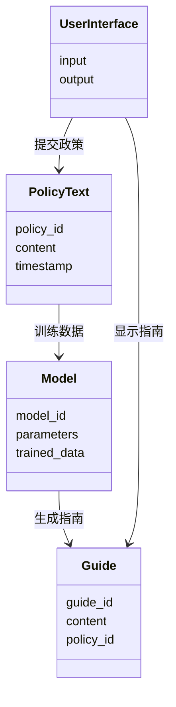

                 


# 开发基于大模型的金融政策解读与执行指南生成器

> 关键词：大模型、金融政策、自然语言处理、生成指南、系统架构

> 摘要：本文详细探讨了如何基于大模型开发金融政策解读与执行指南生成器，涵盖了从背景分析到系统设计的全过程，结合实际案例和代码实现，为读者提供全面的技术指导。

---

## 引言

随着人工智能技术的飞速发展，大模型在自然语言处理领域的应用日益广泛。金融政策的复杂性和多样性使得其解读和执行成为一个巨大的挑战。传统的政策解读依赖于人工分析，效率低下且容易出错。基于大模型的生成器能够自动解读政策并生成执行指南，为金融机构和企业提供高效、准确的解决方案。本文将详细探讨这一系统的开发过程，从算法原理到系统架构，再到实际应用，为读者提供全面的技术指导。

---

## 第1章 背景介绍

### 1.1 问题背景

金融政策的解读和执行是一个复杂且耗时的过程，传统的手动解读方式存在效率低、易出错的问题。金融机构和企业需要快速理解政策内容并制定执行计划，这对现有的方法提出了更高的要求。大模型的引入为解决这一问题提供了新的可能。

### 1.2 问题描述

金融政策文本通常包含大量的专业术语和复杂的结构，解读时需要考虑多个维度的信息。如何将这些信息转化为具体的执行指南是当前面临的主要挑战。此外，政策的更新频率高，要求系统具备快速响应和自适应能力。

### 1.3 问题解决

基于大模型的生成器能够通过自然语言处理技术，自动解析政策文本并生成执行指南。这种自动化的方式不仅提高了效率，还能减少人为错误，为金融机构和企业提供有力支持。

### 1.4 核心概念与联系

在系统开发中，需要将大模型、金融政策和生成指南三者有机结合。大模型负责理解和生成文本，金融政策提供输入数据，生成指南则是最终的输出结果。通过系统的架构设计，三者能够协同工作，实现高效的政策解读和指南生成。

---

## 第2章 核心概念与联系

### 2.1 AI大模型的基本原理

大模型通过深度学习技术，训练庞大的神经网络来理解和生成自然语言。其核心包括编码器和解码器，编码器将输入文本转化为向量表示，解码器根据这些向量生成目标输出。

### 2.2 金融政策的特征分析

金融政策文本通常具有结构化的特点，包含多个条款和细则。政策的意图往往隐含在文本中，需要系统能够识别并提取关键信息。

### 2.3 系统架构的实体关系图

通过Mermaid图展示系统的实体关系，包括政策文本库、模型训练模块、生成器模块等部分。各模块之间的交互关系清晰，确保系统的高效运行。

```mermaid
er
  entity: PolicyText {
    policy_id (PK)
    content
    timestamp
  }
  entity: Model {
    model_id (PK)
    parameters
    trained_data
  }
  entity: Guide {
    guide_id (PK)
    content
    policy_id (FK)
  }
  relationship: PolicyText --> Model: 训练数据
  relationship: Model --> Guide: 生成指南
```

---

## 第3章 算法原理讲解

### 3.1 大模型的训练与调优

模型的训练过程包括预训练和微调两个阶段。预训练使用大规模通用数据，微调则在金融领域数据上进行优化。训练过程中使用交叉熵损失函数来衡量模型的预测误差。

$$ \text{损失函数} = -\frac{1}{N}\sum_{i=1}^{N}\sum_{j=1}^{M} y_{ij}\log p(y_{ij}|x_i) $$

其中，\( y_{ij} \) 是标签，\( p(y_{ij}|x_i) \) 是模型的预测概率。

### 3.2 政策解读与指南生成的算法

解读阶段通过分词和句法分析提取关键信息，生成阶段基于这些信息构建指南的结构。生成过程使用解码器，逐步输出文本内容。

$$ \text{生成概率} = \prod_{i=1}^{n} p(w_i | w_{<i}) $$

其中，\( w_i \) 是生成的词，\( w_{<i} \) 是之前生成的词序列。

---

## 第4章 系统分析与架构设计方案

### 4.1 问题场景介绍

系统主要解决金融政策解读效率低下的问题，适用于银行、证券公司等金融机构。用户角色包括政策制定者、金融机构员工和系统管理员。

### 4.2 系统功能设计

系统功能模块包括政策输入、模型训练、生成指南和用户界面。通过领域模型类图展示各模块之间的关系。



### 4.3 系统架构设计

系统采用微服务架构，各模块独立运行，便于扩展和维护。系统架构图展示各模块的交互关系。

```mermaid
graph TD

    A[PolicyText] --> B[Model]: 训练数据
    B[Model] --> C[Guide]: 生成指南
    C[Guide] --> D[UserInterface]: 显示指南
```

---

## 第5章 项目实战

### 5.1 环境安装

开发环境包括Python、TensorFlow和相关库的安装。具体命令如下：

```bash
pip install tensorflow transformers
```

### 5.2 核心代码实现

以下是生成器的核心代码：

```python
def generate_guide(policy_text):
    # 分词
    tokens = tokenizer(policy_text, max_length=512, truncation=True, padding=True)
    # 解码
    outputs = model.generate(**tokens)
    guide = tokenizer.decode(outputs[0], skip_special_tokens=True)
    return guide
```

### 5.3 案例分析

以一条具体的金融政策为例，展示生成指南的过程。例如，给定政策文本，生成器能够输出相应的执行步骤和注意事项。

### 5.4 项目小结

通过实际案例展示系统的能力，分析可能遇到的问题，并提出改进建议。

---

## 第6章 总结与展望

### 6.1 总结

本文详细探讨了基于大模型的金融政策解读与执行指南生成器的开发过程，从背景分析到系统设计，再到实际应用，为读者提供了全面的技术指导。

### 6.2 未来展望

未来的工作包括优化模型性能、扩展支持更多金融领域、以及提高系统的可解释性。随着技术的进步，生成器将更加智能化，为金融机构提供更强大的支持。

---

## 最佳实践 Tips

- 在开发过程中，确保数据的多样性和质量，以提高模型的泛化能力。
- 定期更新模型参数，以适应政策的变化和新的需求。
- 提供用户友好的界面，方便非技术人员使用。

---

## 作者

作者：AI天才研究院/AI Genius Institute & 禅与计算机程序设计艺术 /Zen And The Art of Computer Programming

---

通过本文的详细讲解，读者可以全面了解基于大模型的金融政策解读与执行指南生成器的开发过程，并能够根据实际需求进行定制和优化。希望本文能为相关领域的技术人员提供有价值的参考。

