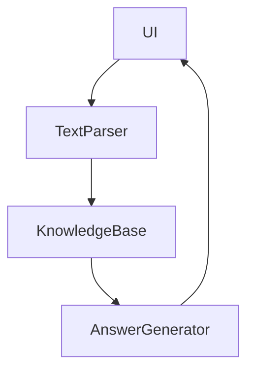
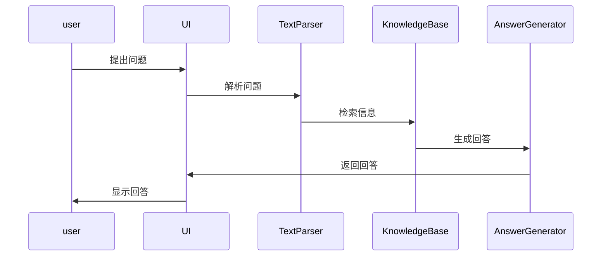

                 


# 开发基于大模型的金融监管报告智能问答助手

> 关键词：大模型，金融监管，自然语言处理，问答系统，智能助手，金融合规

> 摘要：本文将深入探讨如何利用大模型技术开发智能问答助手，以提升金融监管报告的效率和准确性。通过结合自然语言处理（NLP）和大模型的优势，我们能够构建一个能够理解复杂金融监管报告并提供智能问答服务的系统。文章将从背景介绍、核心概念与联系、算法原理、系统架构设计、项目实战等多个方面进行详细阐述，旨在为读者提供一个全面的技术指导。

---

## 第1章 金融监管与智能问答的背景

### 1.1 传统金融监管模式的局限性
传统金融监管主要依赖人工审查和简单的规则匹配，存在以下问题：
- **效率低下**：人工处理大量监管报告耗时耗力。
- **准确性不足**：规则匹配难以应对复杂多变的金融场景。
- **知识门槛高**：需要专业人员解读监管报告。

### 1.2 大模型技术的崛起
大模型（如GPT系列）的出现为智能问答系统带来了革命性的变化：
- **强大的语言理解能力**：能够处理复杂的金融术语和上下文。
- **生成能力**：可以自动生成准确的问答内容。
- **可扩展性**：通过微调可以适应不同行业的需求。

### 1.3 问题背景与目标
开发一个基于大模型的金融监管报告智能问答助手，旨在：
- 提供高效的监管信息检索服务。
- 支持多轮对话，帮助用户更好地理解监管要求。
- 实现自动化合规检查。

### 1.4 核心概念与联系
#### 1.4.1 大模型、NLP、金融监管的关系
- **大模型**：提供强大的语言处理能力。
- **NLP**：提供技术手段，实现文本理解和生成。
- **金融监管**：应用场景，结合行业知识。

#### 1.4.2 核心概念对比表格

| 概念 | 定义 | 特点 |
|------|------|------|
| 大模型 | 基于深度学习的大型语言模型 | 高准确率、多任务能力 |
| NLP   | 自然语言处理技术 | 专注于文本理解和生成 |
| 金融监管 | 金融行业的监管活动 | 高合规性、复杂性 |

#### 1.4.3 ER实体关系图（Mermaid）

```mermaid
erDiagram
    regulator : 监管机构
    report : 监管报告
    question : 用户问题
    answer : 系统回答
    assistant : 智能问答助手
    regulator --> report : 提交
    user --> question : 提出
    assistant --> answer : 生成
    report --> assistant : 数据来源
    question --> assistant : 输入
    answer --> user : 输出
```

---

## 第2章 大模型与NLP基础

### 2.1 大模型的核心原理
#### 2.1.1 概率语言模型的数学表达
大模型基于概率语言模型，其目标是最大化给定文本的概率：
$$ P(w_1, w_2, ..., w_n) = \prod_{i=1}^n P(w_i | w_{1}, ..., w_{i-1}) $$

#### 2.1.2 变压器架构的创新
变压器架构通过自注意力机制和前馈网络实现高效的并行处理：
- **自注意力机制**：捕捉文本中的长距离依赖关系。
- **位置编码**：引入位置信息，弥补绝对位置丢失的问题。

#### 2.1.3 注意力机制的公式推导
注意力机制的计算公式：
$$ \text{Attention}(Q,K,V) = \text{softmax}\left(\frac{QK^T}{\sqrt{d_k}}\right)V $$

### 2.2 大模型的训练与优化
#### 2.2.1 预训练过程
- **无监督学习**：利用海量文本数据进行预训练。
- **目标函数**：最小化预测词与真实词的交叉熵损失。

#### 2.2.2 微调过程
- **有监督学习**：在特定任务（如问答）上进行微调。
- **数据增强**：通过数据增强技术提升模型的鲁棒性。

#### 2.2.3 模型压缩与推理优化
- **剪枝**：去除冗余的神经网络参数。
- **量化**：降低模型参数的精度（如从浮点数降到定点数）。

### 2.3 问答系统的算法流程
#### 2.3.1 基于检索的问答系统
- **检索方法**：基于向量相似度进行问答匹配。
- **挑战**：依赖高质量的知识库，难以处理开放性问题。

#### 2.3.2 基于生成的问答系统
- **生成方法**：通过大模型直接生成答案。
- **优势**：能够处理开放性问题，生成灵活的答案。

#### 2.3.3 混合型问答系统
- **结合检索与生成**：在特定场景下选择最佳答案生成方式。

---

## 第3章 金融监管报告的智能问答系统设计

### 3.1 金融监管报告的特点
#### 3.1.1 报告内容的结构化特征
- **层次性**：报告通常包含多个章节和子章节。
- **术语密集**：涉及大量专业术语和行业知识。

#### 3.1.2 专业术语与行业知识
- **术语复杂性**：需要理解专业术语的上下文含义。
- **行业知识依赖**：监管报告往往依赖于特定的行业背景。

#### 3.1.3 监管规则的复杂性
- **多维度规则**：涉及合规性、风险评估等多个方面。
- **规则更新频繁**：监管政策不断变化，需要系统能够快速适应。

### 3.2 智能问答系统的设计目标
#### 3.2.1 提供准确的监管信息
- **高准确率**：确保问答结果的准确性。
- **实时更新**：能够快速响应监管政策的变化。

#### 3.2.2 支持多轮对话
- **上下文理解**：能够理解用户的历史提问。
- **对话管理**：通过对话历史优化回答质量。

#### 3.2.3 实现高效的知识检索
- **快速检索**：通过大模型快速定位相关知识。
- **多模态检索**：结合文本和其他数据形式（如表格、图表）。

### 3.3 系统设计的数学模型
#### 3.3.1 问题理解与编码
- **文本编码**：将用户的问题转化为向量表示。
- **上下文表示**：利用注意力机制捕捉对话历史中的关键信息。

#### 3.3.2 答案生成与优化
- **条件生成**：基于用户问题生成答案。
- **优化策略**：通过强化学习优化回答的质量。

---

## 第4章 系统架构设计与实现

### 4.1 系统架构设计
#### 4.1.1 项目背景
- **目标**：开发一个能够处理金融监管报告的智能问答系统。
- **用户场景**：金融机构合规人员、监管机构工作人员。

#### 4.1.2 系统功能设计
- **文本理解模块**：解析用户问题并生成结构化表示。
- **知识检索模块**：从监管报告中检索相关信息。
- **回答生成模块**：基于检索结果生成自然语言回答。

#### 4.1.3 系统架构图（Mermaid）



### 4.2 接口设计与交互流程
#### 4.2.1 系统接口
- **用户输入接口**：文本输入框。
- **系统输出接口**：文本输出框。

#### 4.2.2 交互流程图（Mermaid）



---

## 第5章 项目实战与案例分析

### 5.1 环境安装
#### 5.1.1 安装Python
- **版本要求**：Python 3.8+

#### 5.1.2 安装大模型框架
- **选择框架**：如TensorFlow或PyTorch。

#### 5.1.3 安装NLP库
- **库推荐**：spaCy、NLTK。

### 5.2 核心实现
#### 5.2.1 文本预处理
- **分词**：将文本分割成词语或短语。
- **去停用词**：去除无意义的词汇（如“的”、“了”等）。

#### 5.2.2 模型训练
- **数据准备**：收集和标注金融监管相关的文本数据。
- **训练过程**：使用预训练模型进行微调。

#### 5.2.3 接口开发
- **API设计**：设计RESTful API接口。
- **调用示例**：
  ```python
  import requests
  response = requests.post("http://localhost:8000/ask", json={"question": "...")
  print(response.json())
  ```

### 5.3 案例分析
#### 5.3.1 案例背景
- **用户问题**：如何处理关联交易的合规性？

#### 5.3.2 系统回答
- **回答生成**：系统基于监管报告生成详细解答。

---

## 第6章 总结与展望

### 6.1 项目小结
- **成果**：成功开发了一个基于大模型的智能问答系统。
- **经验**：大模型在金融领域的应用潜力巨大，但需要结合行业知识进行微调。

### 6.2 展望
- **未来方向**：探索多模态问答系统，结合图像、语音等多种数据形式。
- **技术进步**：随着大模型技术的不断进步，问答系统的准确性和效率将进一步提升。

---

## 附录

### 附录A: 代码示例
```python
import torch
from transformers import AutoTokenizer, AutoModelForQuestionAnswering

tokenizer = AutoTokenizer.from_pretrained("bert-base")
model = AutoModelForQuestionAnswering.from_pretrained("bert-base")

def answer_question(question, context):
    inputs = tokenizer.encode_plus(question + " " + context, return_tensors="pt")
    with torch.no_grad():
        outputs = model(**inputs)
    start = outputs.start_logits.argmax()
    end = outputs.end_logits.argmax()
    answer = tokenizer.decode(inputs.input_ids[0][start:end+1])
    return answer

print(answer_question("如何处理关联交易的合规性？", "关联交易需符合《公司法》相关规定。"))
```

### 附录B: 最佳实践 tips
1. **数据质量**：确保训练数据的多样性和高质量。
2. **模型调优**：通过超参数调优提升模型性能。
3. **安全合规**：确保数据使用符合相关法律法规。

---

## 作者：AI天才研究院 & 禅与计算机程序设计艺术

---

本文通过系统化的分析和实践，详细阐述了开发基于大模型的金融监管报告智能问答助手的关键技术与实现方法。从背景分析到系统设计，再到项目实战，为读者提供了一个全面的技术指南。

