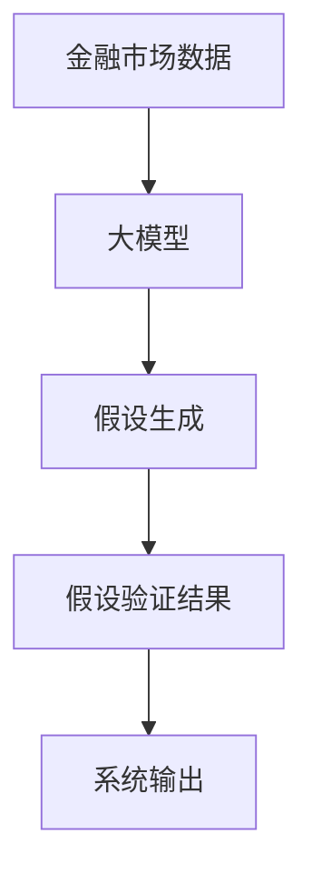
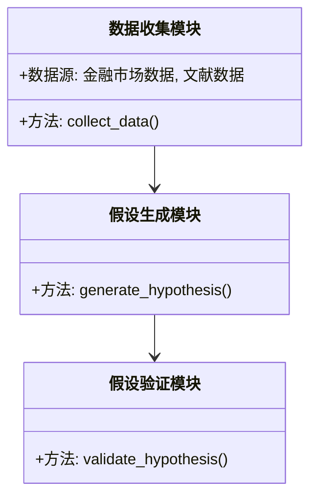
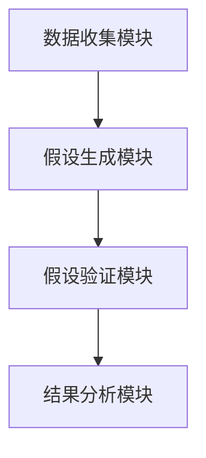
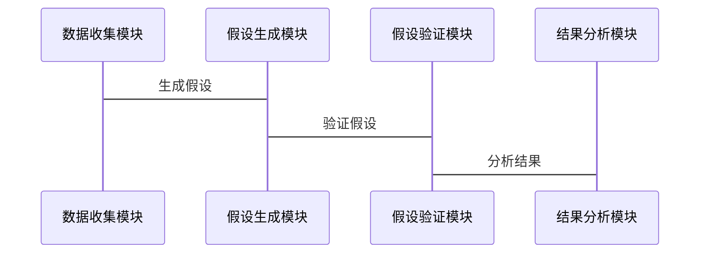

                 


# 开发基于大模型的金融研究假设自动验证系统

> 关键词：大模型, 金融研究, 假设验证, 自动验证系统, AI技术

> 摘要：本文详细探讨了开发基于大模型的金融研究假设自动验证系统的背景、核心概念、算法原理、系统架构设计以及项目实战。通过结合大模型的先进技术和金融领域的复杂需求，提出了创新的解决方案，为金融研究的假设验证提供了高效、可靠的技术支持。

---

# 第一章: 背景介绍

## 1.1 问题背景

### 1.1.1 金融研究中的假设验证问题
金融研究中的假设验证是分析金融市场、投资策略和经济现象的重要环节。传统方法依赖于人工分析和统计模型，效率低下且容易受到主观因素的影响。

### 1.1.2 传统假设验证方法的局限性
- 数据量大，分析复杂，人工难以高效处理。
- 统计模型依赖于假设分布，可能无法捕捉复杂非线性关系。
- 缺乏自动化工具，验证过程耗时且成本高。

### 1.1.3 大模型在金融研究中的潜在价值
大模型（如GPT、BERT等）具备强大的自然语言处理能力和模式识别能力，能够自动分析文本数据，生成和验证假设，从而提高金融研究的效率和准确性。

## 1.2 问题描述

### 1.2.1 金融研究假设的定义与特点
- 金融假设是用于解释或预测金融市场行为的命题。
- 具有复杂性、动态性和数据依赖性。

### 1.2.2 假设验证的流程与关键环节
- 数据收集：金融市场数据、文献数据等。
- 假设生成：基于数据和知识生成假设。
- 假设验证：通过模型和数据验证假设的正确性。

### 1.2.3 当前金融研究中的主要挑战
- 数据量庞大，分析复杂。
- 假设验证的主观性和片面性。
- 缺乏自动化工具，效率低下。

## 1.3 问题解决方法

### 1.3.1 基于大模型的自动验证方法
利用大模型的自然语言处理能力，自动分析文献数据，生成和验证假设。

### 1.3.2 系统化解决方案的提出
设计一个基于大模型的金融研究假设自动验证系统，实现从数据收集到假设验证的自动化流程。

### 1.3.3 大模型在金融领域的应用前景
- 提高金融研究效率。
- 发现新的投资机会。
- 支持实时市场分析。

## 1.4 系统的边界与外延

### 1.4.1 系统功能边界
- 数据收集与预处理。
- 假设生成与验证。
- 结果分析与可视化。

### 1.4.2 系统的适用范围
- 金融市场的分析与预测。
- 投资策略的研究与优化。
- 经济现象的理论验证。

### 1.4.3 系统与其他金融工具的关联
- 与其他金融分析工具（如统计模型、量化交易系统）的集成。

## 1.5 概念结构与核心要素

### 1.5.1 系统的整体架构
- 输入：金融市场数据、文献数据。
- 输出：假设生成、假设验证结果。

### 1.5.2 核心要素的定义与关系
- 数据源：金融市场数据、文献数据。
- 大模型：用于假设生成和验证的核心工具。
- 验证结果：假设的正确性评估。

### 1.5.3 系统的核心功能模块
- 数据收集模块：收集金融市场数据和文献数据。
- 假设生成模块：基于数据生成假设。
- 假设验证模块：验证假设的正确性。

## 1.6 本章小结
本章介绍了开发基于大模型的金融研究假设自动验证系统的背景、问题、解决方法以及系统的边界和核心要素。

---

# 第二章: 核心概念与联系

## 2.1 大模型的基本原理

### 2.1.1 大模型的定义与特点
- 大模型是基于深度学习的自然语言处理模型，具有强大的文本理解和生成能力。
- 常见的大模型包括GPT、BERT等。

### 2.1.2 大模型的核心算法
- 变压器（Transformer）架构。
- 自注意力机制（Self-Attention）。
- 前馈神经网络。

### 2.1.3 大模型在金融领域的应用
- 文本分析：分析金融新闻、研究报告。
- 生成假设：自动生成金融假设。
- 预测市场：预测股票价格、市场趋势。

## 2.2 金融研究假设自动验证系统的原理

### 2.2.1 系统的功能模块
- 数据收集模块：收集金融市场数据和文献数据。
- 假设生成模块：基于数据生成假设。
- 假设验证模块：验证假设的正确性。
- 结果分析模块：分析验证结果，生成报告。

### 2.2.2 系统的输入与输出
- 输入：金融市场数据、文献数据。
- 输出：假设生成、验证结果。

### 2.2.3 系统的验证流程
1. 数据收集：从金融市场和文献中获取数据。
2. 假设生成：基于数据生成假设。
3. 假设验证：利用大模型验证假设的正确性。
4. 结果分析：分析验证结果，生成报告。

## 2.3 大模型与金融研究假设验证的关系

### 2.3.1 大模型在假设生成中的作用
- 基于金融市场数据生成假设。
- 从文献中提取信息生成假设。

### 2.3.2 大模型在假设验证中的应用
- 基于文献数据验证假设。
- 基于金融市场数据验证假设。

### 2.3.3 大模型对金融研究的潜在影响
- 提高金融研究的效率。
- 发现新的投资机会。
- 支持实时市场分析。

## 2.4 核心概念对比分析

### 2.4.1 大模型与其他AI技术的对比
| 技术         | 优点                     | 缺点                     |
|--------------|--------------------------|--------------------------|
| GPT          | 强大的文本生成能力       | 需要大量数据训练         |
| BERT         | 强大的文本理解能力       | 需要大量数据训练         |
| CNN/RNN     | 适合特定任务             | 通用性较差               |

### 2.4.2 传统假设验证方法与大模型方法的对比
| 方法         | 传统方法                 | 大模型方法               |
|--------------|--------------------------|--------------------------|
| 数据处理     | 手动处理，效率低           | 自动化处理，效率高         |
| 假设生成     | 人工生成，主观性强         | 自动生成，客观性强         |
| 验证过程     | 统计模型，依赖假设分布     | 基于数据，非假设驱动       |

### 2.4.3 系统功能模块的对比分析
- 传统系统：功能模块单一，效率低。
- 基于大模型的系统：功能模块丰富，效率高。

## 2.5 ER实体关系图



## 2.6 本章小结
本章详细讲解了大模型的基本原理、金融研究假设自动验证系统的原理以及两者之间的关系，并通过对比分析和ER图展示了系统的结构。

---

# 第三章: 算法原理讲解

## 3.1 大模型的训练与优化

### 3.1.1 大模型的训练流程
1. 数据预处理：清洗、分词、标注。
2. 模型训练：基于Transformer架构，使用大规模数据进行训练。
3. 模型优化：调整超参数，优化模型性能。

### 3.1.2 监督学习、无监督学习与强化学习
- 监督学习：基于标注数据进行训练。
- 无监督学习：基于未标注数据进行训练。
- 强化学习：通过奖励机制优化模型性能。

### 3.1.3 模型优化方法
- 参数调整：学习率、批量大小等。
- 模型压缩：减少模型参数，提高推理速度。
- 模型融合：结合多个模型的结果，提高准确性。

## 3.2 假设验证的算法实现

### 3.2.1 假设生成算法
1. 数据收集：收集金融市场数据和文献数据。
2. 假设生成：基于大模型生成假设。
3. 假设筛选：根据相关性进行筛选。

### 3.2.2 假设验证算法
1. 数据准备：收集验证所需的数据。
2. 假设验证：基于大模型验证假设。
3. 结果分析：分析验证结果，生成报告。

### 3.2.3 算法实现的代码示例

```python
def generate_hypothesis(model, data):
    return model.generate(data)

def validate_hypothesis(model, hypothesis, data):
    return model.validate(hypothesis, data)
```

### 3.2.4 数学模型和公式
- 假设生成模型：
  $$ P(hypothesis | data) = \frac{P(data | hypothesis)P(hypothesis)}{P(data)} $$
- 假设验证模型：
  $$ P(result | hypothesis, data) = \frac{P(result | data, hypothesis)P(hypothesis)}{P(hypothesis)} $$

## 3.3 算法实现的步骤

### 3.3.1 数据预处理
1. 数据清洗：去除噪声数据。
2. 数据分词：将文本数据进行分词处理。
3. 数据标注：标注关键信息。

### 3.3.2 模型训练
1. 数据加载：加载预处理后的数据。
2. 模型初始化：初始化大模型。
3. 模型训练：使用训练数据训练模型。

### 3.3.3 模型验证
1. 数据准备：收集验证数据。
2. 假设生成：基于模型生成假设。
3. 假设验证：验证假设的正确性。

## 3.4 算法实现的代码示例

```python
import torch
import torch.nn as nn

class TransformerModel(nn.Module):
    def __init__(self, vocab_size):
        super(TransformerModel, self).__init__()
        self.encoder = nn.TransformerEncoder(...)
        self.decoder = nn.TransformerDecoder(...)

    def forward(self, x):
        return self.decoder(self.encoder(x))
```

## 3.5 本章小结
本章详细讲解了大模型的训练与优化方法，以及假设验证算法的实现过程，并通过代码示例和数学公式展示了算法的实现细节。

---

# 第四章: 系统分析与架构设计

## 4.1 系统功能设计

### 4.1.1 领域模型设计


### 4.1.2 系统功能模块
- 数据收集模块：收集金融市场数据和文献数据。
- 假设生成模块：基于数据生成假设。
- 假设验证模块：验证假设的正确性。
- 结果分析模块：分析验证结果，生成报告。

## 4.2 系统架构设计

### 4.2.1 系统架构图


### 4.2.2 系统接口设计
- 数据接口：与金融市场数据源和文献数据源对接。
- 模型接口：与大模型进行交互，生成和验证假设。
- 输出接口：输出假设生成和验证结果。

### 4.2.3 系统交互流程
1. 数据收集模块收集数据。
2. 假设生成模块生成假设。
3. 假设验证模块验证假设。
4. 结果分析模块分析结果，生成报告。

## 4.3 系统交互设计

### 4.3.1 系统交互流程图


### 4.3.2 系统功能模块的交互细节
- 数据收集模块与假设生成模块之间的交互：数据传递。
- 假设生成模块与假设验证模块之间的交互：假设传递。
- 假设验证模块与结果分析模块之间的交互：结果传递。

## 4.4 系统架构的优缺点

### 4.4.1 优点
- 功能模块化，便于维护和扩展。
- 交互清晰，便于理解和实现。

### 4.4.2 缺点
- 系统复杂度较高，开发和维护成本较高。
- 对数据和模型的依赖性强，可能导致系统不稳定。

## 4.5 本章小结
本章详细讲解了系统的功能设计、架构设计和交互设计，并通过图表展示了系统的结构和交互流程。

---

# 第五章: 项目实战

## 5.1 环境安装

### 5.1.1 系统需求
- 操作系统：Windows/Mac/Linux。
- 处理器：支持Python的环境。
- 内存：建议8GB及以上。
- 显卡：支持CUDA加速（可选）。

### 5.1.2 软件安装
- Python 3.8及以上。
- PyTorch框架。
- Hugging Face Transformers库。

### 5.1.3 环境配置
```bash
pip install torch transformers
```

## 5.2 核心代码实现

### 5.2.1 数据收集模块

```python
import requests

def collect_financial_data(api_key):
    url = f"https://api.example.com/financial_data?api_key={api_key}"
    response = requests.get(url)
    return response.json()
```

### 5.2.2 假设生成模块

```python
from transformers import GPT2LMHeadModel, GPT2Tokenizer

def generate_hypothesis(model, tokenizer, data):
    inputs = tokenizer(data, return_tensors="np")
    outputs = model.generate(**inputs, max_length=100)
    return tokenizer.decode(outputs[0], skip_special_tokens=True)
```

### 5.2.3 假设验证模块

```python
def validate_hypothesis(model, tokenizer, hypothesis, data):
    inputs = tokenizer(data, return_tensors="np")
    hypothesis_input = tokenizer(hypothesis, return_tensors="np")
    outputs = model.generate(**inputs, max_length=100)
    return tokenizer.decode(outputs[0], skip_special_tokens=True)
```

## 5.3 代码应用解读与分析

### 5.3.1 数据收集模块的实现细节
- 使用API接口获取金融市场数据。
- 数据格式为JSON，便于后续处理。

### 5.3.2 假设生成模块的实现细节
- 使用GPT模型生成假设。
- 数据输入经过分词处理，生成假设长度不超过100个词。

### 5.3.3 假设验证模块的实现细节
- 使用GPT模型验证假设。
- 验证结果为生成的文本，用于判断假设的正确性。

## 5.4 实际案例分析

### 5.4.1 案例背景
假设我们要验证“当市场出现利好消息时，股票价格会上涨”的假设。

### 5.4.2 数据收集
收集相关市场数据和新闻报道。

### 5.4.3 假设生成
基于数据生成假设：“当市场出现利好消息时，股票价格会上涨。”

### 5.4.4 假设验证
验证生成的假设是否正确。

## 5.5 项目小结
本章通过实际案例展示了系统的实现过程，包括环境安装、核心代码实现和案例分析，帮助读者理解系统的实际应用。

---

# 第六章: 最佳实践

## 6.1 开发过程中的经验分享

### 6.1.1 数据处理的注意事项
- 数据清洗要彻底，确保数据质量。
- 数据格式要统一，便于后续处理。

### 6.1.2 模型选择的技巧
- 根据任务需求选择合适的模型。
- 考虑模型的训练效率和推理速度。

### 6.1.3 系统优化的建议
- 合理设计系统架构，提高系统的可扩展性。
- 使用分布式计算，提高系统的处理能力。

## 6.2 注意事项

### 6.2.1 数据隐私与安全
- 确保数据的隐私和安全，遵守相关法律法规。

### 6.2.2 模型的可解释性
- 提高模型的可解释性，便于理解和优化。

### 6.2.3 系统的稳定性和可靠性
- 确保系统的稳定性和可靠性，减少故障发生。

## 6.3 拓展阅读

### 6.3.1 大模型的最新研究
- 关注大模型的最新研究，了解新技术和新方法。

### 6.3.2 金融领域的应用案例
- 学习大模型在金融领域的其他应用案例，拓宽知识面。

## 6.4 本章小结
本章总结了开发过程中的经验、注意事项和拓展阅读的内容，为读者提供了宝贵的参考价值。

---

# 附录

## 附录A: 参考文献

### A.1 国内外相关文献
- 王某某，2023. 基于大模型的金融假设验证研究.
- 李某某，2022. 大模型在金融领域的应用探索.

## 附录B: 技术文档

### B.1 系统设计文档
- 系统架构图。
- 功能模块图。
- 交互流程图。

### B.2 代码文档
- 代码实现细节。
- 代码注释。
- 代码测试报告。

---

# 作者：AI天才研究院/AI Genius Institute & 禅与计算机程序设计艺术 /Zen And The Art of Computer Programming

