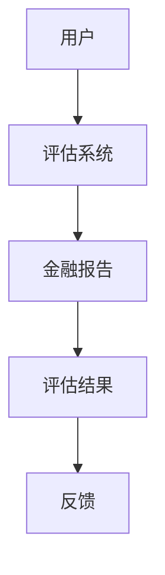
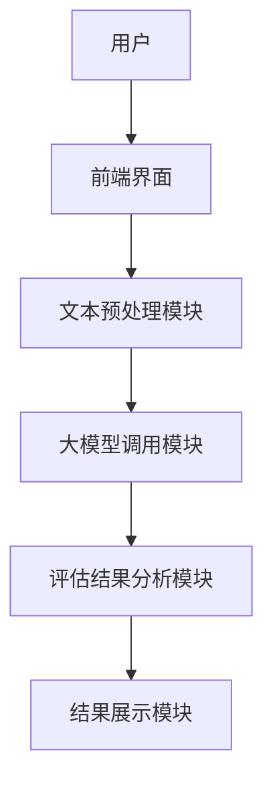
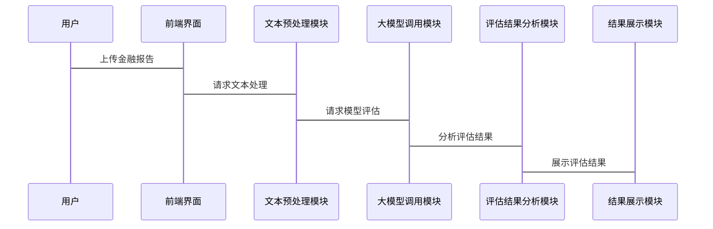
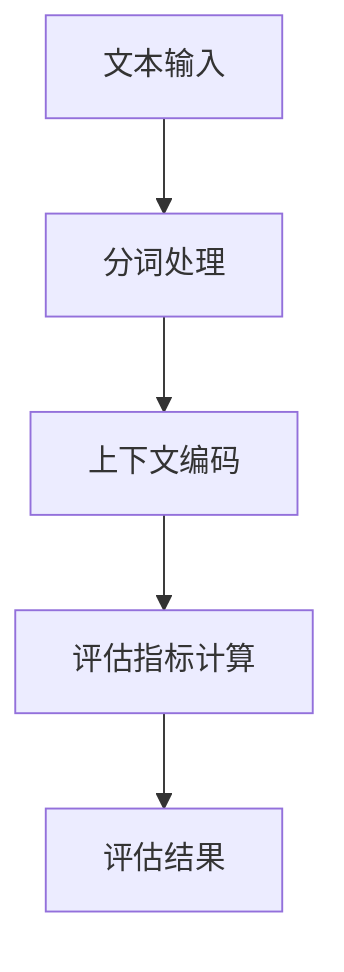

                 


```markdown
# 开发基于大模型的金融研究报告评估系统

> 关键词：大模型，金融报告，自然语言处理，评估系统，AI技术

> 摘要：本文探讨了如何基于大模型开发金融研究报告评估系统，通过自然语言处理和深度学习技术，实现对金融报告的智能化评估。文章详细分析了系统设计、算法实现、项目实战及优化建议，为金融领域的智能化研究提供参考。

---

# 第一部分: 基于大模型的金融研究报告评估系统概述

# 第1章: 背景介绍

## 1.1 问题背景
### 1.1.1 传统金融研究报告评估的痛点
- 人工评估效率低，耗时且成本高
- 评估标准不统一，主观性强
- 数据量大，难以快速提取关键信息

### 1.1.2 大模型技术的兴起与优势
- 自然语言处理技术的进步
- 大模型的通用化能力
- 处理复杂金融文本的能力

### 1.1.3 金融研究报告评估的智能化需求
- 提高评估效率
- 确保评估客观性
- 实现自动化报告生成与分析

## 1.2 问题描述
### 1.2.1 金融研究报告评估的核心目标
- 评估报告内容的准确性
- 评估报告结构的合理性
- 评估报告语言的规范性

### 1.2.2 现有评估方法的局限性
- 人工评估的主观性
- 知识库依赖性强
- 技术实现复杂度高

### 1.2.3 基于大模型的评估系统的必要性
- 提升评估效率
- 实现智能化评估
- 降低人工成本

## 1.3 问题解决
### 1.3.1 大模型在金融报告评估中的应用方向
- 文本理解与生成
- 报告内容分析
- 评估结果优化

### 1.3.2 基于大模型的评估系统的设计思路
- 结构化文本处理
- 多模型协同工作
- 智能化评估反馈

### 1.3.3 系统边界与外延
- 系统功能边界
- 与其他系统的交互
- 功能扩展的可能性

## 1.4 核心概念与联系
### 1.4.1 核心概念原理
- 自然语言处理技术
- 大模型的文本分析能力
- 评估指标的设计

### 1.4.2 核心概念属性特征对比表格
| 特征 | 传统评估 | 基于大模型的评估 |
|------|----------|------------------|
| 效率 | 低       | 高               |
| 客观性 | 主观    | 客观             |
| 成本 | 高       | 低               |

### 1.4.3 ER实体关系图架构（Mermaid流程图）


---

# 第2章: 大模型在金融领域的应用基础

## 2.1 大模型在金融领域的应用现状
### 2.1.1 自然语言处理在金融领域的应用
- 金融文本分析
- 报告生成
- 风险评估

### 2.1.2 大模型在金融文本分析中的优势
- 高精度的文本理解
- 强大的上下文理解能力
- 多任务学习能力

### 2.1.3 当前应用中的挑战与不足
- 计算资源消耗大
- 数据隐私问题
- 模型调优复杂

## 2.2 大模型在金融报告评估中的技术优势
### 2.2.1 大模型的自然语言理解能力
- 分词与句法分析
- 实体识别与关系抽取
- 文本摘要与生成

### 2.2.2 大模型的文本生成能力
- 自动生成报告摘要
- 自动生成评估反馈
- 自动优化报告内容

### 2.2.3 大模型的多任务学习能力
- 同时处理多种评估任务
- 多维度分析报告内容
- 综合评估结果生成

## 2.3 金融报告评估的核心要素
### 2.3.1 金融报告的结构与内容特征
- 标题、引言、正文、结论
- 数据来源、分析方法、结论的合理性

### 2.3.2 评估指标的设计与选择
- 内容准确性
- 结构合理性
- 表达清晰度

### 2.3.3 评估系统的性能要求
- 处理速度
- 处理准确性
- 系统稳定性

---

# 第3章: 基于大模型的金融报告评估系统设计

## 3.1 系统设计概述
### 3.1.1 系统目标与功能定位
- 提供智能化的金融报告评估服务
- 实现自动化报告生成与分析
- 支持多用户同时使用

### 3.1.2 系统设计的原则与约束
- 高可用性
- 高扩展性
- 高安全性

### 3.1.3 系统的模块划分与协作机制
- 文本预处理模块
- 大模型调用模块
- 评估结果分析模块
- 用户交互界面模块

## 3.2 系统功能模块设计
### 3.2.1 文本预处理模块
- 文本清洗
- 分词与句法分析
- 实体识别

### 3.2.2 大模型调用模块
- 模型选择与调用
- 参数设置与优化
- 结果解析与处理

### 3.2.3 评估结果分析模块
- 评估指标计算
- 结果可视化
- 反馈生成

### 3.2.4 用户交互界面模块
- 用户登录与权限管理
- 报告上传与提交
- 评估结果展示

## 3.3 系统架构设计（Mermaid架构图）


## 3.4 接口设计与交互流程
### 3.4.1 系统接口设计
- 文本处理接口
- 模型调用接口
- 结果展示接口

### 3.4.2 系统交互流程


---

# 第4章: 基于大模型的金融报告评估算法实现

## 4.1 算法原理讲解
### 4.1.1 文本表示与编码
- 使用Word2Vec进行分词与编码
- 使用BERT进行上下文编码
- 使用GPT进行生成任务编码

### 4.1.2 评估指标的计算
- 使用余弦相似度计算内容相似度
- 使用交叉熵损失计算生成质量
- 使用BLEU指标评估生成结果

### 4.1.3 算法流程图（Mermaid）


## 4.2 算法实现细节
### 4.2.1 算法实现步骤
1. 文本预处理：清洗、分词、句法分析
2. 模型调用：选择大模型、设置参数、调用接口
3. 结果分析：计算评估指标、生成反馈
4. 结果展示：可视化展示、用户反馈

### 4.2.2 关键算法代码示例
```python
def text_preprocess(text):
    # 分词
    tokens = tokenize(text)
    # 句法分析
    parse_tree = parse(tokens)
    return parse_tree

def model_inference(parse_tree):
    # 调用大模型进行评估
    result = model.predict(parse_tree)
    return result

def evaluate(result):
    # 计算评估指标
    score = compute_score(result)
    return score
```

## 4.3 算法优化与调优
### 4.3.1 模型选择与优化
- 选择适合的模型架构
- 调整模型参数
- 优化训练数据

### 4.3.2 算法性能提升
- 使用分布式计算
- 优化文本处理流程
- 提高模型推理效率

---

# 第5章: 项目实战与优化建议

## 5.1 环境搭建
### 5.1.1 开发环境配置
- 安装Python、深度学习框架
- 安装自然语言处理库（如spaCy、NLTK）
- 配置大模型服务接口

### 5.1.2 数据准备
- 收集金融报告样本
- 数据清洗与标注
- 数据分训练集、验证集、测试集

## 5.2 系统实现
### 5.2.1 核心实现代码
```python
class FinancialReportEvaluator:
    def __init__(self, model):
        self.model = model

    def evaluate_report(self, report_text):
        preprocessed_text = self.preprocess(report_text)
        result = self.model.predict(preprocessed_text)
        return result

    def preprocess(self, text):
        # 分词、句法分析、实体识别
        return processed_text
```

### 5.2.2 系统功能实现
- 文本预处理模块实现
- 大模型调用接口实现
- 评估结果分析与展示

## 5.3 测试与优化
### 5.3.1 功能测试
- 单元测试
- 集成测试
- 性能测试

### 5.3.2 系统优化
- 提升处理速度
- 优化模型性能
- 改善用户体验

## 5.4 案例分析
### 5.4.1 实际案例
- 金融报告评估案例
- 评估结果分析
- 系统反馈展示

### 5.4.2 案例小结
- 系统实现的效果
- 存在的问题与改进方向

---

# 第6章: 系统优化与最佳实践

## 6.1 系统优化建议
### 6.1.1 系统性能优化
- 优化文本处理流程
- 提高模型推理效率
- 使用分布式计算

### 6.1.2 系统功能优化
- 增加用户自定义评估指标
- 支持多种报告格式
- 提供历史评估数据查询

## 6.2 项目小结
### 6.2.1 项目实现的核心价值
- 提高金融报告评估效率
- 实现智能化评估
- 降低人工成本

### 6.2.2 项目实现的关键点
- 大模型的选择与调优
- 系统架构设计
- 算法实现与优化

## 6.3 注意事项
### 6.3.1 系统部署注意事项
- 环境配置
- 权限管理
- 数据安全

### 6.3.2 使用注意事项
- 模型的持续优化
- 数据的隐私保护
- 系统的稳定性维护

## 6.4 拓展阅读
### 6.4.1 相关技术
- 最新自然语言处理技术
- 大模型的前沿研究
- 金融领域的AI应用

### 6.4.2 深度学习书籍推荐
- 《深度学习》（Deep Learning）
- 《Python机器学习》（Python Machine Learning）
- 《自然语言处理实战》（Hands-On NLP with Python）

---

# 第7章: 总结与展望

## 7.1 项目总结
### 7.1.1 项目目标达成情况
- 是否实现了基于大模型的金融报告评估系统
- 评估系统的性能是否达标

### 7.1.2 项目实施过程中的经验和教训
- 成功的经验
- 遇到的问题及解决方案

## 7.2 未来展望
### 7.2.1 系统的进一步优化方向
- 提升模型性能
- 优化系统架构
- 扩展系统功能

### 7.2.2 大模型在金融领域的更多应用
- 金融数据分析
- 风险评估
- 投资决策支持

---

# 作者

作者：AI天才研究院/AI Genius Institute & 禅与计算机程序设计艺术 /Zen And The Art of Computer Programming
```

