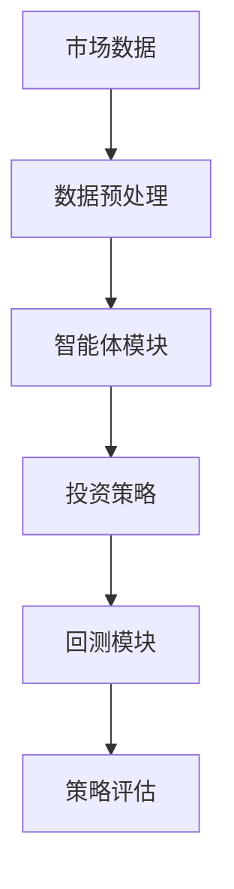

                 

# 开发基于强化学习的投资组合优化系统

## 关键词：强化学习，投资组合优化，金融，机器学习，深度学习

## 摘要：  
本文详细探讨了如何利用强化学习技术开发高效的投资组合优化系统。首先，介绍了强化学习的基本概念和投资组合优化的传统方法，分析了强化学习在金融领域的优势。接着，详细讲解了基于强化学习的投资组合优化算法，包括Q-learning和Deep Q-Network (DQN)等算法，并通过数学模型和公式推导阐述了其工作原理。随后，提出了系统的架构设计，包括系统功能模块划分、架构图和接口设计。最后，通过实际案例分析，展示了如何利用强化学习优化投资组合，并给出了系统实现的代码示例和性能评估。

---

## 第一部分: 强化学习与投资组合优化基础

### 第1章: 强化学习与投资组合优化概述

#### 1.1 强化学习的基本概念
- **1.1.1 强化学习的定义与特点**
  - 强化学习（Reinforcement Learning, RL）是一种机器学习范式，通过智能体与环境的交互，学习最优策略以最大化累积奖励。
  - 强化学习的特点：基于经验学习、目标导向、在线交互、策略优化。

- **1.1.2 强化学习的核心要素：状态、动作、奖励**
  - 状态（State）：描述环境当前情况的特征向量。
  - 动作（Action）：智能体在给定状态下选择的操作。
  - 奖励（Reward）：环境对智能体动作的反馈，用于指导学习过程。

- **1.1.3 强化学习与监督学习、无监督学习的区别**
  - 监督学习：基于标记数据，学习函数输入到输出的映射。
  - 无监督学习：基于无标记数据，发现数据中的结构。
  - 强化学习：基于与环境的交互，学习最优策略。

- **1.2 投资组合优化的基本概念**
  - 投资组合优化的目标是在风险和收益之间找到最佳平衡点。
  - 传统方法包括均值-方差模型和指数跟踪策略。
  - 强化学习在投资组合优化中的应用潜力巨大，尤其是应对动态金融市场。

- **1.3 强化学习在金融投资中的优势**
  - 传统方法的局限性：假设资产收益符合正态分布，忽略非线性和尾部风险。
  - 强化学习的优势：能够捕捉市场中的复杂模式，适应动态变化。
  - 挑战与机遇：算法的计算复杂度、过拟合风险以及市场的不可预测性。

---

### 第2章: 强化学习的核心概念与数学模型

#### 2.1 状态空间与动作空间
- **2.1.1 状态空间的定义与特征**
  - 状态空间：所有可能状态的集合，状态可以是市场指标（如股票价格、波动率）或时间因素。
- **2.1.2 动作空间的定义与特征**
  - 动作空间：所有可能动作的集合，动作可以是买入、卖出或持有某种资产。
- **2.1.3 状态与动作空间的维度分析**
  - 高维状态空间增加了算法的复杂性，需要使用深度学习来降低维度。

#### 2.2 奖励函数的设计
- **2.2.1 奖励函数的定义与作用**
  - 奖励函数：定义智能体在特定状态和动作下获得的奖励。
  - 作用：引导智能体学习最优策略。
- **2.2.2 奖励函数的设计原则**
  - 简单有效：奖励函数应与优化目标直接相关。
  - 平衡风险与收益：例如使用夏普比率（Sharpe Ratio）作为奖励。
- **2.2.3 常见奖励函数类型对比**
  - 单一奖励：只考虑收益或只考虑风险。
  - 综合奖励：同时考虑收益和风险。

#### 2.3 强化学习的数学模型
- **2.3.1 状态转移概率矩阵的定义**
  - 状态转移矩阵：描述从当前状态到下一个状态的概率。
- **2.3.2 Q值函数的数学表达式**
  - Q值函数：$Q(s, a) = r + \gamma \max_{a'} Q(s', a')$
  - 其中，$s$ 是当前状态，$a$ 是当前动作，$r$ 是奖励，$\gamma$ 是折扣因子。
- **2.3.3 策略函数的数学表达式**
  - 策略函数：$\pi(a|s)$，表示在状态 $s$ 下选择动作 $a$ 的概率。

#### 2.4 本章小结
- 强化学习的核心概念包括状态、动作、奖励和Q值函数。
- 通过数学模型可以理解强化学习的基本原理和优化目标。

---

### 第3章: 基于强化学习的投资组合优化算法

#### 3.1 Q-learning算法
- **3.1.1 Q-learning算法的基本原理**
  - Q-learning是一种基于值迭代的强化学习算法，通过更新Q表来学习最优策略。
- **3.1.2 Q-learning算法的数学推导**
  - 更新公式：$Q(s, a) = Q(s, a) + \alpha [r + \gamma \max Q(s', a') - Q(s, a)]$
  - 其中，$\alpha$ 是学习率，$\gamma$ 是折扣因子。
- **3.1.3 Q-learning算法在投资组合优化中的应用**
  - 状态：当前投资组合、市场指标。
  - 动作：买入、卖出或持有某种资产。
  - 奖励：投资组合的收益减去风险。

#### 3.2 Deep Q-Network (DQN) 算法
- **3.2.1 DQN算法的基本原理**
  - DQN通过深度神经网络近似Q值函数，解决高维状态空间的问题。
- **3.2.2 DQN算法的数学推导**
  - 神经网络输入：状态 $s$。
  - 神经网络输出：Q值 $Q(s, a)$。
  - 损失函数：$\mathcal{L} = \mathbb{E}[ (r + \gamma \max Q(s', a') - Q(s, a))^2 ]$
- **3.2.3 DQN算法在投资组合优化中的应用**
  - 使用神经网络处理高维状态空间，提高模型的表达能力。

#### 3.3 其他强化学习算法简介
- **3.3.1 Policy Gradient方法**
  - 通过优化策略函数的参数，直接最大化期望奖励。
- **3.3.2 Actor-Critic方法**
  - 结合价值评估和策略优化，通过两个网络分别估计价值和策略。
- **3.3.3 A2C和PPO算法**
  - A2C：Actor-Critic的改进版本，提高收敛速度。
  - PPO：Proximal Policy Optimization，通过限制策略更新幅度，提高稳定性。

#### 3.4 算法选择与优化策略
- **3.4.1 不同强化学习算法的优缺点对比**
  - Q-learning：简单易实现，但不适用于高维状态空间。
  - DQN：适合高维状态，但需要处理经验回放和目标网络。
  - Policy Gradient：直接优化策略，但收敛速度较慢。
- **3.4.2 算法性能优化的关键点**
  - 经验回放：减少样本偏差，提高泛化能力。
  - 网络结构：选择合适的神经网络架构，如LSTM处理时间序列数据。
  - 超参数调优：学习率、折扣因子、网络层数等。
- **3.4.3 算法调参与超参数优化**
  - 使用网格搜索或随机搜索进行超参数调优。
  - 结合强化学习的特性，动态调整超参数。

#### 3.5 本章小结
- 介绍了几种常见的强化学习算法及其在投资组合优化中的应用。
- 强调了算法选择和优化策略的重要性，为后续系统设计奠定基础。

---

### 第4章: 投资组合优化的数学模型与公式

#### 4.1 投资组合优化的基本数学模型
- **4.1.1 均值-方差模型**
  - 目标函数：$\min \sigma^2$
  - 约束条件：$\mathbf{w}^T \mathbf{1} = 1$（权重之和为1）
- **4.1.2 均值-方差模型的数学推导**
  - 利用拉格朗日乘数法求解优化问题。
- **4.1.3 均值-方差模型的优化目标**
  - 在给定风险下，找到收益最大的组合；在给定收益下，找到风险最小的组合。

#### 4.2 基于强化学习的投资组合优化模型
- **4.2.1 强化学习优化目标的数学表达**
  - 目标函数：$\max \mathbb{E}[r] - \lambda \mathbb{E}[r^2]$（夏普比率）
- **4.2.2 状态、动作、奖励的数学定义**
  - 状态：$s = (s_1, s_2, ..., s_n)$，表示多个资产的价格或指标。
  - 动作：$a = \{buy, sell, hold\}$
  - 奖励：$r = \text{收益} - \lambda \times \text{风险}$
- **4.2.3 Q值函数的数学表达式**
  - $Q(s, a) = \mathbb{E}[r + \gamma \max Q(s', a')]$

#### 4.3 数学模型的对比与分析
- **4.3.1 传统投资组合优化模型与强化学习模型的对比**
  - 传统模型：假设资产收益符合正态分布，无法捕捉市场中的非线性关系。
  - 强化学习模型：能够处理高维复杂状态，适应动态变化。
- **4.3.2 不同强化学习算法的数学模型对比**
  - Q-learning：基于Q表，适用于低维状态。
  - DQN：基于神经网络，适用于高维状态。
- **4.3.3 数学模型的优缺点分析**
  - 优点：能够捕捉市场中的复杂模式。
  - 缺点：计算复杂度高，需要大量数据支持。

#### 4.4 本章小结
- 通过数学模型对比，强调了强化学习在投资组合优化中的优势。

---

### 第5章: 投资组合优化系统的架构设计

#### 5.1 系统功能设计
- **5.1.1 系统输入与输出定义**
  - 输入：市场数据（股票价格、指数、宏观经济指标）、初始资金。
  - 输出：投资组合策略（买入、卖出或持有）。
- **5.1.2 系统功能模块划分**
  - 数据预处理模块：清洗和归一化市场数据。
  - 智能体模块：执行强化学习算法，生成投资策略。
  - 回测模块：评估策略的收益和风险。
- **5.1.3 系统功能流程图**

#### 5.2 系统架构设计
- **5.2.1 分层架构设计**
  - 数据层：存储和管理市场数据。
  - 模型层：实现强化学习算法。
  - 应用层：展示策略评估结果。
- **5.2.2 模块间交互关系**
  - 数据预处理模块与智能体模块交互。
  - 智能体模块与回测模块交互。
- **5.2.3 系统架构的优缺点分析**
  - 优点：模块化设计，便于维护和扩展。
  - 缺点：需要处理模块之间的通信问题。

#### 5.3 系统接口设计
- **5.3.1 系统内部接口设计**
  - 智能体模块与数据预处理模块的接口。
  - 智能体模块与回测模块的接口。
- **5.3.2 系统外部接口设计**
  - 用户输入接口：接收市场数据和初始资金。
  - 输出接口：展示投资策略和评估结果。
- **5.3.3**

---

## 第二部分: 系统实现与项目实战

---

## 第三部分: 性能评估与案例分析

---

## 第四部分: 最佳实践与未来展望

---

## 作者：AI天才研究院/AI Genius Institute & 禅与计算机程序设计艺术 /Zen And The Art of Computer Programming

