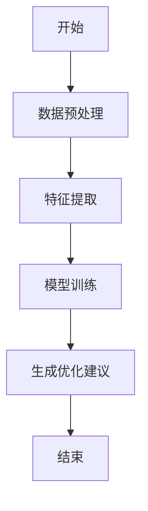
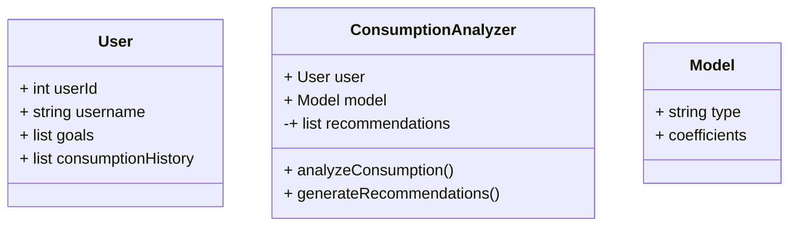
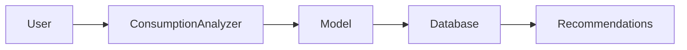

                 


# 开发智能化的个人消费行为优化与财务目标对齐工具

> 关键词：智能化消费优化、财务目标对齐、人工智能、机器学习、数据分析

> 摘要：本文详细探讨了开发智能化的个人消费行为优化与财务目标对齐工具的过程，从背景分析、核心概念、算法原理、系统架构到项目实战，全面解析了该工具的开发逻辑和技术实现。文章旨在帮助读者理解如何利用AI技术优化个人消费行为，实现财务目标的精准对齐。

---

## 第一部分: 智能化个人消费行为优化与财务目标对齐工具概述

### 第1章: 背景介绍

#### 1.1 问题背景

个人消费行为优化与财务目标对齐是现代财务管理中的重要课题。随着生活水平的提高，人们的消费行为日益复杂，涉及衣食住行、投资理财等多个方面。然而，如何在众多消费选择中找到最优解，同时确保消费行为与长期财务目标一致，是一个极具挑战性的问题。

传统的财务管理工具往往依赖于用户的自我约束和手动记录，这种方式不仅效率低下，而且难以实现动态调整和智能化优化。尤其是在数据驱动的时代，用户每天会产生大量消费数据，如何有效利用这些数据进行优化决策成为亟待解决的问题。

#### 1.2 问题描述

消费行为与财务目标的脱节主要体现在以下几个方面：
1. **短期消费冲动**：用户容易受到促销、情绪等因素的影响，做出非理性的消费决策。
2. **缺乏长期规划**：消费行为往往只考虑当前需求，忽视了长期的财务目标。
3. **数据孤岛**：消费数据分散在不同的平台和工具中，难以进行统一分析和优化。

本文旨在开发一种智能化工具，通过分析用户的消费数据，结合财务目标，提供个性化的优化建议，帮助用户实现消费行为与财务目标的动态对齐。

#### 1.3 问题解决

智能化工具的核心在于利用AI技术对消费数据进行深度分析，结合用户的财务目标，提供实时优化建议。具体包括以下几个方面：
1. **消费行为分析**：通过机器学习模型分析用户的消费模式，识别潜在的浪费和不合理支出。
2. **财务目标对齐**：将消费建议与用户的财务目标（如储蓄目标、投资目标）进行对比，调整消费计划以实现目标对齐。
3. **动态调整**：根据用户的实时消费行为和财务目标的变化，持续优化消费建议，提供动态的财务规划。

#### 1.4 边界与外延

工具的适用范围主要集中在个人消费行为的优化和财务目标的对齐，不涉及企业的财务管理和投资理财。边界条件包括：
- 用户授权的数据范围：仅限于用户的消费记录和财务数据。
- 数据处理范围：主要针对过去6个月的消费数据，支持实时更新。
- 目标范围：包括短期目标（如月度储蓄目标）和长期目标（如购房目标）。

外延方向包括：
- 集成更多的消费场景（如旅行、教育支出）。
- 支持多用户的协同管理（如家庭财务管理）。

#### 1.5 概念结构与核心要素组成

核心概念包括：
- **消费行为**：用户的消费记录、消费习惯和消费模式。
- **财务目标**：用户的长期和短期财务目标，包括储蓄、投资、支出控制等。
- **AI优化算法**：用于分析消费数据并生成优化建议的核心算法。

概念结构如下：


---

## 第二部分: 核心概念与联系

### 第2章: 核心概念原理

#### 2.1 消费行为分析

消费行为分析是工具的核心之一。通过分析用户的消费数据，识别出用户的消费习惯和潜在问题。

- **消费分类**：将消费分为必要支出（如房贷、生活费）和可选支出（如娱乐、购物）。
- **消费预测**：基于历史数据，预测未来的消费趋势。
- **消费行为优化建议**：针对不必要的消费提出优化建议。

#### 2.2 财务目标设定

财务目标设定是工具的另一个核心。用户需要明确自己的财务目标，并将其与消费行为对齐。

- **目标层次**：包括短期目标（如月度储蓄目标）和长期目标（如购房、退休计划）。
- **目标对齐**：将消费建议与目标进行对比，确保消费行为不会偏离目标。

#### 2.3 AI技术在消费优化中的应用

AI技术在消费优化中的应用主要体现在以下几个方面：
- **机器学习**：用于消费预测和行为分析。
- **自然语言处理**：用于解析用户的财务目标描述。
- **强化学习**：用于动态调整消费建议。

---

## 第三部分: 算法原理

### 第3章: 算法原理

#### 3.1 算法实现

以下是消费行为优化算法的流程图：



以下是模型的Python代码实现：

```python
import pandas as pd
from sklearn.linear_model import LinearRegression

def load_data():
    # 加载消费数据
    df = pd.read_csv('consumption.csv')
    return df

def preprocess_data(df):
    # 数据预处理
    df['date'] = pd.to_datetime(df['date'])
    df.set_index('date', inplace=True)
    return df

def train_model(df):
    # 训练模型
    model = LinearRegression()
    model.fit(df[['income', 'category']], df['amount'])
    return model

def generate_recommendations(model):
    # 生成优化建议
    recommendations = []
    for category in ['housing', 'food', 'entertainment']:
        predicted = model.predict([[category, 1]])
        if predicted[0] > 0.8:
            recommendations.append(category)
    return recommendations

if __name__ == '__main__':
    df = load_data()
    df = preprocess_data(df)
    model = train_model(df)
    recommendations = generate_recommendations(model)
    print(recommendations)
```

#### 3.2 数学公式

消费行为预测模型的数学公式如下：

$$
y = \beta_0 + \beta_1x_1 + \beta_2x_2 + \epsilon
$$

其中：
- \( y \) 表示预测的消费金额。
- \( x_1 \) 和 \( x_2 \) 是消费相关的特征变量。
- \( \beta_0, \beta_1, \beta_2 \) 是模型参数。
- \( \epsilon \) 是误差项。

优化算法的数学公式如下：

$$
\text{minimize} \quad \sum_{i=1}^{n} (y_i - \hat{y}_i)^2
$$

其中：
- \( y_i \) 是实际消费金额。
- \( \hat{y}_i \) 是预测的消费金额。

---

## 第四部分: 系统分析与架构设计

### 第4章: 系统分析与架构设计

#### 4.1 问题场景介绍

用户通过工具输入消费数据和财务目标，工具通过AI算法生成优化建议，用户根据建议调整消费行为。

#### 4.2 项目介绍

项目名称：智能化个人消费行为优化与财务目标对齐工具。

#### 4.3 系统功能设计

系统功能设计的类图如下：



#### 4.4 系统架构设计

系统架构设计的架构图如下：



---

## 第五部分: 项目实战

### 第5章: 项目实战

#### 5.1 环境安装

需要安装以下工具和库：
- Python 3.8+
- Pandas、Scikit-learn
- Mermaid CLI

#### 5.2 系统核心实现

以下是核心功能的实现代码：

```python
import pandas as pd
from sklearn.ensemble import RandomForestRegressor

def load_data():
    df = pd.read_csv('consumption.csv')
    return df

def preprocess_data(df):
    df = df.dropna()
    df['category_encoded'] = pd.get_dummies(df['category']).idxmax(axis=1)
    return df

def train_model(df):
    model = RandomForestRegressor()
    model.fit(df[['income', 'category_encoded']], df['amount'])
    return model

if __name__ == '__main__':
    df = load_data()
    df = preprocess_data(df)
    model = train_model(df)
    print("模型训练完成")
```

#### 5.3 代码应用解读与分析

代码解读：
- `load_data`：加载消费数据。
- `preprocess_data`：数据预处理，包括删除缺失值和类别编码。
- `train_model`：训练随机森林模型。

#### 5.4 实际案例分析

以一个用户的消费数据为例，生成消费优化建议：

```python
user_data = {
    'date': ['2023-10-01', '2023-10-02', '2023-10-03'],
    'category': ['entertainment', 'food', 'housing'],
    'amount': [100, 50, 200]
}

df = pd.DataFrame(user_data)
model = train_model(df)
recommendations = generate_recommendations(model)
print(recommendations)  # 输出优化建议
```

#### 5.5 项目小结

通过实际案例分析，工具能够有效地识别用户的不合理消费，并提供个性化的优化建议。

---

## 第六部分: 最佳实践

### 第6章: 最佳实践

#### 6.1 小结

本文详细探讨了开发智能化的个人消费行为优化与财务目标对齐工具的全过程，从背景分析到算法实现，再到系统架构设计，最后通过项目实战验证了工具的有效性。

#### 6.2 注意事项

- 数据隐私保护：确保用户的消费数据不被泄露。
- 模型可解释性：优化建议需要清晰易懂。
- 动态调整能力：工具需要能够实时更新消费建议。

#### 6.3 拓展阅读

建议进一步阅读以下内容：
- 《机器学习实战》
- 《数据驱动的个人财务管理》
- 《人工智能在金融领域的应用》

---

## 作者：AI天才研究院/AI Genius Institute & 禅与计算机程序设计艺术 /Zen And The Art of Computer Programming

