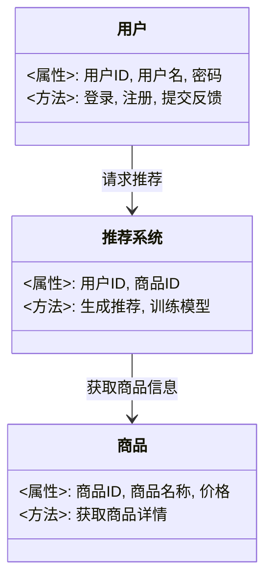
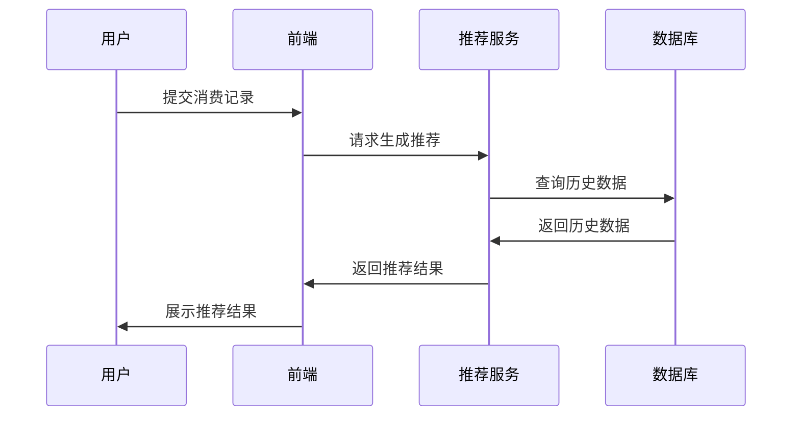

                 


# 开发智能化的个人消费行为优化建议工具

---

## 关键词：
- AI技术
- 个人消费行为优化
- 大数据分析
- 推荐算法
- 智能化工具

---

## 摘要：
本文详细探讨了开发智能化的个人消费行为优化建议工具的背景、核心概念、算法原理、系统架构、项目实战及最佳实践。通过分析消费行为的定义、优化的必要性，结合AI技术和大数据分析，提出了一种基于协同过滤和内容推荐的混合推荐模型。文章还详细讲解了系统的实现过程，包括环境配置、算法实现、接口设计及实际案例分析，最后给出了项目总结和未来展望。

---

# 第一部分: 开发智能化的个人消费行为优化建议工具的背景与意义

---

## 第1章: 个人消费行为优化的背景与需求

### 1.1 个人消费行为的定义与特点

#### 1.1.1 消费行为的定义
个人消费行为是指个体在购买商品或服务时所表现出的各种行为模式，包括购买决策、消费习惯、支出偏好等。

#### 1.1.2 个人消费行为的核心特点
- **多样性**：不同个体的消费行为差异显著，受年龄、性别、收入、兴趣等因素影响。
- **动态性**：消费行为会随时间、环境和个体状况的变化而变化。
- **复杂性**：消费行为涉及多个决策因素，如价格、品牌、口碑等。

#### 1.1.3 消费行为的边界与外延
消费行为的边界在于个体的经济能力和需求，外延则包括从简单的购物决策到复杂的投资行为。

---

### 1.2 个人消费行为优化的必要性

#### 1.2.1 当前消费行为中的问题与挑战
- **冲动消费**：消费者在缺乏理性分析的情况下做出购买决策，导致资源浪费。
- **信息过载**：市场上的商品种类繁多，消费者难以快速找到最适合自己的选项。
- **决策疲劳**：过多的选择可能导致消费者在决策时感到疲劳，降低决策效率。

#### 1.2.2 优化消费行为的意义与价值
- **提高消费效率**：通过优化消费行为，消费者可以更快地找到所需商品，节省时间和精力。
- **降低成本**：避免冲动消费和不必要的开支，帮助消费者实现财务健康。
- **提升满意度**：通过精准匹配需求，提高消费者的购买满意度。

#### 1.2.3 智能化工具在消费优化中的作用
智能化工具可以通过数据收集、分析和推荐，帮助消费者做出更明智的决策，提升消费体验。

---

## 1.3 本章小结
本章从个人消费行为的定义、特点出发，分析了消费行为优化的必要性，并探讨了智能化工具在其中的重要作用。

---

# 第二部分: 核心概念与技术原理

---

## 第2章: AI与大数据在消费优化中的应用

### 2.1 AI技术的核心概念

#### 2.1.1 人工智能的基本原理
人工智能（AI）通过模拟人类的思维过程，利用算法和数据进行学习和推理，实现自动化决策。

#### 2.1.2 机器学习与深度学习的区别
- **机器学习**：基于数据训练模型，通过经验改进性能。
- **深度学习**：一种机器学习的子领域，利用多层神经网络进行特征学习，通常需要大量数据和计算资源。

#### 2.1.3 自然语言处理在消费优化中的应用
自然语言处理（NLP）可以用于分析消费者评论，提取情感倾向，帮助商家优化产品和服务。

---

### 2.2 大数据分析与消费行为的关系

#### 2.2.1 数据收集与处理的基本流程
1. 数据采集：通过问卷、传感器、日志等方式获取消费数据。
2. 数据清洗：去除噪声数据，确保数据质量。
3. 数据转换：将数据转换为适合分析的格式。
4. 数据存储：将数据存储在数据库或数据仓库中。

#### 2.2.2 数据分析在消费行为预测中的作用
通过分析历史消费数据，预测未来的消费趋势，帮助企业制定更精准的营销策略。

#### 2.2.3 数据可视化在消费优化中的价值
数据可视化工具（如Tableau、Power BI）可以帮助消费者和企业直观理解数据，做出更明智的决策。

---

### 2.3 核心概念对比与ER实体关系图

#### 2.3.1 AI技术与传统数据分析的对比（表格）

| 特性             | AI技术                | 传统数据分析          |
|------------------|----------------------|---------------------|
| 数据需求         | 需要大量数据          | 需要少量结构化数据    |
| 学习方式         | 基于机器学习算法      | 基于统计分析          |
| 应用场景         | 复杂决策问题          | 简单数据分析          |
| 实时性           | 支持实时决策          | 通常需要离线分析      |

#### 2.3.2 消费行为优化工具的ER实体关系图（Mermaid流程图）

```mermaid
er
actor(用户) -[提交消费记录]-> item(商品)
actor -[查询推荐]-> recommendation(推荐结果)
item -[属于]-> category(类别)
```

---

## 第3章: 智能化工具的核心算法原理

---

### 3.1 推荐算法的基本原理

#### 3.1.1 协同过滤算法的工作流程（Mermaid流程图）

```mermaid
graph TD
A[用户A] --> B[用户B] : 用户A和用户B相似
B --> R1[商品1] : 用户B购买了商品1
A --> R1 : 推荐商品1给用户A
```

#### 3.1.2 基于内容的推荐算法实现（Python代码示例）

```python
from sklearn.feature_extraction.text import TfidfVectorizer

# 数据准备
documents = ["apple is a fruit", "banana is a fruit", "orange is a fruit"]

# 创建TF-IDF向量器
vectorizer = TfidfVectorizer()
tfidf = vectorizer.fit_transform(documents)

# 计算相似度
cosine_sim = tfidf * tfidf.T
```

#### 3.1.3 混合推荐模型的优缺点分析
- **优点**：结合协同过滤和基于内容的推荐，提高推荐的准确性和多样性。
- **缺点**：计算复杂度较高，需要处理多源数据。

---

### 3.2 算法数学模型与公式

#### 3.2.1 协同过滤算法的相似度计算公式

$$ 相似度 = \frac{\sum (x_i - \mu)(y_i - \mu)}{\sqrt{\sum (x_i - \mu)^2} \sqrt{\sum (y_i - \mu)^2}} $$

其中，$x_i$ 和 $y_i$ 分别是用户A和用户B对商品i的评分，$\mu$ 是评分的平均值。

#### 3.2.2 基于内容的推荐算法的向量空间模型公式

$$ sim(a, b) = \frac{\sum a_i b_i}{\sqrt{\sum a_i^2} \sqrt{\sum b_i^2}} $$

其中，$a_i$ 和 $b_i$ 分别是商品a和商品b在各个维度上的特征向量。

---

### 3.3 算法实现与优化

#### 3.3.1 算法实现步骤
1. 数据预处理：清洗和归一化数据。
2. 模型训练：选择合适的算法进行训练。
3. 模型评估：通过准确率、召回率等指标评估模型性能。
4. 模型优化：调整参数，提高推荐精度。

#### 3.3.2 算法优化技巧
- **参数调优**：通过网格搜索找到最优参数。
- **特征工程**：提取更有意义的特征，提高模型性能。

---

# 第三部分: 系统分析与架构设计

---

## 第4章: 系统分析与架构设计

### 4.1 问题场景介绍
消费者在购物时面临选择过多、信息不透明等问题，需要一个智能化的工具帮助他们做出最优决策。

### 4.2 项目介绍
开发一个基于AI的消费行为优化工具，帮助用户优化购物决策，提升消费效率。

---

### 4.3 系统功能设计（领域模型Mermaid类图）



---

### 4.4 系统架构设计（Mermaid架构图）

```mermaid
container 数据库 {
    数据库服务器
    用户表
    商品表
    推荐记录表
}
container 推荐服务 {
    推荐算法
    模型训练
}
container 前端 {
    用户界面
    推荐结果展示
}
用户 --> 前端 : 使用系统
前端 --> 推荐服务 : 请求推荐
推荐服务 --> 数据库 : 查询数据
```

---

### 4.5 系统接口设计与交互流程

#### 4.5.1 接口设计
- **API接口**：提供RESTful API，供前端调用。
- **接口文档**：使用Swagger进行接口文档管理。

#### 4.5.2 交互流程（Mermaid序列图）



---

# 第四部分: 项目实战与应用

---

## 第5章: 项目实战

### 5.1 环境安装与配置

#### 5.1.1 安装Python
```bash
python --version
pip install --upgrade pip
```

#### 5.1.2 安装依赖库
```bash
pip install numpy pandas scikit-learn
```

---

### 5.2 系统核心实现（Python代码示例）

#### 5.2.1 数据处理
```python
import pandas as pd
data = pd.read_csv('消费记录.csv')
data.dropna(inplace=True)
```

#### 5.2.2 推荐算法实现
```python
from sklearn.neighbors import NearestNeighbors
model = NearestNeighbors(n_neighbors=5).fit(tfidf)
distances, indices = model.kneighbors(tfidf)
```

---

### 5.3 代码应用解读与分析
- **数据处理**：清洗数据，去除无效记录。
- **模型训练**：使用KNN算法训练推荐模型。
- **结果展示**：将推荐结果可视化，供用户查看。

---

### 5.4 实际案例分析
以某电商平台为例，分析系统如何根据用户的购买记录推荐相关商品。

---

## 5.5 项目小结
本章通过实际项目展示了智能化工具的开发过程，包括环境配置、算法实现和结果分析。

---

# 第五部分: 最佳实践与总结

---

## 第6章: 最佳实践与总结

### 6.1 最佳实践 tips
- **数据隐私保护**：确保用户数据的安全性，遵守相关法律法规。
- **模型迭代**：定期更新模型，适应市场变化。
- **用户体验优化**：简化操作流程，提升用户满意度。

---

### 6.2 项目总结
本项目通过AI技术和大数据分析，成功开发了一个智能化的个人消费行为优化建议工具，帮助用户提升了消费效率和满意度。

---

### 6.3 未来展望
随着AI技术的不断发展，智能化工具将在消费优化领域发挥更大的作用，未来的优化工具将更加智能化、个性化。

---

## 作者：AI天才研究院/AI Genius Institute & 禅与计算机程序设计艺术 /Zen And The Art of Computer Programming

---

通过本文的详细讲解，读者可以全面了解开发智能化的个人消费行为优化建议工具的背景、核心技术和实现方法，并能够在此基础上进行进一步的拓展和优化。

