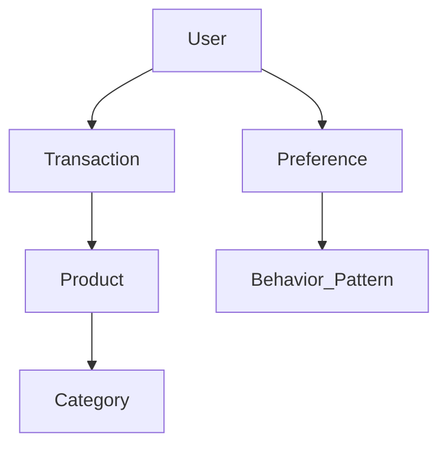
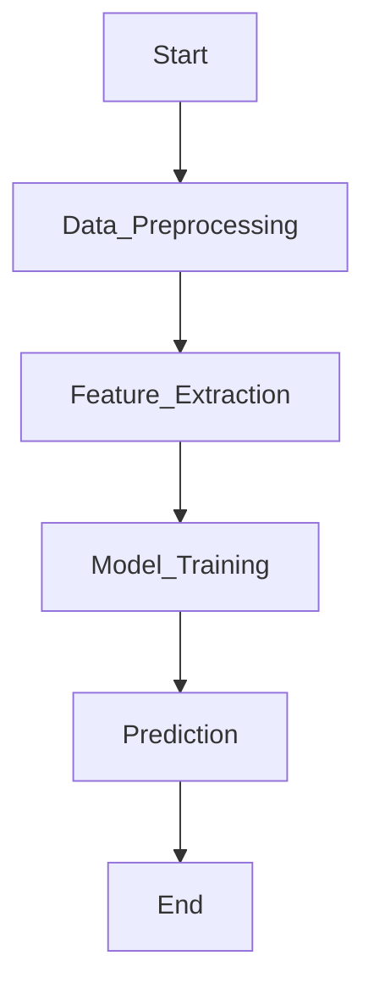
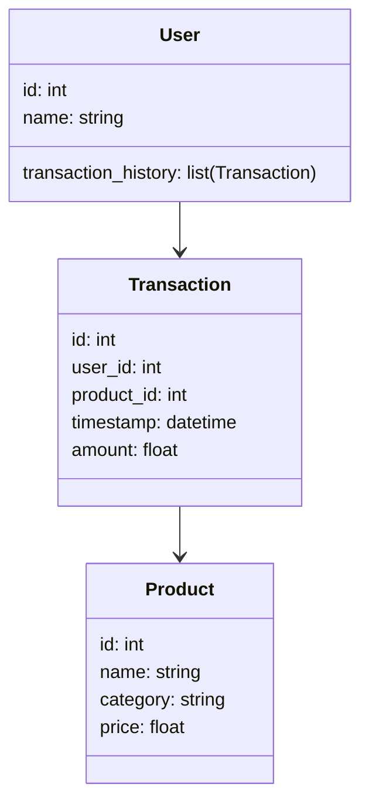
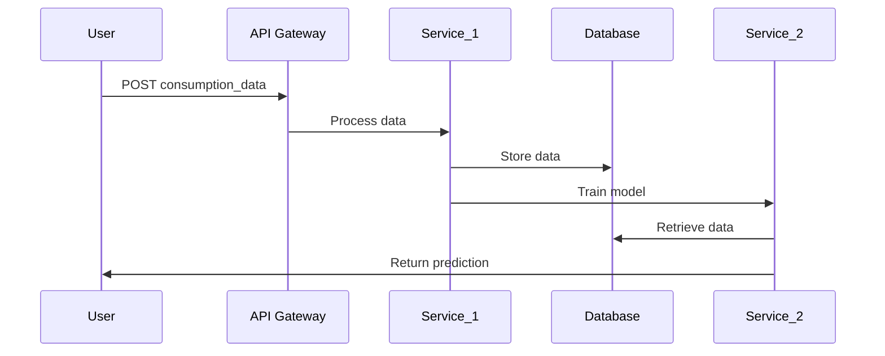

                 


# 开发智能化的个人消费行为分析与预测工具

---

## 关键词：  
智能化、个人消费行为、数据分析、预测模型、机器学习、系统架构  

---

## 摘要：  
本文详细探讨了开发智能化的个人消费行为分析与预测工具的核心方法与技术实现。通过分析消费行为的背景与问题，结合算法原理、数学模型、系统架构和项目实战，本文为读者提供了一套完整的解决方案。从数据采集与预处理、特征提取、模型构建到系统设计与实现，本文详细阐述了每一步的关键技术和实践要点，并通过实际案例展示了工具的应用效果。最后，本文总结了开发过程中需要注意的最佳实践和未来的发展方向。

---

# 第一部分: 背景介绍与问题分析

---

## 第1章: 个人消费行为分析与预测的背景

### 1.1 问题背景

#### 1.1.1 当前消费行为分析的痛点
在当今快速发展的数字经济时代，个人消费行为的分析与预测变得越来越重要。消费者的行为受到多种因素的影响，包括经济状况、市场环境、个人偏好等。然而，传统的消费行为分析方法往往依赖于人工统计和简单的数据汇总，难以捕捉复杂的行为模式和趋势变化。这种分析方式不仅效率低下，而且难以提供实时性和精准性。

#### 1.1.2 智能化分析与预测的必要性
随着人工智能和大数据技术的快速发展，智能化的消费行为分析与预测工具逐渐成为可能。通过机器学习算法和深度学习模型，我们可以从海量数据中提取有价值的信息，发现潜在的消费规律，并为用户提供个性化的建议。这种智能化的分析方法不仅可以提高效率，还能显著提升预测的准确性。

#### 1.1.3 个人消费行为分析的边界与外延
个人消费行为分析的核心目标是通过对个体消费数据的挖掘，预测未来的消费趋势和行为模式。其边界包括数据的采集范围、预测的时间窗口以及分析的粒度。外延则涉及从个人行为扩展到群体行为的分析，以及与其他领域的结合，如金融、营销等。

### 1.2 问题描述

#### 1.2.1 消费行为分析的核心问题
消费行为分析的核心问题在于如何从复杂的数据中提取有用的特征，并构建有效的预测模型。这包括数据的清洗、特征的提取、模型的选择与优化等多个环节。

#### 1.2.2 数据获取与处理的挑战
消费数据的获取和处理面临诸多挑战，包括数据的异构性、缺失值的处理、数据隐私的保护等。此外，如何高效地存储和管理海量数据也是一个重要问题。

#### 1.2.3 智能化预测的实现路径
智能化预测的实现路径包括数据采集、特征工程、模型训练、模型部署和结果解读。每个环节都需要仔细设计和优化，以确保最终的预测结果能够满足实际需求。

### 1.3 问题解决与目标设定

#### 1.3.1 智能化工具的核心目标
智能化工具的核心目标是通过自动化的方式，对个人消费行为进行实时分析和预测，为用户提供个性化的消费建议，并帮助企业制定精准的营销策略。

#### 1.3.2 解决方案的可行性分析
基于现有技术，智能化工具的实现是可行的。通过使用成熟的机器学习算法和大数据处理技术，我们可以有效地解决消费行为分析中的关键问题。

#### 1.3.3 边界条件与实现范围
在实现过程中，需要明确工具的边界条件，包括数据的采集范围、预测的时间窗口以及系统的可扩展性等。这些条件将直接影响系统的架构设计和功能实现。

### 1.4 核心概念与系统架构

#### 1.4.1 核心概念的定义与属性
消费行为分析的核心概念包括消费数据、消费特征、预测模型等。每个概念都有其独特的属性和作用。

#### 1.4.2 系统架构的初步设想
系统的初步架构包括数据采集模块、数据处理模块、模型训练模块和结果展示模块。各模块之间需要高效协作，确保整个系统的流畅运行。

#### 1.4.3 系统功能的模块划分
系统的功能模块划分为数据采集、数据预处理、特征提取、模型训练、结果分析和用户界面等部分。每个模块都有其特定的功能和实现方式。

### 1.5 本章小结
本章通过对消费行为分析的背景、问题和目标的分析，明确了智能化工具的核心任务和实现路径。接下来，我们将深入探讨消费行为分析的核心概念与系统架构。

---

# 第二部分: 核心概念与系统分析

---

## 第2章: 个人消费行为分析的核心概念

### 2.1 核心概念的原理分析

#### 2.1.1 数据采集与预处理
数据采集是消费行为分析的第一步。需要通过多种渠道获取消费数据，并进行清洗和预处理，确保数据的准确性和完整性。

#### 2.1.2 消费行为特征提取
通过对消费数据的分析，提取出反映消费者行为特征的关键指标，如消费频率、消费金额、偏好类别等。

#### 2.1.3 智能化预测模型构建
基于提取的特征，构建机器学习模型，对未来的消费行为进行预测。

### 2.2 核心概念的属性对比

#### 2.2.1 数据特征的对比分析
通过对比不同数据特征的属性，如时间性、空间性、类别性等，选择最适合模型的特征。

#### 2.2.2 模型性能的对比分析
对不同模型的性能进行对比，选择最优的模型组合。

#### 2.2.3 实验结果的对比分析
通过对不同实验结果的对比，验证模型的稳定性和准确性。

### 2.3 系统实体关系图



### 2.4 本章小结
本章通过对消费行为分析的核心概念进行深入分析，明确了各概念之间的关系和作用。接下来，我们将探讨消费行为分析的算法原理与数学模型。

---

## 第3章: 算法原理与数学模型

### 3.1 算法原理

#### 3.1.1 算法选择与流程
选择合适的算法，如随机森林、XGBoost或神经网络，并详细阐述其工作流程。

#### 3.1.2 算法流程图


#### 3.1.3 算法实现代码
```python
import pandas as pd
from sklearn.ensemble import RandomForestRegressor
from sklearn.metrics import mean_absolute_error

# 数据预处理
data = pd.read_csv('consumption_data.csv')
data = data.dropna()
X = data[['feature1', 'feature2', 'feature3']]
y = data['target']

# 特征提取
# （假设已经完成）

# 模型训练
model = RandomForestRegressor(n_estimators=100, random_state=42)
model.fit(X, y)

# 预测
predicted = model.predict(X_test)
print("MAE:", mean_absolute_error(y_test, predicted))
```

### 3.2 数学模型

#### 3.2.1 线性回归模型
$$ y = \beta_0 + \beta_1x_1 + \beta_2x_2 + \dots + \beta_nx_n $$

#### 3.2.2 随机森林模型
随机森林是一种基于树的集成方法，通过组合多个决策树的预测结果来提高模型的准确性和稳定性。

#### 3.2.3 神经网络模型
神经网络模型通过多层感知机（MLP）来模拟复杂的非线性关系，适用于高维数据的处理。

### 3.3 算法对比与优化

#### 3.3.1 不同算法的对比分析
通过对比不同算法的性能指标，如准确率、召回率、F1值等，选择最适合的模型。

#### 3.3.2 模型调优与优化
通过网格搜索、交叉验证等方法，对模型的超参数进行优化，提高预测的准确性。

### 3.4 本章小结
本章通过对算法原理和数学模型的深入分析，明确了不同模型的优缺点和适用场景。接下来，我们将探讨消费行为分析的系统架构与实现方案。

---

## 第4章: 系统分析与架构设计

### 4.1 系统分析

#### 4.1.1 问题场景介绍
消费行为分析系统需要处理大量的消费数据，提供实时的预测结果，并支持用户的交互操作。

#### 4.1.2 项目介绍
系统的目标是开发一个智能化的消费行为分析工具，帮助用户预测未来的消费行为。

### 4.2 系统架构设计

#### 4.2.1 领域模型


#### 4.2.2 系统架构
```mermaid
graph TD
    User-->API Gateway
    API Gateway-->Service_1
    Service_1-->Database
    Service_1-->Service_2
    Service_2-->Database
```

#### 4.2.3 系统接口设计
系统需要提供RESTful API接口，支持数据的上传、处理和预测结果的查询。

#### 4.2.4 系统交互流程


### 4.3 本章小结
本章通过对系统的架构设计和交互流程的分析，明确了系统的整体结构和实现方式。接下来，我们将探讨消费行为分析的项目实现与实际应用。

---

## 第5章: 项目实战与案例分析

### 5.1 项目实战

#### 5.1.1 环境安装
需要安装Python、机器学习库（如scikit-learn、XGBoost）、数据处理库（如pandas、numpy）以及可视化库（如matplotlib、seaborn）。

#### 5.1.2 系统核心实现
实现消费行为分析系统的各个功能模块，包括数据采集、特征提取、模型训练和结果展示。

#### 5.1.3 代码实现与解读
```python
import pandas as pd
from sklearn.ensemble import RandomForestRegressor
from sklearn.metrics import mean_absolute_error

# 数据加载与预处理
data = pd.read_csv('consumption_data.csv')
data = data.dropna()
X = data[['feature1', 'feature2', 'feature3']]
y = data['target']

# 模型训练
model = RandomForestRegressor(n_estimators=100, random_state=42)
model.fit(X, y)

# 模型预测
predicted = model.predict(X_test)
print("预测结果:", predicted)
```

#### 5.1.4 代码功能解读
通过代码实现消费行为分析系统的功能，包括数据处理、模型训练和结果预测。

### 5.2 实际案例分析

#### 5.2.1 案例背景
通过对某电商平台的消费数据进行分析，预测用户的消费行为。

#### 5.2.2 数据分析与解读
通过数据分析工具，如Tableau或Power BI，对消费数据进行可视化分析，发现消费规律和趋势。

#### 5.2.3 案例结果与总结
通过实际案例分析，验证系统的预测能力，并总结经验教训。

### 5.3 本章小结
本章通过对项目的实战和案例分析，验证了消费行为分析系统的可行性和有效性。接下来，我们将总结开发过程中的经验和教训，并展望未来的发展方向。

---

## 第6章: 总结与展望

### 6.1 总结
通过对消费行为分析与预测工具的开发过程的总结，我们明确了系统的实现方法和关键点。系统的实现依赖于数据的采集与处理、特征的提取与分析、模型的训练与优化以及结果的展示与解读。

### 6.2 最佳实践 tips
在开发过程中，需要注意数据的隐私保护、模型的可解释性和系统的可扩展性。此外，还需要结合实际业务需求，选择最适合的算法和模型。

### 6.3 未来展望
未来的发展方向包括模型的优化、系统的扩展以及与其他技术的结合。通过不断的技术创新和实践积累，消费行为分析工具将变得更加智能化和高效。

### 6.4 本章小结
本文通过系统的开发与实践，为读者提供了一套完整的消费行为分析与预测工具的实现方案。希望本文的内容能够为相关领域的研究和实践提供参考和借鉴。

---

# 结语

消费行为分析与预测工具的开发是一个复杂而有趣的过程，需要我们不断探索和实践。通过本文的探讨，我们不仅掌握了相关的核心技术，还积累了宝贵的开发经验。未来，随着技术的不断发展，消费行为分析工具将变得更加智能化和高效，为我们的生活和工作带来更多的便利。

---

**作者：AI天才研究院/AI Genius Institute & 禅与计算机程序设计艺术/Zen And The Art of Computer Programming**

