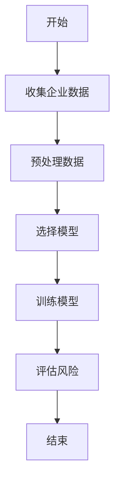
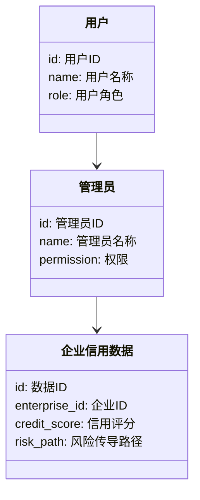
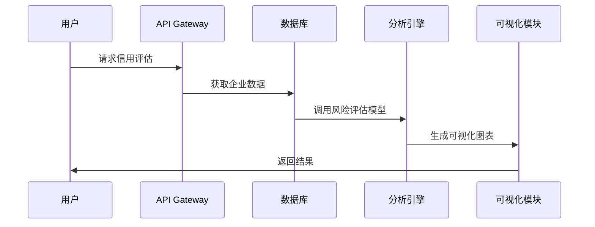

                 


# 开发智能化的企业信用风险传导模拟与可视化系统

> 关键词：企业信用风险，智能化，可视化，系统开发，算法模型

> 摘要：本文详细探讨了开发智能化的企业信用风险传导模拟与可视化系统的核心概念、算法原理、系统架构以及实际应用。通过分析信用风险的定义、特征及其传导机制，结合数学模型和可视化技术，提出了一个高效的系统设计方案，并通过实际案例展示了系统的实现过程和应用效果。

---

## 第一部分: 企业信用风险传导模拟与可视化系统概述

### 第1章: 信用风险的基本概念与问题背景

#### 1.1 信用风险的定义与特征
信用风险是指企业在经济活动中，由于交易对手或债务人未能履行其承诺，导致债权人遭受损失的可能性。其主要特征包括：
- **不确定性**：风险的大小和发生概率难以精确预测。
- **传染性**：信用风险可能通过企业间的关联传导，引发系统性风险。
- **动态性**：受市场环境、政策变化等多种因素影响。

#### 1.2 企业信用风险传导的背景与问题
企业在经营过程中，信用风险的管理至关重要。传统信用风险评估方法主要依赖于历史数据和统计分析，存在以下问题：
- **数据孤岛**：不同部门或系统的数据难以整合，导致分析结果不准确。
- **计算复杂性**：传统模型难以实时模拟信用风险的传导路径。
- **决策滞后**：缺乏动态模拟和可视化工具，导致风险应对措施不够及时。

#### 1.3 智能化信用风险模拟与可视化的必要性
智能化技术（如人工智能、大数据分析）和可视化技术的应用，能够有效解决传统方法的局限性。通过实时数据采集、智能算法分析和直观的可视化展示，企业可以更好地识别和管理信用风险。

---

### 第2章: 企业信用风险传导模拟系统的框架

#### 2.1 系统的核心概念与组成
系统主要包括以下几个核心模块：
- **数据采集模块**：负责收集企业信用相关的数据，包括财务数据、市场数据等。
- **风险评估模块**：基于机器学习算法，评估企业的信用风险。
- **模拟与分析模块**：模拟信用风险的传导过程，并分析其影响。
- **可视化展示模块**：将分析结果以图形化的方式展示，便于决策者理解。

#### 2.2 核心概念的ER实体关系图
以下是系统中核心实体及其关系的ER图：
```mermaid
er
actor: 用户
actor -|> role: 管理员
actor -|> entity: 企业信用数据
entity -|> attribute: 企业基本信息
entity -|> attribute: 信用评分
entity -|> attribute: 风险传导路径
```

---

## 第二部分: 信用风险传导的算法与数学模型

### 第3章: 信用风险评估的数学模型

#### 3.1 风险评估的基本原理
信用风险评估的核心在于构建数学模型，通过概率论和统计学方法，量化企业的信用风险。常用的模型包括：
- **线性回归模型**：用于预测企业的违约概率。
- **逻辑回归模型**：用于分类企业信用等级。

#### 3.2 风险传导的数学公式
风险传导的数学模型可以通过以下公式表示：
$$ R_{total} = \sum_{i=1}^{n} R_i \times C_i $$
其中，$R_i$ 表示第i个风险因素的强度，$C_i$ 表示其传导系数。

#### 3.3 算法流程图
以下是信用风险评估的算法流程图：


---

## 第三部分: 系统架构设计与实现

### 第4章: 系统架构设计

#### 4.1 领域模型设计
以下是系统领域模型的类图：


#### 4.2 系统架构图
以下是系统架构的总体设计：


#### 4.3 接口设计
系统的主要接口包括：
- 数据接口：用于采集和存储企业信用数据。
- 分析接口：用于调用信用风险评估模型。
- 可视化接口：用于生成风险传导的可视化图表。

#### 4.4 交互流程图
以下是用户与系统的交互流程：


---

## 第四部分: 项目实战

### 第5章: 环境安装与代码实现

#### 5.1 环境安装
需要安装以下工具和库：
- Python 3.8+
- Jupyter Notebook
- pandas, numpy, scikit-learn

#### 5.2 核心代码实现
以下是信用风险评估模型的实现代码：
```python
import pandas as pd
from sklearn.linear_model import LogisticRegression
from sklearn.metrics import accuracy_score

# 数据预处理
data = pd.read_csv('credit_data.csv')
X = data.drop('default', axis=1)
y = data['default']

# 模型训练
model = LogisticRegression()
model.fit(X, y)

# 模型评估
predictions = model.predict(X)
print("模型准确率：", accuracy_score(y, predictions))
```

#### 5.3 案例分析
以某企业为例，通过模型预测其违约概率，并模拟信用风险的传导路径。

---

## 第五部分: 总结与展望

### 第6章: 总结与展望

#### 6.1 小结
本文详细介绍了开发智能化的企业信用风险传导模拟与可视化系统的核心概念、算法原理和系统架构，并通过实际案例展示了系统的实现过程和应用效果。

#### 6.2 注意事项
- 数据的准确性和完整性是系统运行的关键。
- 模型的选择和调优需要根据具体业务需求进行。

#### 6.3 拓展阅读
- 《信用风险评估与管理》
- 《机器学习在金融领域的应用》

---

**作者：AI天才研究院/AI Genius Institute & 禅与计算机程序设计艺术 /Zen And The Art of Computer Programming**

