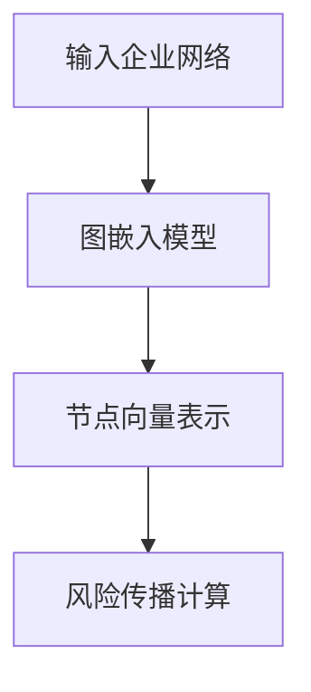
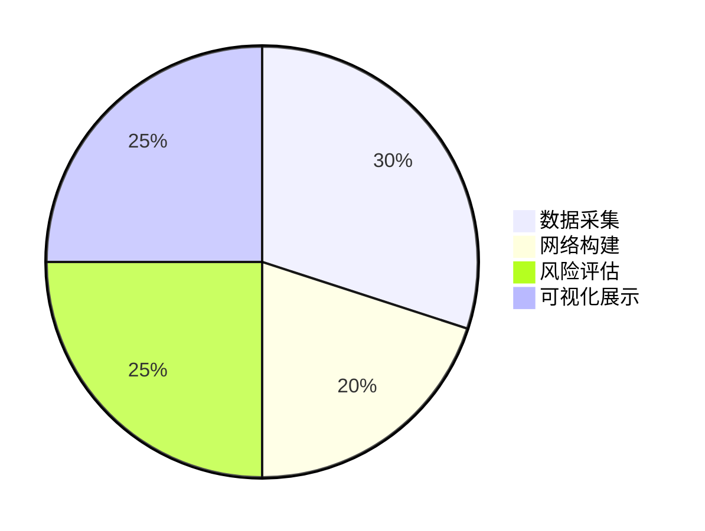

                 


# 开发智能化的企业信用风险传导网络可视化系统

> 关键词：信用风险，网络可视化，企业风险，数据挖掘，风险传导，系统开发

> 摘要：随着企业间信用风险的日益复杂化和网络化，传统的信用风险分析方法已经难以满足实际需求。本文提出了一种基于网络可视化的智能化企业信用风险传导系统开发方法，通过结合图嵌入算法、社区发现算法和风险传播算法，构建了一个能够实时分析和展示企业信用风险传导网络的可视化系统。本文详细介绍了系统开发的背景、核心概念、算法原理、系统架构设计以及实际项目实现，为读者提供了一个全面的开发指南。

---

# 第一部分：企业信用风险传导网络可视化系统概述

# 第1章：企业信用风险传导网络可视化系统背景介绍

## 1.1 问题背景
### 1.1.1 企业信用风险的定义与特征
企业信用风险是指企业在经营过程中，由于外部环境或自身因素导致无法履行合同义务或偿还债务的可能性。其主要特征包括传染性、复杂性和不确定性。

### 1.1.2 信用风险传导的机制与路径
信用风险可以通过供应链、金融投资、合作伙伴等多个路径在企业间传导。这种传导机制使得单个企业的信用问题可能引发连锁反应，影响整个经济系统的稳定性。

### 1.1.3 可视化技术在信用风险分析中的作用
可视化技术能够将复杂的信用风险关系以图形化的方式呈现，帮助用户快速识别风险源、风险传播路径和潜在风险区域。

## 1.2 问题描述
### 1.2.1 传统信用风险分析的局限性
传统的信用风险分析方法通常基于单个企业的财务数据，难以捕捉企业之间的相互影响关系。

### 1.2.2 企业信用风险传导网络的复杂性
企业间的信用风险传导网络通常涉及大量企业和复杂的交互关系，传统的分析方法难以处理这种复杂性。

### 1.2.3 可视化技术在信用风险分析中的应用需求
随着企业间关系的复杂化，可视化技术成为理解和分析信用风险传导网络的重要工具。

## 1.3 问题解决
### 1.3.1 可视化技术如何帮助识别信用风险
通过可视化技术，可以将企业间的信用关系以网络图的形式呈现，帮助用户快速识别高风险区域和关键节点。

### 1.3.2 网络可视化在信用风险传导中的应用
网络可视化技术可以实时监控信用风险的传播路径，帮助企业制定有效的风险管理策略。

### 1.3.3 系统开发的目标与意义
开发智能化的企业信用风险传导网络可视化系统，旨在提高信用风险分析的效率和准确性，为企业风险管理提供决策支持。

## 1.4 系统的边界与外延
### 1.4.1 系统的功能边界
系统主要关注企业间的信用风险传导关系，不涉及企业的内部风险管理。

### 1.4.2 系统的外部接口
系统需要与企业信用数据库、风险评估模型等外部系统进行交互。

### 1.4.3 系统的扩展性与可维护性
系统设计应具有良好的扩展性和可维护性，以适应未来业务需求的变化。

## 1.5 核心概念与组成
### 1.5.1 信用风险的核心要素
信用风险的核心要素包括企业信用状况、债务关系和风险传播路径。

### 1.5.2 企业网络的构建与特征
企业网络的构建基于企业间的交易数据和债务关系，具有复杂性和动态性。

### 1.5.3 可视化系统的组成与功能
可视化系统主要包括数据采集、网络构建、风险评估和可视化展示四个功能模块。

## 1.6 本章小结
本章从背景、问题描述和问题解决三个方面，详细介绍了企业信用风险传导网络可视化系统的开发背景和意义。同时，明确了系统的核心概念和组成，为后续章节的系统开发奠定了基础。

---

# 第2章：企业信用风险传导网络的核心概念与联系

## 2.1 核心概念原理
### 2.1.1 信用风险的数学模型
信用风险的数学模型通常基于概率论和统计学方法，例如马尔可夫链模型和贝叶斯网络模型。

### 2.1.2 企业网络的构建方法
企业网络的构建方法包括基于交易数据的网络构建和基于债务关系的网络构建。

### 2.1.3 可视化技术的实现原理
可视化技术的实现原理包括数据预处理、网络布局算法和交互式展示技术。

## 2.2 核心概念对比分析
### 2.2.1 不同信用风险模型的对比
不同的信用风险模型在假设、计算方法和适用场景上存在差异，需要根据具体需求选择合适的模型。

### 2.2.2 不同网络构建方法的对比
不同的网络构建方法在数据来源、计算复杂度和网络特征提取方面存在差异。

### 2.2.3 不同可视化技术的优缺点
不同的可视化技术在展示效果、交互性和可扩展性方面存在优缺点，需要综合考虑选择合适的可视化技术。

## 2.3 ER实体关系图架构
```mermaid
er
actor: 用户
system: 信用风险可视化系统
database: 企业信用数据
relation: 用户与系统交互
relation: 系统与数据库交互
```

## 2.4 本章小结
本章通过对比分析和ER实体关系图，详细介绍了企业信用风险传导网络的核心概念和联系。通过对比分析，明确了不同方法和技术的优缺点，为后续章节的系统开发提供了理论基础。

---

# 第3章：企业信用风险传导网络的算法原理

## 3.1 算法原理概述
### 3.1.1 图嵌入算法
图嵌入算法是一种将图结构数据转换为低维向量表示的技术，常用于网络分析和机器学习。

### 3.1.2 社区发现算法
社区发现算法用于识别图中的社区结构，帮助理解网络的组织形式。

### 3.1.3 风险传播算法
风险传播算法用于模拟信用风险在网络中的传播过程。

## 3.2 图嵌入算法实现


## 3.3 算法实现代码
```python
def graph_embedding(network):
    # 算法实现
    pass
```

## 3.4 数学模型与公式
### 3.4.1 图嵌入模型公式
$$E = \sum_{i,j} (x_i^T A_{ij} x_j)$$

### 3.4.2 风险传播公式
$$R_i = \sum_{j} w_{ij} R_j$$

## 3.5 本章小结
本章详细介绍了企业信用风险传导网络的算法原理，包括图嵌入算法、社区发现算法和风险传播算法的实现方法。通过公式和代码示例，读者可以理解这些算法的核心思想和实现步骤。

---

# 第4章：系统架构设计

## 4.1 系统功能设计
### 4.1.1 数据采集模块
数据采集模块负责从企业信用数据库中获取企业间的交易数据和债务关系。

### 4.1.2 网络构建模块
网络构建模块基于数据采集模块获取的数据，构建企业间的信用风险传导网络。

### 4.1.3 风险评估模块
风险评估模块利用图嵌入算法和风险传播算法，评估企业间的信用风险。

### 4.1.4 可视化展示模块
可视化展示模块将信用风险传导网络以图形化的方式展示给用户。

## 4.2 系统架构设计


## 4.3 系统接口设计
### 4.3.1 数据接口
系统需要与企业信用数据库进行交互，获取企业间的交易数据和债务关系。

### 4.3.2 用户接口
系统提供用户友好的可视化界面，方便用户进行信用风险分析和管理。

## 4.4 系统交互设计
```mermaid
sequence
    用户 -> 数据采集模块: 请求数据
    数据采集模块 -> 数据库: 查询数据
    数据采集模块 -> 网络构建模块: 传输数据
    网络构建模块 -> 风险评估模块: 传输网络数据
    风险评估模块 -> 可视化展示模块: 传输风险评估结果
    可视化展示模块 -> 用户: 显示可视化结果
```

## 4.5 本章小结
本章详细介绍了企业信用风险传导网络可视化系统的架构设计，包括系统功能设计、架构设计、接口设计和交互设计。通过mermaid图，读者可以清晰地理解系统的设计思路。

---

# 第5章：项目实战

## 5.1 环境安装与配置
### 5.1.1 开发工具安装
需要安装Python、Jupyter Notebook、Pandas、Matplotlib等开发工具。

### 5.1.2 数据库配置
需要配置企业信用数据库，确保系统能够正常读取数据。

## 5.2 系统核心功能实现
### 5.2.1 数据采集模块实现
编写代码从数据库中读取企业间的交易数据和债务关系。

### 5.2.2 网络构建模块实现
基于数据构建企业间的信用风险传导网络。

### 5.2.3 风险评估模块实现
利用图嵌入算法和风险传播算法评估企业间的信用风险。

### 5.2.4 可视化展示模块实现
将信用风险传导网络以图形化的方式展示给用户。

## 5.3 代码实现与解读
### 5.3.1 数据采集模块代码
```python
import pandas as pd
def load_data():
    # 数据库查询代码
    pass
```

### 5.3.2 网络构建模块代码
```python
import networkx as nx
def build_network(data):
    # 网络构建代码
    pass
```

### 5.3.3 风险评估模块代码
```python
def calculate_risk(network):
    # 风险评估代码
    pass
```

### 5.3.4 可视化展示模块代码
```python
import matplotlib.pyplot as plt
def visualize(network):
    # 可视化代码
    pass
```

## 5.4 实际案例分析
### 5.4.1 案例背景
假设某企业A由于债务问题导致信用风险，需要分析其对整个网络的影响。

### 5.4.2 数据采集与网络构建
从数据库中获取相关数据，构建企业间的信用风险传导网络。

### 5.4.3 风险评估与可视化
利用系统进行风险评估，并通过可视化展示企业间的信用风险传导路径。

## 5.5 本章小结
本章通过实际案例分析，详细介绍了企业信用风险传导网络可视化系统的开发和应用过程。通过代码实现和案例分析，读者可以更好地理解系统的开发和使用方法。

---

# 第6章：总结与展望

## 6.1 项目总结
### 6.1.1 系统开发成果
成功开发了一个智能化的企业信用风险传导网络可视化系统，能够实时分析和展示企业间的信用风险传导网络。

### 6.1.2 系统的优缺点
系统具有高效性、可视化和易用性等优点，但也存在数据获取难度大、网络复杂性高等缺点。

## 6.2 项目小结
通过本项目，我们掌握了企业信用风险传导网络的构建方法和可视化技术，为后续研究奠定了基础。

## 6.3 注意事项与最佳实践
### 6.3.1 数据质量管理
确保数据的准确性和完整性，是系统开发的关键。

### 6.3.2 系统维护与更新
定期维护和更新系统，确保系统的稳定性和准确性。

## 6.4 拓展阅读
### 6.4.1 更多信用风险模型
推荐读者阅读更多关于信用风险模型的文献，了解不同的模型和方法。

### 6.4.2 可视化技术的发展
可视化技术不断发展，读者可以关注最新的可视化技术和工具。

## 6.5 本章小结
本章总结了系统的开发成果和优缺点，提出了系统的维护和更新建议，并为读者提供了拓展阅读的方向。

---

# 作者：AI天才研究院/AI Genius Institute & 禅与计算机程序设计艺术 /Zen And The Art of Computer Programming

