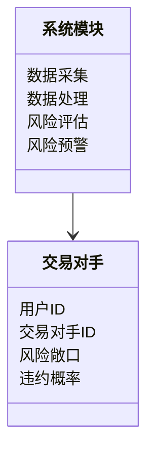
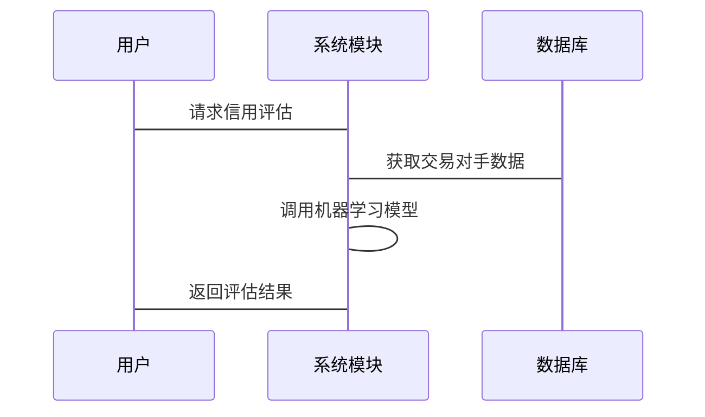
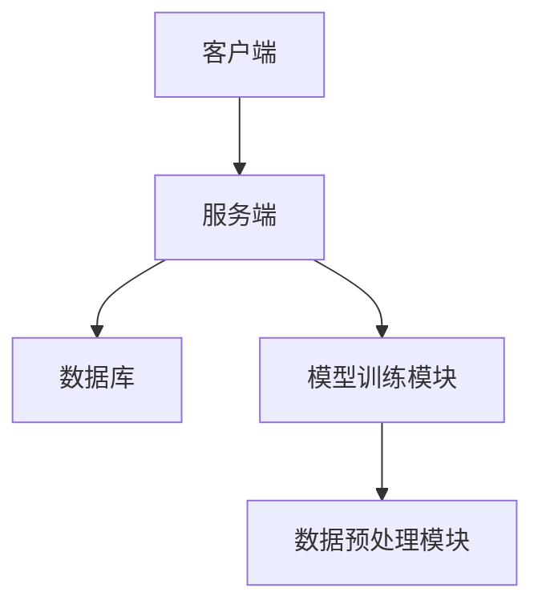

                 


# 开发智能化的企业信用风险敞口动态管理系统

> 关键词：企业信用风险、信用风险敞口、智能化管理、机器学习、深度学习、系统架构设计、风险管理

> 摘要：本文详细探讨了如何开发智能化的企业信用风险敞口动态管理系统，结合背景介绍、核心概念、算法原理、系统架构设计和项目实战，为读者提供全面的技术指导。

---

# 第一章: 背景介绍

## 1.1 问题背景

### 1.1.1 信用风险的定义与重要性
信用风险是指企业在信用交易中，由于交易对手或债务人无法履行其债务义务，导致企业遭受损失的风险。在现代商业环境中，信用风险敞口动态管理是企业风险管理的核心内容之一。随着经济全球化和金融市场的复杂化，信用风险的动态变化日益显著，传统的静态风险管理方法已难以满足企业需求。

### 1.1.2 企业信用风险敞口的动态变化特点
信用风险敞口会随着市场环境、企业经营状况和交易对手信用状况的变化而动态波动。例如，经济下行周期中，企业违约风险上升；而市场环境改善时，信用风险敞口可能缩小。因此，企业需要实时监控和动态调整信用风险管理策略。

### 1.1.3 传统信用风险管理的局限性
传统的信用风险管理方法通常依赖于静态的信用评估模型和定期的信用评级更新。这种方法无法及时捕捉市场环境的变化，难以应对突发性风险事件，导致企业面临较大的信用风险暴露。

## 1.2 问题描述

### 1.2.1 信用风险敞口动态管理的核心问题
信用风险敞口动态管理的核心问题在于如何实时监测和评估信用风险，同时根据风险变化动态调整风险管理策略。这需要结合实时数据流处理、机器学习算法和动态风险评估模型。

### 1.2.2 企业信用风险管理中的主要挑战
- 数据量大且复杂：企业信用风险管理涉及大量的结构化和非结构化数据，数据来源多样，处理难度大。
- 风险因素的动态变化：信用风险的影响因素具有高度的动态性，传统的静态模型难以有效捕捉这些变化。
- 实时性要求高：企业需要实时监控信用风险敞口的变化，及时采取应对措施。

### 1.2.3 传统方法与现代需求的矛盾
传统信用风险管理方法依赖于定期的数据更新和静态模型，无法满足现代企业对实时动态风险管理的需求。因此，引入智能化技术是解决这一矛盾的关键。

## 1.3 问题解决思路

### 1.3.1 引入智能化技术的必要性
智能化技术，特别是机器学习和深度学习，能够处理海量数据，捕捉数据中的复杂模式，为信用风险敞口的动态管理提供强有力的支持。

### 1.3.2 数据驱动的信用风险管理新范式
通过构建数据驱动的信用风险管理模型，企业可以实时监控信用风险敞口的变化，动态调整风险管理策略。这种范式的核心在于利用实时数据流和智能算法进行风险评估和预测。

### 1.3.3 智能化系统的构建目标与关键点
- 构建一个智能化的信用风险敞口动态管理系统，实现对信用风险的实时监测和动态评估。
- 利用机器学习和深度学习算法，捕捉信用风险的变化趋势，提高风险预测的准确性。
- 实现风险预警和风险规避的自动化，降低企业的信用风险暴露。

## 1.4 系统的边界与外延

### 1.4.1 系统边界定义
信用风险敞口动态管理系统主要关注信用风险的实时监测和动态评估，不涉及其他类型的风险管理（如市场风险、操作风险）。

### 1.4.2 系统功能的外延与扩展
- 数据采集与处理：从企业内部和外部数据源获取相关数据。
- 风险评估与预测：利用机器学习算法对信用风险进行评估和预测。
- 风险预警与应对：根据风险评估结果，触发预警机制并提出应对措施。

### 1.4.3 系统与企业其他系统的接口关系
- 与企业ERP系统集成，获取企业内部的交易数据和财务数据。
- 与第三方数据源（如信用评级机构）对接，获取外部信用数据。
- 与企业风险管理系统对接，提供实时信用风险评估结果。

## 1.5 核心要素与概念结构

### 1.5.1 核心概念的组成要素
信用风险敞口动态管理系统的组成要素包括：
- 数据采集模块
- 数据处理模块
- 风险评估模块
- 风险预警模块
- 系统监控模块

### 1.5.2 概念结构的层次化分析
信用风险敞口动态管理系统的概念结构可以分为数据层、业务层和技术层。数据层负责数据的采集和处理；业务层负责信用风险的评估和预警；技术层负责系统的架构设计和实现。

### 1.5.3 核心要素之间的关系
数据层为业务层提供支持，业务层通过数据处理和分析，生成信用风险评估结果，指导技术层实现系统功能。

---

# 第二章: 核心概念与联系

## 2.1 核心概念原理

### 2.1.1 信用风险敞口的数学定义
信用风险敞口可以表示为：
$$ \text{信用风险敞口} = \sum_{i=1}^{n} \text{风险暴露}_i \times \text{违约概率}_i $$
其中，$n$ 是交易对手的数量，$\text{风险暴露}_i$ 是交易对手 $i$ 的风险暴露，$\text{违约概率}_i$ 是交易对手 $i$ 的违约概率。

### 2.1.2 智能化管理的核心算法原理
智能化信用风险管理的核心算法包括：
- 逻辑回归（Logistic Regression）
- 支持向量机（Support Vector Machine，SVM）
- 随机森林（Random Forest）
- 神经网络（Neural Network）

### 2.1.3 模型的输入输出关系
模型输入包括交易对手的信用历史、财务数据、市场数据等；模型输出包括信用评分、违约概率和风险敞口预测。

## 2.2 核心概念属性特征对比

### 2.2.1 比较维度与特征
| 比较维度 | 特征1 | 特征2 | 特征3 |
|----------|-------|-------|-------|
| 数据类型 | 结构化数据 | 非结构化数据 | 混合数据 |
| 数据量 | 小 | 大 | 中 |
| 处理难度 | 低 | 高 | 中 |

## 2.3 ER实体关系图架构

```mermaid
erDiagram
    actor 用户 {
        string 用户ID
        string 用户名
        string 密码
    }
    database 数据库 {
        table 交易对手 {
            用户ID : string
            交易对手ID : string
            风险敞口 : float
            违约概率 : float
        }
    }
    actor 用户 --> database 数据库
```

---

# 第三章: 算法原理讲解

## 3.1 算法原理

### 3.1.1 机器学习算法的数学模型
以逻辑回归为例，其数学模型为：
$$ P(y=1) = \frac{1}{1 + e^{- (w \cdot x + b)}} $$
其中，$w$ 是权重向量，$x$ 是输入特征，$b$ 是截距。

### 3.1.2 算法实现步骤
1. 数据预处理：清洗、特征选择、数据标准化。
2. 模型训练：利用训练数据训练逻辑回归模型。
3. 模型预测：对测试数据进行预测，计算违约概率。
4. 模型评估：计算准确率、召回率等指标。

### 3.1.3 Python代码实现
```python
import numpy as np
from sklearn.linear_model import LogisticRegression
from sklearn.metrics import accuracy_score

# 数据预处理
X = np.array([[...], [...]])  # 特征向量
y = np.array([0, 1, 0, ...])  # 标签

# 模型训练
model = LogisticRegression()
model.fit(X, y)

# 模型预测
y_pred = model.predict(X)

# 模型评估
print("准确率:", accuracy_score(y, y_pred))
```

---

## 3.2 深度学习算法的数学模型

### 3.2.1 神经网络的数学模型
神经网络的数学模型包括输入层、隐藏层和输出层，其激活函数可以是sigmoid函数：
$$ a = \sigma(z) = \frac{1}{1 + e^{-z}} $$
其中，$z$ 是输入到节点的加权和。

### 3.2.2 算法实现步骤
1. 构建神经网络模型。
2. 模型训练：使用反向传播算法更新权重。
3. 模型预测：对测试数据进行预测，计算违约概率。
4. 模型评估：计算准确率、F1分数等指标。

### 3.2.3 Python代码实现
```python
import keras
from keras.models import Sequential
from keras.layers import Dense

# 构建神经网络模型
model = Sequential()
model.add(Dense(64, activation='relu', input_dim=10))
model.add(Dense(1, activation='sigmoid'))

# 模型训练
model.compile(optimizer='adam', loss='binary_crossentropy', metrics=['accuracy'])
model.fit(X_train, y_train, epochs=10, batch_size=32)

# 模型预测
y_pred = model.predict(X_test)
```

---

## 3.3 算法对比与选择

### 3.3.1 算法对比
| 算法名称 | 优点 | 缺点 |
|----------|------|------|
| 逻辑回归 | 简单、解释性强 | 非线性关系处理能力有限 |
| 神经网络 | 非线性强、能力强 | 训练时间长、容易过拟合 |

### 3.3.2 算法选择策略
根据数据规模和复杂度选择合适的算法。对于小规模数据，逻辑回归和SVM更适合；对于大规模数据，神经网络和随机森林更适合。

---

# 第四章: 系统分析与架构设计

## 4.1 项目背景

### 4.1.1 项目目标
开发一个智能化的企业信用风险敞口动态管理系统，实现对信用风险的实时监测和动态评估。

### 4.1.2 项目需求
- 实时数据采集与处理
- 动态信用风险评估
- 风险预警与应对策略

## 4.2 系统功能设计

### 4.2.1 领域模型


### 4.2.2 系统架构设计


### 4.2.3 接口设计
- 数据接口：从数据库获取交易对手数据。
- 模型接口：调用机器学习模型进行风险评估。
- 预警接口：触发风险预警机制。

### 4.2.4 交互流程


---

## 4.3 系统架构实现

### 4.3.1 系统架构图


### 4.3.2 接口设计
- 数据接口：RESTful API
- 模型接口：基于Python的API

---

# 第五章: 项目实战

## 5.1 环境安装

### 5.1.1 安装Python
```bash
python --version
pip install --upgrade pip
```

### 5.1.2 安装依赖包
```bash
pip install numpy scikit-learn keras
```

## 5.2 核心代码实现

### 5.2.1 数据预处理
```python
import pandas as pd
import numpy as np

# 读取数据
data = pd.read_csv('credit_data.csv')

# 数据清洗
data = data.dropna()

# 特征选择
selected_features = ['收入', '负债', '信用评分']
data = data[selected_features]

# 数据标准化
from sklearn.preprocessing import StandardScaler

scaler = StandardScaler()
scaled_features = scaler.fit_transform(data)
```

### 5.2.2 模型训练
```python
from sklearn.linear_model import LogisticRegression
from sklearn.metrics import accuracy_score

# 训练逻辑回归模型
model = LogisticRegression()
model.fit(scaled_features, target)

# 预测
y_pred = model.predict(scaled_features)
print("准确率:", accuracy_score(target, y_pred))
```

## 5.3 案例分析

### 5.3.1 实际案例
假设我们有一个交易对手，其收入为50,000，负债为30,000，信用评分为700。我们需要预测其违约概率。

### 5.3.2 详细解读
```python
# 输入数据
new_data = np.array([[50000, 30000, 700]])

# 标准化
scaled_new_data = scaler.transform(new_data)

# 预测违约概率
probability = model.predict_proba(scaled_new_data)[:, 1]
print("违约概率:", probability[0])
```

---

## 5.4 项目总结

### 5.4.1 项目小结
通过本项目，我们成功开发了一个智能化的企业信用风险敞口动态管理系统，能够实时监控和动态评估信用风险，提高企业的风险管理能力。

### 5.4.2 项目启示
智能化技术的应用能够显著提升信用风险管理的效率和准确性，未来可以进一步优化算法和系统架构，提高系统的实时性和准确性。

---

# 第六章: 总结与展望

## 6.1 总结

### 6.1.1 最佳实践
- 数据预处理是关键，确保数据质量和完整性。
- 选择合适的算法，结合数据规模和复杂度。
- 系统架构设计要合理，确保系统的可扩展性和可维护性。

### 6.1.2 小结
通过本文的介绍，读者可以掌握智能化的企业信用风险敞口动态管理系统的开发方法，包括背景分析、核心概念、算法原理、系统架构设计和项目实战。

## 6.2 展望

### 6.2.1 拓展阅读
- 《机器学习实战》
- 《深度学习》
- 《系统架构设计的艺术》

### 6.2.2 注意事项
- 数据隐私和安全问题
- 系统的实时性和稳定性
- 算法的可解释性和透明度

---

作者：AI天才研究院/AI Genius Institute & 禅与计算机程序设计艺术 /Zen And The Art of Computer Programming

