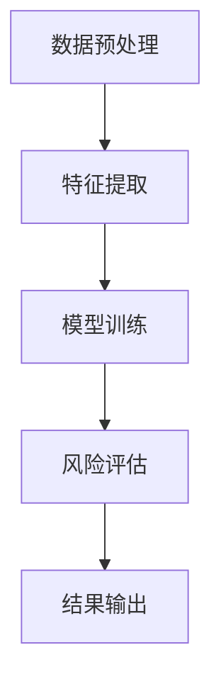
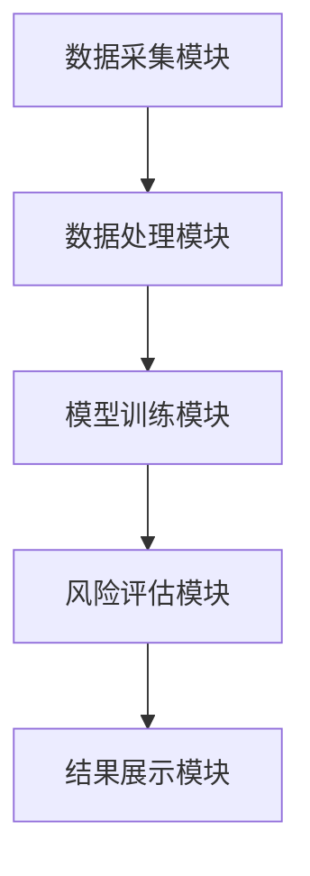

                 


# 开发智能化的企业并购风险评估模型

## 关键词：企业并购，风险评估，人工智能，机器学习，智能化模型

## 摘要：企业并购是企业发展的重要战略之一，但其过程伴随着多种风险。传统的并购风险评估方法存在数据不足、人为因素干扰大、评估结果不准确等问题。本文通过引入人工智能和机器学习技术，开发一种智能化的企业并购风险评估模型，能够更全面、准确地识别和评估并购风险。本文从背景介绍、核心概念、算法原理、系统架构设计、项目实战等多方面进行详细阐述，最终构建一个高效、可靠的智能化企业并购风险评估系统。

---

# 第1章: 企业并购风险评估的背景与挑战

## 1.1 企业并购的定义与重要性

### 1.1.1 企业并购的定义
企业并购是指企业之间的合并或收购行为，是企业为了实现战略目标、扩大市场份额、优化资源配置而进行的重要商业活动。

### 1.1.2 并购在企业发展中的作用
企业并购能够快速获取技术、市场、品牌等资源，帮助企业在竞争中占据优势，同时优化资产结构，提高运营效率。

### 1.1.3 并购风险的定义与分类
并购风险是指在企业并购过程中可能遇到的财务、法律、市场、技术等各方面的不确定性，可能导致并购失败或损失。并购风险可以分为财务风险、市场风险、技术风险、法律风险等。

---

## 1.2 传统企业并购风险评估的局限性

### 1.2.1 传统评估方法的局限性
传统的企业并购风险评估方法通常基于财务指标和经验判断，存在数据不足、分析维度有限的问题，难以全面反映并购风险。

### 1.2.2 数据不足与人为因素的影响
传统评估方法依赖于有限的历史数据和专家经验，容易受到人为因素的影响，导致评估结果的主观性和不准确性。

### 1.2.3 风险评估的不全面性
传统方法往往忽视了市场波动、技术变革等动态因素，无法全面覆盖并购过程中的各种潜在风险。

---

## 1.3 智能化企业并购风险评估的必要性

### 1.3.1 AI技术在企业并购中的应用潜力
人工智能和机器学习技术能够处理海量数据，发现传统方法难以察觉的模式和趋势，为并购风险评估提供更全面的支持。

### 1.3.2 智能化评估的优势与价值
智能化评估能够基于大数据分析，提供实时、动态的评估结果，帮助企业在并购决策中做出更明智的选择。

### 1.3.3 未来发展趋势与挑战
随着人工智能技术的不断发展，智能化企业并购风险评估将成为企业并购的重要工具，但同时也面临着数据隐私、模型优化等挑战。

---

## 1.4 本章小结

---

# 第2章: 企业并购风险评估模型的核心概念

## 2.1 企业并购风险评估模型的定义与特点

### 2.1.1 模型的定义
企业并购风险评估模型是一种基于人工智能和机器学习技术的数学模型，用于预测和评估企业并购过程中的各种风险因素。

### 2.1.2 模型的核心特点
- **数据驱动**：基于大量历史数据进行建模和分析。
- **动态评估**：能够实时更新数据，提供动态的风险评估结果。
- **多维度分析**：综合考虑财务、市场、技术等多方面的因素。

### 2.1.3 模型的适用范围
适用于企业并购前的尽职调查、风险评估以及并购后的整合优化。

---

## 2.2 核心概念与联系

### 2.2.1 风险因素分析
企业并购的风险因素包括财务风险、市场风险、技术风险、法律风险等。

### 2.2.2 风险评估指标体系
构建一个包含多个指标的评估体系，例如：
- 财务指标：债务比率、盈利能力。
- 市场指标：市场份额、行业趋势。
- 技术指标：技术专利数量、研发能力。

### 2.2.3 模型的输入与输出
- **输入**：企业的财务数据、市场数据、技术数据等。
- **输出**：并购风险的评分（例如：高、中、低风险）。

---

## 2.3 模型的数学表达与公式

### 2.3.1 风险评估的数学模型
风险评分公式：
$$
\text{风险评分} = \alpha \times \text{财务风险} + \beta \times \text{市场风险} + \gamma \times \text{技术风险}
$$

其中，$\alpha$、$\beta$、$\gamma$为各风险因素的权重，通常通过训练数据进行优化。

### 2.3.2 模型的公式推导
以逻辑回归模型为例，风险概率的计算公式为：
$$
P(\text{风险}) = \frac{1}{1 + e^{- (\theta_0 + \theta_1 x_1 + \theta_2 x_2 + \dots + \theta_n x_n)}}
$$

其中，$x_i$为输入特征，$\theta_i$为模型参数。

---

## 2.4 本章小结

---

# 第3章: 企业并购风险评估模型的算法原理

## 3.1 算法选择与原理

### 3.1.1 机器学习算法的选择
选择逻辑回归、支持向量机（SVM）或随机森林等算法，根据数据特点和模型性能进行选择。

### 3.1.2 算法的基本原理
以逻辑回归为例，模型通过优化目标函数：
$$
\min \sum_{i=1}^{n} \ln(1 + e^{-y_i (\theta^T x_i + \theta_0)})
$$

其中，$y_i$为真实标签，$\theta$为模型参数，$x_i$为输入特征。

### 3.1.3 算法的优缺点分析
- **优点**：逻辑回归适合二分类问题，易于解释。
- **缺点**：对非线性关系的拟合能力有限。

---

## 3.2 算法流程图



---

## 3.3 算法实现

### 3.3.1 数据预处理代码
```python
import pandas as pd
from sklearn.preprocessing import StandardScaler

# 加载数据
data = pd.read_csv('merger_data.csv')

# 删除缺失值
data = data.dropna()

# 标准化处理
scaler = StandardScaler()
data_scaled = scaler.fit_transform(data)
```

### 3.3.2 模型训练代码
```python
from sklearn.linear_model import LogisticRegression

# 初始化模型
model = LogisticRegression()

# 训练模型
model.fit(data_scaled, target)
```

---

## 3.4 本章小结

---

# 第4章: 企业并购风险评估模型的系统架构设计

## 4.1 系统架构概述

### 4.1.1 系统组成模块
- 数据采集模块：收集企业并购相关的数据。
- 数据处理模块：对数据进行清洗和预处理。
- 模型训练模块：基于机器学习算法训练风险评估模型。
- 风险评估模块：根据模型预测并购风险。
- 结果展示模块：将评估结果以可视化形式呈现。

### 4.1.2 模块之间的关系
数据采集模块将数据传递给数据处理模块，处理后的数据传递给模型训练模块，训练好的模型应用于风险评估模块，最终结果由结果展示模块呈现。

### 4.1.3 系统的输入输出
- **输入**：企业并购相关的数据，如财务数据、市场数据等。
- **输出**：并购风险评估结果。

---

## 4.2 系统功能设计

### 4.2.1 数据采集模块
负责从数据库或其他数据源获取企业并购相关的数据。

### 4.2.2 数据处理模块
对数据进行清洗、标准化等预处理，确保数据质量。

### 4.2.3 模型训练模块
基于预处理后的数据，训练机器学习模型。

### 4.2.4 风险评估模块
利用训练好的模型，对目标企业进行风险评估。

### 4.2.5 结果展示模块
将评估结果以图表或报告的形式展示给用户。

---

## 4.3 系统架构图



---

## 4.4 本章小结

---

# 第5章: 企业并购风险评估模型的项目实战

## 5.1 项目背景与目标

### 5.1.1 项目背景
以某科技公司并购案例为例，评估其并购风险。

### 5.1.2 项目目标
构建一个智能化的企业并购风险评估模型，准确预测并购风险。

---

## 5.2 项目实施步骤

### 5.2.1 数据收集与清洗
收集目标企业的财务数据、市场数据等，清洗数据并去除缺失值。

### 5.2.2 模型训练与优化
选择合适的算法，训练模型并进行参数优化。

### 5.2.3 模型部署与测试
将模型部署到实际场景中，进行测试和验证。

---

## 5.3 项目核心代码实现

### 5.3.1 数据预处理代码
```python
import pandas as pd
from sklearn.impute import SimpleImputer

# 加载数据
data = pd.read_csv('merger_data.csv')

# 去除缺失值
imp = SimpleImputer(missing_values=np.nan, strategy='mean')
data_imputed = imp.fit_transform(data)
```

### 5.3.2 模型训练代码
```python
from sklearn.model_selection import train_test_split
from sklearn.ensemble import RandomForestClassifier

# 划分训练集和测试集
X_train, X_test, y_train, y_test = train_test_split(data_imputed, target, test_size=0.2)

# 训练模型
model = RandomForestClassifier()
model.fit(X_train, y_train)
```

---

## 5.4 项目案例分析

### 5.4.1 案例背景
某科技公司计划并购一家初创公司，需要评估并购风险。

### 5.4.2 数据分析
分析目标公司的财务数据、市场数据等，提取特征。

### 5.4.3 模型评估
利用训练好的模型预测并购风险，得出高、中、低风险的评分。

---

## 5.5 本章小结

---

# 第6章: 总结与展望

## 6.1 总结

### 6.1.1 核心成果
构建了一个基于机器学习的企业并购风险评估模型，能够准确预测并购风险。

### 6.1.2 经验总结
数据质量和模型选择对评估结果影响较大，需要结合实际场景进行优化。

---

## 6.2 展望

### 6.2.1 模型优化
进一步优化模型，引入深度学习技术，提高评估精度。

### 6.2.2 应用拓展
将模型应用于更多企业并购案例，推广到更多行业。

### 6.2.3 数据隐私与安全
加强数据隐私保护，确保模型使用的合规性。

---

## 6.3 注意事项

- 数据来源必须合法合规。
- 模型需要定期更新和优化。
- 风险评估结果仅供参考，需结合实际情况进行决策。

---

## 6.4 拓展阅读

- 《机器学习实战》
- 《企业并购风险管理》
- 《人工智能与商业分析》

---

## 作者

作者：AI天才研究院/AI Genius Institute & 禅与计算机程序设计艺术 /Zen And The Art of Computer Programming

