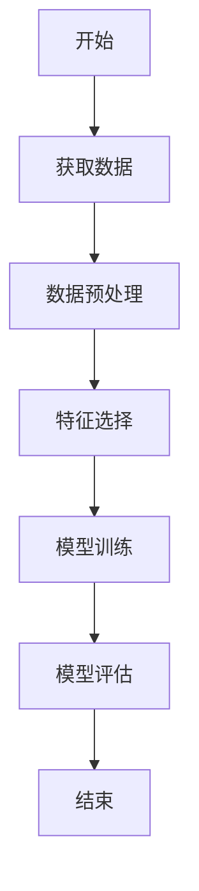
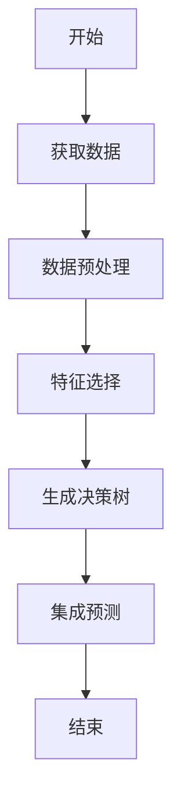
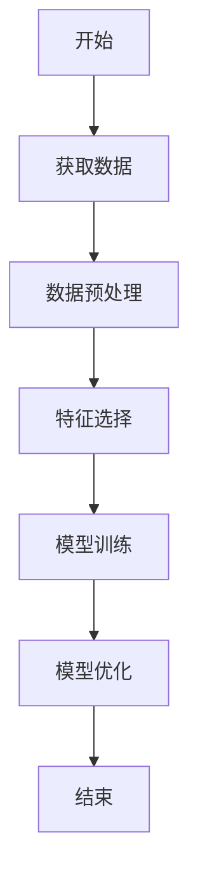
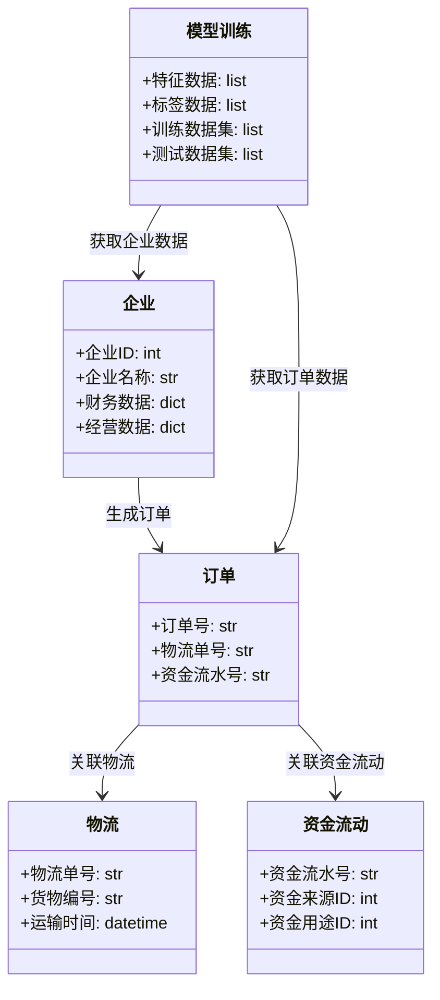
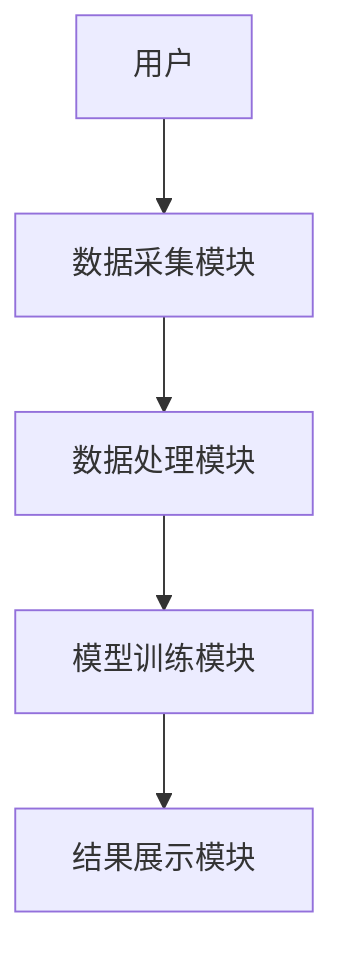
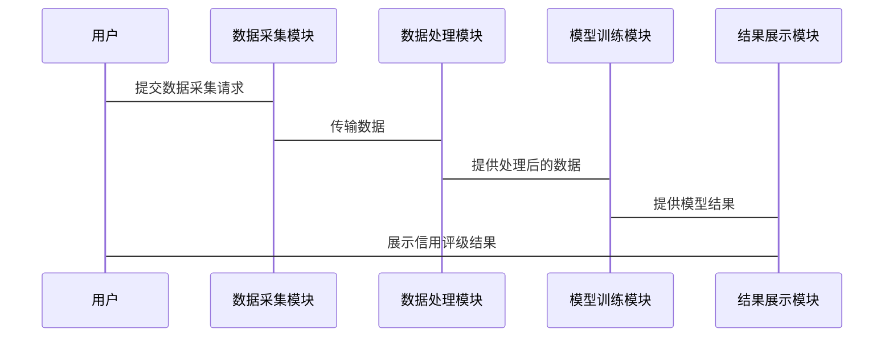

                 


# 开发智能化的供应链金融信用评级模型

## 关键词：供应链金融，信用评级，人工智能，机器学习，数学模型，系统架构，项目实战

## 摘要：  
供应链金融是现代金融体系的重要组成部分，而信用评级是供应链金融中的核心环节。传统的信用评级方法存在效率低、准确率低、难以应对复杂场景等问题。本文将从理论到实践，详细讲解如何利用人工智能技术开发智能化的供应链金融信用评级模型，包括模型的核心概念、算法原理、系统架构设计以及项目实战等内容，帮助读者全面掌握开发智能化信用评级模型的方法和技巧。

---

## 第一部分: 供应链金融与信用评级模型概述

### 第1章: 供应链金融的定义与现状  
供应链金融是指围绕供应链上的企业，通过整合物流、信息流、资金流，为供应链上的企业提供融资支持的一种金融模式。随着全球供应链的复杂化和数字化，供应链金融在支持企业运营、优化资源配置方面发挥着越来越重要的作用。  

#### 1.1 供应链金融的定义  
供应链金融是以供应链上的核心企业为依托，通过整合上下游企业之间的交易数据和信息，为整个供应链上的企业提供融资、信用评估等金融服务。  

#### 1.2 供应链金融的核心要素  
- **核心企业**：供应链上的核心企业是供应链金融的发起者和主导者。  
- **上下游企业**：供应链上的供应商、经销商等企业。  
- **交易数据**：包括订单、物流、资金流动等数据。  
- **金融产品**：包括应收账款融资、存货质押融资等。  

#### 1.3 供应链金融的现状与挑战  
目前，供应链金融在国内外发展迅速，但仍然面临以下挑战：  
1. 数据分散，难以整合。  
2. 传统信用评级方法效率低，准确性差。  
3. 缺乏智能化的信用评级模型，难以应对复杂的供应链场景。  

---

### 第2章: 供应链金融中的信用评级问题  
信用评级是供应链金融中的核心环节，用于评估企业的信用风险。  

#### 2.1 信用评级的定义与重要性  
信用评级是对企业信用状况的评估，是决定企业能否获得融资以及融资利率的重要依据。在供应链金融中，信用评级不仅影响单个企业的融资能力，还会影响整个供应链的资金流动效率。  

#### 2.2 供应链金融中信用评级的独特性  
与传统信用评级相比，供应链金融中的信用评级具有以下特点：  
1. 数据来源多样，包括交易数据、物流数据等。  
2. 需要考虑供应链上下游企业的关联性。  
3. 对实时性要求高，需要快速响应供应链上的资金需求。  

#### 2.3 当前信用评级的主要挑战  
1. 数据质量参差不齐，清洗成本高。  
2. 传统模型难以捕捉复杂的供应链关系。  
3. 缺乏智能化的信用评级工具，难以应对动态变化的供应链环境。  

---

### 第3章: 智能化信用评级模型的必要性  
智能化信用评级模型能够有效解决传统信用评级的局限性，提升供应链金融的整体效率。  

#### 3.1 传统信用评级的局限性  
- 数据来源单一，难以全面反映企业的信用状况。  
- 模型简单，难以捕捉复杂的供应链关系。  
- 人工干预较多，效率低。  

#### 3.2 智能化信用评级的优势  
- 数据处理能力强，能够整合多源异构数据。  
- 算法先进，能够捕捉复杂的信用关系。  
- 实时性强，能够快速响应供应链上的信用需求。  

#### 3.3 供应链金融智能化的发展趋势  
随着人工智能和大数据技术的发展，供应链金融智能化是必然趋势。智能化信用评级模型将逐步取代传统模型，成为供应链金融的核心技术之一。  

---

## 第二部分: 供应链金融信用评级模型的核心概念

### 第4章: 核心概念与联系  
本章将详细讲解供应链金融信用评级模型中的核心概念及其联系。  

#### 4.1 核心概念原理  
供应链金融信用评级模型的核心概念包括：  
- **企业信用数据**：包括企业的财务数据、经营数据等。  
- **交易数据**：包括订单、物流、资金流动等数据。  
- **外部数据**：包括市场数据、政策数据等。  

#### 4.2 核心概念属性特征对比表格  
| 核心概念       | 属性特征                   |  
|----------------|---------------------------|  
| 企业信用数据   | 财务数据、经营数据         |  
| 交易数据       | 订单、物流、资金流动       |  
| 外部数据       | 市场数据、政策数据         |  

#### 4.3 ER实体关系图架构  
```mermaid
erd
  id: identifier
  企业
    --> 订单: 订单号
    --> 财务数据: 企业ID
    --> 经营数据: 企业ID
  订单
    --> 物流: 物流单号
    --> 资金流动: 资金流水号
  物流
    --> 货物: 货物编号
  资金流动
    --> 资金来源: 资金来源ID
    --> 资金用途: 资金用途ID
```

---

### 第5章: 供应链金融信用评级模型的构建要素  

#### 5.1 企业信用数据的收集与处理  
企业信用数据是信用评级的重要基础，包括企业的财务数据、经营数据等。  

#### 5.2 交易数据的分析与建模  
交易数据是供应链金融的核心数据，包括订单、物流、资金流动等数据。  

#### 5.3 外部数据源的整合与应用  
外部数据源包括市场数据、政策数据等，能够为信用评级提供外部支持。  

---

## 第三部分: 供应链金融信用评级模型的算法原理

### 第6章: 常见算法原理与流程图  

#### 6.1 逻辑回归算法原理  
逻辑回归是一种经典的分类算法，适用于二分类问题。  

流程图：  


#### 6.2 随机森林算法原理  
随机森林是一种基于决策树的集成算法，具有较高的准确性和鲁棒性。  

流程图：  


#### 6.3 XGBoost算法原理  
XGBoost是一种基于梯度提升的算法，适用于分类和回归问题。  

流程图：  


---

### 第7章: 算法实现与数学模型  

#### 7.1 逻辑回归的数学模型  
$$ P(y=1|x) = \frac{e^{\beta_0 + \beta_1 x}}{1 + e^{\beta_0 + \beta_1 x}} $$  

#### 7.2 随机森林的实现原理  
随机森林通过随机选择特征和样本，构建多个决策树，并通过投票或加权的方式进行集成预测。  

#### 7.3 XGBoost的优化策略  
XGBoost通过梯度提升和正则化优化，能够在复杂数据上取得更好的效果。  

---

### 第8章: 算法实现的Python代码示例  

#### 8.1 数据预处理代码  
```python
import pandas as pd
from sklearn.preprocessing import StandardScaler

# 读取数据
data = pd.read_csv('data.csv')

# 删除缺失值
data = data.dropna()

# 标准化处理
scaler = StandardScaler()
data_scaled = scaler.fit_transform(data)
```

#### 8.2 模型训练代码  
```python
from sklearn.linear_model import LogisticRegression

# 训练逻辑回归模型
model = LogisticRegression()
model.fit(X_train, y_train)
```

#### 8.3 模型评估代码  
```python
from sklearn.metrics import accuracy_score

# 预测
y_pred = model.predict(X_test)

# 计算准确率
accuracy = accuracy_score(y_test, y_pred)
print(f'Accuracy: {accuracy}')
```

---

## 第四部分: 供应链金融信用评级模型的系统分析与架构设计

### 第9章: 项目背景与目标  

#### 9.1 项目背景介绍  
随着供应链金融的快速发展，智能化信用评级模型的需求日益迫切。  

#### 9.2 项目目标设定  
本项目旨在开发一个智能化的供应链金融信用评级模型，能够高效、准确地评估企业的信用风险。  

#### 9.3 项目范围界定  
本项目包括数据采集、模型训练、系统开发和测试等阶段。  

---

### 第10章: 系统功能设计  

#### 10.1 领域模型类图  


---

### 第11章: 系统架构设计  

#### 11.1 系统架构图  


#### 11.2 模块间交互流程  
1. 用户提交数据采集请求。  
2. 数据采集模块获取企业、订单、物流、资金流动等数据。  
3. 数据处理模块对数据进行清洗、标准化和特征提取。  
4. 模型训练模块基于特征数据和标签数据，训练信用评级模型。  
5. 结果展示模块将模型输出结果展示给用户。  

---

### 第12章: 系统交互流程图  



---

## 第五部分: 项目实战

### 第13章: 项目实战与代码实现  

#### 13.1 环境安装  
```bash
pip install pandas numpy scikit-learn xgboost
```

#### 13.2 核心代码实现  
```python
import xgboost as xgb
from sklearn.model_selection import train_test_split
from sklearn.metrics import roc_auc_score

# 读取数据
data = pd.read_csv('data.csv')

# 分割数据
X_train, X_test, y_train, y_test = train_test_split(data.drop('label', axis=1), data['label'], test_size=0.2)

# 训练XGBoost模型
model = xgb.XGBClassifier()
model.fit(X_train, y_train)

# 预测
y_pred = model.predict(X_test)

# 计算AUC分数
auc = roc_auc_score(y_test, y_pred)
print(f'AUC: {auc}')
```

#### 13.3 代码解读与分析  
1. 数据预处理：包括数据清洗和特征提取。  
2. 模型训练：使用XGBoost算法进行训练。  
3. 模型评估：计算AUC分数，评估模型性能。  

---

### 第14章: 实际案例分析与详细讲解  

#### 14.1 实际案例分析  
以某供应链企业为例，分析模型在实际应用中的表现。  

#### 14.2 模型优化与效果提升  
1. 调整模型参数，优化模型性能。  
2. 引入外部数据，提升模型的准确性。  

---

### 第15章: 项目小结  

#### 15.1 项目总结  
本项目成功开发了一个智能化的供应链金融信用评级模型，能够高效、准确地评估企业的信用风险。  

#### 15.2 经验与教训  
- 数据预处理是模型开发的关键环节。  
- 模型选择需要根据具体场景进行调整。  

---

## 第六部分: 最佳实践

### 第16章: 最佳实践与注意事项  

#### 16.1 小结  
智能化信用评级模型是供应链金融发展的必然趋势，本文详细讲解了模型开发的全过程。  

#### 16.2 注意事项  
1. 数据隐私和安全问题需要高度重视。  
2. 模型的可解释性需要进一步提升。  

#### 16.3 拓展阅读  
推荐阅读《机器学习实战》、《供应链金融与区块链》等相关书籍，深入学习供应链金融和人工智能的相关知识。  

---

## 作者：AI天才研究院/AI Genius Institute & 禅与计算机程序设计艺术 /Zen And The Art of Computer Programming

