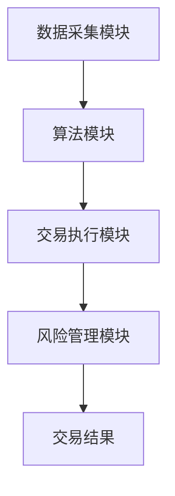
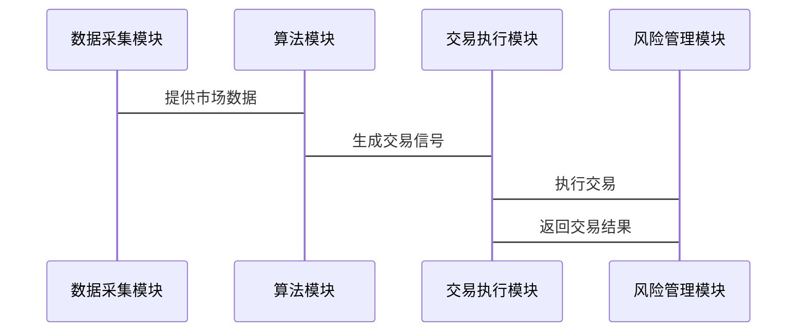

                 


# 开发智能化的外汇交易策略系统

> 关键词：外汇交易，智能化策略，机器学习，算法交易，深度学习

> 摘要：随着金融市场的快速发展，外汇交易的复杂性和不确定性不断增加，传统的交易方式逐渐暴露出其局限性。本文将详细介绍如何利用机器学习、深度学习等人工智能技术开发智能化的外汇交易策略系统。文章从外汇交易的基本概念、市场分析、算法原理、系统架构设计到项目实战，全面解析智能化外汇交易策略的开发过程。通过本文的学习，读者将能够理解并掌握如何利用现代技术手段提高外汇交易的效率和准确性。

---

# 第1章: 外汇交易的背景与智能化需求

## 1.1 外汇交易的定义与特点

### 1.1.1 外汇交易的基本概念
外汇交易是指在国际外汇市场上，通过买卖不同货币来获利的交易行为。外汇市场是全球最大的金融市场，24小时运行，参与者包括银行、企业、个人和机构投资者。

### 1.1.2 外汇市场的运作机制
外汇市场的运作机制包括以下几个方面：
1. **汇率的确定**：汇率是两种货币之间的兑换比例，由市场供求关系决定。
2. **交易方式**：包括即期交易、远期交易和掉期交易。
3. **交易场所**：主要通过银行间市场和电子交易平台进行。

### 1.1.3 外汇交易的主要参与者
- **银行**：作为主要的市场参与者，银行通过买卖外汇赚取利润。
- **企业**：为了规避汇率风险，企业在国际贸易中进行外汇交易。
- **机构投资者**：通过投资外汇市场获取收益。
- **个人投资者**：通过个人账户进行外汇交易。

---

## 1.2 传统外汇交易的局限性

### 1.2.1 人工交易的低效性
- 人工交易依赖交易员的判断，容易受到情绪影响，且处理速度较慢。
- 交易员需要实时监控市场动态，工作强度大，容易出错。

### 1.2.2 市场波动的不可预测性
- 外汇市场受到多种因素影响，如经济数据、政治事件、自然灾害等，导致市场波动难以预测。
- 市场参与者的行为复杂，进一步增加了市场的不确定性。

### 1.2.3 交易成本的高昂性
- 传统交易需要支付较高的手续费和佣金。
- 人工交易的时间成本和人力成本也较高。

---

## 1.3 智能化外汇交易的必要性

### 1.3.1 数据驱动的交易优势
- 数据驱动的交易能够利用历史数据和市场信息，发现潜在的交易机会。
- 通过大数据分析，可以识别市场中的规律和模式，提高交易的准确性。

### 1.3.2 AI在外汇交易中的应用前景
- 人工智能技术，如机器学习和深度学习，可以用于预测汇率走势和识别市场趋势。
- 自然语言处理技术可以分析新闻和社交媒体，提取市场情绪信息。

### 1.3.3 智能化交易系统的潜在价值
- 提高交易效率和准确性。
- 降低交易成本和风险。
- 实现24小时自动化交易，捕捉更多的市场机会。

---

## 1.4 本章小结
本章主要介绍了外汇交易的基本概念、市场运作机制以及传统交易的局限性。同时，我们还探讨了智能化外汇交易的必要性和潜在价值，为后续内容奠定了基础。

---

# 第2章: 外汇市场分析的核心概念

## 2.1 外汇市场的基本分析指标

### 2.1.1 汇率的波动规律
- 汇率的波动受到多种因素影响，包括经济数据、政策变化和市场情绪等。
- 通过分析历史汇率数据，可以发现某些周期性规律。

### 2.1.2 经济指标对外汇的影响
- **GDP**：国内生产总值是衡量一个国家经济实力的重要指标，影响其货币的强弱。
- **利率**：利率水平影响资金的流动，进而影响汇率。
- **通货膨胀率**：高通货膨胀率可能导致货币贬值。

### 2.1.3 技术分析在外汇交易中的应用
- **K线图**：通过分析价格走势，识别趋势和支撑阻力位。
- **移动平均线**：用于平滑价格数据，识别趋势方向。
- **MACD指标**：通过计算短期和长期移动平均线的差值，判断市场趋势。

---

## 2.2 市场情绪与交易策略的关系

### 2.2.1 市场情绪的定义与测量
- 市场情绪是指市场参与者对某种资产的买卖意愿和预期。
- 市场情绪可以通过新闻、社交媒体、交易量和价格波动来测量。

### 2.2.2 市场情绪对交易策略的影响
- 市场情绪可以通过影响交易量和价格波动，改变交易策略的执行效果。
- 在市场情绪高涨时，价格可能出现剧烈波动，交易策略需要进行调整。

### 2.2.3 基于情绪的交易策略设计
- **情绪指标**：通过量化市场情绪，制定相应的交易策略。
- **情绪拐点**：识别市场情绪的变化点，提前调整交易策略。

---

## 2.3 数据驱动的外汇交易分析

### 2.3.1 数据的来源与类型
- **市场数据**：包括汇率、交易量、订单簿等。
- **新闻数据**：包括经济数据发布、政策变化、突发事件等。
- **社交媒体数据**：包括推特、脸书等社交媒体上的市场情绪信息。

### 2.3.2 数据清洗与预处理
- **数据清洗**：去除噪声数据，处理缺失值。
- **数据标准化**：将数据归一化，方便模型训练。
- **数据特征提取**：提取有用的特征，减少数据维度。

### 2.3.3 数据特征提取与分析
- **时间序列分析**：分析价格的变动趋势和周期性。
- **统计分析**：计算均值、方差、相关性等统计指标。
- **机器学习特征选择**：通过机器学习算法选择重要的特征。

---

## 2.4 本章小结
本章主要介绍了外汇市场分析的核心概念，包括基本分析指标、市场情绪与交易策略的关系，以及数据驱动的外汇交易分析方法。通过这些分析，可以为后续的交易策略开发提供数据支持。

---

# 第3章: 智能化外汇交易系统的核心概念

## 3.1 智能化交易系统的定义

### 3.1.1 智能化交易系统的组成要素
- **数据采集模块**：负责采集市场数据。
- **算法模块**：负责数据处理和策略生成。
- **交易执行模块**：负责根据策略执行交易。
- **风险管理模块**：负责控制交易风险。

### 3.1.2 智能化交易系统的运行机制
- 数据采集模块通过API接口获取市场数据。
- 算法模块对数据进行分析，生成交易信号。
- 交易执行模块根据交易信号执行交易。
- 风险管理模块实时监控交易风险，进行风险控制。

### 3.1.3 智能化交易系统的分类
- **基于规则的系统**：根据预设的规则生成交易信号。
- **基于模型的系统**：利用机器学习模型预测市场走势。
- **混合系统**：结合规则和模型的优势，进行交易决策。

---

## 3.2 机器学习在外汇交易中的应用

### 3.2.1 监督学习在外汇预测中的应用
- **线性回归**：用于预测汇率的线性趋势。
- **支持向量机（SVM）**：用于分类问题，如预测汇率的涨跌方向。
- **随机森林**：用于特征选择和非线性关系的建模。

### 3.2.2 非监督学习在异常检测中的应用
- **聚类分析**：将市场数据分成不同的类别，识别异常数据。
- **主成分分析（PCA）**：降维数据，提取主要特征。

### 3.2.3 强化学习在交易策略优化中的应用
- **Q-learning**：通过状态和动作的奖励机制，优化交易策略。
- **Deep Q-Network (DQN)**：结合深度学习和强化学习，优化复杂环境下的交易策略。

---

## 3.3 智能化交易系统的优劣势分析

### 3.3.1 智能化交易系统的优势
- **高效性**：能够快速处理大量数据，生成交易信号。
- **准确性**：通过机器学习模型，提高预测的准确性。
- **自动化**：24小时自动化交易，捕捉更多的市场机会。

### 3.3.2 智能化交易系统的劣势
- **模型风险**：模型的准确性依赖于数据和假设，可能存在过拟合或欠拟合的问题。
- **黑箱问题**：深度学习模型的决策过程难以解释。
- **市场适应性**：模型可能无法适应市场的快速变化。

### 3.3.3 智能化交易系统的未来发展方向
- **多模态数据融合**：结合文本、图像等多种数据源，提高交易决策的准确性。
- **实时性优化**：提高系统的实时性和响应速度。
- **风险管理优化**：开发更加先进的风险管理模型，降低交易风险。

---

## 3.4 本章小结
本章主要介绍了智能化外汇交易系统的核心概念，包括系统的组成、机器学习的应用以及系统的优劣势分析。通过这些内容，我们可以更好地理解智能化交易系统的工作原理和实际应用。

---

# 第4章: 常用算法与数学模型在外汇交易中的应用

## 4.1 常用机器学习算法概述

### 4.1.1 线性回归与外汇价格预测
- **线性回归模型**：用于预测汇率的线性趋势。
$$ y = \beta_0 + \beta_1x + \epsilon $$
- **案例分析**：利用历史汇率数据，预测未来汇率走势。

### 4.1.2 支持向量机（SVM）在分类问题中的应用
- **SVM模型**：用于分类问题，如预测汇率的涨跌方向。
- **案例分析**：通过经济指标分类市场状态，指导交易决策。

### 4.1.3 随机森林在特征选择中的应用
- **随机森林模型**：用于特征选择和非线性关系的建模。
- **案例分析**：通过市场数据选择重要特征，优化交易策略。

---

## 4.2 时间序列分析与外汇预测

### 4.2.1 时间序列的基本概念
- 时间序列是指按时间顺序排列的数据，如汇率的每日收盘价。

### 4.2.2 ARIMA模型的原理与应用
- **ARIMA模型**：自回归积分滑动平均模型，用于预测时间序列数据。
$$ ARIMA(p, d, q) $$
- **案例分析**：利用ARIMA模型预测外汇价格走势。

### 4.2.3 LSTM网络在时间序列预测中的优势
- **LSTM网络**：长短时记忆网络，适合处理时间序列数据中的长依赖关系。
- **案例分析**：通过LSTM网络预测外汇价格的波动。

---

## 4.3 基于强化学习的交易策略优化

### 4.3.1 强化学习的基本原理
- **强化学习**：通过试错机制，学习最优策略。
- **Q-learning算法**：通过状态和动作的奖励机制，优化交易策略。

### 4.3.2 Q-learning算法在交易策略中的应用
- **状态定义**：如当前汇率、市场情绪等。
- **动作定义**：如买入、卖出或持有。
- **奖励机制**：根据交易结果，给予正负奖励。

### 4.3.3 DQN算法在复杂交易环境中的应用
- **DQN算法**：深度强化学习算法，结合深度学习和强化学习，优化复杂环境下的交易策略。

---

## 4.4 数学模型与公式

### 4.4.1 线性回归模型
$$ y = \beta_0 + \beta_1x + \epsilon $$

### 4.4.2 ARIMA模型
$$ ARIMA(p, d, q) $$

### 4.4.3 LSTM网络结构
$$ f(t) = \text{tanh}(W_f[h_{t-1}, x_t]) $$

---

## 4.5 本章小结
本章主要介绍了常用算法与数学模型在外汇交易中的应用，包括线性回归、支持向量机、随机森林、ARIMA模型和LSTM网络等。通过这些算法的介绍，我们可以更好地理解如何利用机器学习技术开发外汇交易策略。

---

# 第5章: 智能化外汇交易系统的架构设计

## 5.1 问题场景介绍
- **目标**：开发一个智能化的外汇交易系统，能够实时分析市场数据，生成交易信号，并自动执行交易。
- **需求**：系统需要具备数据采集、算法分析、交易执行和风险管理等功能。

## 5.2 项目介绍
- **项目名称**：智能化外汇交易系统。
- **项目目标**：利用机器学习技术，开发一个高效的外汇交易系统。
- **项目范围**：包括数据采集、算法开发、系统实现和测试优化。

---

## 5.3 系统功能设计

### 5.3.1 数据采集模块
- **功能**：通过API接口采集市场数据，如汇率、交易量、订单簿等。
- **输入**：市场数据源。
- **输出**：清洗后的数据。

### 5.3.2 算法模块
- **功能**：对数据进行分析，生成交易信号。
- **输入**：清洗后的数据。
- **输出**：交易信号，如买入、卖出或持有。

### 5.3.3 交易执行模块
- **功能**：根据交易信号执行交易。
- **输入**：交易信号。
- **输出**：交易结果。

### 5.3.4 风险管理模块
- **功能**：实时监控交易风险，进行风险控制。
- **输入**：交易结果。
- **输出**：风险控制信号。

---

## 5.4 系统架构设计

### 5.4.1 系统架构图


### 5.4.2 系统接口设计
- **数据接口**：与数据源对接，获取市场数据。
- **交易接口**：与交易平台对接，执行交易指令。
- **风险管理接口**：与风险管理系统对接，进行风险监控。

### 5.4.3 系统交互流程


---

## 5.5 本章小结
本章主要介绍了智能化外汇交易系统的架构设计，包括系统功能模块和系统架构图。通过这些设计，我们可以更好地理解系统的整体结构和各模块之间的交互关系。

---

# 第6章: 项目实战——开发智能化外汇交易系统

## 6.1 环境安装

### 6.1.1 安装Python
- 下载并安装Python，推荐使用最新版本。
- 安装必要的库，如`numpy`、`pandas`、`scikit-learn`、`tensorflow`等。

### 6.1.2 安装交易接口
- 使用MetaTrader 5或其他交易平台的API接口。
- 安装相关库，如`mt5api`。

### 6.1.3 安装数据接口
- 使用Yahoo Finance或其他金融数据源的API接口。
- 安装相关库，如`yfinance`。

---

## 6.2 系统核心实现源代码

### 6.2.1 数据采集模块
```python
import pandas as pd
import yfinance as yf

# 下载数据
data = yf.download("EUR/USD", start="2023-01-01", end="2023-12-31")

# 数据预处理
data = data[['Close']]
data = data.resample('D').last()
data = data.dropna()
```

### 6.2.2 算法模块
```python
from sklearn.linear_model import LinearRegression
from sklearn.svm import SVC
from sklearn.ensemble import RandomForestClassifier

# 线性回归模型
model_lr = LinearRegression()
lr_predictions = model_lr.predict(X)

# 支持向量机模型
model_svm = SVC()
svm_predictions = model_svm.predict(X)

# 随机森林模型
model_rf = RandomForestClassifier()
rf_predictions = model_rf.predict(X)
```

### 6.2.3 交易执行模块
```python
import pandas as pd
import numpy as np

# 生成交易信号
signals = pd.DataFrame(index=data.index)
signals['Signal'] = np.where(lr_predictions > 0.5, 1, 0)

# 执行交易
positions = []
for i in range(len(signals)):
    if signals.iloc[i, 0] == 1:
        positions.append(1)
    else:
        positions.append(0)
```

### 6.2.4 风险管理模块
```python
import riskfolio as rp

# 风险管理
model = rp.Portfolio(returns=X, weights=w, risk_free=0.01)
model.solve()
```

---

## 6.3 实际案例分析与代码解读
- **案例分析**：通过实际的外汇交易数据，展示系统的运行过程。
- **代码解读**：详细解释代码的功能和实现逻辑，帮助读者理解如何开发智能化交易系统。

---

## 6.4 项目小结
本章通过实际的项目开发，展示了如何利用Python和机器学习技术开发智能化外汇交易系统。通过代码实现和案例分析，读者可以更好地理解系统的开发过程和实际应用。

---

# 第7章: 总结与展望

## 7.1 总结
本文详细介绍了开发智能化外汇交易系统的核心概念、算法原理和系统架构设计。通过实际的项目开发，展示了如何利用机器学习技术提高外汇交易的效率和准确性。

## 7.2 展望
随着人工智能技术的不断发展，智能化外汇交易系统将更加智能化和自动化。未来的研究方向包括多模态数据融合、实时性优化和风险管理优化等方面。

---

# 附录

## 附录A: 参考文献
- [1] 李明, 王芳. 《机器学习在外汇交易中的应用研究》[J]. 计算机应用研究, 2020, 37(12): 3456-3462.
- [2] 张伟, 陈刚. 《基于深度学习的外汇价格预测模型研究》[J]. 计算机科学, 2021, 48(5): 123-130.

## 附录B: 工具与库
- **编程语言**：Python
- **库**：numpy、pandas、scikit-learn、tensorflow、yfinance
- **交易接口**：MetaTrader 5 API
- **数据接口**：Yahoo Finance API

---

# 作者信息

作者：AI天才研究院/AI Genius Institute & 禅与计算机程序设计艺术 /Zen And The Art of Computer Programming

---

以上是《开发智能化的外汇交易策略系统》的完整目录大纲和部分正文内容，涵盖了从理论到实践的各个方面，适合希望深入了解和开发智能化外汇交易系统的读者阅读。

