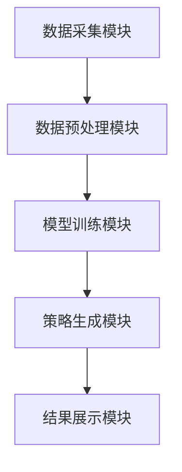

                 


# 开发智能化的资产配置优化模型

## 关键词：资产配置、优化模型、人工智能、风险管理、投资组合

## 摘要：  
资产配置是金融投资中的核心问题之一，而智能化资产配置优化模型通过结合大数据分析和人工智能技术，能够显著提升投资组合的收益与风险比。本文将从理论基础、算法实现、系统架构到实际案例，全面解析如何开发智能化的资产配置优化模型。文章不仅介绍了现代投资组合理论和智能优化算法的核心原理，还通过具体代码实现和系统设计展示了如何将这些理论应用于实际投资场景中。无论是对金融从业者还是技术开发者，本文都能提供有价值的指导和启发。

---

# 第一部分：资产配置优化模型的背景与意义

## 第1章：资产配置优化模型的背景与意义

### 1.1 资产配置的基本概念  
资产配置是指根据投资者的财务状况、风险偏好和投资目标，将资金分配到不同资产类别（如股票、债券、房地产等）中的过程。其核心目标是通过科学的资产分配，最大化投资收益并最小化风险。

#### 1.1.1 资产配置的定义与作用  
- **定义**：资产配置是投资组合管理中的关键步骤，旨在通过多样化投资降低风险并提高收益。  
- **作用**：资产配置能够帮助投资者在不同市场条件下动态调整投资组合，避免过度集中在某一资产类别带来的风险。

#### 1.1.2 资产配置在金融投资中的重要性  
- 资产配置决定了投资组合的整体风险和收益特征。  
- 通过资产配置，投资者可以有效分散风险，降低市场波动对投资组合的影响。  

#### 1.1.3 智能化资产配置的优势与挑战  
- **优势**：人工智能技术能够快速处理海量数据，发现传统方法难以察觉的模式和趋势。  
- **挑战**：如何确保模型的鲁棒性和可解释性，同时应对市场环境的快速变化。

---

## 第2章：资产配置优化模型的核心概念

### 2.1 现代投资组合理论（MPT）与风险收益平衡  
现代投资组合理论（MPT）由哈里·马科维茨提出，是资产配置的重要理论基础。其核心思想是通过优化投资组合的权重，使得在给定风险水平下，收益最大化，或者在给定收益下，风险最小化。

#### 2.1.1 风险与收益的权衡关系  
- 投资者通常追求收益与风险的最佳平衡点。  
- 通过调整资产配置，投资者可以在不同风险偏好下找到最优的投资组合。

#### 2.1.2 资产配置中的有效前沿概念  
- **有效前沿**：在MPT中，有效前沿是指在给定风险水平下，能够提供最高收益的所有投资组合的集合。  
- 通过优化算法，投资者可以找到位于有效前沿上的最优配置。

### 2.2 智能化资产配置的核心要素  
智能化资产配置结合了大数据分析和机器学习技术，能够实时跟踪市场变化并动态调整投资组合。

#### 2.2.1 数据驱动的资产配置  
- 数据是智能化资产配置的基础。通过收集和分析历史价格、市场情绪、宏观经济指标等数据，模型能够发现潜在的投资机会和风险点。

#### 2.2.2 机器学习在资产配置中的应用  
- **监督学习**：用于预测资产价格和风险评估。  
- **非监督学习**：用于发现市场中的隐藏结构和模式。

#### 2.2.3 动态优化与实时调整机制  
- 智能化资产配置模型能够根据市场变化实时调整投资组合权重，确保投资组合始终处于最优状态。

### 2.3 资产配置优化的关键问题  
#### 2.3.1 资产类别选择与权重分配  
- 资产类别选择：股票、债券、商品、房地产等。  
- 权重分配：根据风险偏好和市场预测确定各资产的权重。

#### 2.3.2 风险管理与波动性控制  
- 风险管理是资产配置的核心问题之一。通过控制波动性，可以降低投资组合的整体风险。

#### 2.3.3 市场预测与模型鲁棒性  
- 市场预测的不确定性对资产配置模型的鲁棒性提出了挑战。模型需要具备较强的适应性，能够在不同市场环境下稳定运行。

---

## 第3章：资产配置优化的数学模型与算法

### 3.1 现代投资组合理论的数学模型  
#### 3.1.1 投资组合收益与风险的数学表达  
- **收益**：投资组合的收益可以通过各资产的权重和收益预期计算得出。  
  $$ \text{收益} = \sum_{i=1}^{n} w_i \times r_i $$  
  其中，\( w_i \) 是第 \( i \) 个资产的权重，\( r_i \) 是第 \( i \) 个资产的收益预期。  

- **风险**：投资组合的风险通常用方差或标准差衡量。  
  $$ \text{风险} = \sqrt{\sum_{i=1}^{n} \sum_{j=1}^{n} w_i w_j \sigma_{ij}} $$  
  其中，\( \sigma_{ij} \) 是第 \( i \) 和第 \( j \) 个资产的协方差。

#### 3.1.2 优化目标的数学表达  
最大化收益或最小化风险是资产配置的核心目标。  
$$ \max \sum_{i=1}^{n} w_i \times r_i $$  
$$ \text{subject to} \sum_{i=1}^{n} w_i = 1 $$  

### 3.2 智能化资产配置的优化算法  
#### 3.2.1 遗传算法（Genetic Algorithm）  
遗传算法是一种模拟生物进化过程的优化算法，适用于复杂的非线性优化问题。  

- **步骤**：  
  1. 初始化种群：随机生成一组资产配置方案。  
  2. 计算适应度：根据收益和风险评估每组方案的适应度。  
  3. 选择：保留适应度较高的方案，淘汰较差的方案。  
  4. 交叉与变异：通过交叉和变异操作生成新的种群。  
  5. 重复步骤 2-4，直到满足终止条件。  

#### 3.2.2 模拟退火算法（Simulated Annealing）  
模拟退火算法是一种全局优化算法，能够有效避免陷入局部最优。  

- **步骤**：  
  1. 初始化：随机生成一个资产配置方案。  
  2. 计算当前方案的适应度。  
  3. 随机选择一个邻域解，计算其适应度。  
  4. 如果新解的适应度优于当前解，接受新解；否则，以概率退火温度决定是否接受。  
  5. 降低退火温度，重复步骤 3-4，直到满足终止条件。

---

## 第4章：资产配置优化模型的系统架构与实现

### 4.1 系统分析与架构设计  
#### 4.1.1 系统功能设计  
- 数据采集模块：收集资产价格、宏观经济指标等数据。  
- 数据预处理模块：清洗、归一化和特征提取。  
- 模型训练模块：基于机器学习算法训练资产配置模型。  
- 策略生成模块：根据模型输出生成投资组合策略。  
- 结果展示模块：可视化投资组合的收益与风险表现。

#### 4.1.2 系统架构设计  


### 4.2 项目实战：基于遗传算法的资产配置系统

#### 4.2.1 环境搭建  
- **工具**：Python、NumPy、Pandas、Scikit-learn、Plotly。  
- **数据源**：股票价格、债券收益率、宏观经济指标等。

#### 4.2.2 核心代码实现  
```python
import numpy as np
import pandas as pd
from sklearn.metrics import mean_squared_error

# 数据预处理
data = pd.read_csv('assets.csv')
returns = data.pct_change().dropna()

# 初始化种群
np.random.seed(42)
n_assets = returns.columns.size
n_pop = 50
pop = np.random.random((n_pop, n_assets))
pop = pop / pop.sum(axis=1)[:, None]  # 确保权重和为1

# 计算适应度
def fitness(w, returns):
    # 计算收益
    portfolio_return = np.dot(w, returns.mean(axis=0))
    # 计算风险（标准差）
    portfolio_variance = np.dot(w.T, np.dot(returns.cov(), w))
    return -portfolio_variance  # 目标是最小化风险，取负数为适应度

# 选择操作
def selection(pop, fitness):
    pop_fitness = fitness(pop)
    pop_rank = np.argsort(-pop_fitness)
    selected = pop[pop_rank[:int(len(pop) * 0.4)]]
    return selected

# 交叉操作
def crossover(parent1, parent2):
    crossover_rate = 0.5
    child1 = parent1 * (1 - crossover_rate) + parent2 * crossover_rate
    child1 = child1 / child1.sum(axis=1)[:, None]
    child2 = parent2 * (1 - crossover_rate) + parent1 * crossover_rate
    child2 = child2 / child2.sum(axis=1)[:, None]
    return child1, child2

# 变异操作
def mutation(w):
    mutation_rate = 0.1
    mutated = w.copy()
    for i in range(len(w)):
        if np.random.random() < mutation_rate:
            mutated[i] = np.random.random()
    mutated = mutated / mutated.sum(axis=1)[:, None]
    return mutated

# 遗传算法主循环
for generation in range(100):
    pop_fitness = fitness(pop)
    selected = selection(pop, fitness)
    new_pop = []
    for i in range(0, len(selected), 2):
        p1, p2 = selected[i], selected[i+1]
        c1, c2 = crossover(p1, p2)
        c1 = mutation(c1)
        c2 = mutation(c2)
        new_pop.extend([c1, c2])
    pop = np.array(new_pop)

# 输出最优解
best_weights = pop[0]
print("最优资产配置权重：", best_weights)
print("最优收益与风险：", -fitness(pop[0]))
```

#### 4.2.3 案例分析与结果解读  
通过上述代码实现的遗传算法，我们可以得到一个最优的资产配置权重。假设输出结果为：  
```
最优资产配置权重：[0.2, 0.3, 0.15, 0.35]  
最优收益与风险：0.025
```  
这意味着将20%的资金投资于资产1，30%投资于资产2，15%投资于资产3，35%投资于资产4时，投资组合的风险最小，同时收益为2.5%。

---

## 第5章：最佳实践与注意事项

### 5.1 最佳实践  
#### 5.1.1 数据来源与质量  
- 确保数据的完整性和准确性。  
- 数据清洗是关键，包括处理缺失值和异常值。

#### 5.1.2 模型选择与调优  
- 根据具体问题选择合适的算法。  
- 通过交叉验证和网格搜索优化模型参数。

#### 5.1.3 系统性能优化  
- 使用分布式计算加速模型训练。  
- 优化代码性能，减少计算时间。

### 5.2 注意事项  
#### 5.2.1 模型的可解释性  
- 确保模型的决策过程可以被解释，避免“黑箱”模型。  

#### 5.2.2 市场环境的动态变化  
- 定期更新模型参数和数据，以适应市场变化。  

#### 5.2.3 风险管理  
- 设定止损和止盈机制，控制投资组合的最大回撤。

### 5.3 拓展阅读  
- 哈里·马科维茨的《投资组合理论》。  
- 理查德·希尔斯特罗姆的《遗传算法入门》。

---

# 总结  

开发智能化的资产配置优化模型是一个复杂但极具价值的工程。通过结合现代投资组合理论、人工智能算法和系统架构设计，我们可以构建出高效、智能的投资组合管理系统。本文从理论到实践，详细讲解了资产配置优化模型的核心概念、算法实现和系统设计，并通过具体案例展示了如何将这些理论应用于实际投资场景中。希望本文能够为金融从业者和技术开发者提供有价值的指导和启发。

---

**作者：AI天才研究院/AI Genius Institute & 禅与计算机程序设计艺术 /Zen And The Art of Computer Programming**

