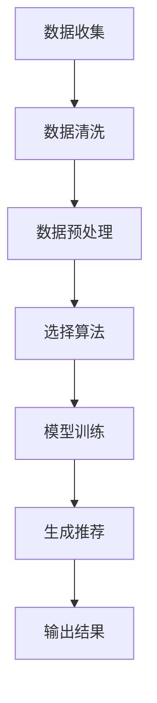
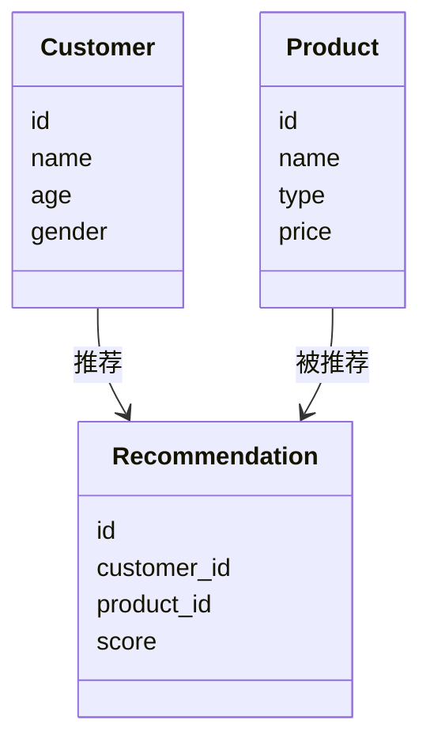
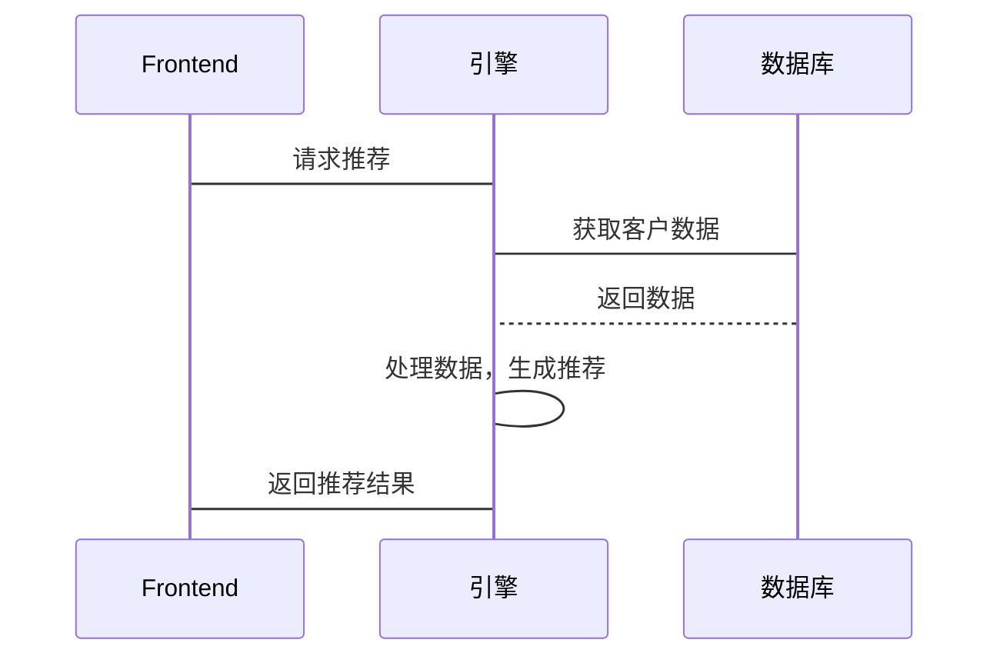

                 


# 开发智能化的金融产品交叉销售推荐引擎

> 关键词：交叉销售推荐引擎、人工智能、金融产品、推荐系统、深度学习、协同过滤

> 摘要：本文详细探讨了开发智能化金融产品交叉销售推荐引擎的各个方面，包括背景、核心概念、算法原理、系统架构、项目实战、最佳实践等。文章从理论到实践，全面解析了如何利用人工智能技术提升金融产品的交叉销售效率和客户体验。

---

## 第一部分：背景介绍

### 第1章：背景介绍

#### 1.1 问题背景

##### 1.1.1 金融产品交叉销售的定义

金融产品交叉销售是指在同一客户购买多个金融产品的情况下，向客户推荐与当前产品相关联的其他产品，以提高客户满意度和销售效率。这种销售策略可以帮助金融机构挖掘客户的潜在需求，提升客户忠诚度和收入来源。

##### 1.1.2 当前金融行业中的销售痛点

- **低效的传统销售方式**：传统的交叉销售依赖于人工推荐，效率低且容易出错。
- **客户需求多样化**：客户对金融产品的需求日益多样化，人工推荐难以覆盖所有可能性。
- **数据孤岛问题**：金融机构内部数据分散，难以充分利用数据来支持推荐决策。
- **市场竞争加剧**：竞争对手的智能化推荐系统逐渐普及，传统销售方式难以维持竞争优势。

##### 1.1.3 交叉销售的重要性与价值

- **提高客户满意度**：通过推荐相关产品，客户感受到个性化的服务，提升满意度。
- **增加收入来源**：交叉销售可以带来更多的产品销售，增加机构收入。
- **提升客户忠诚度**：通过精准推荐，增强客户对机构的信任和忠诚度。
- **降低销售成本**：智能化推荐引擎可以降低人工成本，提高销售效率。

#### 1.2 问题描述

##### 1.2.1 传统交叉销售的局限性

传统交叉销售主要依赖于人工经验和有限的产品知识，难以覆盖所有可能的客户需求，推荐结果往往不够精准，客户体验差。

##### 1.2.2 数据驱动的交叉销售需求

随着大数据和人工智能技术的发展，金融机构可以通过分析客户行为、偏好和历史数据，实现精准推荐，提高销售效率和客户满意度。

##### 1.2.3 人工智能在金融销售中的应用潜力

人工智能技术，如机器学习、深度学习和自然语言处理，可以为金融产品推荐提供更精准、个性化的解决方案，提升交叉销售的效果。

#### 1.3 问题解决

##### 1.3.1 智能化推荐引擎的目标

智能化金融产品交叉销售推荐引擎的目标是通过分析客户数据、市场趋势和产品特征，生成个性化的产品推荐，提高销售效率和客户满意度。

##### 1.3.2 引擎的核心功能与作用

- **数据收集与处理**：收集和整理客户数据、交易记录和市场数据。
- **模型训练**：基于数据训练推荐模型，预测客户需求。
- **个性化推荐**：根据模型输出结果，生成个性化的产品推荐。
- **实时反馈与优化**：根据客户反馈实时优化推荐策略，提高推荐准确性。

##### 1.3.3 引擎如何解决实际问题

通过智能化推荐引擎，金融机构可以快速、准确地向客户推荐相关产品，避免了传统销售中的低效和错误，提升了客户体验和销售效率。

#### 1.4 边界与外延

##### 1.4.1 引擎的适用范围

智能化推荐引擎适用于银行、证券、保险等金融行业的交叉销售场景，帮助机构提高销售效率和客户满意度。

##### 1.4.2 与其他系统的边界划分

- **数据来源**：推荐引擎的数据来自客户管理系统（如CRM）、交易系统和市场数据系统。
- **接口交互**：引擎通过API与其他系统（如前端界面、客户数据库）进行交互。
- **输出结果**：引擎生成推荐结果，供前端展示或进一步处理。

##### 1.4.3 功能的扩展与延伸

智能化推荐引擎可以扩展到更多领域，如风险管理、客户服务和产品定价，进一步提升金融机构的综合竞争力。

#### 1.5 概念结构与核心要素

##### 1.5.1 引擎的组成要素

- **数据源**：客户数据、交易记录、市场数据。
- **推荐算法**：协同过滤、深度学习模型、自然语言处理技术。
- **推荐策略**：基于规则的推荐、基于模型的推荐、混合推荐。
- **反馈机制**：实时反馈、用户评价、效果评估。

##### 1.5.2 各要素之间的关系

通过数据源获取客户信息，利用推荐算法分析数据，生成推荐结果，通过推荐策略优化推荐效果，并根据反馈机制实时调整推荐策略。

##### 1.5.3 核心要素的详细描述

- **数据源**：包括客户的基本信息、交易记录、市场趋势等，是推荐引擎的基础。
- **推荐算法**：基于数据源的分析，生成推荐结果，是引擎的核心部分。
- **推荐策略**：根据算法输出结果，优化推荐效果，提升客户满意度。
- **反馈机制**：实时收集客户反馈，调整推荐策略，确保推荐结果的准确性。

---

## 第二部分：核心概念与联系

### 第2章：核心概念与联系

#### 2.1 引擎原理

##### 2.1.1 数据处理流程

1. **数据收集**：从各种数据源（如CRM系统、交易系统）收集客户数据。
2. **数据清洗**：去除无效数据，处理缺失值和异常值。
3. **数据预处理**：进行数据归一化、特征提取等处理，为模型训练做准备。

##### 2.1.2 模型训练过程

1. **特征工程**：提取客户特征、产品特征和市场特征。
2. **选择算法**：根据需求选择合适的推荐算法（如协同过滤、深度学习模型）。
3. **模型训练**：利用训练数据训练推荐模型，生成推荐结果。

##### 2.1.3 推荐策略

1. **基于规则的推荐**：根据业务规则生成推荐，如推荐同类产品。
2. **基于模型的推荐**：根据模型输出结果生成推荐，如协同过滤推荐。
3. **混合推荐**：结合规则和模型结果生成推荐，提高推荐准确性和多样性。

#### 2.2 概念属性特征对比

| 概念        | 属性                | 特征描述                                   |
|-------------|---------------------|------------------------------------------|
| 数据源       | 类型                | 结构化数据、非结构化数据                 |
|             | 来源                | 客户数据、交易记录、市场数据             |
| 推荐算法     | 类型                | 协同过滤、深度学习、自然语言处理         |
|             | 优缺点              | 协同过滤简单易懂，深度学习效果好但复杂 |

#### 2.3 ER实体关系图

```mermaid
erDiagram
    customer[CUSTOMER] {
        id : integer
        name : string
        age : integer
        gender : string
    }
    product[PRODUCT] {
        id : integer
        name : string
        type : string
        price : float
    }
    recommendation[RECOMMENDATION] {
        id : integer
        customer_id : integer
        product_id : integer
        score : float
    }
    customer --> recommendation : 推荐
    product --> recommendation : 被推荐
```

---

## 第三部分：算法原理讲解

### 第3章：算法原理讲解

#### 3.1 协同过滤算法

##### 使用Mermaid流程图展示算法流程



##### Python代码实现示例

```python
import numpy as np
from sklearn.metrics.pairwise import cosine_similarity

# 示例数据：客户-产品评分矩阵
X = np.array([
    [4, 3, 0],
    [5, 1, 0],
    [1, 4, 0],
    [2, 2, 0],
    [3, 1, 0],
])

# 计算余弦相似度
similarity = cosine_similarity(X)

# 推荐算法：基于用户的协同过滤
def recommend_user(userId, similarity):
    # 找到与当前用户相似性最高的用户
    similar_user = np.argmax(similarity[userId])
    return similar_user

# 示例推荐
userId = 0
recommended_user = recommend_user(userId, similarity)
print(f"推荐用户{userId}的相似用户是：{recommended_user}")
```

##### 数学模型和公式

协同过滤的数学模型基于相似性计算，常用的相似性指标有余弦相似度和Jaccard相似度。余弦相似度公式如下：

$$
\cos(\theta) = \frac{\sum_{i=1}^{n} x_i y_i}{\sqrt{\sum_{i=1}^{n} x_i^2} \cdot \sqrt{\sum_{i=1}^{n} y_i^2}}
$$

---

### 第4章：数学模型和公式

#### 4.1 协同过滤的数学模型

协同过滤的数学模型基于相似性计算，常用的相似性指标有余弦相似度和Jaccard相似度。余弦相似度公式如下：

$$
\cos(\theta) = \frac{\sum_{i=1}^{n} x_i y_i}{\sqrt{\sum_{i=1}^{n} x_i^2} \cdot \sqrt{\sum_{i=1}^{n} y_i^2}}
$$

其中，$x_i$ 和 $y_i$ 分别是两个用户的评分。

---

## 第四部分：系统分析与架构设计

### 第5章：系统分析与架构设计

#### 5.1 问题场景介绍

交叉销售推荐引擎的目标是通过分析客户数据，生成个性化的产品推荐，提升销售效率和客户满意度。系统需要处理大量的数据，并实时生成推荐结果。

#### 5.2 系统功能设计

##### 5.2.1 领域模型设计



##### 5.2.2 系统架构设计

```mermaid
rectangle 数据库 {
    客户表
    产品表
    推荐表
}
rectangle 推荐引擎 {
    数据处理模块
    模型训练模块
    推荐生成模块
}
rectangle 前端界面 {
    用户界面
    推荐展示
}
```

##### 5.2.3 接口设计

推荐引擎通过API与前端和数据库交互。前端发送请求，引擎处理数据并返回推荐结果。

##### 5.2.4 交互流程设计



---

## 第五部分：项目实战

### 第6章：项目实战

#### 6.1 环境安装

推荐引擎需要以下环境：

- Python 3.6+
- NumPy
- Scikit-learn
- TensorFlow（可选）
- Jupyter Notebook（可选）

安装命令：

```bash
pip install numpy scikit-learn
```

#### 6.2 核心代码实现

##### 6.2.1 数据处理模块

```python
import pandas as pd
import numpy as np

# 示例数据
data = {
    'customer_id': [1, 2, 3, 4, 5],
    'product_id': [101, 102, 103, 104, 105],
    'score': [4, 5, 3, 2, 4]
}

df = pd.DataFrame(data)
```

##### 6.2.2 模型训练模块

```python
from sklearn.metrics.pairwise import cosine_similarity

# 计算相似度矩阵
similarity_matrix = cosine_similarity(df['score'].values.reshape(-1, 1))
```

##### 6.2.3 推荐生成模块

```python
def generate_recommendations(customer_id, similarity_matrix):
    # 获取当前客户的相似客户索引
    similar_indices = np.argsort(similarity_matrix[customer_id])[::-1]
    recommendations = []
    for idx in similar_indices:
        if idx != customer_id:
            recommendations.append(idx)
            if len(recommendations) == 5:
                break
    return recommendations

# 示例推荐
customer_id = 0
recommendations = generate_recommendations(customer_id, similarity_matrix)
print(f"推荐客户{customer_id}的相似客户是：{recommendations}")
```

#### 6.3 案例分析

假设我们有一个银行客户，我们需要推荐与他相关的金融产品。通过分析他的交易记录和市场数据，推荐引擎生成了一系列相关产品，如基金、保险和贷款产品。

---

## 第六部分：最佳实践、小结与展望

### 第7章：最佳实践

#### 7.1 小结

智能化金融产品交叉销售推荐引擎通过分析客户数据和市场趋势，生成个性化的产品推荐，提升销售效率和客户满意度。推荐引擎的核心在于算法的选择和模型的优化。

#### 7.2 注意事项

- **数据隐私**：确保客户数据的安全和隐私。
- **模型优化**：定期优化推荐算法，提高推荐准确性。
- **实时反馈**：及时收集客户反馈，调整推荐策略。

#### 7.3 未来趋势

随着人工智能和大数据技术的发展，推荐引擎将更加智能化和个性化。未来，推荐引擎可能会结合区块链技术，确保数据的安全性和透明性。

#### 7.4 拓展阅读

- 《推荐系统实践》
- 《深度学习在推荐系统中的应用》

---

## 第七部分：总结

### 第8章：总结

智能化金融产品交叉销售推荐引擎是人工智能技术在金融领域的典型应用之一。通过分析客户数据和市场趋势，引擎可以帮助金融机构提高销售效率和客户满意度。未来，随着技术的不断发展，推荐引擎将更加智能化和个性化，为金融行业带来更多的创新和机遇。

---

## 作者信息

作者：AI天才研究院/AI Genius Institute & 禅与计算机程序设计艺术 /Zen And The Art of Computer Programming

---

这篇文章详细探讨了开发智能化金融产品交叉销售推荐引擎的各个方面，从背景介绍到系统架构设计，再到项目实战，为读者提供了全面的知识和实践指导。希望这篇文章能够帮助读者深入了解如何利用人工智能技术提升金融产品的交叉销售效率和客户体验。

