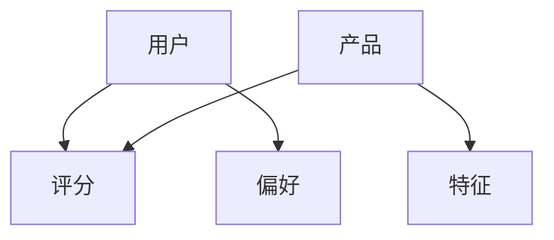
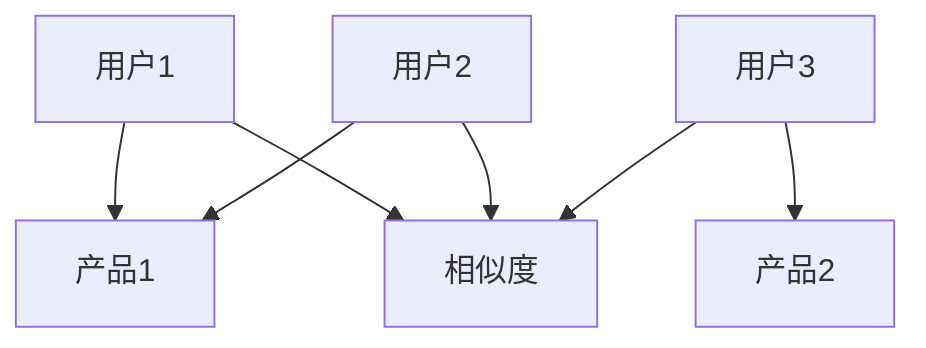
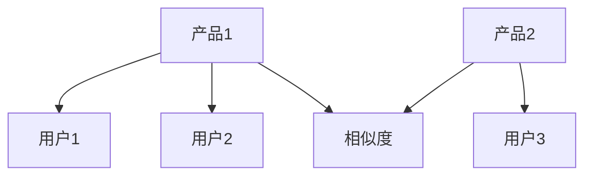
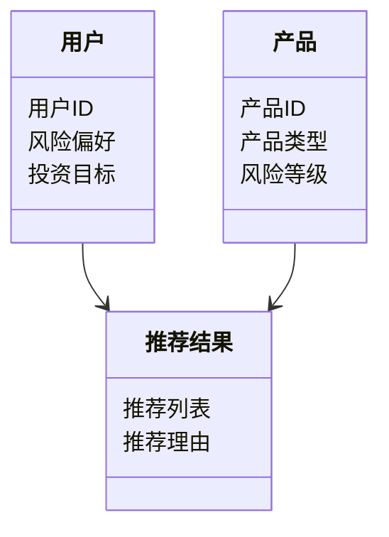
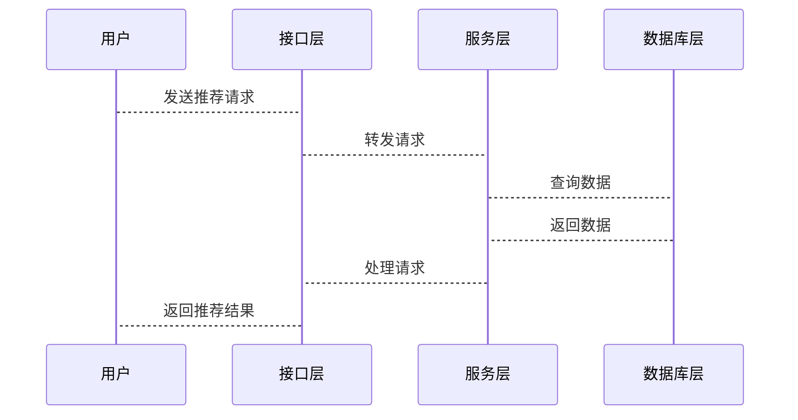

                 


# 开发智能化的金融产品推荐个性化引擎

## 关键词：金融推荐系统，个性化引擎，机器学习，协同过滤，深度学习

## 摘要：本文详细探讨了开发智能化金融产品推荐个性化引擎的核心技术与实现方案，涵盖背景分析、推荐算法、系统架构设计及项目实战等内容，旨在为读者提供从理论到实践的全面指导。

---

# 第1章: 背景介绍

## 1.1 问题背景

### 1.1.1 传统金融产品推荐的局限性
传统的金融产品推荐系统主要依赖于简单的规则或基于少量用户行为的统计分析，这种推荐方式存在以下问题：
- **缺乏个性化**：无法根据用户的特定需求和风险承受能力提供定制化推荐。
- **推荐准确性低**：难以捕捉用户深层次的需求和市场变化。
- **数据利用率低**：未充分挖掘多维度数据（如用户行为、市场波动、产品特征）的潜力。

### 1.1.2 数据驱动的个性化推荐需求
随着大数据和人工智能技术的快速发展，金融机构可以通过收集和分析海量数据，为用户提供更精准的推荐服务。这种数据驱动的推荐方式能够：
- **提升用户体验**：通过个性化推荐，满足用户的真实需求。
- **提高销售效率**：帮助金融机构更高效地匹配用户与产品。
- **降低风险**：通过分析用户行为和市场数据，减少不合适的产品推荐。

### 1.1.3 智能化推荐引擎的必要性
智能化推荐引擎通过结合机器学习和深度学习技术，能够实时分析用户行为、市场动态和产品特性，从而实现动态、精准的推荐。这不仅提高了推荐的准确性，还能帮助金融机构在竞争激烈的市场中占据优势。

## 1.2 问题描述

### 1.2.1 用户需求分析
用户在选择金融产品时，通常会考虑以下因素：
- **风险承受能力**：用户对投资风险的偏好程度。
- **投资目标**：用户的投资目标（如短期收益、长期增值）。
- **历史行为**：用户的交易记录、浏览行为等。

### 1.2.2 产品特征分析
金融产品的推荐需要考虑以下特征：
- **产品类型**：如股票、基金、债券等。
- **风险等级**：如低风险、中风险、高风险。
- **历史表现**：如收益率、波动性等。

### 1.2.3 推荐系统的目标与挑战
推荐系统的最终目标是为用户提供最优的产品组合，同时确保推荐的准确性和实时性。主要挑战包括：
- **数据稀疏性**：用户数据和产品数据的稀疏性可能导致推荐准确性下降。
- **实时性要求**：金融市场波动频繁，推荐系统需要快速响应。
- **模型泛化能力**：模型需要在不同市场条件下保持稳定表现。

## 1.3 问题解决

### 1.3.1 数据采集与处理方案
- **数据来源**：整合用户行为数据、市场数据和产品数据。
- **数据清洗**：去除噪声数据，处理缺失值。
- **数据预处理**：标准化、归一化处理，确保模型输入的规范性。

### 1.3.2 算法选择与优化策略
- **算法选择**：根据数据特点选择合适的推荐算法（如协同过滤、深度学习模型）。
- **模型优化**：通过参数调优、特征工程等方法提升模型性能。

### 1.3.3 系统架构设计思路
- **模块化设计**：将系统划分为数据采集、特征提取、模型训练、推荐生成等模块。
- **分布式架构**：采用分布式计算框架（如Spark）处理海量数据。

## 1.4 系统边界与外延

### 1.4.1 系统输入与输出定义
- **输入**：用户信息（如风险偏好）、产品信息（如类型、风险等级）、市场数据（如波动率）。
- **输出**：个性化推荐列表、推荐理由。

### 1.4.2 系统功能的边界划分
- **核心功能**：数据处理、模型训练、推荐生成。
- **非核心功能**：用户界面展示、结果解释。

### 1.4.3 系统与外部系统的交互
- **用户交互**：通过API接收用户请求。
- **外部数据源**：与第三方数据供应商接口对接。

## 1.5 核心概念与组成

### 1.5.1 用户画像构建
用户画像是基于用户行为数据和特征数据构建的用户信息模型，主要包括：
- **基本属性**：年龄、性别、职业。
- **风险偏好**：保守型、稳健型、进取型。
- **投资目标**：短期、中期、长期。

### 1.5.2 产品特征提取
产品特征提取是通过分析产品属性和市场表现，提取可用于推荐的关键特征，包括：
- **产品类型**：股票、基金、债券。
- **风险等级**：低、中、高。
- **历史表现**：收益率、波动率。

### 1.5.3 推荐策略生成
推荐策略生成是根据用户画像和产品特征，生成个性化推荐列表的过程，主要步骤包括：
- **特征匹配**：基于用户特征和产品特征进行匹配。
- **评分预测**：预测用户对产品的兴趣评分。
- **排序与筛选**：根据评分和用户偏好进行排序和筛选。

---

# 第2章: 核心概念与联系

## 2.1 推荐系统类型对比

### 2.1.1 基于协同过滤的推荐
- **基于用户的协同过滤**：通过寻找与目标用户相似的用户群体，推荐这些用户喜欢的产品。
- **基于物品的协同过滤**：通过分析产品之间的相似性，推荐与用户已感兴趣的产品相似的产品。

### 2.1.2 基于内容的推荐
- **内容特征提取**：通过文本挖掘、NLP等技术提取产品描述中的特征。
- **相似度计算**：基于内容特征计算产品间的相似度，推荐相似的产品。

### 2.1.3 混合推荐模型
- **混合推荐**：结合协同过滤和基于内容的推荐，利用两者的优势，提高推荐的准确性和多样性。

## 2.2 核心概念对比表格

| 推荐类型       | 基于协同过滤         | 基于内容         | 混合推荐         |
|----------------|---------------------|-----------------|-----------------|
| 描述           | 用户相似性           | 内容特征         | 综合两者         |
| 优缺点         | 高准确性，计算复杂   | 易扩展，准确性低 | 高准确性和扩展性 |
| 应用场景       | 用户行为数据丰富     | 产品描述详细     | 综合场景         |

## 2.3 实体关系图



---

# 第3章: 推荐算法原理

## 3.1 协同过滤算法

### 3.1.1 基于用户的协同过滤



#### 算法步骤：
1. **计算用户相似度**：使用余弦相似度或Jaccard相似度计算用户之间的相似度。
2. **生成推荐列表**：根据相似用户的评分，加权生成目标用户的推荐评分。

#### 代码示例：
```python
import numpy as np

# 示例数据：用户-产品评分矩阵
user_item_matrix = np.array([[4, 3, 0],
                              [2, 0, 4],
                              [3, 1, 0]])

# 计算用户1和用户2的余弦相似度
user1_ratings = user_item_matrix[0]
user2_ratings = user_item_matrix[1]
similarity = np.dot(user1_ratings, user2_ratings) / (np.linalg.norm(user1_ratings) * np.linalg.norm(user2_ratings))
print(f"用户相似度：{similarity}")
```

#### 数学模型：
$$ \text{相似度} = \frac{\sum_{i} u_i v_i}{\sqrt{\sum_{i} u_i^2} \cdot \sqrt{\sum_{i} v_i^2}} $$

### 3.1.2 基于物品的协同过滤



#### 算法步骤：
1. **计算产品相似度**：基于产品的评分数据，计算产品之间的相似度。
2. **生成推荐列表**：根据目标用户的历史评分和产品相似度，预测目标用户对其他产品的评分。

#### 代码示例：
```python
# 示例数据：产品-用户评分矩阵
item_user_matrix = np.array([[4, 2, 3],
                              [3, 0, 1],
                              [0, 4, 2]])

# 计算产品1和产品2的余弦相似度
product1_ratings = item_user_matrix[0]
product2_ratings = item_user_matrix[1]
similarity = np.dot(product1_ratings, product2_ratings) / (np.linalg.norm(product1_ratings) * np.linalg.norm(product2_ratings))
print(f"产品相似度：{similarity}")
```

#### 数学模型：
$$ \text{相似度} = \frac{\sum_{i} u_i v_i}{\sqrt{\sum_{i} u_i^2} \cdot \sqrt{\sum_{i} v_i^2}} $$

## 3.2 深度学习模型

### 3.2.1 矩阵分解

#### 模型描述：
矩阵分解是一种常用的方法，通过将用户-产品评分矩阵分解为用户特征矩阵和产品特征矩阵，来预测评分。

#### 算法步骤：
1. **初始化特征矩阵**：随机初始化用户特征矩阵和产品特征矩阵。
2. **计算预测评分**：基于矩阵乘法计算预测评分。
3. **计算损失函数**：使用平方损失函数或交叉熵损失函数。
4. **更新特征矩阵**：通过梯度下降优化特征矩阵。

#### 代码示例：
```python
import tensorflow as tf

# 示例数据：用户数为3，产品数为3
n_users = 3
n_items = 3
n_factors = 2

# 初始化用户和产品的特征矩阵
user_factors = tf.Variable(tf.random.normal([n_users, n_factors]))
item_factors = tf.Variable(tf.random.normal([n_items, n_factors]))

# 计算预测评分
predicted_ratings = tf.matmul(user_factors, item_factors, transpose_b=True)

# 定义损失函数
loss = tf.reduce_mean(tf.square(predicted_ratings - user_item_matrix))

# 定义优化器
optimizer = tf.optimizers.Adam()
```

#### 数学模型：
$$ \text{预测评分} = U \cdot V^T $$

### 3.2.2 神经网络模型

#### 模型描述：
神经网络模型通过多层感知机（MLP）结构，提取用户和产品的高阶特征，生成推荐评分。

#### 算法步骤：
1. **特征提取**：将用户和产品特征输入神经网络，提取深层特征。
2. **评分预测**：输出层生成评分预测。

#### 代码示例：
```python
# 定义神经网络模型
model = tf.keras.Sequential([
    tf.keras.layers.Dense(64, activation='relu'),
    tf.keras.layers.Dense(1, activation='sigmoid')
])

# 编译模型
model.compile(optimizer='adam', loss='binary_crossentropy', metrics=['accuracy'])
```

#### 数学模型：
$$ \text{预测评分} = \sigma(W_1 x + b_1) $$

---

# 第4章: 系统分析与架构设计

## 4.1 问题场景介绍

### 4.1.1 系统目标
- 实现智能化金融产品推荐。
- 提供个性化推荐服务。
- 支持实时推荐和历史数据分析。

### 4.1.2 项目介绍
本项目旨在开发一个智能化的金融产品推荐系统，通过机器学习算法，为用户提供个性化的产品推荐。

## 4.2 系统功能设计

### 4.2.1 领域模型



## 4.3 系统架构设计

### 4.3.1 分层架构


### 4.3.2 系统交互流程



## 4.4 系统接口设计

### 4.4.1 接口定义
- **输入接口**：用户ID、产品ID。
- **输出接口**：推荐列表、推荐理由。

### 4.4.2 交互流程
1. 用户发送推荐请求。
2. 系统查询用户信息和产品信息。
3. 系统生成推荐结果。
4. 系统返回推荐结果。

---

# 第5章: 项目实战

## 5.1 环境安装

### 5.1.1 安装Python
```bash
python --version
```

### 5.1.2 安装依赖
```bash
pip install numpy pandas scikit-learn tensorflow
```

## 5.2 系统核心实现

### 5.2.1 数据预处理
```python
import pandas as pd

# 加载数据
data = pd.read_csv('financial_products.csv')

# 数据清洗
data.dropna()
```

### 5.2.2 模型训练
```python
from sklearn.model_selection import train_test_split
from sklearn.metrics import accuracy_score

# 划分训练集和测试集
X_train, X_test, y_train, y_test = train_test_split(data.drop('label', axis=1), data['label'], test_size=0.2)

# 训练模型
model.fit(X_train, y_train)
```

### 5.2.3 推荐生成
```python
# 预测推荐
y_pred = model.predict(X_test)
print(f"准确率：{accuracy_score(y_test, y_pred)}")
```

## 5.3 代码实现解读

### 5.3.1 数据预处理
```python
import pandas as pd

def preprocess_data(data):
    # 处理缺失值
    data = data.dropna()
    # 标准化处理
    from sklearn.preprocessing import StandardScaler
    scaler = StandardScaler()
    data_scaled = scaler.fit_transform(data)
    return data_scaled
```

### 5.3.2 模型训练
```python
from sklearn.neighbors import NearestNeighbors

def train_model(data):
    model = NearestNeighbors(n_neighbors=5)
    model.fit(data)
    return model
```

## 5.4 案例分析

### 5.4.1 数据准备
```python
# 示例数据
data = pd.DataFrame({
    '用户ID': [1, 2, 3],
    '产品ID': [101, 102, 103],
    '评分': [4, 3, 5]
})
```

### 5.4.2 模型训练
```python
model = train_model(preprocess_data(data))
```

### 5.4.3 推荐生成
```python
# 预测推荐
distances, indices = model.kneighbors(data[['评分']], n_neighbors=5)
print(f"最近邻索引：{indices}")
```

---

# 第6章: 总结与展望

## 6.1 项目总结
本项目通过结合机器学习和深度学习技术，开发了一个智能化的金融产品推荐系统，实现了个性化推荐功能，提高了推荐的准确性和实时性。

## 6.2 未来展望
未来，推荐系统可以进一步优化算法，结合实时数据流处理技术，提升推荐的实时性和准确性。同时，可以探索更复杂的模型，如图神经网络，以捕捉更多的关联信息。

---

# 作者：AI天才研究院/AI Genius Institute & 禅与计算机程序设计艺术 /Zen And The Art of Computer Programming

---

这篇博客文章详细探讨了开发智能化金融产品推荐个性化引擎的核心技术与实现方案，涵盖了背景分析、推荐算法、系统架构设计及项目实战等内容，为读者提供了从理论到实践的全面指导。通过结合协同过滤和深度学习模型，文章展示了如何构建一个高效、准确的推荐系统，为金融机构提供强有力的技术支持。

