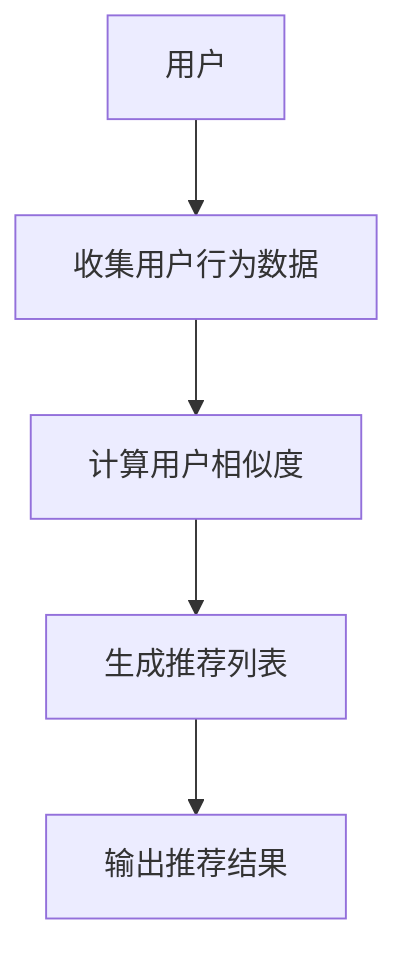
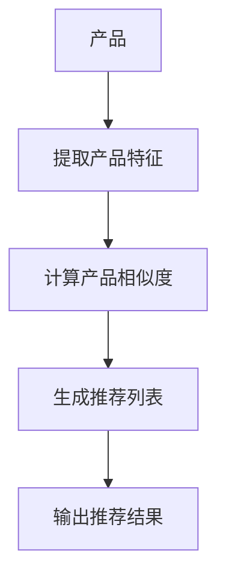
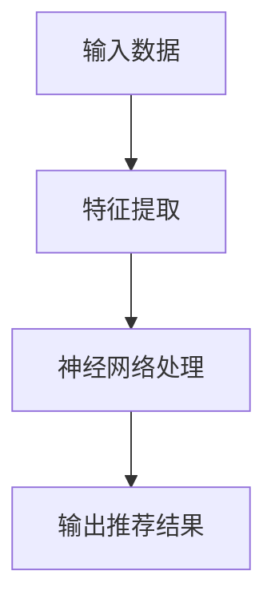
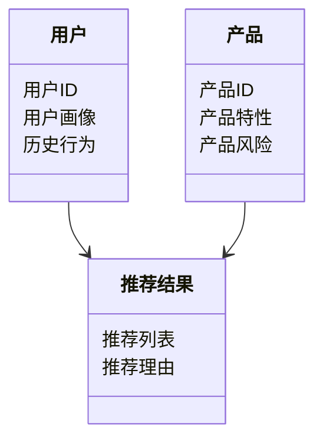
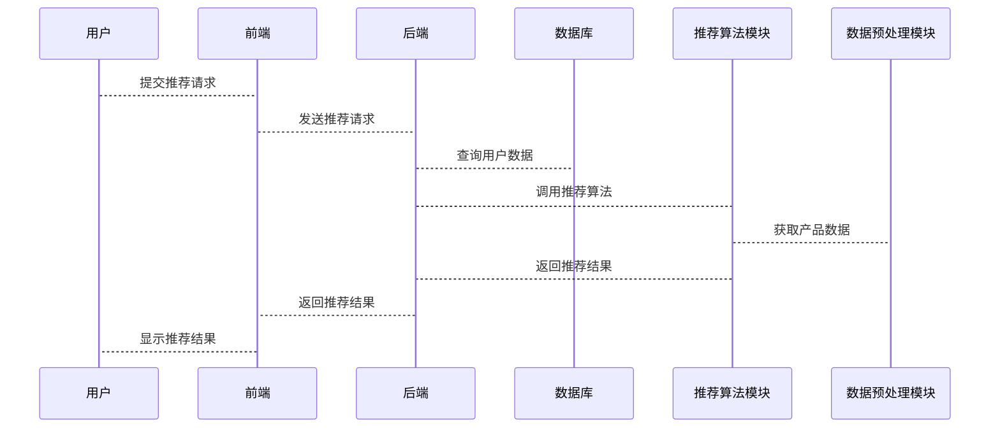

                 


# 开发智能化的金融产品推荐引擎

> 关键词：智能化推荐引擎、金融产品推荐、人工智能算法、系统架构设计、推荐系统、用户行为分析

> 摘要：本文深入探讨了开发智能化金融产品推荐引擎的关键技术与实现方法。从背景与核心概念出发，结合具体算法原理与系统架构设计，通过项目实战与案例分析，详细阐述了如何构建一个高效、智能且个性化的金融产品推荐系统。文章内容涵盖从理论到实践的各个方面，旨在为读者提供一个系统化的开发指南。

---

# 第1章: 金融产品推荐引擎的背景与核心概念

## 1.1 问题背景

### 1.1.1 传统金融产品推荐的局限性
传统的金融产品推荐主要依赖人工经验或简单的规则匹配，存在以下问题：
- **推荐结果的片面性**：难以全面考虑用户的复杂需求和市场变化。
- **效率低下**：面对海量金融产品和用户，人工推荐难以覆盖所有场景。
- **缺乏个性化**：无法根据用户实时行为和市场动态进行调整。

### 1.1.2 人工智能在金融领域的应用趋势
人工智能技术的快速发展为金融行业的智能化转型提供了强大支持：
- **数据处理能力**：能够高效处理海量金融数据。
- **实时分析能力**：支持实时市场动态和用户行为分析。
- **个性化推荐能力**：通过深度学习和自然语言处理技术实现精准推荐。

### 1.1.3 智能化推荐引擎的必要性
智能化推荐引擎能够帮助金融机构：
- 提高客户满意度。
- 增加产品销售转化率。
- 提升市场竞争力。

## 1.2 问题描述

### 1.2.1 金融产品推荐的核心目标
金融产品推荐引擎的核心目标是：
- 根据用户需求和市场动态，推荐最合适的金融产品。
- 提供个性化、实时化的推荐服务。

### 1.2.2 用户需求与产品特性的匹配问题
用户需求与金融产品特性之间的匹配问题主要体现在：
- **需求多样性**：用户需求复杂且多样化，难以简单匹配。
- **产品特性复杂性**：金融产品具有风险、收益、流动性等多种特性。

### 1.2.3 市场环境的动态变化对推荐的影响
市场环境的动态变化对推荐的影响包括：
- **市场波动**：金融市场的波动会影响推荐结果。
- **政策变化**：政策调整会改变金融产品的合规性。

## 1.3 问题解决

### 1.3.1 智能化推荐引擎的解决方案
智能化推荐引擎的解决方案包括：
- **数据驱动**：通过数据分析提取用户需求和产品特性。
- **模型驱动**：利用机器学习模型进行推荐。

### 1.3.2 数据驱动与模型驱动的结合
数据驱动与模型驱动的结合方式包括：
- **数据预处理**：清洗和整合多源数据。
- **特征提取**：提取关键特征用于模型训练。
- **模型优化**：通过反馈机制优化推荐结果。

### 1.3.3 实时性和个性化推荐的实现
实现实时性和个性化推荐的关键点：
- **实时数据处理**：采用流数据处理技术。
- **动态调整推荐策略**：根据实时数据动态调整推荐结果。

## 1.4 边界与外延

### 1.4.1 推荐引擎的边界
推荐引擎的边界包括：
- **输入数据**：用户行为数据、产品数据。
- **输出结果**：推荐列表和推荐理由。
- **外部系统**：与用户交互系统、产品管理系统接口。

### 1.4.2 与其他金融系统的接口关系
推荐引擎与其他金融系统的接口关系包括：
- **用户交互系统**：接收用户输入，输出推荐结果。
- **产品管理系统**：获取产品信息，更新产品状态。

### 1.4.3 推荐引擎的可扩展性
推荐引擎的可扩展性体现在：
- **算法扩展**：支持多种推荐算法的接入。
- **数据扩展**：支持多种数据源的接入。
- **场景扩展**：支持多种金融场景的应用。

## 1.5 核心要素组成

### 1.5.1 数据源的整合
数据源的整合包括：
- **用户数据**：用户基本信息、历史行为数据。
- **产品数据**：产品基本信息、产品特性。
- **市场数据**：市场行情、政策信息。

### 1.5.2 推荐算法的选择
推荐算法的选择包括：
- **协同过滤**：基于用户行为的相似性推荐。
- **基于内容的推荐**：基于产品特性的推荐。
- **混合推荐**：结合协同过滤和内容推荐的优势。

### 1.5.3 系统架构的设计
系统架构的设计包括：
- **单体架构**：适用于小规模推荐系统。
- **微服务架构**：适用于大规模推荐系统。
- **分布式架构**：适用于高并发推荐系统。

---

# 第2章: 金融产品推荐引擎的核心概念与联系

## 2.1 核心概念原理

### 2.1.1 推荐系统的定义与分类
推荐系统的定义与分类：
- **协同过滤**：基于用户行为的推荐。
- **基于内容的推荐**：基于产品特性的推荐。
- **混合推荐**：结合协同过滤和内容推荐的推荐方式。

### 2.1.2 金融产品的特征分析
金融产品的特征分析包括：
- **产品类型**：股票、基金、债券等。
- **产品风险**：高风险、中风险、低风险。
- **产品收益**：固定收益、浮动收益。

### 2.1.3 用户行为分析与建模
用户行为分析与建模包括：
- **用户画像**：构建用户画像。
- **用户行为序列**：分析用户行为序列。
- **用户偏好**：挖掘用户偏好。

## 2.2 核心概念属性对比

### 2.2.1 不同推荐算法的对比表格
以下是几种推荐算法的对比表格：

| 算法类型     | 描述                     | 优缺点                   |
|--------------|--------------------------|--------------------------|
| 协同过滤     | 基于用户相似性推荐       | 优点：个性化推荐；缺点：计算复杂度高 |
| 基于内容的推荐 | 基于产品特性推荐         | 优点：稳定性高；缺点：难以处理用户偏好 |
| 深度学习模型  | 基于神经网络推荐         | 优点：高准确性；缺点：计算资源消耗大 |

### 2.2.2 算法性能指标的对比分析
以下是几种推荐算法的性能指标对比：

| 指标         | 协同过滤 | 基于内容的推荐 | 深度学习模型 |
|--------------|----------|----------------|-------------|
| 准确性       | 中       | 中             | 高           |
| 召回率       | 高       | 中             | 中           |
| 计算复杂度   | 高       | 低             | 高           |

### 2.2.3 数据特征与模型选择的关系
数据特征与模型选择的关系：
- **数据稀疏性**：数据稀疏时适合协同过滤。
- **数据规模**：数据规模大时适合深度学习模型。
- **数据类型**：数据类型多样时适合混合推荐。

## 2.3 ER实体关系图

以下是推荐引擎的ER实体关系图：

```mermaid
er
    actor: 用户
    product: 金融产品
    recommendation: 推荐关系
    actor -[1..n]-> recommendation
    product -[1..n]-> recommendation
    actor --> product
```

---

# 第3章: 推荐算法原理与实现

## 3.1 算法原理

### 3.1.1 协同过滤算法
协同过滤算法的原理：
- **基于用户的相似性**：通过计算用户之间的相似性，推荐相似用户喜欢的产品。
- **基于物品的相似性**：通过计算产品之间的相似性，推荐用户喜欢的相似产品。

### 3.1.2 基于内容的推荐
基于内容的推荐的原理：
- **特征提取**：提取产品的关键特征。
- **相似度计算**：计算产品之间的相似度，推荐相似产品。

### 3.1.3 深度学习模型
深度学习模型的原理：
- **神经网络结构**：构建多层神经网络。
- **特征学习**：通过神经网络学习高维特征。
- **推荐结果**：输出推荐结果。

## 3.2 算法流程图

### 3.2.1 协同过滤算法流程图



### 3.2.2 基于内容的推荐流程图



### 3.2.3 深度学习模型流程图



## 3.3 算法实现

### 3.3.1 协同过滤算法的Python代码实现

```python
def collaborative_filtering(user_id):
    # 数据预处理
    data = preprocess_data()
    # 计算用户相似度
    similarity = calculate_similarity(data, user_id)
    # 生成推荐列表
    recommendation = generate_recommendation(similarity, user_id)
    return recommendation
```

### 3.3.2 基于内容的推荐的Python代码实现

```python
def content_based_recommendation(product_id):
    # 数据预处理
    data = preprocess_data()
    # 提取产品特征
    features = extract_features(data, product_id)
    # 计算产品相似度
    similarity = calculate_similarity(features, product_id)
    # 生成推荐列表
    recommendation = generate_recommendation(similarity, product_id)
    return recommendation
```

### 3.3.3 深度学习模型的数学模型

深度学习模型的数学模型如下：

$$
y = f(x; \theta)
$$

其中，$x$是输入数据，$\theta$是模型参数，$f$是神经网络函数。

---

# 第4章: 系统分析与架构设计

## 4.1 系统分析

### 4.1.1 问题场景介绍
推荐引擎需要解决的问题：
- **数据处理**：如何高效处理海量数据。
- **模型训练**：如何训练高效的推荐模型。
- **实时推荐**：如何实现实时推荐。

### 4.1.2 项目介绍
项目目标：
- 开发一个智能化的金融产品推荐引擎。
- 实现个性化推荐和实时推荐。

## 4.2 系统功能设计

### 4.2.1 领域模型
以下是推荐引擎的领域模型：



### 4.2.2 系统架构设计
以下是推荐引擎的系统架构设计：

```mermaid
architectural
    前端 --> 后端
    后端 --> 数据库
    后端 --> 推荐算法模块
    推荐算法模块 --> 数据预处理模块
```

## 4.3 系统接口设计

### 4.3.1 接口描述
推荐引擎的主要接口包括：
- **用户输入接口**：接收用户输入。
- **产品数据接口**：获取产品数据。
- **推荐结果接口**：输出推荐结果。

### 4.3.2 接口协议
接口协议包括：
- **HTTP协议**：用于前后端交互。
- **RESTful API**：用于系统内部接口调用。

## 4.4 系统交互设计

### 4.4.1 交互流程图
以下是推荐引擎的系统交互流程图：



---

# 第5章: 项目实战

## 5.1 环境安装

### 5.1.1 Python环境
推荐使用的Python版本：Python 3.8及以上。

### 5.1.2 依赖库安装
需要安装的依赖库包括：
- **pandas**：数据处理。
- **numpy**：数值计算。
- **scikit-learn**：机器学习库。
- **tensorflow**：深度学习框架。

## 5.2 系统核心实现

### 5.2.1 数据预处理代码
以下是数据预处理代码：

```python
import pandas as pd
import numpy as np

def preprocess_data():
    # 读取数据
    data = pd.read_csv('data.csv')
    # 数据清洗
    data = data.dropna()
    # 数据转换
    data = data.astype('float32')
    return data
```

### 5.2.2 推荐算法实现代码
以下是协同过滤算法实现代码：

```python
from sklearn.metrics.pairwise import cosine_similarity

def collaborative_filtering(user_id):
    # 数据预处理
    data = preprocess_data()
    # 计算相似度
    similarity = cosine_similarity(data[user_id])
    # 生成推荐列表
    recommendation = get_recommendations(similarity, user_id)
    return recommendation
```

## 5.3 代码应用解读与分析

### 5.3.1 数据预处理解读
数据预处理的主要步骤：
- **数据清洗**：去除缺失值。
- **数据转换**：将数据转换为数值类型。

### 5.3.2 推荐算法实现解读
协同过滤算法实现的步骤：
- **计算相似度**：使用余弦相似度计算用户相似度。
- **生成推荐列表**：根据相似度排序，生成推荐列表。

## 5.4 实际案例分析

### 5.4.1 案例背景
假设我们有一个金融产品推荐系统，用户输入自己的需求，系统推荐合适的金融产品。

### 5.4.2 案例分析
- **用户输入**：用户A希望投资低风险产品。
- **系统推荐**：系统根据用户需求，推荐低风险产品。

### 5.4.3 推荐结果解读
推荐结果包括：
- **推荐列表**：低风险产品列表。
- **推荐理由**：产品风险、收益等信息。

## 5.5 项目小结

### 5.5.1 项目总结
项目实现了以下功能：
- 数据预处理。
- 推荐算法实现。
- 系统交互设计。

### 5.5.2 项目成果
项目成果包括：
- 可用的金融产品推荐系统。
- 可扩展的系统架构。

### 5.5.3 项目经验
项目经验包括：
- 数据处理的关键性。
- 算法选择的重要性。
- 系统架构的设计。

---

# 第6章: 最佳实践、小结与展望

## 6.1 最佳实践

### 6.1.1 数据处理的注意事项
数据处理的注意事项：
- **数据清洗**：确保数据质量。
- **数据转换**：选择合适的转换方式。

### 6.1.2 算法选择的建议
算法选择的建议：
- 根据数据特征选择算法。
- 根据计算资源选择算法。

### 6.1.3 系统架构设计的注意事项
系统架构设计的注意事项：
- **可扩展性**：设计可扩展的架构。
- **可维护性**：设计可维护的架构。

## 6.2 小结

### 6.2.1 核心知识点总结
核心知识点包括：
- 金融产品推荐引擎的背景与核心概念。
- 推荐算法原理与实现。
- 系统分析与架构设计。
- 项目实战。

### 6.2.2 项目经验总结
项目经验总结包括：
- 项目实施的关键点。
- 项目实施的难点。
- 项目实施的收获。

## 6.3 展望

### 6.3.1 未来发展方向
未来发展方向包括：
- 推荐算法的优化。
- 系统架构的优化。
- 新技术的应用。

### 6.3.2 未来技术趋势
未来技术趋势包括：
- **深度学习**：在推荐系统中的应用。
- **强化学习**：在推荐系统中的应用。
- **边缘计算**：在推荐系统中的应用。

---

# 作者：AI天才研究院/AI Genius Institute & 禅与计算机程序设计艺术/Zen And The Art of Computer Programming

