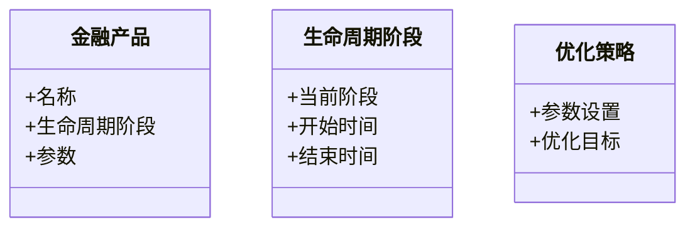

                 


# 开发智能化的金融产品生命周期管理与优化引擎

> 关键词：金融产品生命周期管理、优化引擎、强化学习、系统架构设计、智能化管理

> 摘要：本文详细探讨了开发智能化的金融产品生命周期管理与优化引擎的核心概念、算法原理、系统架构设计以及项目实战。通过分析金融产品管理的痛点，结合强化学习和遗传算法等人工智能技术，提出了一种智能化的优化引擎设计方案，并通过实际案例展示了该引擎的应用效果。本文还提供了系统的架构设计和接口设计，为读者提供了从理论到实践的全面指导。

---

# 第一章: 金融产品生命周期管理与优化引擎概述

## 1.1 问题背景与问题描述

### 1.1.1 传统金融产品管理的痛点
传统的金融产品管理过程中，存在以下痛点：
- **复杂性高**：金融产品种类繁多，生命周期各阶段涉及的业务流程复杂。
- **效率低下**：人工操作占主导，导致效率低且容易出错。
- **数据孤岛**：各部门之间的数据孤立，难以实现高效协同。
- **决策滞后**：依赖人工经验判断，缺乏实时数据支持，导致决策滞后。

### 1.1.2 优化引擎的作用
优化引擎通过智能化算法，能够实时分析海量数据，优化金融产品的生命周期管理，提升效率和准确性。

## 1.2 问题解决与边界定义

### 1.2.1 核心目标
优化引擎的核心目标包括：
- 实现金融产品生命周期的智能化管理。
- 提供实时优化建议，提升产品收益。
- 提高管理效率，降低人工成本。

### 1.2.2 边界与外延
- **边界**：优化引擎仅关注金融产品的生命周期管理和优化，不涉及产品设计和市场推广。
- **外延**：通过优化引擎，可以与其他系统（如CRM、ERP）进行数据交互。

## 1.3 系统架构与核心要素

### 1.3.1 核心要素
- 数据采集模块：负责收集金融市场数据、产品数据和用户反馈。
- 算法模块：包括强化学习和遗传算法，用于优化建议的生成。
- 执行模块：根据优化建议生成执行指令。

### 1.3.2 系统架构


---

# 第二章: 核心概念与联系

## 2.1 核心概念原理

### 2.1.1 业务流程
金融产品的生命周期包括：
1. 设计阶段：定义产品特性。
2. 发行阶段：产品上线。
3. 运营阶段：监控和优化。
4. 结束阶段：产品退市。

### 2.1.2 数据流
数据流包括：
- 市场数据：市场波动、用户行为。
- 产品数据：产品性能、风险指标。
- 用户反馈：用户满意度、投诉数据。

## 2.2 实体关系图


---

# 第三章: 算法原理与实现

## 3.1 强化学习算法

### 3.1.1 基本原理
强化学习通过智能体与环境的交互，学习最优策略。其数学模型如下：
$$ Q(s,a) = r + \gamma \max_{a'} Q(s',a') $$

### 3.1.2 应用
在优化引擎中，强化学习用于动态调整产品参数。

### 3.1.3 代码实现
```python
class Agent:
    def __init__(self, state_space, action_space):
        self.state_space = state_space
        self.action_space = action_space
        self.Q = defaultdict(int)
    
    def take_action(self, state):
        return np.random.choice(self.action_space)
```

## 3.2 遗传算法

### 3.2.1 基本原理
遗传算法模拟自然选择过程，包括选择、交叉和变异。

### 3.2.2 应用
用于优化产品组合。

### 3.2.3 代码实现
```python
def genetic_algorithm(population, fitness_fn, mutation_rate=0.1):
    for _ in range(100):
        population = select(population, fitness_fn)
        population = crossover(population)
        population = mutate(population, mutation_rate)
    return max(population, key=fitness_fn)
```

---

# 第四章: 系统分析与架构设计

## 4.1 领域模型设计

### 4.1.1 领域模型


## 4.2 系统架构设计

### 4.2.1 分层架构


---

# 第五章: 项目实战

## 5.1 环境安装

### 5.1.1 安装Python
```bash
python --version
pip install numpy
pip install gym
```

## 5.2 核心代码实现

### 5.2.1 强化学习实现
```python
import numpy as np

class Agent:
    def __init__(self, state_space, action_space):
        self.state_space = state_space
        self.action_space = action_space
        self.Q = defaultdict(int)
    
    def take_action(self, state):
        return np.random.choice(self.action_space)
```

## 5.3 案例分析
假设我们优化一个基金产品，通过强化学习调整其投资组合。

---

# 第六章: 最佳实践与小结

## 6.1 最佳实践
- 确保数据质量。
- 定期更新模型。

## 6.2 小结
智能化优化引擎能够显著提升金融产品管理的效率和准确性，但需要结合具体业务场景进行定制化开发。

## 6.3 注意事项
- 数据隐私保护。
- 算法的可解释性。

## 6.4 拓展阅读
推荐阅读《强化学习实战》和《金融工程入门》。

---

# 作者信息

作者：AI天才研究院/AI Genius Institute & 禅与计算机程序设计艺术 /Zen And The Art of Computer Programming

