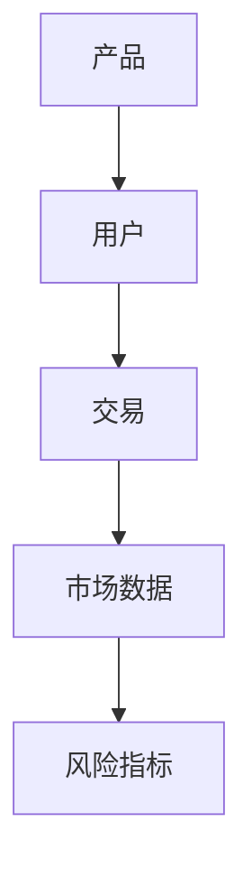
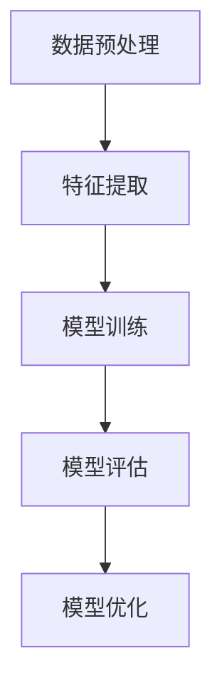
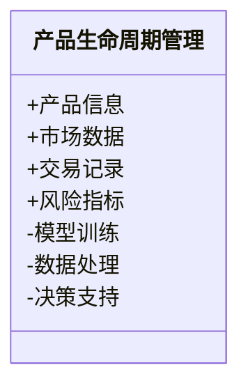
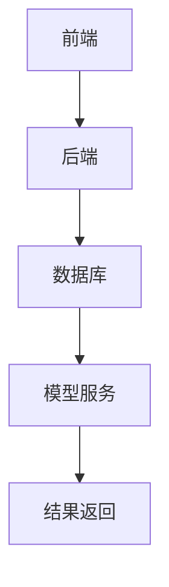
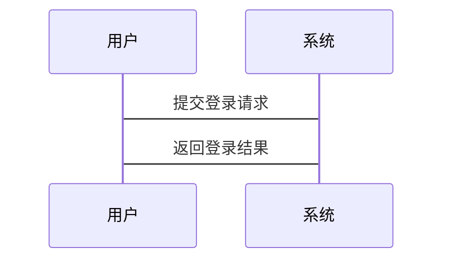
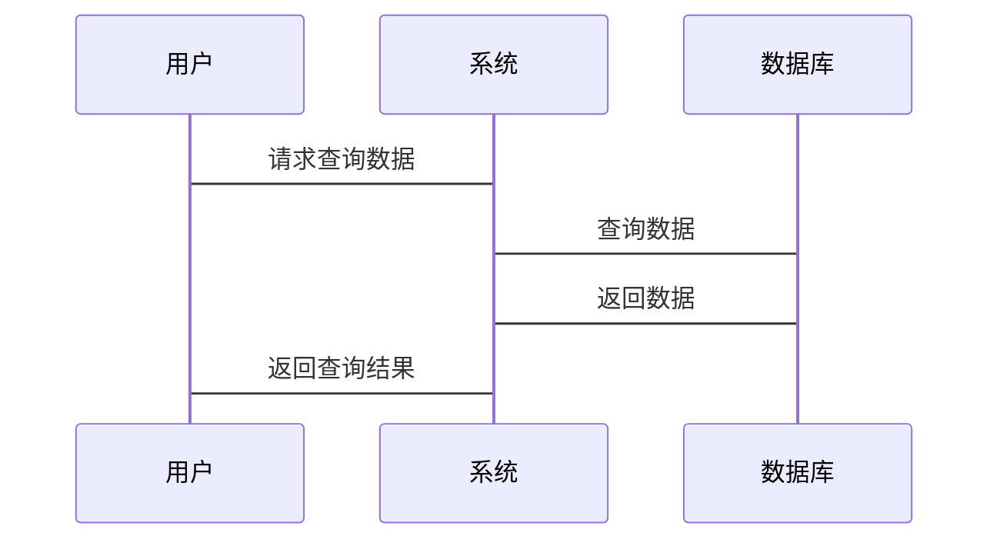

                 


# 开发智能化的金融产品生命周期管理与退市决策引擎

## 关键词：金融产品生命周期、退市决策、机器学习、风险管理、智能引擎

## 摘要：  
本文深入探讨了如何利用人工智能技术开发智能化的金融产品生命周期管理与退市决策引擎。通过分析金融产品的生命周期，结合机器学习算法，提出了一种基于数据驱动的退市决策方法，旨在提高金融产品管理的效率和准确性。文章详细介绍了核心概念、算法原理、系统架构设计以及实际应用案例，为金融行业智能化转型提供了理论和实践指导。

---

# 第一部分: 智能化金融产品生命周期管理与退市决策引擎概述

## 第1章: 金融产品生命周期管理与退市决策引擎的背景介绍

### 1.1 金融产品生命周期管理的概念与重要性

#### 1.1.1 金融产品的定义与分类  
金融产品是指金融机构提供给客户的各类金融服务或金融工具，包括但不限于股票、债券、基金、保险产品等。金融产品的生命周期从创建、发行、运作到终止，涉及多个阶段。  

#### 1.1.2 金融产品生命周期的阶段划分  
金融产品的生命周期可以分为以下几个阶段：  
1. **产品设计与开发**：确定产品目标、功能和风险特征。  
2. **产品发行与销售**：通过合规渠道向市场推广和销售。  
3. **产品运作与监控**：实时监控产品运行状态，评估风险。  
4. **产品终止与退市**：根据市场变化和风险评估，决定是否终止产品。  

#### 1.1.3 退市机制在金融产品管理中的作用  
退市机制是金融产品生命周期管理的重要环节，主要作用包括：  
- **风险控制**：及时终止不符合市场或监管要求的产品。  
- **资源优化**：避免资源浪费，集中精力发展优质产品。  
- **合规性**：确保产品符合监管要求，维护市场秩序。  

### 1.2 退市决策引擎的背景与意义

#### 1.2.1 退市机制的定义与作用  
退市机制是指根据一定的规则和标准，对不符合市场条件的金融产品进行终止的过程。其作用包括：  
- **维护市场秩序**：避免低质量产品对市场造成干扰。  
- **保护投资者利益**：及时淘汰不符合要求的产品，减少投资者损失。  
- **促进产品创新**：激励金融机构不断提升产品质量。  

#### 1.2.2 传统退市决策的局限性  
传统的退市决策主要依赖于人工判断和固定规则，存在以下问题：  
- **主观性**：决策过程受主观因素影响，可能导致不准确的结果。  
- **低效性**：人工处理大量数据耗时耗力，难以应对复杂市场环境。  
- **缺乏动态性**：无法及时捕捉市场变化和风险信号。  

#### 1.2.3 智能化退市决策引擎的优势  
智能化退市决策引擎通过引入人工智能技术，可以实现以下目标：  
- **数据驱动决策**：基于海量数据进行分析，提供客观、准确的决策支持。  
- **自动化与实时性**：快速处理数据，实时监控产品状态，及时发出退市预警。  
- **动态调整**：根据市场变化和新数据不断优化模型，提高决策的适应性。  

### 1.3 智能化金融产品管理的核心要素

#### 1.3.1 数据驱动的决策支持  
智能化管理依赖于高质量的数据输入，包括产品信息、市场数据、交易数据等。通过数据清洗、特征提取和数据分析，为决策提供支持。  

#### 1.3.2 机器学习在退市决策中的应用  
机器学习算法（如决策树、随机森林、支持向量机等）可以用于分析产品风险、预测市场趋势，从而辅助退市决策。  

#### 1.3.3 多维度风险评估与预警  
通过构建多维度的风险评估模型，可以对金融产品进行实时监控，及时发现潜在风险，发出退市预警。  

### 1.4 本章小结  
本章介绍了金融产品生命周期管理的背景和重要意义，分析了传统退市决策的局限性，并提出了智能化退市决策引擎的优势和核心要素。  

---

## 第2章: 智能化金融产品管理的核心概念与联系

### 2.1 智能化金融产品管理的核心原理  
智能化金融产品管理基于数据驱动和机器学习技术，通过分析产品生命周期中的各种数据，优化退市决策过程。  

#### 2.1.1 数据驱动的决策支持  
数据是智能化管理的基础，通过收集和分析产品相关的多维度数据，可以为决策提供有力支持。  

#### 2.1.2 机器学习在金融产品管理中的应用  
机器学习算法可以用于分类、回归和聚类等任务，帮助识别产品风险、预测市场趋势。  

#### 2.1.3 多维度风险评估与预警  
通过构建多维度的评估模型，可以对产品风险进行实时监控，并根据风险等级发出预警信号。  

### 2.2 核心概念对比分析  

#### 2.2.1 传统退市决策与智能化退市决策的对比  
| 对比维度 | 传统退市决策 | 智能化退市决策 |  
|----------|----------------|------------------|  
| 决策方式 | 基于固定规则和人工判断 | 基于机器学习和大数据分析 |  
| 处理效率 | 低效，耗时长 | 高效，自动化处理 |  
| 决策准确率 | 主观性强，准确率低 | 客观性高，准确率高 |  

#### 2.2.2 数据驱动与规则驱动的对比  
| 对比维度 | 数据驱动 | 规则驱动 |  
|----------|-----------|----------|  
| 决策依据 | 大数据分析和模式识别 | 固定规则和经验判断 |  
| 适应性 | 高，能够动态调整 | 低，难以应对变化 |  
| 精准度 | 高，基于大量数据 | 低，依赖经验规则 |  

#### 2.2.3 机器学习算法的优缺点对比  
| 算法 | 优点 | 缺点 |  
|------|------|------|  
| 决策树 | 易解释，适合分类任务 | 易受噪声影响，过拟合风险 |  
| 随机森林 | 高准确率，鲁棒性强 | 计算复杂度高 |  
| 支持向量机 | 高准确率，适合小数据集 | 不适合高维数据 |  

### 2.3 ER实体关系图  
以下是金融产品生命周期管理的实体关系图：  



---

## 第3章: 机器学习算法在退市决策中的应用

### 3.1 常用算法介绍  

#### 3.1.1 决策树算法  
决策树是一种树状结构，通过特征分裂来划分数据，最终形成分类或回归结果。  

#### 3.1.2 随机森林算法  
随机森林是通过集成多个决策树模型来提高准确率和鲁棒性的算法。  

#### 3.1.3 支持向量机算法  
支持向量机通过构建超平面将数据分为两类，适用于分类和回归任务。  

### 3.2 算法流程图  
以下是机器学习算法的通用流程图：  



### 3.3 代码实现与数学模型  

#### 3.3.1 数据预处理代码  
```python
import pandas as pd
data = pd.read_csv('financial_data.csv')
data = data.dropna()
```

#### 3.3.2 决策树模型  
```python
from sklearn.tree import DecisionTreeClassifier
model = DecisionTreeClassifier()
model.fit(X_train, y_train)
```

#### 3.3.3 模型评估公式  
分类准确率公式：  
$$ \text{准确率} = \frac{\text{正确预测的数量}}{\text{总样本数量}} $$  

回归问题中的均方误差公式：  
$$ \text{MSE} = \frac{1}{n}\sum_{i=1}^{n}(y_i - \hat{y}_i)^2 $$  

---

## 第4章: 系统分析与架构设计  

### 4.1 系统功能设计  

#### 4.1.1 领域模型类图  
以下是领域模型的类图：  



#### 4.1.2 系统架构设计  
以下是系统架构图：  



### 4.2 接口与交互设计  

#### 4.2.1 用户登录流程  


#### 4.2.2 数据查询流程  


---

## 第5章: 项目实战  

### 5.1 环境安装  
需要安装以下工具和库：  
- Python 3.x  
- Pandas、Scikit-learn、XGBoost等机器学习库  
- Jupyter Notebook 或 IDE  

### 5.2 核心代码实现  

#### 5.2.1 数据预处理  
```python
import pandas as pd
from sklearn.impute import SimpleImputer

data = pd.read_csv('financial_data.csv')
imputer = SimpleImputer(strategy='mean')
data_imputed = imputer.fit_transform(data)
```

#### 5.2.2 模型训练与评估  
```python
from sklearn.model_selection import train_test_split
from sklearn.ensemble import RandomForestClassifier
from sklearn.metrics import accuracy_score

X_train, X_test, y_train, y_test = train_test_split(data_imputed, target, test_size=0.2)
model = RandomForestClassifier()
model.fit(X_train, y_train)
y_pred = model.predict(X_test)
print("准确率:", accuracy_score(y_test, y_pred))
```

### 5.3 实际案例分析  
以某金融产品的退市决策为例，通过模型预测其退市概率，并根据预测结果制定相应的退市策略。  

### 5.4 项目小结  
本章通过实际案例展示了如何利用机器学习算法开发智能化的退市决策引擎，并验证了模型的准确性和实用性。  

---

## 第6章: 最佳实践与注意事项  

### 6.1 最佳实践  

#### 6.1.1 数据质量管理  
确保数据的完整性和准确性，避免噪声数据对模型的影响。  

#### 6.1.2 模型调优  
通过交叉验证和超参数优化，提高模型的准确率和泛化能力。  

#### 6.1.3 模型解释性  
选择具有高解释性的算法，便于业务人员理解和使用。  

### 6.2 小结  
智能化金融产品生命周期管理与退市决策引擎的开发需要结合理论与实践，注重数据质量、模型优化和业务需求的结合。  

### 6.3 注意事项  
- 数据隐私和安全问题需要高度重视。  
- 模型的可解释性和透明度是业务应用的关键。  
- 定期更新模型，以适应市场变化和新数据的输入。  

---

## 第7章: 拓展阅读与学习资源  

### 7.1 推荐书籍  
- 《机器学习实战》  
- 《金融风险管理与数学模型》  

### 7.2 在线课程  
- Coursera: 《机器学习与金融》  
- edX: 《金融数据分析与Python编程》  

### 7.3 开源工具  
- Scikit-learn  
- XGBoost  
- Pandas  

---

## 作者：AI天才研究院/AI Genius Institute & 禅与计算机程序设计艺术 /Zen And The Art of Computer Programming  

---

**本文通过系统化的分析和实践，展示了如何利用人工智能技术开发智能化的金融产品生命周期管理与退市决策引擎。希望本文能为金融行业的智能化转型提供有价值的参考和启发。**

