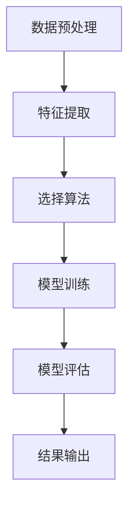
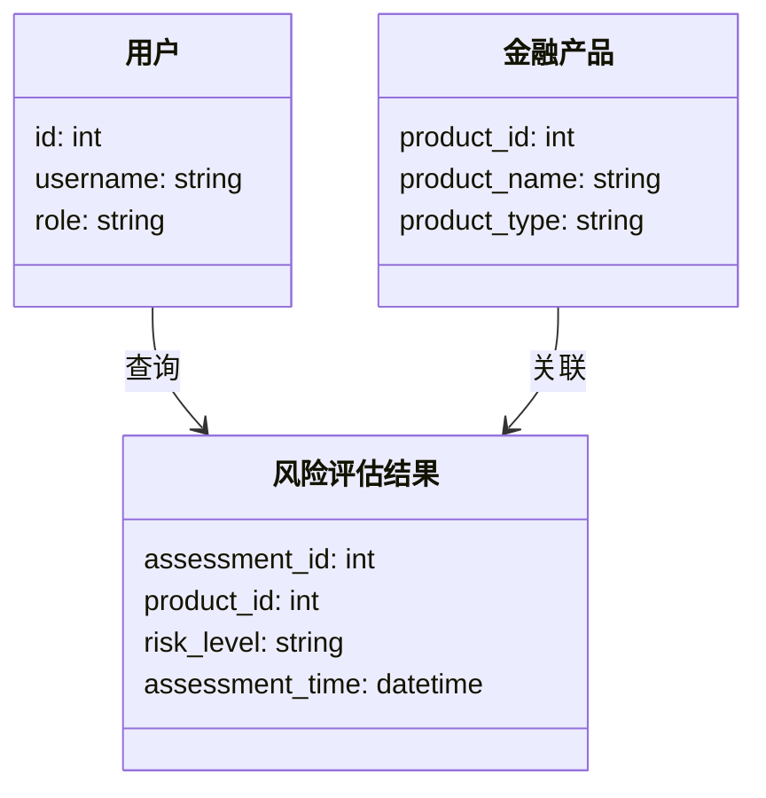
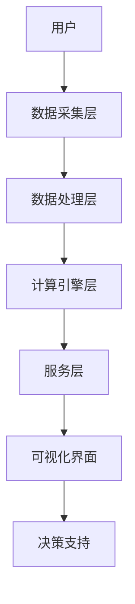

                 


```markdown
# 开发智能化的金融产品生命周期风险评估平台

> 关键词：智能化、金融产品、风险评估、生命周期、机器学习、大数据、系统架构

> 摘要：  
本文详细探讨了开发智能化金融产品生命周期风险评估平台的背景、核心概念、算法原理、系统架构设计及其实战应用。通过结合机器学习和大数据技术，提出了一种创新的解决方案，旨在提高金融产品风险评估的准确性和效率，帮助金融机构更好地管理风险，实现稳健的金融创新。

---

# 第一部分：背景介绍

## 第1章：背景介绍

### 1.1 问题背景

#### 1.1.1 金融产品风险评估的重要性
金融产品的生命周期涉及多个阶段，从设计、发行到交易和退市，每个阶段都伴随着不同的风险。准确评估这些风险对于金融机构的稳健运营至关重要。近年来，金融市场波动加剧，传统的基于经验的评估方法已难以应对复杂多变的市场环境，因此，开发智能化的金融产品风险评估平台显得尤为重要。

#### 1.1.2 当前金融风险管理的痛点
- 数据量庞大且复杂，传统方法难以高效处理。
- 风险因素多且动态变化，难以实时捕捉。
- 风险评估的准确性和及时性不足，可能导致重大损失。
- 缺乏统一的平台化解决方案，各环节割裂，效率低下。

#### 1.1.3 智能化平台的必要性
通过引入人工智能和大数据技术，可以实现对金融产品全生命周期的实时监控和智能评估，显著提升风险管理的效率和准确性。

### 1.2 问题描述

#### 1.2.1 金融产品生命周期的复杂性
金融产品生命周期包括设计、发行、交易、监控和退市等阶段，每个阶段都有不同的风险特征和评估需求。

#### 1.2.2 风险评估的多维度性
风险评估需要考虑市场风险、信用风险、流动性风险等多维度因素，且这些因素会随时间变化而动态调整。

#### 1.2.3 数据驱动的风险管理需求
现代风险管理依赖于大量数据的分析，包括历史交易数据、市场数据、客户行为数据等，传统的经验评估已无法满足需求。

### 1.3 问题解决

#### 1.3.1 智能化平台的核心目标
- 提供全生命周期的风险评估能力。
- 实现实时数据处理和智能分析。
- 提供可视化和决策支持工具。

#### 1.3.2 技术手段的选择与实现路径
- 引入机器学习算法（如随机森林、XGBoost）进行风险预测。
- 使用大数据技术（如Hadoop、Spark）进行高效数据处理。
- 构建分布式系统架构，确保平台的高可用性和扩展性。

#### 1.3.3 平台预期的效益与价值
- 提高风险评估的准确性和及时性。
- 降低金融机构的运营成本。
- 提升金融机构的市场竞争力。

### 1.4 平台的边界与外延

#### 1.4.1 平台的功能边界
- 限于金融产品生命周期内的风险评估，不包括产品设计和营销环节。
- 支持多种金融产品类型，如股票、基金、债券等。

#### 1.4.2 平台的适用范围
- 适用于银行、证券公司、保险公司等金融机构。
- 适用于个人投资者的风险评估服务。

#### 1.4.3 平台与外部系统的交互
- 与交易系统、客户关系管理系统（CRM）等外部系统对接，获取实时数据。
- 与监管机构的报告系统对接，提供合规性报告。

### 1.5 核心要素组成

#### 1.5.1 数据来源与处理
- 数据来源：内部交易数据、客户数据、市场数据等。
- 数据处理：清洗、整合、特征提取。

#### 1.5.2 风险评估模型
- 使用监督学习算法（如随机森林）进行风险分类。
- 使用无监督学习算法（如聚类）进行异常检测。

#### 1.5.3 可视化与决策支持
- 提供风险评估的可视化界面。
- 生成风险报告，支持决策者制定风险管理策略。

---

# 第二部分：核心概念与联系

## 第2章：核心概念与联系

### 2.1 核心概念原理

#### 2.1.1 智能化金融产品风险评估的定义
智能化金融产品风险评估是指利用人工智能和大数据技术，对金融产品的全生命周期进行实时监控和智能分析，以预测和管理潜在风险。

#### 2.1.2 机器学习在风险评估中的应用
- 用于预测市场波动、识别异常交易、评估信用风险等。

#### 2.1.3 大数据技术在金融领域的优势
- 高效处理海量数据。
- 发现数据中的潜在关联和模式。

### 2.2 概念属性特征对比表格

| 概念         | 属性       | 特征                               |
|--------------|------------|------------------------------------|
| 数据来源     | 内部数据    | 交易数据、客户数据                 |
| 数据来源     | 外部数据    | 宏观经济数据、行业数据             |
| 风险评估模型 | 监督学习    | 分类、回归                         |
| 风险评估模型 | 无监督学习  | 聚类、异常检测                     |

### 2.3 ER实体关系图

```mermaid
erd
    title 实体关系图
    User (用户) {
        id: int
        username: string
        role: string
    }
    Product (金融产品) {
        product_id: int
        product_name: string
        product_type: string
    }
    Risk-Assessment (风险评估结果) {
        assessment_id: int
        product_id: int
        risk_level: string
        assessment_time: datetime
    }
    User -> Risk-Assessment: 查询
    Product -> Risk-Assessment: 关联
```

---

## 第3章：算法原理

### 3.1 算法选择与流程设计

#### 3.1.1 算法选择
- 随机森林：用于分类任务，适合处理高维数据。
- XGBoost：用于回归任务，适合处理连续型风险评分。
- LSTM：用于时间序列分析，适合处理金融市场的波动性。

#### 3.1.2 算法流程



#### 3.1.3 算法实现

##### 3.1.3.1 随机森林分类实现

```python
from sklearn.ensemble import RandomForestClassifier

# 数据准备
X_train, y_train = prepare_data()

# 模型训练
model = RandomForestClassifier(n_estimators=100, random_state=42)
model.fit(X_train, y_train)

# 预测
y_pred = model.predict(X_test)
```

##### 3.1.3.2 LSTM回归实现

```python
from keras.models import Sequential
from keras.layers import LSTM, Dense

# 数据准备
X_train, y_train = prepare_sequences()

# 模型构建
model = Sequential()
model.add(LSTM(50, return_sequences=True, input_shape=(timesteps, features)))
model.add(LSTM(50))
model.add(Dense(1))

model.compile(loss='mean_squared_error', optimizer='adam')
model.fit(X_train, y_train, epochs=10, batch_size=32)
```

##### 3.1.3.3 数学模型与公式

随机森林分类模型的数学表达式：
$$
f(x) = \text{多数投票}(\{h_1(x), h_2(x), ..., h_n(x)\})
$$

LSTM的时间序列预测公式：
$$
s_t = \text{LSTM}(h_{t-1}, x_t)
$$
$$
y_t = W s_t + b
$$

---

## 第4章：系统分析与架构设计

### 4.1 系统分析

#### 4.1.1 问题场景介绍
金融产品生命周期中的风险评估需要实时处理大量数据，涉及多个系统的集成。

#### 4.1.2 项目介绍
开发一个智能化的金融产品生命周期风险评估平台，整合机器学习模型和大数据技术，提供实时风险评估和决策支持。

### 4.2 系统功能设计

#### 4.2.1 领域模型



#### 4.2.2 系统架构设计



---

## 第5章：项目实战

### 5.1 环境安装

#### 5.1.1 安装Python和相关库
```bash
pip install numpy pandas scikit-learn keras
```

#### 5.1.2 安装Jupyter Notebook
```bash
pip install jupyter
```

### 5.2 系统核心实现

#### 5.2.1 核心代码实现

##### 5.2.1.1 数据预处理

```python
import pandas as pd

# 读取数据
data = pd.read_csv('financial_data.csv')

# 数据清洗
data.dropna(inplace=True)
```

##### 5.2.1.2 模型训练

```python
from sklearn.model_selection import train_test_split
from sklearn.ensemble import RandomForestClassifier

# 划分数据集
X_train, X_test, y_train, y_test = train_test_split(data.drop('risk_level', axis=1), data['risk_level'], test_size=0.2)

# 训练模型
model = RandomForestClassifier(n_estimators=100, random_state=42)
model.fit(X_train, y_train)

# 评估准确率
print(model.score(X_test, y_test))
```

---

## 第6章：总结与展望

### 6.1 总结

#### 6.1.1 关键点回顾
- 引入机器学习和大数据技术，提升风险评估的准确性和效率。
- 构建智能化平台，实现全生命周期的实时监控。

#### 6.1.2 经验与教训
- 数据质量和完整性对模型性能影响重大。
- 模型的可解释性在金融领域尤为重要。

### 6.2 未来展望

#### 6.2.1 技术发展方向
- 引入实时数据流处理技术，提升平台的实时性。
- 探索强化学习在风险控制中的应用。

#### 6.2.2 应用领域拓展
- 扩展到更多金融产品类型，如衍生品、外汇交易等。
- 拓展到更多金融市场，如国际市场、新兴市场等。

### 6.3 最佳实践 Tips

- 数据预处理是关键，确保数据的准确性和完整性。
- 模型选择要结合实际业务需求，选择合适的算法。
- 系统架构设计要注重可扩展性和可维护性。

---

# 作者

作者：AI天才研究院/AI Genius Institute & 禅与计算机程序设计艺术 /Zen And The Art of Computer Programming
```

