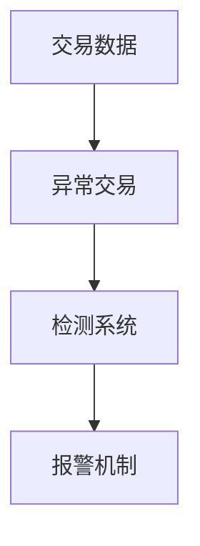
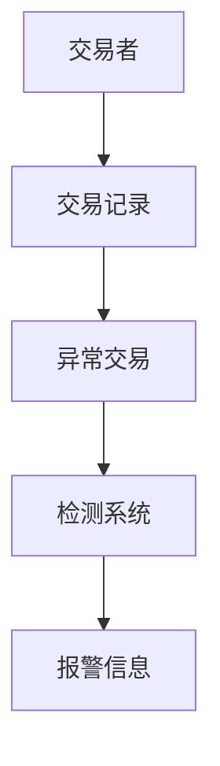
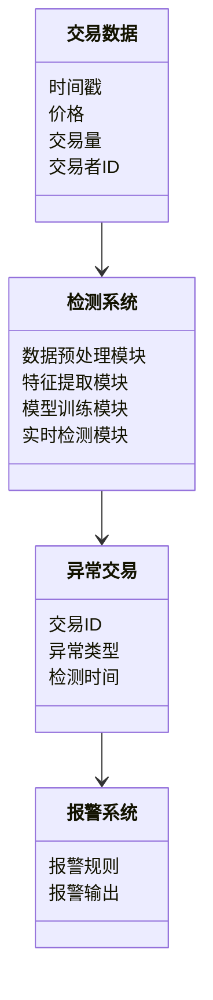
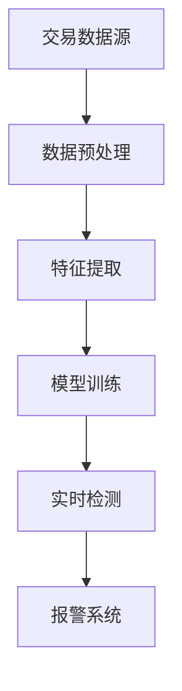
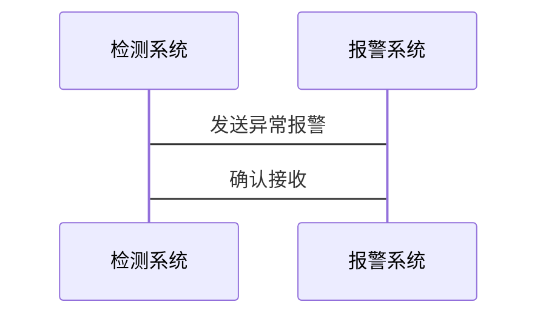

                 


# 开发智能化的金融市场异常交易检测模型

> 关键词：金融市场，异常交易检测，机器学习，深度学习，时间序列分析，系统架构设计，数学模型

> 摘要：金融市场异常交易检测是保障市场公平、透明和稳定运行的重要手段。本文系统地介绍了异常交易检测的核心概念、算法原理、系统架构设计、数学模型以及实际项目开发的全过程。通过结合理论与实践，详细讲解了如何利用机器学习、深度学习等技术手段，开发高效的异常交易检测系统，为金融市场的风险管理提供了有力的技术支持。

---

# 第一部分: 金融市场异常交易检测模型背景与概述

# 第1章: 异常交易检测的背景与问题描述

## 1.1 问题背景
### 1.1.1 金融市场异常交易的定义
金融市场中的异常交易是指偏离正常市场行为的交易行为，通常包括操纵市场、内幕交易、洗售交易等行为。这些行为不仅损害了市场的公平性，还可能引发系统性风险。

### 1.1.2 异常交易的危害与影响
- **市场稳定性**：异常交易可能导致市场价格剧烈波动，威胁金融市场的稳定性。
- **投资者利益**：异常交易可能损害普通投资者的利益，尤其是中小投资者。
- **市场信任**：异常交易会削弱市场参与者的信任，影响市场的健康发展。

### 1.1.3 技术手段在异常交易检测中的作用
随着技术的进步，利用机器学习、深度学习等人工智能技术，可以更高效地检测异常交易行为，从而保护市场公平性。

## 1.2 问题描述
### 1.2.1 异常交易的类型与特征
- **类型**：
  - 操纵市场：通过虚假交易影响市场价格。
  - 内幕交易：利用未公开信息进行交易。
  - 洗售交易：通过频繁买卖同一资产来制造交易量假象。
- **特征**：
  - 交易频率异常：短时间内大量交易。
  - 价格波动异常：价格在短时间内出现剧烈波动。
  - 交易量异常：交易量远超正常水平。

### 1.2.2 异常交易检测的目标与挑战
- **目标**：
  - 及时发现并识别异常交易行为。
  - 准确区分正常交易与异常交易。
- **挑战**：
  - 数据复杂性：金融市场数据具有高维、非线性、噪声多等特点。
  - 模型泛化能力：需要模型能够适应不同市场环境和交易行为。
  - 实时性要求：检测系统需要具备实时处理能力。

### 1.2.3 数据驱动的异常检测方法
利用历史交易数据，通过数据分析和建模，识别异常交易行为的模式和特征。

## 1.3 问题解决与边界
### 1.3.1 异常交易检测的核心目标
- 及时、准确地识别异常交易行为。
- 提供实时或近实时的报警机制。

### 1.3.2 检测模型的边界与限制
- 数据范围：基于历史交易数据，无法预测未来未知的异常行为。
- 模型能力：模型的检测能力依赖于训练数据的质量和数量。

### 1.3.3 与其他金融检测任务的区分
- 与欺诈检测的区别：异常交易检测更关注交易行为的异常性，而欺诈检测更关注交易的合法性。
- 与市场风险检测的区别：异常交易检测关注交易行为本身，而市场风险检测关注市场整体风险。

## 1.4 概念结构与核心要素
### 1.4.1 异常交易检测的系统架构


### 1.4.2 核心要素的定义与关系
- **交易数据**：包括时间戳、价格、交易量、交易者ID等。
- **异常交易**：偏离正常交易模式的行为。
- **检测系统**：通过算法分析交易数据，识别异常交易。
- **报警机制**：当检测到异常交易时，触发报警。

### 1.4.3 系统的输入输出与流程
- **输入**：交易数据。
- **输出**：异常交易报警信息。
- **流程**：数据预处理 → 特征提取 → 模型训练 → 实时检测 → 报警输出。

## 1.5 本章小结
本章介绍了金融市场异常交易检测的背景、目标、挑战以及核心概念，为后续的算法设计和系统实现奠定了基础。

---

# 第二部分: 异常交易检测的核心概念与联系

# 第2章: 异常交易检测的核心概念

## 2.1 核心概念原理
### 2.1.1 异常交易的特征提取
- **时间序列特征**：如交易频率、价格波动幅度。
- **统计特征**：如均值、标准差、偏度等。
- **行为特征**：如交易者的行为模式、交易时间分布。

### 2.1.2 异常检测算法的分类
- **监督学习**：基于标记数据的分类模型。
- **无监督学习**：基于聚类的异常检测。
- **半监督学习**：结合监督和无监督学习方法。
- **强化学习**：通过策略优化进行异常检测。

### 2.1.3 数据特征与异常判定的关系
- 数据特征是异常检测的基础。
- 异常判定依赖于特征的组合和权重。

## 2.2 核心概念属性特征对比
下表展示了不同异常检测方法在特征提取和适用场景上的对比：

| 特征维度      | 监督学习 | 无监督学习 | 强化学习 |
|----------------|----------|------------|----------|
| 数据需求      | 需要标记数据 | 无需标记数据 | 需要环境反馈 |
| 特征提取方式    | 基于特定特征 | 基于全局特征 | 基于状态和动作 |
| 适用场景      | 已知异常类型 | 未知异常类型 | 动态异常检测 |

## 2.3 ER实体关系图架构


---

# 第三部分: 异常交易检测的算法原理

# 第3章: 异常检测算法原理

## 3.1 监督学习算法
### 3.1.1 算法流程
1. 数据预处理：清洗、归一化。
2. 特征提取：提取交易特征。
3. 模型训练：基于标记数据训练分类模型。
4. 检测阶段：输入新数据，输出异常概率。

### 3.1.2 数学模型
$$ P(\text{异常} | x) = \frac{P(x | \text{异常}) P(\text{异常})}{P(x)} $$

其中，$P(x | \text{异常})$ 是异常条件下数据的概率密度函数。

### 3.1.3 实际应用中的挑战
- 标记数据获取困难。
- 异常样本数量少，可能导致模型过拟合。

## 3.2 无监督学习算法
### 3.2.1 基于聚类的异常检测
- 算法流程：
  1. 数据预处理。
  2. 聚类分析。
  3. 异常点识别。
- 数学模型：
$$ \text{聚类目标函数} = \sum_{i=1}^{k} \sum_{j=1}^{n_i} d(x_i, c_j) $$

其中，$d(x_i, c_j)$ 是数据点$x_i$与聚类中心$c_j$的距离。

### 3.2.2 基于密度的异常检测
- 使用局部密度来判断异常点。

## 3.3 强化学习算法
### 3.3.1 算法流程
1. 状态空间定义：交易特征、市场状态。
2. 动作空间定义：检测或不检测。
3. 奖励机制设计：正确检测异常的奖励，误检的惩罚。

### 3.3.2 数学模型
$$ R = \sum_{t=1}^{T} r_t(s_t, a_t) $$

其中，$s_t$ 是状态，$a_t$ 是动作，$r_t$ 是即时奖励。

---

# 第四部分: 异常交易检测的系统架构设计

# 第4章: 异常交易检测系统架构

## 4.1 问题场景介绍
- 实时交易监控。
- 大规模数据处理。
- 高效检测算法需求。

## 4.2 系统功能设计
### 4.2.1 领域模型


### 4.2.2 系统架构设计


### 4.2.3 接口设计
- 数据接口：交易数据的输入和输出接口。
- 模型接口：模型训练和实时检测的接口。

### 4.2.4 交互设计


---

# 第五部分: 异常交易检测的项目实战

# 第5章: 项目开发与实战

## 5.1 环境搭建
### 5.1.1 技术选型
- 数据存储：MySQL、Hadoop。
- 数据处理：Python、Pandas。
- 模型训练：TensorFlow、PyTorch。
- 实时检测：Flask、Django。

## 5.2 核心代码实现
### 5.2.1 特征提取代码
```python
import pandas as pd
from sklearn.preprocessing import StandardScaler

def extract_features(data):
    # 数据预处理
    data_processed = data.dropna()
    # 特征提取
    features = data_processed[['time', 'price', 'volume', 'trader_id']]
    # 标准化处理
    scaler = StandardScaler()
    features_scaled = scaler.fit_transform(features)
    return features_scaled
```

### 5.2.2 模型训练代码
```python
from sklearn.

