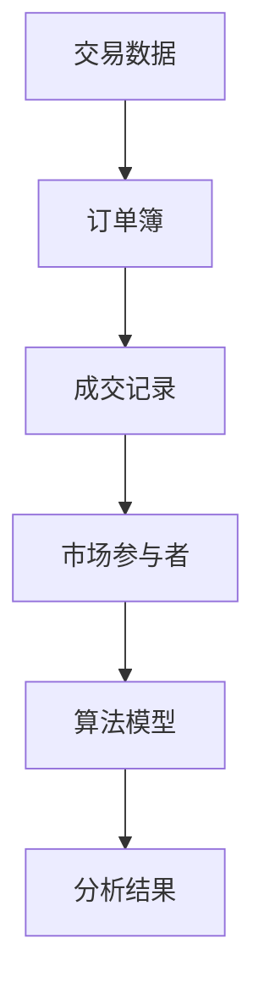
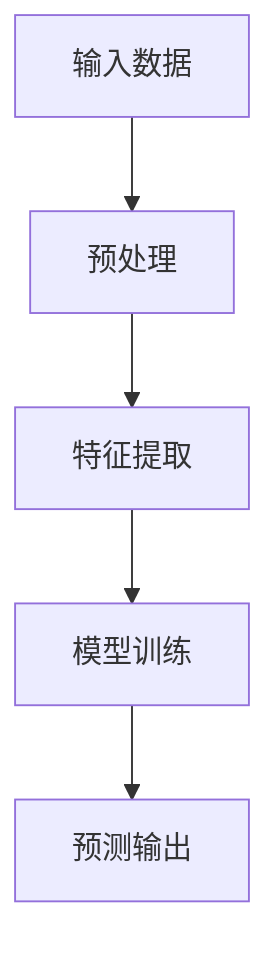
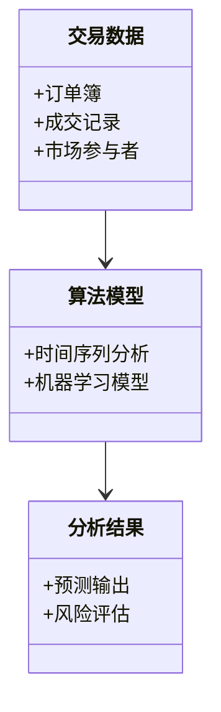
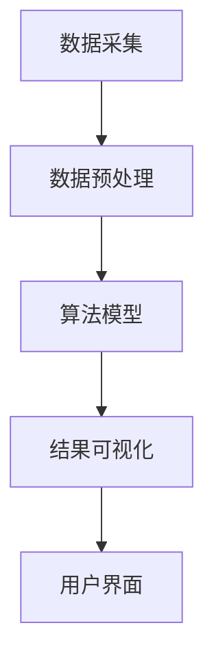

                 


# 开发智能化的金融市场微观结构分析工具

> 关键词：金融市场、微观结构、智能化、算法交易、高频交易、大数据分析、量化投资

> 摘要：本文探讨了开发智能化的金融市场微观结构分析工具的背景、核心概念、算法原理、系统架构及项目实现。通过详细的技术分析和案例解读，展示了如何利用先进的算法和系统设计，提升金融市场的数据处理和分析能力。

---

# 第一部分：金融市场微观结构分析工具开发背景

## 第1章：问题背景与需求分析

### 1.1 问题背景

#### 1.1.1 金融市场微观结构的基本概念
金融市场微观结构指的是市场参与者、交易机制、价格形成等微观层面的运作机制。了解这些机制对于投资者和机构至关重要。

#### 1.1.2 微观结构分析的现实意义
通过分析微观结构，可以帮助投资者识别市场机会，优化交易策略，并提高风险管理能力。

#### 1.1.3 智能化工具开发的必要性
随着金融市场的复杂化，传统分析方法已难以应对高频交易和大数据挑战，智能化工具成为必要。

### 1.2 需求分析

#### 1.2.1 用户需求概述
用户包括金融机构、量化交易员和研究人员，他们需要实时、高效的分析工具。

#### 1.2.2 技术需求分析
要求工具具备大数据处理能力、实时分析和自适应学习功能。

#### 1.2.3 功能边界与外延
工具应涵盖数据采集、分析、可视化和策略生成，但不涉及具体交易执行。

---

## 第2章：核心概念与联系

### 2.1 核心概念原理

#### 2.1.1 数据流与分析流程
从数据采集到预处理，再到分析和可视化，形成完整的数据处理流程。

#### 2.1.2 算法模型与实现方式
结合统计分析和机器学习，构建多维度的分析模型。

#### 2.1.3 系统架构与交互机制
系统采用分层架构，确保高效的数据处理和用户友好的交互界面。

### 2.2 概念属性特征对比表

| 概念         | 属性             | 特征             |
|--------------|------------------|------------------|
| 数据流       | 来源             | 实时交易数据     |
| 算法模型     | 类型             | 时间序列分析     |
| 系统架构     | 结构             | 分层架构         |

### 2.3 ER实体关系图



---

# 第二部分：算法原理与数学模型

## 第3章：算法原理讲解

### 3.1 时间序列分析



#### 3.1.1 模型实现

```python
# 示例代码
import numpy as np
from sklearn.linear_model import LinearRegression

# 数据预处理
X = np.array([i for i in range(100)]).reshape(-1, 1)
y = np.array([2*i + 1 for i in range(100)])

# 模型训练
model = LinearRegression()
model.fit(X, y)

# 预测
print(model.predict(np.array([[101]])))
```

#### 3.1.2 数学模型

时间序列分析的线性回归模型可以表示为：
$$ y_t = \beta_0 + \beta_1 x_t + \epsilon_t $$
其中，$\epsilon_t$ 是误差项。

### 3.2 机器学习模型

#### 3.2.1 模型实现

```python
from sklearn.ensemble import RandomForestRegressor

# 数据准备
X_train, y_train = ...  # 训练数据
X_test, y_test = ...    # 测试数据

# 模型训练
model = RandomForestRegressor()
model.fit(X_train, y_train)

# 预测与评估
print(model.score(X_test, y_test))
```

#### 3.2.2 数学模型

随机森林模型的预测公式为：
$$ y = \sum_{i=1}^{n} \text{Tree}_i(x) $$

---

## 第4章：系统分析与架构设计

### 4.1 系统功能设计

#### 4.1.1 领域模型



### 4.2 系统架构设计

#### 4.2.1 系统架构图



---

## 第5章：项目实战

### 5.1 环境安装

```bash
pip install numpy pandas scikit-learn
```

### 5.2 核心实现

```python
import pandas as pd
from sklearn import svm

# 数据加载
data = pd.read_csv('market_data.csv')

# 特征工程
X = data[['open', 'high', 'low', 'close']]
y = data['volume']

# 模型训练
model = svm.SVR()
model.fit(X, y)
```

### 5.3 案例分析

分析某段时间内的市场波动，生成风险评估报告，指导投资决策。

---

## 第6章：总结与展望

### 6.1 总结

开发智能化工具的关键在于高效的数据处理和精准的算法模型，结合实时分析能力，为用户提供有力支持。

### 6.2 展望

未来将结合更先进的AI技术，如深度学习和自然语言处理，进一步提升工具的智能化水平。

---

作者：AI天才研究院/AI Genius Institute & 禅与计算机程序设计艺术/Zen And The Art of Computer Programming

