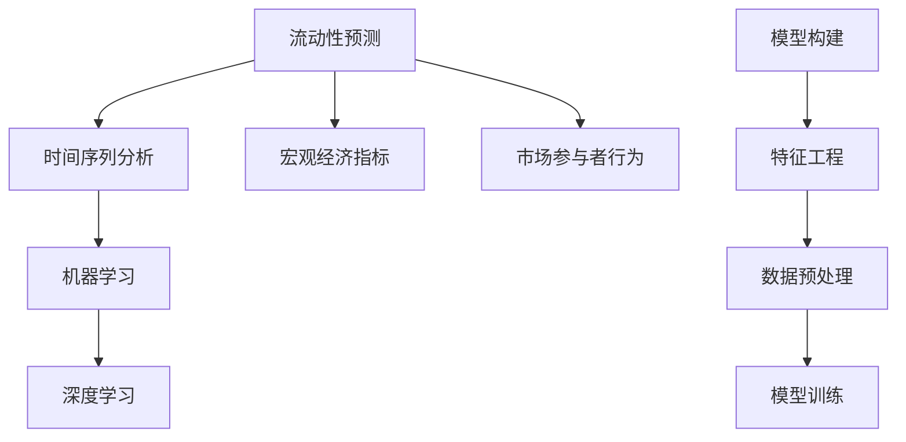
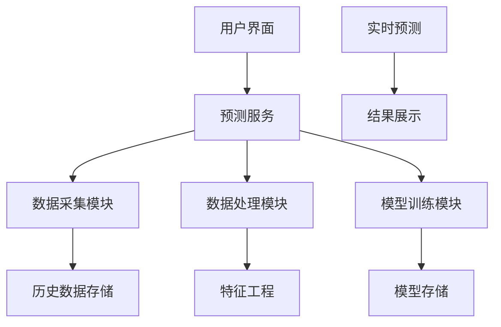
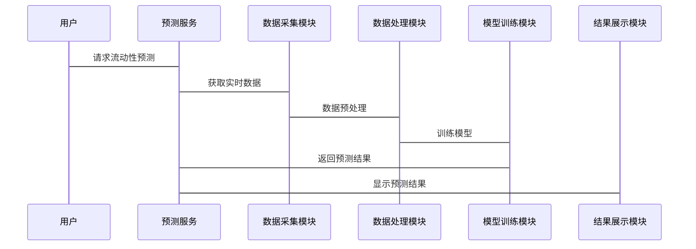

                 


# 开发智能化的金融市场流动性预测工具

> 关键词：金融市场流动性预测、时间序列分析、机器学习、深度学习、人工智能、系统架构

> 摘要：金融市场流动性预测是投资决策和风险管理中的重要环节。本文详细介绍了如何利用时间序列分析、机器学习和深度学习等技术，开发智能化的流动性预测工具。通过系统化的架构设计、算法实现和项目实战，本文为金融从业者提供了一套完整的解决方案，帮助他们更准确地预测市场流动性变化，降低投资风险。

---

## 第一部分: 金融市场流动性预测工具开发背景

### 第1章: 金融市场流动性预测概述

#### 1.1 金融市场概述

- **1.1.1 金融市场的定义与分类**
  - 金融市场是资金流动和资产交易的场所，分为一级市场（新资产发行）和二级市场（资产交易）。
  - 主要参与者包括投资者、交易员、金融机构和监管机构。

- **1.1.2 金融市场的核心功能与参与者**
  - 核心功能：资金配置、价格发现、风险管理。
  - 参与者：个人投资者、机构投资者、经纪商、做市商、交易所等。

- **1.1.3 流动性在金融市场中的重要性**
  - 市场流动性指资产快速转化为现金的能力，影响交易成本和市场稳定性。
  - 高流动性市场具有深度和广度，交易者可以以合理价格买卖资产。

#### 1.2 流动性预测的定义与应用

- **1.2.1 流动性预测的定义**
  - 预测市场在特定时间段内的流动情况，包括交易量、买卖价差和订单簿深度。
  - 流动性预测帮助交易者和投资者优化交易策略，降低市场风险。

- **1.2.2 流动性预测的核心应用场景**
  - 算法交易：高频交易需要实时预测流动性以优化订单执行。
  - 投资组合管理：通过预测市场流动性变化，调整资产配置。
  - 风险管理：识别流动性风险，避免市场波动带来的损失。

- **1.2.3 流动性预测的边界与外延**
  - 边界：流动性预测仅基于历史数据，无法预测突发事件（如市场崩盘）。
  - 外延：结合宏观经济指标、市场情绪和新闻事件，提高预测准确性。

#### 1.3 流动性预测工具的开发背景

- **1.3.1 传统流动性预测方法的局限性**
  - 基于统计分析的传统方法（如移动平均法）在非平稳数据上表现不佳。
  - 无法捕捉复杂市场行为和非线性关系。

- **1.3.2 人工智能技术在金融领域的应用趋势**
  - 机器学习和深度学习在金融时间序列预测中的广泛应用。
  - 自然语言处理（NLP）用于分析新闻和社交媒体情绪，辅助预测。

- **1.3.3 开发智能化流动性预测工具的必要性**
  - 提高预测准确性和实时性，满足金融市场对高效工具的需求。
  - 结合多种技术手段，构建智能化的预测系统，帮助交易者做出更明智的决策。

---

## 第2章: 问题背景与需求分析

### 2.1 问题背景分析

- **2.1.1 金融市场波动性对流动性的影响**
  - 市场波动性增加时，流动性通常会下降，导致买卖价差扩大。
  - 高波动性市场中，交易者需要快速调整交易策略。

- **2.1.2 市场参与者行为对流动性预测的影响**
  - 机构投资者的大额交易可能影响市场流动性。
  - 零散交易者的行为具有随机性，增加了预测的复杂性。

- **2.1.3 宏观经济指标与流动性预测的关系**
  - 利率、GDP增长率和通货膨胀率等宏观经济指标影响市场流动性。
  - 这些指标可以通过时间序列分析和机器学习模型进行预测。

### 2.2 核心问题描述

- **2.2.1 流动性预测的核心问题**
  - 如何利用历史交易数据和市场指标，预测未来市场流动性。
  - 如何构建高效的模型，平衡预测准确性和计算效率。

- **2.2.2 数据驱动的流动性预测模型构建**
  - 数据来源：历史交易数据、订单簿数据、宏观经济指标。
  - 数据预处理：清洗、特征提取和归一化。

- **2.2.3 模型的实时性和准确性要求**
  - 实时预测需要低延迟和高计算效率。
  - 预测准确性是模型性能的核心指标。

### 2.3 问题解决的思路与方法

- **2.3.1 数据驱动与模型驱动的结合**
  - 数据驱动：基于历史数据训练模型，捕捉市场规律。
  - 模型驱动：结合金融理论，构建数学模型。

- **2.3.2 时间序列分析方法的应用**
  - ARIMA模型：适合平稳时间序列数据。
  - GARCH模型：捕捉波动性变化。

- **2.3.3 机器学习与深度学习的融合**
  - 机器学习：随机森林、支持向量机（SVM）用于特征选择。
  - 深度学习：LSTM和Transformer模型处理复杂时间序列数据。

---

## 第3章: 核心概念与联系

### 3.1 核心概念原理

- **3.1.1 时间序列分析的基本原理**
  - 时间序列分析是研究数据随时间变化的模式和趋势。
  - 常用方法：移动平均法（MA）、自回归（AR）、ARIMA模型。

- **3.1.2 机器学习在时间序列预测中的应用**
  - 机器学习模型（如随机森林、XGBoost）用于特征工程和非线性关系建模。
  - 特征工程：提取有用的特征，如均值、波动率和自相关系数。

- **3.1.3 深度学习模型在金融时间序列预测中的优势**
  - LSTM网络：擅长捕捉时间序列的长-term依赖关系。
  - Transformer模型：通过自注意力机制捕捉全局模式。

### 3.2 核心概念属性对比

| 概念          | 描述                                                                 |
|---------------|----------------------------------------------------------------------|
| 时间序列分析 | 研究数据随时间变化的模式，适用于预测未来值。                           |
| 机器学习      | 基于数据训练模型，适用于非线性关系和复杂模式识别。                     |
| 深度学习      | 基于多层神经网络，擅长处理复杂时间序列数据和非线性关系。               |

### 3.3 概念结构与核心要素组成



---

## 第4章: 算法原理讲解

### 4.1 ARIMA模型

- **4.1.1 ARIMA模型原理**
  - ARIMA模型由AR（自回归）、I（差分）和MA（移动平均）三部分组成。
  - 适用于平稳时间序列数据。

- **4.1.2 ARIMA模型的数学表达式**
  $$ ARIMA(p, d, q) = y_t = \phi_1 y_{t-1} + \dots + \phi_p y_{t-p} + \theta_1 \epsilon_{t-1} + \dots + \theta_q \epsilon_{t-q} + \epsilon_t $$

- **4.1.3 ARIMA模型的实现步骤**
  1. 数据预处理：检查数据是否平稳，进行差分处理。
  2. 确定模型参数：使用AIC准则选择最佳p、d、q。
  3. 模型训练与验证：使用训练数据拟合模型，验证残差是否符合白噪声假设。

### 4.2 LSTM模型

- **4.2.1 LSTM模型原理**
  - LSTM（长短期记忆网络）通过门控机制捕捉长期依赖关系。
  - 由输入门、遗忘门和输出门组成。

- **4.2.2 LSTM模型的数学表达式**
  $$ i_t = \sigma(w_i x_t + u_i h_{t-1}) $$
  $$ f_t = \sigma(w_f x_t + u_f h_{t-1}) $$
  $$ o_t = \sigma(w_o x_t + u_o h_{t-1}) $$
  $$ c_t = f_t c_{t-1} + i_t tanh(w_c x_t + u_c h_{t-1}) $$
  $$ h_t = o_t tanh(c_t) $$

- **4.2.3 LSTM模型的实现步骤**
  1. 数据预处理：归一化和分割训练集、验证集、测试集。
  2. 构建LSTM网络：定义输入层、LSTM层和全连接层。
  3. 模型训练：使用梯度下降优化器（如Adam）训练模型，计算均方误差（MSE）损失。

### 4.3 注意力机制

- **4.3.1 注意力机制原理**
  - 注意力机制通过自注意力机制捕捉序列中各位置的重要性。
  - 在Transformer模型中，注意力机制用于全局模式识别。

- **4.3.2 注意力机制的数学表达式**
  $$ \text{Attention}(Q, K, V) = \text{softmax}\left(\frac{QK^T}{\sqrt{d_k}}\right)V $$

- **4.3.3 注意力机制的实现步骤**
  1. 计算查询（Q）、键（K）和值（V）向量。
  2. 计算注意力权重矩阵。
  3. 加权求和得到最终的注意力输出。

---

## 第5章: 系统分析与架构设计方案

### 5.1 问题场景介绍

- **5.1.1 项目背景**
  - 开发一个智能化的金融市场流动性预测工具，帮助交易者和投资者做出决策。

- **5.1.2 系统功能设计**
  - 数据采集：从交易所API获取实时交易数据。
  - 数据处理：清洗、特征提取和归一化。
  - 模型训练：使用历史数据训练ARIMA、LSTM和Transformer模型。
  - 预测服务：提供实时流动性预测和可视化界面。

### 5.2 系统架构设计



### 5.3 接口设计与交互流程



---

## 第6章: 项目实战

### 6.1 环境安装与配置

- **6.1.1 安装Python环境**
  - 使用Anaconda安装Python 3.8及以上版本。
  - 安装必要的库：pandas、numpy、scikit-learn、keras、tensorflow、pytorch。

- **6.1.2 数据集获取**
  - 从交易所API获取历史交易数据。
  - 数据格式：CSV文件，包含时间戳、买卖价差、订单簿深度等。

### 6.2 核心代码实现

```python
import pandas as pd
import numpy as np
from sklearn.preprocessing import MinMaxScaler
from keras.models import Sequential
from keras.layers import LSTM, Dense, Dropout

# 数据预处理
data = pd.read_csv('market_data.csv')
data = data[['time', 'bid_ask_spread', 'order_book_depth']]
scaler = MinMaxScaler()
scaled_data = scaler.fit_transform(data[['bid_ask_spread', 'order_book_depth']])

# 划分训练集和测试集
train_size = int(len(scaled_data) * 0.8)
train_data = scaled_data[:train_size]
test_data = scaled_data[train_size:]

# 构建LSTM数据集
def create_dataset(data, look_back=1):
    X, y = [], []
    for i in range(len(data) - look_back):
        X.append(data[i:i+look_back])
        y.append(data[i+look_back])
    return np.array(X), np.array(y)

X_train, y_train = create_dataset(train_data, look_back=10)
X_test, y_test = create_dataset(test_data, look_back=10)

# 构建LSTM模型
model = Sequential()
model.add(LSTM(50, return_sequences=True, input_shape=(10, 2)))
model.add(Dropout(0.2))
model.add(LSTM(50, return_sequences=False))
model.add(Dense(1))

model.compile(optimizer='adam', loss='mean_squared_error')
model.fit(X_train, y_train, epochs=50, batch_size=64, validation_split=0.2)
```

### 6.3 案例分析与结果解读

- **6.3.1 案例分析**
  - 使用某股票的历史交易数据，训练LSTM模型。
  - 比较模型预测结果与实际值，计算均方误差（MSE）和R平方值。

- **6.3.2 代码解读与优化**
  - 调整模型超参数，如LSTM单元数和批量大小。
  - 使用交叉验证优化模型性能。

---

## 第7章: 最佳实践与总结

### 7.1 开发经验总结

- **7.1.1 数据的重要性**
  - 数据质量直接影响模型性能，需进行充分的数据清洗和特征工程。

- **7.1.2 模型选择与优化**
  - 根据数据特征选择合适的模型，进行交叉验证和超参数优化。

- **7.1.3 系统架构设计**
  - 模块化设计便于维护和扩展，确保系统的高效运行。

### 7.2 注意事项与建议

- **7.2.1 数据隐私与合规性**
  - 确保数据来源合法，遵守相关法律法规。

- **7.2.2 模型的实时性与可扩展性**
  - 使用高效的计算框架（如TensorFlow Serving）部署模型，确保实时预测能力。

- **7.2.3 模型的解释性与可解释性**
  - 使用LIME等工具解释模型预测结果，帮助交易者理解预测依据。

### 7.3 拓展阅读与学习资源

- 推荐书籍：
  - 《机器学习实战》
  - 《深度学习》
  - 《金融时间序列分析》

- 推荐网站：
  - TensorFlow官方文档
  - PyTorch官方文档
  - Kaggle金融数据集

---

## 作者

作者：AI天才研究院/AI Genius Institute & 禅与计算机程序设计艺术 /Zen And The Art of Computer Programming

