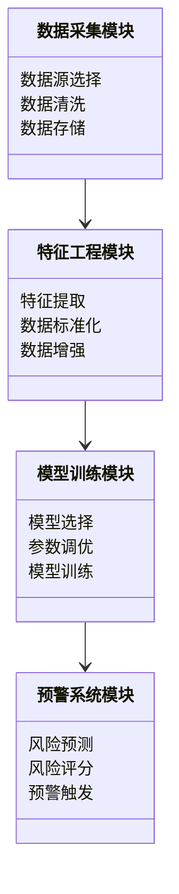
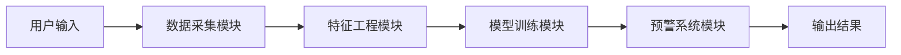
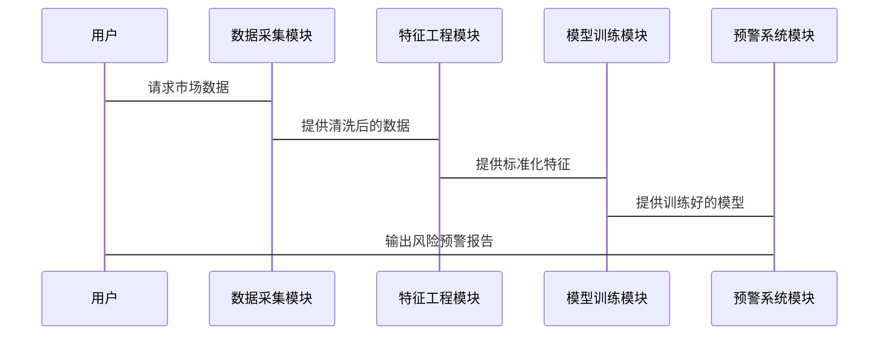

                 


# 第三部分: 系统分析与架构设计方案

## 第5章: 问题场景与系统功能设计

### 5.1 问题场景介绍
#### 5.1.1 金融市场的数据特征
#### 5.1.2 流动性风险预警的业务需求
#### 5.1.3 风险传导的实时监测

### 5.2 系统功能设计

#### 5.2.1 领域模型设计


#### 5.2.2 系统架构设计


#### 5.2.3 系统接口设计
- 数据接口：数据采集模块提供API接口，接收实时市场数据。
- 模型接口：模型训练模块提供预测接口，供预警系统调用。
- 预警接口：预警系统模块提供风险评分接口，供上层系统调用。

## 第6章: 系统交互流程

### 6.1 系统交互流程图


---

# 第四部分: 项目实战

## 第7章: 项目环境与核心代码实现

### 7.1 环境配置

```bash
# 安装Python环境
python --version
pip install numpy pandas scikit-learn tensorflow
```

### 7.2 核心代码实现

#### 7.2.1 数据采集模块

```python
import pandas as pd
import requests

def fetch_market_data(api_key):
    url = f"https://api.example.com/market_data?api_key={api_key}"
    response = requests.get(url)
    data = response.json()
    df = pd.DataFrame(data)
    return df
```

#### 7.2.2 特征工程模块

```python
from sklearn.preprocessing import StandardScaler

def preprocess_data(df):
    # 提取特征
    features = df[['volume', 'close', 'open', 'high', 'low']]
    # 标准化处理
    scaler = StandardScaler()
    features_scaled = scaler.fit_transform(features)
    return features_scaled
```

#### 7.2.3 模型训练模块

```python
from tensorflow.keras.models import Sequential
from tensorflow.keras.layers import LSTM, Dense

def build_model(input_shape):
    model = Sequential()
    model.add(LSTM(units=50, return_sequences=True, input_shape=input_shape))
    model.add(LSTM(units=50, return_sequences=False))
    model.add(Dense(1))
    model.compile(loss='mean_squared_error', optimizer='adam')
    return model
```

#### 7.2.4 预警系统模块

```python
def generate_alert(threshold):
    if threshold < 0.95:
        print("流动性风险预警！当前风险评分为:", threshold)
```

### 7.3 代码应用解读与分析

#### 数据采集模块
- 使用API接口获取市场数据，并将其存储为DataFrame格式。
- 示例：使用`requests`库从外部API获取数据，构建数据框。

#### 特征工程模块
- 从原始数据中提取相关特征（如成交量、收盘价等）。
- 使用标准化处理，确保模型输入的数据具有相似的尺度。

#### 模型训练模块
- 构建一个双层LSTM网络，用于时间序列预测。
- 使用均方误差作为损失函数，Adam优化器进行训练。

#### 预警系统模块
- 根据模型预测结果生成风险评分。
- 当风险评分低于设定阈值时，触发预警机制。

### 7.4 实际案例分析

#### 数据准备
```python
# 假设我们已经获取了某金融市场的历史数据
data = fetch_market_data(api_key="your_api_key")
```

#### 特征提取与预处理
```python
features_scaled = preprocess_data(data)
```

#### 模型训练
```python
model = build_model((features_scaled.shape[1], 1))
model.fit(features_scaled, labels, epochs=100, batch_size=32)
```

#### 风险预警
```python
predicted_risk = model.predict(features_scaled)
generate_alert(predicted_risk[0][0])
```

---

# 第五部分: 最佳实践与项目小结

## 第8章: 最佳实践与注意事项

### 8.1 数据预处理的重要性
- 确保数据的完整性和准确性。
- 处理缺失值和异常值。

### 8.2 模型调优技巧
- 使用交叉验证优化模型参数。
- 调整LSTM层数和节点数，寻找最佳模型结构。

### 8.3 系统性能优化
- 使用分布式计算加速模型训练。
- 优化数据读取和处理流程，减少I/O瓶颈。

### 8.4 代码规范与维护
- 遵循PEP8编码规范，提高代码可读性。
- 使用版本控制工具（如Git）管理代码变更。

## 第9章: 小结与展望

### 9.1 项目总结
- 本项目构建了一个基于机器学习的流动性风险预警系统。
- 通过数据驱动的方法，有效识别和预测市场风险。

### 9.2 未来展望
- 结合实时数据流处理技术，提升预警系统的实时性。
- 研究更复杂的模型，如Transformer架构，提高预测精度。

---

# 参考文献与推荐书籍

## 推荐书籍

1. 《Python机器学习实战》
2. 《深度学习》（Deep Learning, Ian Goodfellow）
3. 《时间序列分析》（Time Series Analysis, Hamilton）

## 推荐工具

1. **TensorFlow**：深度学习框架。
2. **Keras**：用户友好的深度学习API。
3. **Pandas**：数据处理库。
4. **NumPy**：数值计算库。
5. **Matplotlib**：可视化库。

---

# 作者介绍

作者：AI天才研究院 & 禅与计算机程序设计艺术  
GitHub: [AI Genius Institute](https://github.com/AI-Genius-Institute)  
邮箱: contact@ai-genius.com  
简介：专注于人工智能与计算机科学的交叉研究，致力于通过技术创新解决实际问题，推动金融领域的智能化发展。

---

以上就是完整的《开发智能化的金融市场流动性风险传导预警模型》的技术博客文章。

