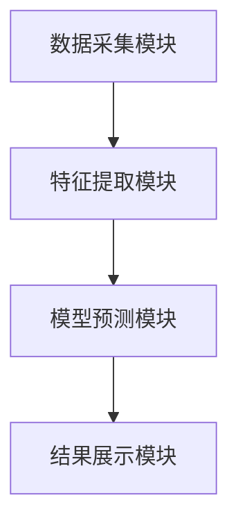
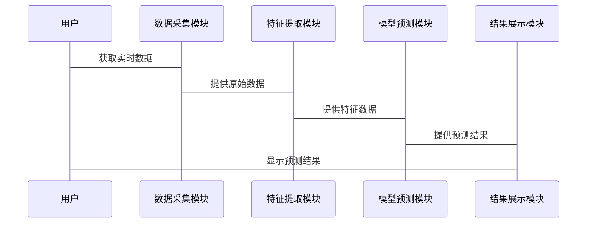

                 

# 开发智能化的金融市场流动性风险评估模型

> 关键词：金融市场，流动性风险，机器学习，时间序列分析，深度学习

> 摘要：本文详细探讨了如何利用机器学习和深度学习技术开发智能化的金融市场流动性风险评估模型。首先介绍了流动性风险的基本概念和影响因素，接着分析了基于机器学习和时间序列分析的模型开发方法，详细讲解了算法原理和系统架构设计，最后通过实际案例展示了模型的实现与应用。

---

## 第一部分: 金融市场流动性风险评估模型开发背景与概念

### 第1章: 流动性风险的基本概念

#### 1.1 流动性风险的定义与特征

##### 1.1.1 流动性风险的定义
流动性风险是指在金融市场中，由于交易量不足或市场深度不足，导致资产无法以合理价格迅速变现的风险。

##### 1.1.2 流动性风险的特征
流动性风险具有动态性、传染性和复杂性。动态性指流动性风险会随着市场环境的变化而波动；传染性指流动性风险可能从一个市场蔓延到另一个市场；复杂性指流动性风险受到多种因素的影响。

##### 1.1.3 流动性风险与市场风险的区别
流动性风险关注的是资产变现的难度，而市场风险关注的是资产价格的波动。流动性风险更多与交易条件相关，而市场风险则与整体市场环境相关。

#### 1.2 金融市场中的流动性问题

##### 1.2.1 金融市场概述
金融市场包括股票市场、债券市场、外汇市场等，是资金流动和资产交易的场所。

##### 1.2.2 交易量与价格的关系
交易量与价格密切相关，交易量增加通常会导致价格波动加剧，但高交易量也意味着市场流动性更好。

##### 1.2.3 市场深度与流动性的关系
市场深度是指在特定价格下可以买卖的资产数量，市场深度越大，流动性越好。

#### 1.3 流动性风险的度量方法

##### 1.3.1 常见的流动性风险度量指标
- 市场深度
- 价差（Bid-Ask Spread）
- 成交量

##### 1.3.2 市场深度与价差的关系
市场深度越大，价差通常越小，流动性风险越低。

##### 1.3.3 交易量与流动性的关系
交易量越大，市场流动性越好，流动性风险越低。

### 第2章: 金融市场流动性风险的影响因素

#### 2.1 市场结构对流动性的影响

##### 2.1.1 市场结构的类型
- 场内市场
- 场外市场
- 电子交易平台

##### 2.1.2 不同市场结构下的流动性特征
场内市场通常具有更高的流动性和透明度，而场外市场流动性较低，但可能提供更好的交易条件。

##### 2.1.3 市场结构对流动性风险的影响
市场结构的变化会影响交易成本和交易速度，从而影响流动性风险。

#### 2.2 市场参与者行为对流动性的影响

##### 2.2.1 投资者行为对流动性的影响
投资者的买卖行为直接影响市场的流动性，例如大额交易可能导致市场深度下降。

##### 2.2.2 市场做市商的行为
做市商通过提供买卖报价来维持市场流动性，其行为对市场流动性有重要影响。

##### 2.2.3 市场参与者对流动性风险的放大效应
市场参与者的集中交易行为可能导致流动性风险的放大。

#### 2.3 宏观经济因素对流动性的影响

##### 2.3.1 宏观经济周期对流动性的影响
经济繁荣时期市场流动性通常较好，而经济衰退时期市场流动性可能下降。

##### 2.3.2 利率政策对流动性的影响
低利率政策通常会增加市场流动性，而高利率政策可能减少市场流动性。

##### 2.3.3 货币政策对流动性的影响
货币政策的变化会影响市场参与者的资金 availability，从而影响市场流动性。

---

## 第二部分: 基于机器学习的流动性风险评估模型开发

### 第3章: 机器学习在流动性风险评估中的应用

#### 3.1 机器学习的基本概念

##### 3.1.1 机器学习的定义
机器学习是一种通过数据驱动的方法，让计算机能够从经验中学习并改进性能的技术。

##### 3.1.2 监督学习与无监督学习的区别
监督学习需要标注数据，而无监督学习不需要标注数据。

##### 3.1.3 机器学习在金融领域的应用
机器学习在金融领域的应用包括股票价格预测、信用评分、风险管理等。

#### 3.2 常见的机器学习算法

##### 3.2.1 线性回归
线性回归是一种用于预测连续变量的简单算法，适用于线性关系的场景。

##### 3.2.2 支持向量机
支持向量机适用于分类和回归问题，能够处理非线性关系。

##### 3.2.3 随机森林
随机森林是一种基于树的集成算法，适用于分类和回归问题，具有较高的鲁棒性。

##### 3.2.4 神经网络
神经网络是一种模拟人脑神经网络的算法，适用于复杂的非线性关系。

#### 3.3 机器学习在流动性风险评估中的优势

##### 3.3.1 数据驱动
机器学习能够从大量数据中发现模式和关系，适用于流动性风险评估。

##### 3.3.2 高维度数据处理
机器学习能够处理高维度数据，适用于金融市场中的多因素分析。

##### 3.3.3 实时性
机器学习模型能够实时更新，适用于金融市场的实时风险管理。

---

### 第4章: 时间序列分析在流动性风险评估中的应用

#### 4.1 时间序列分析的基本概念

##### 4.1.1 时间序列的定义
时间序列是指按照时间顺序排列的数据。

##### 4.1.2 时间序列分析的目的
时间序列分析的目的是通过分析数据的时序特性，预测未来的趋势和变化。

#### 4.2 常见的时间序列分析方法

##### 4.2.1 自回归积分滑动平均模型（ARIMA）
ARIMA模型适用于线性时间序列预测，能够捕捉到数据的自相关性和趋势。

##### 4.2.2 广义自回归条件异方差模型（GARCH）
GARCH模型适用于波动率预测，能够捕捉到数据的波动性特征。

##### 4.2.3 长短期记忆网络（LSTM）
LSTM是一种基于循环神经网络的算法，适用于非线性时间序列预测。

#### 4.3 时间序列分析在流动性风险评估中的应用

##### 4.3.1 使用ARIMA模型预测市场深度
通过ARIMA模型，可以预测市场的未来深度，从而评估流动性风险。

##### 4.3.2 使用GARCH模型预测波动性
通过GARCH模型，可以预测市场的波动性，从而评估流动性风险。

##### 4.3.3 使用LSTM模型预测多步时间序列
LSTM模型能够捕捉到时间序列中的长程依赖关系，适用于复杂的流动性风险预测。

---

### 第5章: 系统架构设计与实现

#### 5.1 系统功能设计

##### 5.1.1 数据采集模块
数据采集模块负责从金融市场中获取实时数据，包括交易量、价格等。

##### 5.1.2 特征提取模块
特征提取模块负责从原始数据中提取有用的特征，例如市场深度、价差等。

##### 5.1.3 模型预测模块
模型预测模块负责使用机器学习模型对流动性风险进行预测。

##### 5.1.4 结果展示模块
结果展示模块负责将预测结果以可视化的方式展示给用户。

#### 5.2 系统架构设计

##### 5.2.1 系统架构图

##### 5.2.2 系统接口设计
系统接口包括数据接口和模型接口，数据接口用于获取实时数据，模型接口用于调用机器学习模型进行预测。

##### 5.2.3 系统交互流程图

---

### 第6章: 项目实战与应用

#### 6.1 环境搭建

##### 6.1.1 安装必要的库
需要安装的库包括：pandas、numpy、scikit-learn、tensorflow、keras等。

#### 6.2 数据清洗与特征工程

##### 6.2.1 数据预处理
对获取的数据进行清洗和标准化处理，确保数据质量。

##### 6.2.2 特征工程
从原始数据中提取有用的特征，例如市场深度、价差等。

#### 6.3 模型训练与评估

##### 6.3.1 训练机器学习模型
使用训练数据训练机器学习模型，例如随机森林或神经网络。

##### 6.3.2 评估模型性能
使用测试数据评估模型的性能，例如准确率、召回率等。

#### 6.4 模型部署与应用

##### 6.4.1 模型部署
将训练好的模型部署到生产环境中，实现实时预测。

##### 6.4.2 实际案例分析
通过实际案例分析，展示模型在实际应用中的效果。

---

## 第三部分: 总结与展望

### 第7章: 总结与展望

#### 7.1 关键点回顾
本文详细介绍了流动性风险的基本概念、影响因素、机器学习算法和系统架构设计。

#### 7.2 最佳实践
- 数据预处理和特征工程是模型开发的关键步骤。
- 选择合适的算法和模型参数能够显著提高模型性能。
- 模型部署和实时更新是实际应用的重要环节。

#### 7.3 未来展望
未来的研究方向包括：更复杂的深度学习模型、多模态数据的融合、实时预测的优化等。

---

作者：AI天才研究院/AI Genius Institute & 禅与计算机程序设计艺术 /Zen And The Art of Computer Programming

