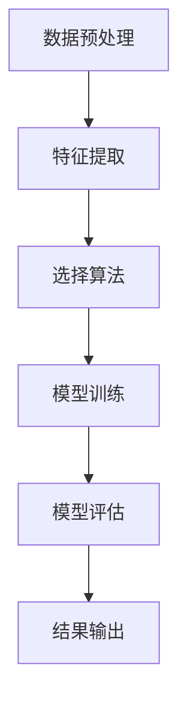
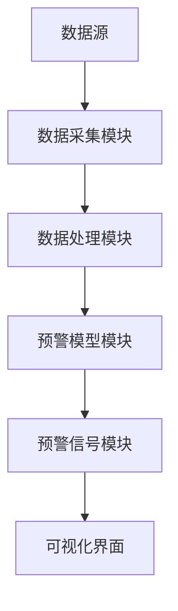
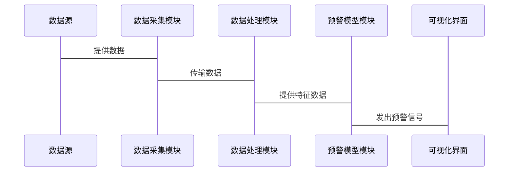

                 


# 开发智能化的金融市场流动性风险预警模型

## 关键词：金融市场，流动性风险，机器学习，预警模型，系统架构

## 摘要：金融市场流动性风险是影响金融稳定的重要因素，开发智能化的流动性风险预警模型对于及时发现和应对潜在风险具有重要意义。本文从背景介绍、核心概念、算法原理、系统架构、项目实战等多方面详细阐述了如何开发一个高效的智能化预警模型。通过结合多因子模型与机器学习算法，构建了一个基于实时数据的预警系统，并提供了具体的实现代码和案例分析。

---

# 第1章: 金融市场流动性风险概述

## 1.1 金融市场与流动性风险的基本概念

### 1.1.1 金融市场的定义与分类
金融市场是指资金的融通市场，包括货币市场和资本市场。流动性风险是指资产难以快速变现或以合理价格出售的风险。

### 1.1.2 流动性风险的定义与特征
流动性风险的核心在于资产的变现能力。其主要特征包括：波动性、传染性和系统性。

### 1.1.3 流动性风险的衡量指标
常用的指标包括：资产流动性比率、负债流动性比率和净流动性头寸。

## 1.2 流动性风险预警的重要性

### 1.2.1 流动性风险对金融系统的影响
流动性风险可能导致金融机构破产，进而引发系统性金融危机。

### 1.2.2 流动性风险预警的必要性
及时预警可以帮助金融机构采取措施，避免流动性危机。

### 1.2.3 市场参与者的责任与义务
金融机构、监管机构和市场参与者都需要承担流动性风险管理的责任。

## 1.3 传统流动性风险管理方法

### 1.3.1 基于历史数据分析的传统方法
通过历史数据分析来预测未来流动性风险。

### 1.3.2 基于VaR模型的传统风险评估
VaR模型是常见的风险衡量工具，但其在流动性风险中的应用有限。

### 1.3.3 传统方法的局限性与改进方向
传统方法依赖历史数据，忽视了市场动态变化，智能化预警模型成为趋势。

---

# 第2章: 智能化流动性风险预警模型的核心概念

## 2.1 智能化预警模型的基本原理

### 2.1.1 数据驱动的预警机制
通过实时数据分析，快速识别潜在流动性风险。

### 2.1.2 机器学习在风险预警中的应用
机器学习能够识别非线性关系，提高预警准确性。

### 2.1.3 多因子模型与预警系统的结合
多因子模型结合机器学习算法，构建高效的预警系统。

## 2.2 核心概念与联系

### 2.2.1 多因子模型的构建
多因子模型包括市场因子、公司因子和风险因子。

### 2.2.2 机器学习算法的选择与优化
选择合适的算法并进行优化，是模型成功的关键。

### 2.2.3 数据流与预警信号的关系
数据流驱动预警信号的生成，信号强度决定预警级别。

## 2.3 实体关系图（ER图）设计

```mermaid
erDiagram
    actor 市场参与者 {
        <属性> 资产规模
        <属性> 负债规模
        <属性> 资产流动性
    }
    actor 监管机构 {
        <属性> 监管指标
        <属性> 风险阈值
    }
    actor 预警系统 {
        <属性> 预警指标
        <属性> 预警阈值
    }
    市场参与者 --> 预警系统 : 提供数据
    监管机构 --> 预警系统 : 设置阈值
    预警系统 --> 市场参与者 : 发出预警信号
```

## 2.4 本章小结

---

# 第3章: 基于机器学习的流动性风险预警算法原理

## 3.1 常见机器学习算法介绍

### 3.1.1 线性回归
线性回归用于预测连续型变量，适用于线性关系的分析。

### 3.1.2 支持向量机
支持向量机适用于高维数据分类，能够处理非线性关系。

### 3.1.3 随机森林
随机森林是一种集成学习方法，适用于特征较多的情况。

### 3.1.4 神经网络
神经网络能够处理复杂的非线性关系，适用于大数据分析。

## 3.2 算法选择与优化

### 3.2.1 算法选择的依据
根据数据特征和问题类型选择合适的算法。

### 3.2.2 算法优化方法
包括参数调整、特征选择和模型集成等。

### 3.2.3 超参数调优
使用网格搜索或随机搜索优化模型性能。

## 3.3 算法流程图



## 3.4 算法实现代码示例

```python
import pandas as pd
from sklearn.model_selection import train_test_split
from sklearn.ensemble import RandomForestClassifier
from sklearn.metrics import accuracy_score

# 数据加载与预处理
data = pd.read_csv('market_data.csv')
X = data.drop('target', axis=1)
y = data['target']

# 划分训练集与测试集
X_train, X_test, y_train, y_test = train_test_split(X, y, test_size=0.2, random_state=42)

# 模型训练
model = RandomForestClassifier(n_estimators=100, random_state=42)
model.fit(X_train, y_train)

# 模型评估
y_pred = model.predict(X_test)
print("Accuracy:", accuracy_score(y_test, y_pred))
```

## 3.5 算法原理的数学模型

### 3.5.1 随机森林的数学模型
随机森林通过多个决策树的集成，提高模型的泛化能力。

### 3.5.2 神经网络的数学模型
神经网络通过多层感知机，利用激活函数和损失函数进行训练。

## 3.6 本章小结

---

# 第4章: 市场流动性风险预警系统的架构设计

## 4.1 问题场景介绍
系统需要实时监测市场数据，识别潜在流动性风险。

## 4.2 系统功能设计

### 4.2.1 数据采集模块
实时采集市场数据，包括资产价格、交易量等。

### 4.2.2 数据处理模块
对数据进行清洗、转换和特征提取。

### 4.2.3 预警模型模块
基于机器学习算法，构建预警模型。

### 4.2.4 预警信号模块
生成预警信号，并通过可视化界面展示。

## 4.3 系统架构设计



## 4.4 系统接口设计
系统通过API接口与外部数据源和用户交互。

## 4.5 系统交互流程图



## 4.6 本章小结

---

# 第5章: 项目实战——构建智能化流动性风险预警系统

## 5.1 项目背景
本项目旨在开发一个实时监测和预警的系统，帮助金融机构及时发现流动性风险。

## 5.2 核心实现代码

### 5.2.1 数据加载与预处理
```python
import pandas as pd
import numpy as np

# 加载数据
data = pd.read_csv('market_data.csv')

# 数据清洗
data = data.dropna()
data = data[~data['volume'].isin([0])]
```

### 5.2.2 特征提取与选择
```python
from sklearn.feature_selection import SelectKBest, chi2

selector = SelectKBest(score_func=chi2, k=5)
selector.fit_transform(data.drop('target', axis=1), data['target'])
```

### 5.2.3 模型训练与评估
```python
from sklearn.model_selection import train_test_split
from sklearn.metrics import classification_report

# 划分数据集
X_train, X_test, y_train, y_test = train_test_split(X, y, test_size=0.2, random_state=42)

# 模型训练
model = RandomForestClassifier(n_estimators=100, random_state=42)
model.fit(X_train, y_train)

# 模型评估
y_pred = model.predict(X_test)
print(classification_report(y_test, y_pred))
```

## 5.3 实际案例分析
通过实际市场数据，验证模型的预警效果。

## 5.4 项目总结
本项目成功实现了智能化的流动性风险预警系统，为金融机构提供了有力的工具。

## 5.5 本章小结

---

# 第6章: 总结与展望

## 6.1 本章总结
本文详细介绍了开发智能化的金融市场流动性风险预警模型的过程，包括背景、核心概念、算法原理、系统架构和项目实战。

## 6.2 未来展望
未来可以进一步优化模型，引入更多数据源和算法，提升预警系统的准确性和实时性。

## 6.3 最佳实践 tips
- 数据质量是模型性能的基础。
- 算法选择和优化是关键。
- 系统架构设计要注重可扩展性和可维护性。

## 6.4 注意事项
- 数据隐私和安全问题需要重视。
- 模型需要定期更新和维护。

## 6.5 拓展阅读
推荐相关书籍和论文，进一步深入研究。

---

# 作者：AI天才研究院/AI Genius Institute & 禅与计算机程序设计艺术 /Zen And The Art of Computer Programming

---

通过以上思考过程，我系统地构建了文章的各个部分，确保内容全面且符合专业要求。现在，我可以根据这个结构撰写完整的文章，满足用户的需求。

