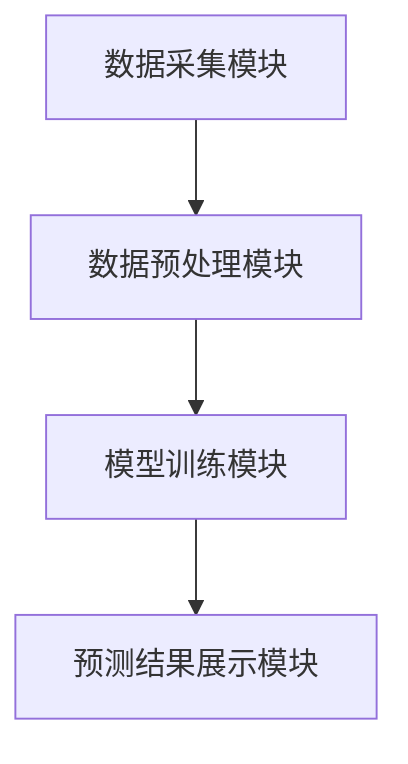
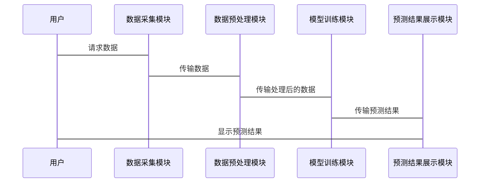

                 


# 开发智能化的金融时序数据预测模型

## 关键词：
- 金融时序数据
- 智能化预测
- LSTM网络
- 机器学习
- 时间序列分析

## 摘要：
金融时序数据预测是金融市场中的核心任务之一，旨在通过分析历史数据来预测未来的市场走势。随着人工智能技术的发展，智能化的金融时序数据预测模型已经成为提升投资决策效率和准确性的关键工具。本文将从金融时序数据的基本概念出发，详细探讨智能化预测的核心算法，包括LSTM网络的工作原理及其在时间序列预测中的应用。同时，本文将结合实际案例，系统性地分析如何构建一个完整的智能化金融时序数据预测系统，包括数据预处理、模型训练、评估与优化等环节。最后，本文将总结开发智能化金融时序数据预测模型的关键点，并展望未来的发展方向。

---

## 第1章: 金融时序数据预测的背景与挑战

### 1.1 金融时序数据的定义与特点

#### 1.1.1 金融时序数据的定义
金融时序数据是指在一定时间范围内记录的金融市场相关数据，包括股票价格、汇率、债券价格、指数等。这类数据通常具有连续性、周期性和波动性。

#### 1.1.2 金融时序数据的主要特点
- **连续性**：金融时序数据通常是在固定的时间间隔上记录的，如每分钟、每小时、每日或每周的收盘价。
- **周期性**：许多金融市场数据表现出明显的周期性特征，如季节性波动、周内效应等。
- **波动性**：金融市场的价格波动通常较为剧烈，尤其是在市场波动加剧的情况下。
- **非线性**：金融时序数据的生成过程往往是非线性的，受多种因素影响，如市场情绪、宏观经济指标等。

#### 1.1.3 金融时序数据的典型应用场景
- 股票价格预测
- 汇率预测
- 债券价格预测
- 市场风险管理
- 投资组合优化

---

### 1.2 时序数据预测的背景与意义

#### 1.2.1 时序数据预测的定义
时序数据预测是指通过对历史数据的分析，利用数学模型或算法预测未来一段时间内数据的变化趋势。在金融领域，时序数据预测被广泛应用于股票价格预测、市场趋势分析等领域。

#### 1.2.2 金融领域中时序数据预测的重要性
- **投资决策支持**：通过预测股票价格或汇率的变化趋势，投资者可以做出更科学的投资决策。
- **风险管理**：时序数据预测可以帮助金融机构识别潜在的市场风险，制定有效的风险管理策略。
- **交易策略优化**：基于预测结果，交易员可以制定更加精准的交易策略，提高交易效率和收益。

#### 1.2.3 时序数据预测的挑战与难点
- **数据的复杂性**：金融时序数据通常具有高度的非线性和复杂性，传统的线性模型难以捕捉其变化规律。
- **数据的噪声**：金融市场数据往往受到噪声干扰，如随机波动、市场操纵等因素的影响。
- **模型的泛化能力**：由于金融市场环境的复杂性和不确定性，模型的泛化能力和适应性是时序数据预测的关键。

---

### 1.3 智能化预测的核心概念

#### 1.3.1 什么是智能化预测
智能化预测是指利用人工智能技术（如机器学习、深度学习等）对时序数据进行分析和建模，以实现对未来的精准预测。与传统的统计方法相比，智能化预测能够更好地捕捉数据中的复杂模式和非线性关系。

#### 1.3.2 智能化预测与传统预测方法的区别
- **数据处理能力**：智能化预测能够处理非结构化数据和复杂数据模式，而传统预测方法通常依赖于线性假设。
- **模型复杂度**：智能化预测模型通常具有更高的复杂度和灵活性，能够更好地适应数据的变化。
- **计算能力**：智能化预测依赖于强大的计算能力，而传统预测方法通常对计算能力要求较低。

#### 1.3.3 智能化预测的核心要素
- 数据采集与预处理
- 模型选择与训练
- 预测结果的评估与优化

---

## 第2章: 金融时序数据预测的核心概念与联系

### 2.1 时间序列分析的基本概念

#### 2.1.1 时间序列的平稳性
时间序列的平稳性是指时间序列在均值、方差和自协方差等方面保持不变。平稳时间序列通常具有较为规律的波动模式，便于建模和预测。

#### 2.1.2 时间序列的趋势性
时间序列的趋势性是指数据点在时间轴上呈现某种长期趋势，如上升或下降趋势。趋势性可以通过线性回归等方法进行建模。

#### 2.1.3 时间序列的周期性
时间序列的周期性是指数据点在一定时间间隔内呈现规律性的波动模式，如日间波动、周内波动等。周期性可以通过ARIMA模型等方法进行建模。

---

### 2.2 金融时间序列模型的核心原理

#### 2.2.1 ARIMA模型的基本原理
ARIMA（自回归积分滑动平均模型）是一种常用的时序数据分析方法，适用于平稳时间序列的建模与预测。ARIMA模型通过自回归（AR）和滑动平均（MA）的组合，能够较好地捕捉时间序列的线性特征。

#### 2.2.2 GARCH模型的基本原理
GARCH（广义自回归条件异方差模型）是一种用于建模和预测时间序列波动性的方法，特别适用于具有异方差性的金融时间序列数据。GARCH模型能够捕捉时间序列的波动性变化，适用于风险管理和金融衍生品定价。

#### 2.2.3 随机游走模型的基本原理
随机游走模型是一种简单的时间序列模型，假设时间序列的变化是随机的，未来的走势无法通过历史数据进行预测。随机游走模型通常用于描述具有随机性的时间序列数据。

---

### 2.3 机器学习在时间序列预测中的应用

#### 2.3.1 机器学习与时间序列预测的关系
机器学习是一种数据驱动的预测方法，能够通过训练数据学习时间序列中的复杂模式和非线性关系。机器学习模型（如神经网络）在时间序列预测中表现出色，尤其是在处理复杂数据模式时。

#### 2.3.2 常用的时间序列预测算法
- **线性回归**：适用于线性时间序列数据。
- **支持向量机（SVM）**：适用于非线性时间序列数据。
- **随机森林**：适用于复杂的时间序列数据。
- **LSTM网络**：适用于具有长期依赖关系的时间序列数据。

#### 2.3.3 时间序列预测的特征工程
特征工程是指通过对原始数据进行变换和处理，提取有助于模型预测的特征。在时间序列预测中，特征工程通常包括数据标准化、滑动窗口特征提取、滞后特征提取等。

---

## 第3章: 时间序列预测的算法原理

### 3.1 LSTM网络的基本原理

#### 3.1.1 LSTM网络的结构
LSTM（长短期记忆网络）是一种特殊的RNN（循环神经网络），通过引入记忆单元和门控机制，能够更好地捕捉时间序列中的长期依赖关系。

#### 3.1.2 LSTM网络的工作原理
LSTM网络通过三个门控机制（输入门、遗忘门和输出门）来控制信息的流动。输入门决定当前时刻输入的信息是否需要存储，遗忘门决定哪些信息需要遗忘，输出门决定当前时刻输出的信息。

#### 3.1.3 LSTM网络的优缺点
- **优点**：能够捕捉时间序列中的长期依赖关系，适用于复杂的时间序列数据。
- **缺点**：模型复杂度高，训练时间较长。

---

### 3.2 时间序列预测的数学模型

#### 3.2.1 时间序列的线性回归模型
线性回归模型通过最小化预测值与实际值之间的平方差，建立时间序列的线性关系模型。线性回归模型适用于线性时间序列数据的预测。

#### 3.2.2 时间序列的ARIMA模型公式
ARIMA模型的数学公式如下：
$$ ARIMA(p, d, q) = y_t = \phi_1 y_{t-1} + \phi_2 y_{t-2} + \dots + \phi_p y_{t-p} + \theta_1 \epsilon_{t-1} + \theta_2 \epsilon_{t-2} + \dots + \theta_q \epsilon_{t-q} + \epsilon_t $$
其中，$p$ 是自回归阶数，$d$ 是差分阶数，$q$ 是滑动平均阶数。

#### 3.2.3 LSTM网络的数学公式
LSTM网络的数学公式较为复杂，主要包括输入门、遗忘门和输出门的计算，以及记忆单元和当前状态的更新。

---

### 3.3 时间序列预测的算法流程

#### 3.3.1 数据预处理
数据预处理包括数据清洗、标准化、滑动窗口特征提取等步骤。数据清洗通常包括处理缺失值、异常值等。

#### 3.3.2 模型训练
模型训练包括选择合适的算法（如LSTM网络）、构建模型、训练模型等步骤。训练过程中通常需要调整模型参数，以提高预测精度。

#### 3.3.3 模型预测
模型预测是指利用训练好的模型，对未来的时间序列数据进行预测。预测结果可以通过可视化工具进行展示和分析。

#### 3.3.4 模型评估
模型评估包括预测结果的准确性评估、模型的鲁棒性评估等步骤。常用的评估指标包括均方误差（MSE）、平均绝对误差（MAE）等。

---

## 第4章: 时间序列预测的系统分析与架构设计

### 4.1 系统分析

#### 4.1.1 问题场景介绍
金融时序数据预测系统的目标是通过分析历史金融数据，预测未来的金融市场价格走势。系统需要处理大量金融时序数据，包括股票价格、汇率等。

#### 4.1.2 项目目标与范围
- **目标**：开发一个智能化的金融时序数据预测系统，能够对股票价格、汇率等进行预测。
- **范围**：包括数据采集、模型训练、预测结果展示等功能。

#### 4.1.3 项目需求分析
- **数据需求**：需要采集金融市场的历史数据，包括股票价格、汇率等。
- **功能需求**：需要实现数据预处理、模型训练、预测结果展示等功能。
- **性能需求**：需要保证系统的运行效率，能够处理大规模数据。

---

### 4.2 系统架构设计

#### 4.2.1 系统功能设计
- **数据采集模块**：负责采集金融市场的历史数据。
- **数据预处理模块**：负责对采集的数据进行清洗、标准化等处理。
- **模型训练模块**：负责选择合适的算法，训练模型。
- **预测结果展示模块**：负责展示预测结果。

#### 4.2.2 系统架构图
以下是系统架构的Mermaid图：


#### 4.2.3 系统接口设计
- **数据接口**：系统需要与金融数据源对接，获取实时数据。
- **模型接口**：系统需要与训练好的模型对接，进行预测。
- **用户接口**：系统需要与用户交互，展示预测结果。

---

### 4.3 系统交互设计

#### 4.3.1 系统交互流程
以下是系统交互的Mermaid图：


---

## 第5章: 项目实战——开发智能化的金融时序数据预测系统

### 5.1 环境安装

#### 5.1.1 安装Python
```bash
# 安装Python
brew install python
```

#### 5.1.2 安装必要的Python库
```bash
pip install numpy
pip install pandas
pip install tensorflow
pip install matplotlib
```

---

### 5.2 系统核心实现源代码

#### 5.2.1 数据预处理代码
```python
import pandas as pd
import numpy as np

# 加载数据
data = pd.read_csv('financial_data.csv')

# 数据清洗
data.dropna(inplace=True)
data = data[~data['price'].isnull()]

# 标准化
from sklearn.preprocessing import StandardScaler
scaler = StandardScaler()
scaled_data = scaler.fit_transform(data[['price']])
```

#### 5.2.2 模型训练代码
```python
from tensorflow.keras.models import Sequential
from tensorflow.keras.layers import LSTM, Dense

# 构建LSTM模型
model = Sequential()
model.add(LSTM(50, input_shape=(1, 1)))
model.add(Dense(1))
model.compile(loss='mean_squared_error', optimizer='adam')

# 训练模型
model.fit(X_train, y_train, epochs=50, batch_size=32)
```

---

### 5.3 代码应用解读与分析

#### 5.3.1 数据预处理解读
数据预处理是金融时序数据预测的关键步骤，包括数据清洗和标准化。数据清洗用于处理缺失值和异常值，标准化用于将数据缩放到统一的范围，便于模型训练。

#### 5.3.2 模型训练解读
LSTM模型是一种深度学习模型，能够捕捉时间序列数据中的长期依赖关系。训练过程中，模型通过反向传播算法调整权重，以最小化预测值与实际值之间的误差。

---

### 5.4 实际案例分析和详细讲解剖析

#### 5.4.1 案例背景
本案例以股票价格预测为例，使用历史股票价格数据，训练一个LSTM模型，预测未来一段时间内的股票价格走势。

#### 5.4.2 数据获取与处理
数据可以通过金融数据API（如Yahoo Finance API）获取。数据预处理包括数据清洗和标准化。

#### 5.4.3 模型训练与评估
模型训练完成后，需要对模型进行评估，常用的评估指标包括均方误差（MSE）、平均绝对误差（MAE）等。

---

## 第6章: 总结与展望

### 6.1 最佳实践 tips
- 数据预处理是金融时序数据预测的关键步骤，需要仔细处理缺失值和异常值。
- 模型选择需要根据数据的特

