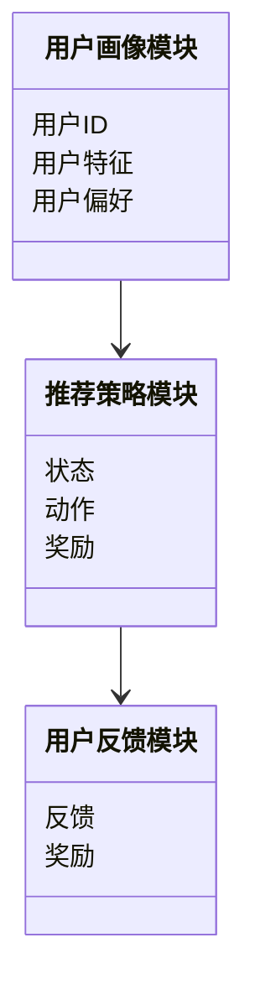
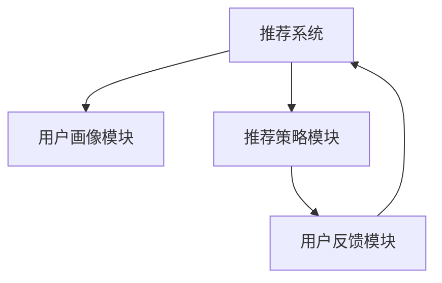
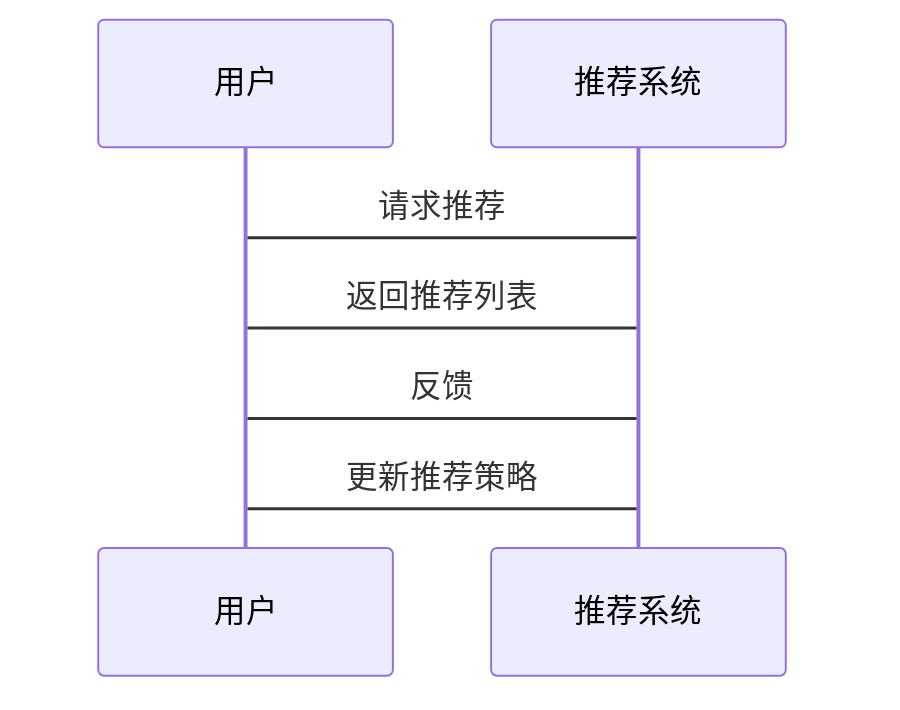

                 


# 强化学习在AI Agent个性化推荐中的应用

## 关键词：强化学习, AI Agent, 个性化推荐, 算法原理, 系统设计

## 摘要：本文详细探讨了强化学习在AI Agent个性化推荐系统中的应用，从强化学习的基本概念到其在推荐系统中的实际应用，从算法原理到系统架构设计，再到项目实战，全面分析了强化学习如何助力AI Agent实现个性化的推荐服务。通过本文，读者将深入了解强化学习在推荐系统中的核心作用，掌握如何设计和实现基于强化学习的个性化推荐系统。

---

# 第1章 强化学习与AI Agent的基本概念

## 1.1 强化学习的定义与核心概念

### 1.1.1 强化学习的基本定义
强化学习（Reinforcement Learning, RL）是一种机器学习范式，通过智能体与环境的交互，智能体通过不断尝试和错误，学习如何采取行动以最大化累积的奖励。与监督学习和无监督学习不同，强化学习不需要明确的标签数据，而是通过奖励信号来指导学习过程。

### 1.1.2 强化学习的核心概念与特点
- **状态（State）**：智能体所处环境的表示。
- **动作（Action）**：智能体在某一状态下做出的行为。
- **奖励（Reward）**：智能体在某个状态下采取某个动作后获得的反馈，用于指导学习。
- **策略（Policy）**：智能体选择动作的规则，可以是随机的或确定性的。
- **价值函数（Value Function）**：衡量某个状态或动作的好坏的函数。
- **马尔可夫决策过程（MDP）**：描述强化学习问题的数学框架，包括状态、动作、转移概率和奖励函数。

### 1.1.3 强化学习与监督学习、无监督学习的区别
- **监督学习**：基于标记数据，学习输入到输出的映射。
- **无监督学习**：基于未标记数据，发现数据中的结构。
- **强化学习**：基于与环境的交互，通过奖励信号优化决策策略。

## 1.2 AI Agent的基本概念与类型

### 1.2.1 AI Agent的定义与分类
AI Agent（智能体）是能够感知环境并采取行动以实现目标的实体。根据智能体的结构和功能，可以分为：
- **反应式智能体**：基于当前感知做出反应。
- **认知式智能体**：具有复杂推理和规划能力。
- **学习型智能体**：通过与环境交互学习优化自身行为。

### 1.2.2 AI Agent的核心功能与应用场景
AI Agent的核心功能包括感知、决策、学习和执行。应用场景广泛，如游戏AI、机器人控制、推荐系统等。

### 1.2.3 AI Agent与强化学习的结合
强化学习为AI Agent提供了自适应优化策略的能力，使其能够在动态环境中做出最优决策。

## 1.3 强化学习在AI Agent中的应用背景

### 1.3.1 个性化推荐的定义与目标
个性化推荐是根据用户的偏好和行为，推荐相关的内容或产品。

### 1.3.2 强化学习在个性化推荐中的优势
强化学习能够通过与用户的交互不断优化推荐策略，提供更精准的推荐。

### 1.3.3 AI Agent在个性化推荐中的角色与价值
AI Agent作为推荐系统的决策者，利用强化学习优化推荐策略，提升用户体验。

---

# 第2章 强化学习的核心原理与数学模型

## 2.1 强化学习的基本原理

### 2.1.1 状态、动作、奖励的定义与关系
- **状态**：用户的行为或环境的特征。
- **动作**：推荐系统做出的推荐行为。
- **奖励**：用户对推荐的反馈，如点击、购买等。

### 2.1.2 强化学习的马尔可夫决策过程（MDP）模型
MDP由状态空间S、动作空间A、转移概率P和奖励函数R组成。

### 2.1.3 策略与价值函数的定义与作用
- **策略（Policy）**：从状态到动作的映射。
- **价值函数（Value Function）**：衡量状态或动作的价值。

## 2.2 强化学习的数学模型

### 2.2.1 状态值函数（Value Function）的定义与公式
状态值函数V(s)表示在状态s下采取某种策略的期望奖励。

$$ V(s) = E[r_t + \gamma r_{t+1} + \gamma^2 r_{t+2} + \dots ] $$

### 2.2.2 动作值函数（Q-value Function）的定义与公式
动作值函数Q(s,a)表示在状态s下采取动作a的期望奖励。

$$ Q(s,a) = E[r_t + \gamma r_{t+1} + \gamma^2 r_{t+2} + \dots ] $$

### 2.2.3 策略梯度（Policy Gradient）的基本原理
策略梯度方法通过优化策略的参数，最大化累积奖励。

### 2.2.4 贝叶斯强化学习的基本概念
贝叶斯强化学习通过概率模型表示不确定性，更新信念以指导决策。

## 2.3 强化学习的核心算法

### 2.3.1 Q-learning算法的原理与步骤
Q-learning通过更新Q表，学习状态-动作对的值。

### 2.3.2 Deep Q-Network（DQN）的基本原理
DQN结合深度神经网络和Q-learning，通过经验回放和目标网络优化。

### 2.3.3 策略梯度方法（PG、PPO）的基本原理
策略梯度方法直接优化策略参数，通过梯度上升或下降。

### 2.3.4 多智能体强化学习的基本概念
多智能体强化学习涉及多个智能体协同工作，优化全局目标。

---

# 第3章 AI Agent的强化学习框架与实现

## 3.1 强化学习框架的设计与选择

### 3.1.1 简单强化学习框架的设计
设计简单强化学习框架，明确状态、动作和奖励。

### 3.1.2 基于深度学习的强化学习框架（如DQN）
使用深度神经网络近似Q函数。

### 3.1.3 多智能体强化学习框架的选择
选择适合多智能体的强化学习框架，如MAPO或MADDPG。

## 3.2 强化学习的训练过程与优化方法

### 3.2.1 状态空间与动作空间的定义与设计
定义合适的状态和动作空间，确保覆盖所有可能的情况。

### 3.2.2 奖励函数的设计原则与技巧
设计合理的奖励函数，平衡短期和长期目标。

### 3.2.3 策略优化方法（如策略梯度、Q-learning）的对比
比较不同策略优化方法的优缺点，选择合适的方法。

### 3.2.4 贝叶斯强化学习的应用
通过概率建模，处理不确定性，提升决策质量。

---

# 第4章 系统分析与架构设计方案

## 4.1 个性化推荐系统场景介绍

### 4.1.1 推荐系统的典型场景
- 用户行为分析
- 个性化推荐生成
- 用户反馈收集

## 4.2 系统功能设计

### 4.2.1 系统功能模块
- 用户画像模块
- 推荐策略模块
- 用户反馈模块

### 4.2.2 领域模型设计
使用Mermaid绘制类图，展示各模块之间的关系。



## 4.3 系统架构设计

### 4.3.1 系统架构设计
使用Mermaid绘制系统架构图，展示各组件之间的关系。



## 4.4 系统接口设计

### 4.4.1 接口定义
- 输入接口：用户行为数据
- 输出接口：推荐列表

## 4.5 系统交互设计

### 4.5.1 交互流程
使用Mermaid绘制交互序列图，展示系统与用户之间的交互流程。



---

# 第5章 项目实战

## 5.1 环境安装

### 5.1.1 环境要求
- Python 3.8+
- TensorFlow或PyTorch

## 5.2 系统核心实现源代码

### 5.2.1 强化学习推荐系统实现

```python
import numpy as np
import gym

class ReinforcementLearningAgent:
    def __init__(self, env):
        self.env = env
        self.gamma = 0.99
        self.lr = 0.001
        self.epsilon = 1.0
        self.epsilon_min = 0.01
        self.epsilon_decay = 0.995

    def get_action(self, state):
        if np.random.random() < self.epsilon:
            return self.env.action_space.sample()
        else:
            return np.argmax(self.model.predict(state))

    def train(self, state, action, reward, next_state):
        target = reward + self.gamma * self.model.predict(next_state)[0]
        target = np.array(target)
        self.model.fit(state, target, epochs=1, verbose=0)
        if self.epsilon > self.epsilon_min:
            self.epsilon *= self.epsilon_decay

# 创建环境和代理
env = gym.make('CartPole-v1')
agent = ReinforcementLearningAgent(env)
```

## 5.3 代码应用解读与分析

### 5.3.1 代码功能分析
- 初始化强化学习代理，定义超参数。
- 根据状态选择动作。
- 更新模型，优化策略。

## 5.4 实际案例分析

### 5.4.1 实验结果分析
通过实验验证强化学习在推荐系统中的效果。

## 5.5 项目小结

### 5.5.1 项目总结
强化学习能够显著提升个性化推荐系统的性能。

---

# 第6章 最佳实践

## 6.1 关键点总结

### 6.1.1 强化学习的核心要素
- 状态、动作、奖励的设计
- 策略优化方法的选择
- 奖励函数的设计

## 6.2 小结

### 6.2.1 项目总结
通过强化学习优化推荐系统，提升用户体验。

## 6.3 注意事项

### 6.3.1 实践中需要注意的事项
- 状态空间和动作空间的设计要合理
- 奖励函数设计要平衡短期和长期目标
- 需要不断调整参数和策略

## 6.4 拓展阅读

### 6.4.1 推荐的书籍和文章
- 《强化学习（Deep Reinforcement Learning）》
- 《Reinforcement Learning: Theory and Algorithms》

---

# 结语

通过本文的详细讲解，读者可以深入了解强化学习在AI Agent个性化推荐系统中的应用，从理论到实践，全面掌握如何设计和实现基于强化学习的个性化推荐系统。希望本文能够为相关领域的研究和实践提供有价值的参考。

---

# 作者

作者：AI天才研究院/AI Genius Institute & 禅与计算机程序设计艺术 /Zen And The Art of Computer Programming

