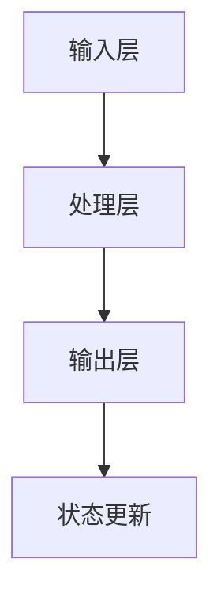
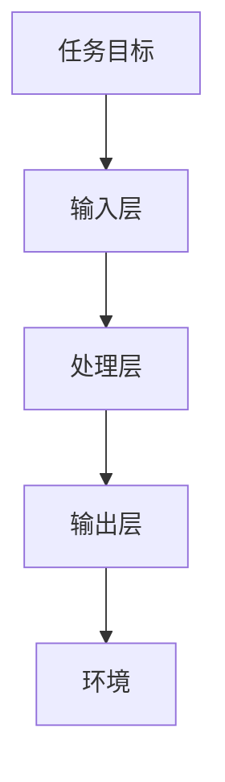
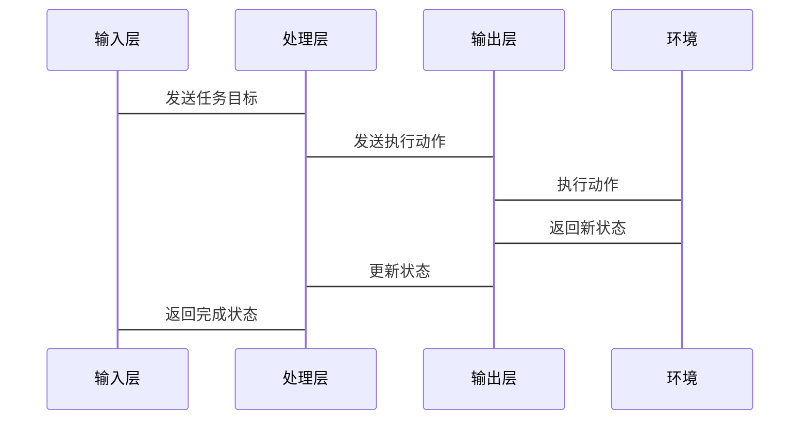
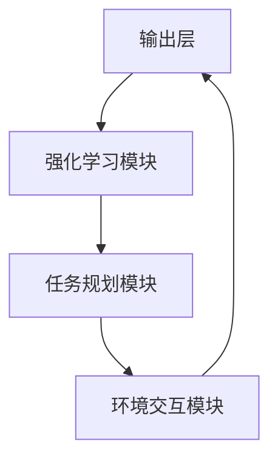

                 


# 强化学习在AI Agent任务规划中的应用

> 关键词：强化学习、AI Agent、任务规划、算法原理、系统设计、项目实战

> 摘要：本文详细探讨了强化学习在AI Agent任务规划中的应用，从强化学习的基本概念、核心算法、任务规划的定义与挑战，到系统设计与实现、项目实战以及扩展与展望，系统地分析了强化学习在AI Agent任务规划中的理论基础、算法实现、系统架构和实际应用。通过本文，读者可以全面了解强化学习在AI Agent任务规划中的应用，并掌握相关的核心技术和实现方法。

---

# 第一部分: 强化学习与AI Agent任务规划基础

## 第1章: 强化学习与AI Agent概述

### 1.1 强化学习的基本概念

#### 1.1.1 强化学习的定义
强化学习（Reinforcement Learning，RL）是一种机器学习范式，通过智能体与环境的交互，学习最优策略以最大化累积奖励。与监督学习不同，强化学习不需要标注数据，而是通过试错和奖励机制来优化决策过程。

#### 1.1.2 强化学习的核心要素
- **状态（State）**：环境在某一时刻的描述，表示智能体所处的环境情况。
- **动作（Action）**：智能体在给定状态下采取的行为或决策。
- **奖励（Reward）**：智能体执行动作后，环境给予的反馈，用于评估动作的好坏。
- **策略（Policy）**：智能体在某一状态下选择动作的概率分布或确定性规则。
- **值函数（Value Function）**：衡量某状态下策略的好坏，帮助智能体做出决策。

#### 1.1.3 强化学习与监督学习的区别
| 特性 | 强化学习 | 监督学习 |
|------|----------|----------|
| 数据 | 试错数据 | 标签数据 | 
| 目标 | 最大化奖励 | 最小化误差 |
| 决策 | 动作选择 | 标签分类或回归 |

### 1.2 AI Agent的定义与特点

#### 1.2.1 AI Agent的定义
AI Agent（人工智能代理）是指能够感知环境、自主决策并执行任务的智能实体。它可以是一个软件程序、机器人或其他智能系统。

#### 1.2.2 AI Agent的核心特点
- **自主性**：能够在没有外部干预的情况下自主决策。
- **反应性**：能够根据环境的变化实时调整行为。
- **目标导向性**：具有明确的目标，并根据目标优化决策。
- **学习能力**：能够通过经验改进自身的决策能力。

#### 1.2.3 AI Agent的分类
| 类型 | 描述 | 示例 |
|------|------|------|
| 简单反射型 | 基于当前状态做出反应 | 自动门禁系统 |
| 目标驱动型 | 根据目标选择动作 | 自动化交易系统 |
| 情景驱动型 | 基于上下文做出决策 | 智能客服系统 |

### 1.3 任务规划的定义与应用

#### 1.3.1 任务规划的定义
任务规划是指智能体根据目标和环境状态，制定一系列动作以实现目标的过程。

#### 1.3.2 任务规划的核心要素
- **目标**：智能体需要完成的任务或目标。
- **环境**：智能体所处的物理或虚拟环境。
- **动作**：智能体可以执行的动作或操作。
- **奖励**：智能体执行动作后获得的反馈。

#### 1.3.3 任务规划的典型应用场景
- **机器人控制**：智能机器人在复杂环境中执行任务。
- **自动驾驶**：自动驾驶汽车在交通环境中规划路径。
- **智能助手**：智能助手根据用户需求执行任务。

---

## 第2章: 强化学习在任务规划中的应用背景

### 2.1 强化学习在AI Agent任务规划中的优势

#### 2.1.1 强化学习的灵活性
强化学习能够处理复杂的动态环境，适应环境的变化，具有很强的灵活性。

#### 2.1.2 强化学习的自主性
强化学习通过自主试错学习，能够在没有外部干预的情况下完成任务。

#### 2.1.3 强化学习的适应性
强化学习能够根据环境反馈调整策略，具有很强的适应性。

### 2.2 任务规划中的强化学习挑战

#### 2.2.1 状态空间的复杂性
复杂的环境会导致状态空间维度高，增加学习难度。

#### 2.2.2 动作空间的多样性
多样化的动作选择增加了学习的复杂性。

#### 2.2.3 奖励函数的设计难度
奖励函数的设计需要准确反映任务目标，否则会影响学习效果。

### 2.3 本章小结
本章分析了强化学习在AI Agent任务规划中的优势和挑战，为后续章节的深入分析奠定了基础。

---

# 第二部分: 强化学习的核心算法

## 第3章: Q-learning算法

### 3.1 Q-learning的基本原理

#### 3.1.1 状态-动作-奖励-状态 (SARSA) 过程
智能体在状态s下选择动作a，执行后进入新状态s'，并获得奖励r。

#### 3.1.2 Q值更新公式
$$ Q(s, a) = Q(s, a) + \alpha [r + \gamma \max Q(s', a')] - Q(s, a) $$

其中：
- $\alpha$ 是学习率
- $\gamma$ 是折扣因子
- $r$ 是奖励
- $\max Q(s', a')$ 是新状态下最大的Q值

#### 3.1.3 探索与利用策略
- **探索**：尝试未访问过的动作，避免陷入局部最优。
- **利用**：利用当前知识选择最优动作，提高累积奖励。

### 3.2 Q-learning的数学模型

#### 3.2.1 Q值更新公式推导
$$ Q_{t+1}(s, a) = Q_t(s, a) + \alpha (r + \gamma Q_t(s', a') - Q_t(s, a)) $$

#### 3.2.2 状态转移概率矩阵
$$ P(s' | s, a) $$

其中，$P(s' | s, a)$ 表示在状态s下采取动作a后转移到状态s'的概率。

#### 3.2.3 奖励函数的设计
奖励函数需要根据任务目标设计，例如：
$$ r = 1 \text{ 如果动作正确，否则 } r = 0 $$

### 3.3 Q-learning的算法实现

#### 3.3.1 算法步骤
1. 初始化Q值表。
2. 进入循环：
   - 选择当前状态下的动作。
   - 执行动作，获得新状态和奖励。
   - 更新Q值表。
3. 重复步骤2，直到收敛。

#### 3.3.2 算法伪代码
```python
Initialize Q(s, a) = 0 for all s, a
while True:
    s = get_current_state()
    a = choose_action(s)  # 探索与利用策略
    s', r = take_action(s, a)
    Q(s, a) += α * (r + γ * max Q(s', a') - Q(s, a))
```

#### 3.3.3 算法实现示例
```python
import numpy as np

class QLearning:
    def __init__(self, state_space, action_space, alpha=0.1, gamma=0.9):
        self.state_space = state_space
        self.action_space = action_space
        self.Q = np.zeros((state_space, action_space))
        self.alpha = alpha
        self.gamma = gamma

    def choose_action(self, state, epsilon=0.1):
        if np.random.random() < epsilon:
            return np.random.randint(self.action_space)
        else:
            return np.argmax(self.Q[state, :])

    def update_Q(self, state, action, reward, next_state):
        self.Q[state, action] += self.alpha * (reward + self.gamma * np.max(self.Q[next_state, :]) - self.Q[state, action])
```

---

## 第4章: Deep Q-Network (DQN) 算法

### 4.1 DQN的基本原理

#### 4.1.1 神经网络近似值函数
使用神经网络近似Q值函数：
$$ Q(s, a) = \hat{Q}(s, a) $$

#### 4.1.2 经验回放
将经验存储在回放池中，随机抽取进行训练，避免序列依赖。

#### 4.1.3 权值更新
使用梯度下降优化神经网络参数，最小化预测值与目标值之间的误差。

### 4.2 DQN的数学模型

#### 4.2.1 状态值函数
$$ V(s) = \max_a Q(s, a) $$

#### 4.2.2 动作值函数
$$ Q(s, a) = r + \gamma \max_a Q(s', a') $$

#### 4.2.3 损失函数
$$ L = \mathbb{E}[(y - Q(s, a))^2] $$

其中，$y = r + \gamma \max Q(s', a')$。

### 4.3 DQN的算法实现

#### 4.3.1 算法步骤
1. 初始化经验回放池和神经网络。
2. 进入循环：
   - 选择当前状态下的动作。
   - 执行动作，获得新状态和奖励。
   - 存储经验。
   - 从经验池中随机抽取小批量数据，更新神经网络。
3. 重复步骤2，直到收敛。

#### 4.3.2 算法伪代码
```python
Initialize replay_buffer, DNN Q
while True:
    s = get_current_state()
    a = choose_action(s)
    s', r = take_action(s, a)
    replay_buffer.add((s, a, r, s'))
    batch = replay_buffer.sample(batch_size)
    for (s, a, r, s') in batch:
        target = r + γ * max(Q(s', a))
        Q(s, a) = Q(s, a) + α * (target - Q(s, a))
```

---

## 第5章: 策略梯度方法

### 5.1 策略梯度的基本原理

#### 5.1.1 策略直接优化
直接优化策略，而不是值函数。

#### 5.1.2 梯度上升法
通过梯度上升最大化累积奖励。

### 5.2 策略梯度的数学模型

#### 5.2.1 策略梯度定理
$$ \nabla J(\theta) = \mathbb{E}[ \nabla \log \pi_\theta(a|s) \cdot Q(s, a) ] $$

#### 5.2.2 梯度计算
$$ \nabla J(\theta) = \sum_{t} \nabla \log \pi_\theta(a_t|s_t) Q(s_t, a_t) $$

### 5.3 策略梯度的算法实现

#### 5.3.1 算法步骤
1. 初始化策略网络参数θ。
2. 进入循环：
   - 选择当前状态下的动作。
   - 执行动作，获得新状态和奖励。
   - 计算梯度，更新θ。
3. 重复步骤2，直到收敛。

#### 5.3.2 算法伪代码
```python
Initialize θ
while True:
    s = get_current_state()
    a = choose_action(s, θ)
    s', r = take_action(s, a)
    compute gradient ∇J(θ)
    θ = θ + α ∇J(θ)
```

---

## 第6章: Actor-Critic架构

### 6.1 Actor-Critic的基本原理

#### 6.1.1 分离Actor和Critic
- Actor负责选择动作。
- Critic负责评估Q值。

#### 6.1.2 同步更新
Actor和Critic网络参数同步更新。

### 6.2 Actor-Critic的数学模型

#### 6.2.1 策略网络
$$ \pi(a|s; θ) $$

#### 6.2.2 价值网络
$$ Q(s, a; φ) $$

#### 6.2.3 同步更新策略
$$ θ = φ $$

### 6.3 Actor-Critic的算法实现

#### 6.3.1 算法步骤
1. 初始化Actor和Critic网络参数θ和φ。
2. 进入循环：
   - 选择当前状态下的动作。
   - 执行动作，获得新状态和奖励。
   - 更新Critic网络。
   - 同步更新Actor网络。
3. 重复步骤2，直到收敛。

#### 6.3.2 算法伪代码
```python
Initialize θ, φ
while True:
    s = get_current_state()
    a = choose_action(s, θ)
    s', r = take_action(s, a)
    target = r + γ Q(s', a; φ)
    update φ: φ = φ + α (target - Q(s, a; φ))
    update θ: θ = φ
```

---

# 第三部分: 任务规划的强化学习方法

## 第7章: 基于状态空间和动作空间的强化学习方法

### 7.1 状态空间的建模

#### 7.1.1 状态表示
使用向量或图结构表示状态。

#### 7.1.2 动作空间的建模
使用动作树或动作图表示动作。

### 7.2 状态转移模型

#### 7.2.1 马尔可夫决策过程
$$ P(s' | s, a) $$

#### 7.2.2 马尔可夫性质
当前状态足以决定未来行为。

### 7.3 基于强化学习的任务规划算法

#### 7.3.1 增广状态空间
扩展状态空间以包含任务目标。

#### 7.3.2 多阶段任务规划
将任务分解为多个子任务，分阶段执行。

---

## 第8章: 多智能体协作的强化学习方法

### 8.1 多智能体协作的定义

#### 8.1.1 多智能体系统
多个智能体协同完成任务。

#### 8.1.2 协作任务规划
智能体之间协作完成复杂任务。

### 8.2 多智能体协作的强化学习挑战

#### 8.2.1 通信与协调
智能体之间需要通信和协调。

#### 8.2.2 假设与冲突
多个智能体可能有冲突的目标。

### 8.3 基于强化学习的多智能体协作算法

#### 8.3.1 基于价值函数的协作
使用价值函数进行协作。

#### 8.3.2 基于策略的协作
使用策略协作。

---

## 第9章: 基于知识图谱和规划树的强化学习方法

### 9.1 知识图谱的构建

#### 9.1.1 知识表示
使用知识图谱表示任务相关的知识。

#### 9.1.2 知识推理
基于知识图谱进行推理。

### 9.2 规划树的构建

#### 9.2.1 任务分解
将任务分解为子任务。

#### 9.2.2 动作选择
根据规划树选择动作。

### 9.3 基于知识图谱和规划树的强化学习算法

#### 9.3.1 知识增强的强化学习
结合知识图谱进行强化学习。

#### 9.3.2 规划树引导的强化学习
利用规划树指导强化学习。

---

# 第四部分: 系统设计与实现

## 第10章: 任务规划系统设计

### 10.1 任务规划系统的概述

#### 10.1.1 系统架构
- **输入层**：接收任务目标和环境信息。
- **处理层**：执行任务规划。
- **输出层**：输出执行动作。

#### 10.1.2 系统功能
- **任务分解**：将复杂任务分解为简单任务。
- **动作选择**：根据当前状态选择动作。
- **状态更新**：更新系统状态。

### 10.2 系统设计

#### 10.2.1 领域模型
使用领域模型描述任务和动作。

#### 10.2.2 系统架构


#### 10.2.3 接口设计
- **输入接口**：接收任务目标和环境信息。
- **输出接口**：输出执行动作。

### 10.3 系统实现

#### 10.3.1 系统架构


#### 10.3.2 系统交互


---

## 第11章: 基于强化学习的系统架构

### 11.1 系统架构设计

#### 11.1.1 系统模块
- **强化学习模块**：负责学习策略。
- **任务规划模块**：负责任务分解。
- **环境交互模块**：负责与环境交互。

#### 11.1.2 系统流程


### 11.2 系统实现

#### 11.2.1 强化学习模块实现
使用DQN或Actor-Critic算法实现。

#### 11.2.2 任务规划模块实现
使用任务分解算法实现。

#### 11.2.3 环境交互模块实现
实现与环境的接口交互。

### 11.3 系统优化

#### 11.3.1 算法优化
使用经验回放和网络优化。

#### 11.3.2 系统优化
优化系统架构和交互流程。

---

# 第五部分: 项目实战

## 第12章: 智能助手任务规划系统

### 12.1 项目背景

#### 12.1.1 项目目标
实现一个智能助手任务规划系统。

#### 12.1.2 项目需求
- **用户需求**：根据用户指令执行任务。
- **系统需求**：具备任务分解和动作选择能力。

### 12.2 项目实现

#### 12.2.1 环境配置
安装Python和相关库：
```bash
pip install numpy matplotlib keras
```

#### 12.2.2 核心实现
实现强化学习模块和任务规划模块：
```python
class Agent:
    def __init__(self, state_space, action_space):
        self.Q = np.zeros((state_space, action_space))
    
    def choose_action(self, state, epsilon=0.1):
        if np.random.random() < epsilon:
            return np.random.randint(action_space)
        else:
            return np.argmax(self.Q[state, :])
    
    def update_Q(self, state, action, reward, next_state):
        self.Q[state, action] += 0.1 * (reward + 0.9 * np.max(self.Q[next_state, :]) - self.Q[state, action])
```

#### 12.2.3 代码实现
```python
import numpy as np

class Agent:
    def __init__(self, state_space, action_space):
        self.Q = np.zeros((state_space, action_space))
    
    def choose_action(self, state, epsilon=0.1):
        if np.random.random() < epsilon:
            return np.random.randint(action_space)
        else:
            return np.argmax(self.Q[state, :])
    
    def update_Q(self, state, action, reward, next_state):
        self.Q[state, action] += 0.1 * (reward + 0.9 * np.max(self.Q[next_state, :]) - self.Q[state, action])

# 初始化
state_space = 4
action_space = 2
agent = Agent(state_space, action_space)

# 训练
for episode in range(1000):
    state = 0
    done = False
    while not done:
        action = agent.choose_action(state)
        next_state, reward, done = step(state, action)
        agent.update_Q(state, action, reward, next_state)
        state = next_state
```

---

## 第13章: 项目小结

### 13.1 项目成果
成功实现了智能助手任务规划系统。

### 13.2 项目经验
总结项目中的经验和教训。

### 13.3 项目优化
提出进一步优化的建议。

---

# 第六部分: 扩展与展望

## 第14章: 强化学习的前沿技术

### 14.1 模型无关方法
使用模型无关的强化学习方法。

### 14.2 元学习
研究元学习在强化学习中的应用。

### 14.3 图神经网络
结合图神经网络进行强化学习。

## 第15章: 强化学习与其他技术的结合

### 15.1 图神经网络
结合图神经网络进行强化学习。

### 15.2 多模态学习
结合多模态数据进行强化学习。

### 15.3 人机协作
研究人机协作的强化学习方法。

---

# 作者：AI天才研究院/AI Genius Institute & 禅与计算机程序设计艺术 /Zen And The Art of Computer Programming
---

