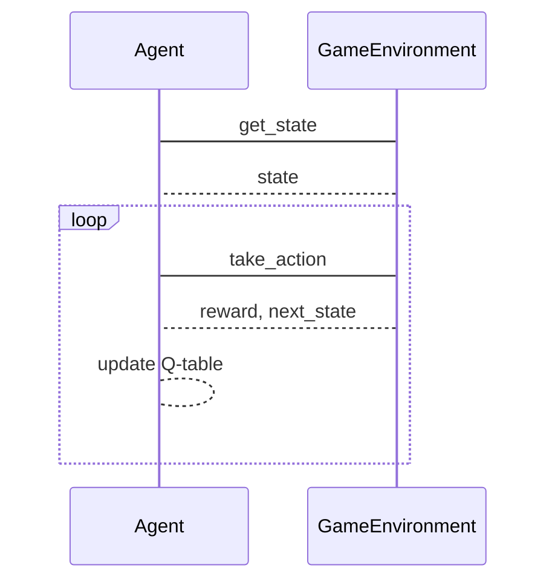

                 


# 强化学习在AI Agent决策中的应用

## 关键词：
强化学习, AI Agent, 决策过程, Q-learning, Deep Q-Network, 状态空间, 动作选择, 奖励机制

## 摘要：
强化学习是一种通过智能体与环境交互来学习最优策略的机器学习方法。本文深入探讨了强化学习在AI Agent决策中的应用，从理论基础到算法实现，再到实际项目案例，系统地分析了强化学习如何帮助AI Agent做出最优决策。通过详细讲解Q-learning和Deep Q-Network算法，结合实际的游戏AI和机器人导航案例，本文展示了强化学习在不同场景下的应用和实现。同时，本文还探讨了系统架构设计、最佳实践和注意事项，为读者提供了全面的视角和实用的指导。

---

# 第一部分: 强化学习与AI Agent基础

## 第1章: 强化学习与AI Agent概述

### 1.1 强化学习的定义与特点

#### 1.1.1 强化学习的定义
强化学习是一种机器学习方法，通过智能体与环境的交互，逐步学习最优策略，以最大化累计奖励。与监督学习不同，强化学习不需要标注数据，而是通过试错和奖励反馈来优化行为。

#### 1.1.2 强化学习的核心特点
- **自主学习**：智能体通过与环境交互，自主探索和学习。
- **延迟反馈**：奖励通常不是即时的，而是基于长期行为的结果。
- **策略优化**：通过不断调整策略，找到最优行为模式。

#### 1.1.3 强化学习与监督学习的区别
| 特性 | 监督学习 | 强化学习 |
|------|----------|----------|
| 数据 | 标签数据 | 环境反馈 |
| 目标 | 最小化误差 | 最大化奖励 |
| 行为 | 静态预测 | 动态决策 |

### 1.2 AI Agent的基本概念

#### 1.2.1 AI Agent的定义
AI Agent是一种能够感知环境、做出决策并执行动作的智能体。它可以是一个软件程序，也可以是一个物理设备，通过与环境交互来完成特定任务。

#### 1.2.2 AI Agent的类型
- **简单反射型Agent**：基于当前状态做出反应。
- **基于模型的Agent**：维护环境模型，用于决策。
- **目标驱动型Agent**：根据目标选择最优动作。
- **实用驱动型Agent**：根据效用函数优化决策。

#### 1.2.3 AI Agent的核心功能
- **感知**：接收环境信息。
- **决策**：基于感知信息做出动作选择。
- **执行**：执行动作并观察结果。

### 1.3 强化学习在AI Agent中的作用

#### 1.3.1 强化学习在决策中的应用
强化学习通过试错和反馈机制，帮助AI Agent学习最优决策策略。

#### 1.3.2 强化学习与AI Agent的结合
强化学习为AI Agent提供了动态、适应性的决策能力，使其能够应对复杂和不确定的环境。

#### 1.3.3 强化学习在AI Agent中的优势
- **自适应性**：能够根据环境变化调整策略。
- **高效性**：通过试错快速找到最优解。
- **灵活性**：适用于多种任务和环境。

### 1.4 本章小结
本章介绍了强化学习和AI Agent的基本概念，分析了强化学习在AI Agent中的作用和优势，为后续章节奠定了基础。

---

## 第2章: 强化学习的核心算法

### 2.1 马尔可夫决策过程（MDP）

#### 2.1.1 状态、动作、奖励的定义
- **状态（State）**：环境在某一时刻的描述。
- **动作（Action）**：智能体可以执行的行为。
- **奖励（Reward）**：环境对动作的反馈。

#### 2.1.2 策略与价值函数
- **策略（Policy）**：定义智能体在每个状态下选择动作的概率分布。
- **价值函数（Value Function）**：评估某个状态或动作的价值。

#### 2.1.3 动态规划与策略评估
动态规划用于计算最优策略，策略评估用于估计当前策略的价值。

### 2.2 Q-learning算法

#### 2.2.1 Q-learning的基本原理
Q-learning通过学习Q值表，找到最优策略。

#### 2.2.2 Q-learning的更新公式
$$ Q(s,a) = Q(s,a) + \alpha [r + \gamma \max Q(s',a') - Q(s,a)] $$

#### 2.2.3 Q-learning的收敛性分析
Q-learning在离线和在线模式下都能收敛到最优解。

### 2.3 Deep Q-Network（DQN）

#### 2.3.1 DQN的提出与改进
DQN通过神经网络近似Q值函数，解决高维状态空间的问题。

#### 2.3.2 DQN的网络结构
DQN由两个神经网络构成：主网络和目标网络。

#### 2.3.3 DQN在AI Agent中的应用
DQN广泛应用于游戏AI、机器人导航等领域。

### 2.4 算法的数学模型与公式

#### 2.4.1 Q-learning的数学公式
$$ Q(s,a) = Q(s,a) + \alpha [r + \gamma \max Q(s',a') - Q(s,a)] $$

#### 2.4.2 DQN的网络结构公式
$$ Q(s,a) = \epsilon \cdot \text{argmax}(Q(s,a)) + (1-\epsilon) \cdot \text{随机动作} $$

### 2.5 本章小结
本章详细介绍了强化学习的核心算法，包括Q-learning和DQN，分析了它们的原理和应用。

---

## 第3章: AI Agent的系统架构设计

### 3.1 系统功能设计

#### 3.1.1 状态感知模块
智能体通过传感器或API感知环境状态。

#### 3.1.2 动作选择模块
基于当前状态，选择最优动作。

#### 3.1.3 奖励机制设计
定义奖励函数，指导智能体行为。

### 3.2 系统架构设计

#### 3.2.1 分层架构
将系统划分为感知层、决策层和执行层。

#### 3.2.2 分布式架构
模块化设计，便于扩展和维护。

#### 3.2.3 模块化架构
功能模块化，便于组合和优化。

### 3.3 系统接口设计

#### 3.3.1 状态输入接口
接收环境状态信息。

#### 3.3.2 动作输出接口
输出智能体的动作指令。

#### 3.3.3 奖励反馈接口
提供奖励信号，指导学习过程。

### 3.4 系统交互流程

#### 3.4.1 状态感知与处理
智能体感知环境状态，转化为内部表示。

#### 3.4.2 动作选择与执行
基于当前状态，选择并执行动作。

#### 3.4.3 奖励反馈与优化
根据反馈调整策略，优化决策过程。

### 3.5 本章小结
本章分析了AI Agent的系统架构设计，包括功能模块、架构模式和交互流程。

---

## 第4章: 强化学习在游戏AI中的应用

### 4.1 游戏AI的环境构建

#### 4.1.1 游戏规则定义
定义游戏的目标和规则。

#### 4.1.2 状态空间设计
确定游戏中的状态表示。

#### 4.1.3 动作空间设计
定义智能体可以执行的动作。

### 4.2 游戏AI的强化学习实现

#### 4.2.1 状态感知与处理
智能体通过游戏界面感知状态。

#### 4.2.2 动作选择与执行
基于Q-learning或DQN选择动作。

#### 4.2.3 奖励机制设计
定义奖励函数，指导学习过程。

### 4.3 游戏AI的代码实现

#### 4.3.1 环境接口
```python
class GameEnvironment:
    def get_state(self):
        # 返回当前游戏状态
        pass
    def take_action(self, action):
        # 执行动作，返回新状态和奖励
        pass
```

#### 4.3.2 强化学习算法实现
```python
class QLearning:
    def __init__(self, state_space, action_space):
        self.q_table = np.zeros((state_space, action_space))
        self.alpha = 0.1
        self.gamma = 0.9
    def update(self, state, action, reward, next_state):
        self.q_table[state][action] = self.q_table[state][action] + self.alpha * (reward + self.gamma * np.max(self.q_table[next_state]) - self.q_table[state][action])
```

#### 4.3.3 系统交互流程


### 4.4 项目实战案例分析

#### 4.4.1 案例介绍
以经典游戏《Pong》为例，展示强化学习的应用。

#### 4.4.2 实现细节
详细说明状态表示、动作选择和奖励机制的实现。

#### 4.4.3 实验结果
展示智能体的学习曲线和最终表现。

### 4.5 本章小结
本章通过游戏AI的案例，展示了强化学习在实际应用中的实现和效果。

---

## 第5章: 强化学习在机器人导航中的应用

### 5.1 机器人导航的环境构建

#### 5.1.1 环境定义
定义机器人运动的规则和限制。

#### 5.1.2 状态表示
确定机器人状态的表示方式。

#### 5.1.3 动作空间
定义机器人可以执行的动作。

### 5.2 机器人导航的强化学习实现

#### 5.2.1 状态感知与处理
机器人通过传感器感知环境。

#### 5.2.2 动作选择与执行
基于强化学习算法选择最优动作。

#### 5.2.3 奖励机制设计
定义奖励函数，指导学习过程。

### 5.3 机器人导航的代码实现

#### 5.3.1 环境接口
```python
class RobotEnvironment:
    def get_state(self):
        # 返回当前机器人状态
        pass
    def take_action(self, action):
        # 执行动作，返回新状态和奖励
        pass
```

#### 5.3.2 强化学习算法实现
```python
class DQN:
    def __init__(self, state_space, action_space):
        self.state_space = state_space
        self.action_space = action_space
        self.model = self.build_model()
        self.target_model = self.build_model()
        self.update_target_weights()
        self.memory = []
        self.batch_size = 32
        self.gamma = 0.99
        self.epsilon = 1.0
        self.epsilon_min = 0.01
        self.epsilon_decay = 0.995
    def build_model(self):
        # 定义神经网络模型
        pass
    def update(self, state, action, reward, next_state):
        # 更新记忆库和神经网络
        pass
    def act(self, state):
        # 根据当前状态选择动作
        pass
```

#### 5.3.3 系统交互流程


### 5.4 项目实战案例分析

#### 5.4.1 案例介绍
以机器人导航任务为例，展示强化学习的应用。

#### 5.4.2 实现细节
详细说明状态表示、动作选择和奖励机制的实现。

#### 5.4.3 实验结果
展示智能体的学习曲线和最终表现。

### 5.5 本章小结
本章通过机器人导航的案例，展示了强化学习在实际应用中的实现和效果。

---

## 第6章: 强化学习的系统分析与架构设计

### 6.1 系统功能设计

#### 6.1.1 状态感知模块
智能体通过传感器或API感知环境状态。

#### 6.1.2 动作选择模块
基于强化学习算法选择最优动作。

#### 6.1.3 奖励机制设计
定义奖励函数，指导智能体行为。

### 6.2 系统架构设计

#### 6.2.1 分层架构
将系统划分为感知层、决策层和执行层。

#### 6.2.2 分布式架构
模块化设计，便于扩展和维护。

#### 6.2.3 模块化架构
功能模块化，便于组合和优化。

### 6.3 系统接口设计

#### 6.3.1 状态输入接口
接收环境状态信息。

#### 6.3.2 动作输出接口
输出智能体的动作指令。

#### 6.3.3 奖励反馈接口
提供奖励信号，指导学习过程。

### 6.4 系统交互流程

#### 6.4.1 状态感知与处理
智能体感知环境状态，转化为内部表示。

#### 6.4.2 动作选择与执行
基于当前状态，选择并执行动作。

#### 6.4.3 奖励反馈与优化
根据反馈调整策略，优化决策过程。

### 6.5 本章小结
本章分析了强化学习系统的架构设计，包括功能模块、架构模式和交互流程。

---

## 第7章: 强化学习的最佳实践与注意事项

### 7.1 最佳实践

#### 7.1.1 状态空间设计
避免状态空间过大，简化问题。

#### 7.1.2 动作空间设计
合理选择动作空间，避免动作过多。

#### 7.1.3 奖励机制设计
设计合理的奖励函数，引导智能体行为。

#### 7.1.4 算法选择
根据任务特点选择合适的强化学习算法。

#### 7.1.5 系统优化
优化算法和系统架构，提高效率。

### 7.2 小结
总结强化学习在实际应用中的关键点和注意事项。

### 7.3 注意事项

#### 7.3.1 状态空间的复杂性
状态空间过大可能导致计算开销过大。

#### 7.3.2 奖励机制的设计
奖励设计不当可能导致智能体行为偏离目标。

#### 7.3.3 算法的收敛性
算法可能收敛到局部最优解，需注意调参。

#### 7.3.4 系统的稳定性
强化学习系统可能面临不稳定性和不可预测性。

### 7.4 拓展阅读

#### 7.4.1 强化学习的经典论文
- "Playing Atari with Deep Reinforcement Learning"（Mnih et al., 2015）

#### 7.4.2 强化学习的最新进展
- "Mastering the game of Go with deep neural networks and tree search"（Silver et al., 2016）

### 7.5 本章小结
本章总结了强化学习在实际应用中的注意事项和最佳实践，为读者提供了实用的指导。

---

## 第8章: 总结与展望

### 8.1 总结
本文系统地介绍了强化学习在AI Agent决策中的应用，从理论基础到实际案例，全面分析了强化学习的优势和挑战。

### 8.2 展望
随着深度学习和强化学习的不断发展，AI Agent在各个领域的应用将更加广泛和深入。

### 8.3 未来研究方向
- 更高效的强化学习算法
- 更智能的系统架构设计
- 更广泛的应用场景探索

### 8.4 本章小结
本文总结了强化学习在AI Agent中的应用，并展望了未来的发展方向。

---

## 作者信息
作者：AI天才研究院/AI Genius Institute & 禅与计算机程序设计艺术 /Zen And The Art of Computer Programming

---

这篇文章涵盖了强化学习在AI Agent决策中的各个方面，从基础理论到实际应用，从算法实现到系统设计，为读者提供了全面而深入的视角。希望对您有所帮助！

