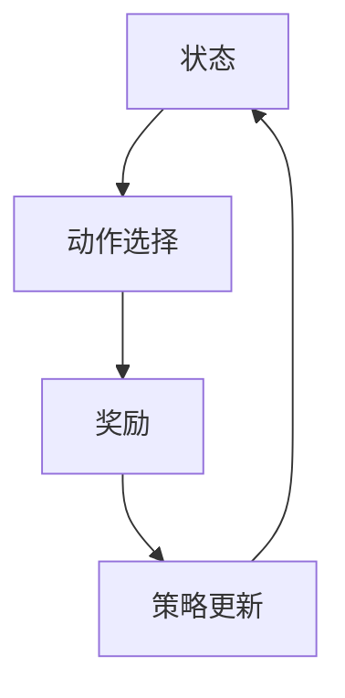
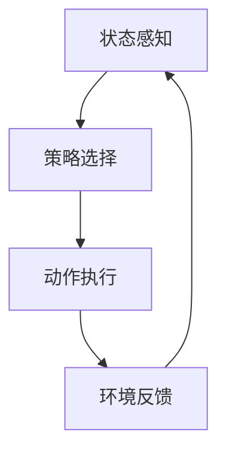
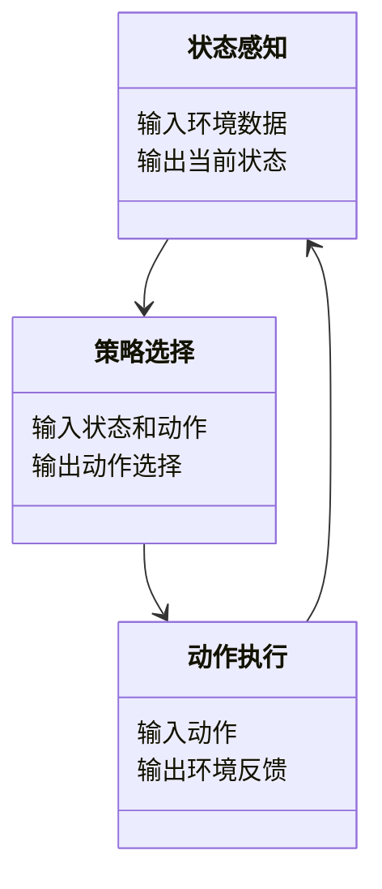
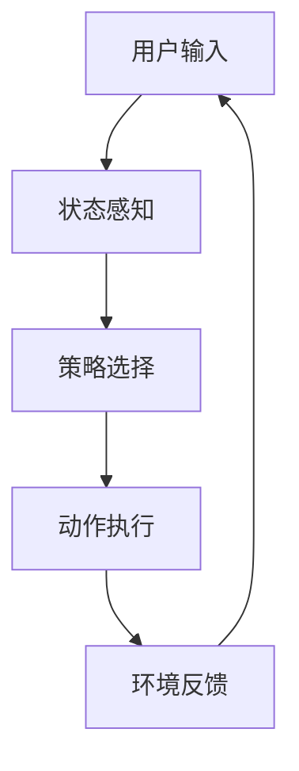
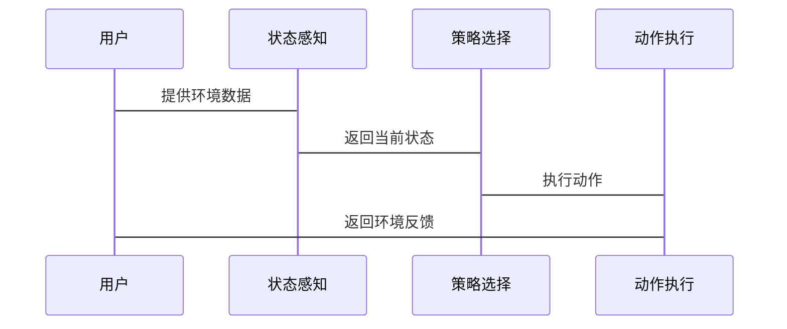

                 


```

# 强化学习在AI Agent决策中的运用

## 关键词：强化学习、AI Agent、决策过程、算法原理、系统架构、应用案例

## 摘要：本文深入探讨了强化学习在AI Agent决策中的应用，详细分析了强化学习的核心算法及其在不同场景下的实现。通过系统架构设计和实际案例分析，展示了如何将强化学习应用于游戏AI、机器人控制和推荐系统等领域的决策过程，帮助读者全面理解强化学习在AI Agent中的应用和未来发展。

---

# 第1章: 强化学习与AI Agent概述

## 1.1 强化学习的基本概念

### 1.1.1 强化学习的定义与核心要素

强化学习（Reinforcement Learning, RL）是一种机器学习范式，通过智能体与环境的交互来学习策略，以最大化累积奖励。其核心要素包括：

- **状态（State）**：环境中的当前情况，表示智能体所处的环境信息。
- **动作（Action）**：智能体在给定状态下采取的行动。
- **奖励（Reward）**：智能体执行动作后，环境给予的反馈，用于评估动作的好坏。
- **策略（Policy）**：智能体在不同状态下选择动作的概率分布，表示如何从状态中选择动作。



### 1.1.2 AI Agent的定义与分类

AI Agent（人工智能代理）是指能够感知环境并采取行动以实现目标的智能实体。AI Agent可以分为以下几类：

| 类型          | 描述                                                                 |
|---------------|----------------------------------------------------------------------|
| 基于规则的Agent | 基于预定义的规则进行决策，适用于简单任务。                           |
| 基于模型的Agent | 使用环境模型进行规划和决策，适用于复杂任务。                         |
| 强化学习Agent   | 通过与环境交互学习策略，优化奖励函数。                               |
| 多智能体Agent   | 多个智能体协作或竞争完成任务，适用于复杂场景。                         |

### 1.1.3 强化学习与AI Agent的关系

强化学习是AI Agent实现智能决策的核心方法，通过与环境的交互不断优化策略，使AI Agent能够在复杂动态环境中做出最优决策。

---

## 1.2 强化学习的基本原理

### 1.2.1 状态、动作、奖励与策略

- **状态**：智能体所处的环境信息，如游戏中的棋盘状态或机器人传感器数据。
- **动作**：智能体在给定状态下采取的行动，如移动、攻击或推荐某个商品。
- **奖励**：环境对智能体动作的反馈，用于指导智能体的行为，通常表现为数值形式。
- **策略**：智能体在不同状态下选择动作的概率分布，目标是最大化累积奖励。

### 1.2.2 马尔可夫决策过程（MDP）

马尔可夫决策过程是强化学习的基本模型，由以下五个要素组成：

1. **状态空间（S）**：所有可能的状态集合。
2. **动作空间（A）**：所有可能的动作集合。
3. **转移概率（P）**：从当前状态s执行动作a后转移到状态s'的概率。
4. **奖励函数（R）**：执行动作a后获得的奖励r。
5. **目标**：找到最优策略π，使得累积奖励最大化。

### 1.2.3 动作空间与状态空间的构建

- **动作空间**：动作空间的设计直接影响智能体的决策能力。例如，在机器人控制中，动作空间可以是连续的（如角度和速度）或离散的（如左转、右转）。
- **状态空间**：状态空间的构建需要考虑环境的动态特性。例如，在自动驾驶中，状态空间可以包括车速、与前车的距离和车道信息。

---

## 1.3 AI Agent的决策过程

### 1.3.1 状态感知与处理

智能体通过传感器或接口感知环境状态，将其转换为内部表示，以便进行处理和分析。

### 1.3.2 动作选择与执行

智能体根据当前状态和策略选择动作，并执行该动作，观察环境的反馈。

### 1.3.3 奖励机制与目标函数

奖励机制是强化学习的核心，通过奖励指导智能体的行为。目标函数通常定义为累积奖励的最大化。

---

## 1.4 强化学习在AI Agent中的应用

### 1.4.1 游戏AI与智能体决策

在游戏AI中，强化学习被广泛应用于策略学习，如棋类游戏中的AlphaZero算法。

### 1.4.2 机器人控制与路径规划

强化学习可以用于机器人路径规划，优化运动轨迹以避开障碍物。

### 1.4.3 推荐系统与个性化决策

强化学习通过建模用户行为，优化推荐策略，提升用户体验。

---

## 1.5 本章小结

本章介绍了强化学习的基本概念、AI Agent的定义与分类，以及强化学习在AI Agent决策中的应用。通过马尔可夫决策过程和状态空间的构建，初步探讨了强化学习的核心原理。

---

# 第2章: 强化学习的核心算法

## 2.1 Q-learning算法

### 2.1.1 Q-learning的基本原理

Q-learning是一种经典的强化学习算法，通过更新Q值表来学习最优策略。

### 2.1.2 Q值更新公式

$$ Q(s, a) = Q(s, a) + \alpha (r + \gamma \max Q(s', a')) $$

其中：
- $\alpha$：学习率
- $\gamma$：折扣因子
- $r$：即时奖励
- $Q(s', a')$：下一个状态的最大Q值

### 2.1.3 探索与利用策略

为了平衡探索新状态和利用已知信息，Q-learning通常结合$\epsilon$-贪心策略。

---

## 2.2 Deep Q-Networks（DQN）

### 2.2.1 DQN的网络结构

DQN使用两个深度神经网络：主网络和目标网络，分别用于当前策略和目标值的计算。

### 2.2.2 经验回放机制

经验回放通过存储和随机采样历史经验，减少样本偏差，加速收敛。

### 2.2.3 网络更新与目标网络

主网络和目标网络定期同步，确保目标值的稳定。

---

## 2.3 Policy Gradient方法

### 2.3.1 Policy Gradient的基本原理

Policy Gradient通过直接优化策略的参数，最大化累积奖励。

### 2.3.2 梯度上升与优化策略

使用梯度上升方法优化策略参数，通常采用概率梯度提升算法。

### 2.3.3 Actor-Critic架构

Actor-Critic结合策略网络（Actor）和价值函数网络（Critic），通过两者协同优化策略。

---

## 2.4 强化学习算法的优缺点对比

| 算法         | 优点                           | 缺点                           |
|--------------|--------------------------------|--------------------------------|
| Q-learning   | 简单易实现，适合离散动作空间   | 无法处理高维状态和连续动作空间 |
| DQN          | 可处理高维状态，经验回放加速收敛 | 网络设计复杂，训练时间较长       |
| Policy Gradient | 直接优化策略，适合连续动作空间 | 算法收敛不稳定，优化困难           |

---

## 2.5 本章小结

本章详细介绍了强化学习的核心算法，包括Q-learning、DQN和Policy Gradient，分析了它们的优缺点和适用场景。

---

# 第3章: AI Agent的决策过程与系统架构

## 3.1 状态空间与动作空间

### 3.1.1 状态空间的构建

状态空间的设计需要考虑环境的动态特性和智能体的感知能力。

### 3.1.2 动作空间的设计

动作空间的设计影响智能体的决策能力，通常需要根据任务需求进行调整。

### 3.1.3 状态与动作的转换关系

状态和动作之间存在转换关系，通过转移概率矩阵进行建模。

---

## 3.2 策略与奖励函数

### 3.2.1 策略函数的定义

策略函数定义了智能体在不同状态下选择动作的概率分布。

### 3.2.2 奖励函数的设计原则

奖励函数的设计需要考虑任务目标、动态特性和环境约束。

### 3.2.3 奖励函数的优化方法

通过调整奖励函数的权重和参数，优化智能体的决策性能。

---

## 3.3 多智能体协作与竞争

### 3.3.1 多智能体系统的基本概念

多智能体系统由多个智能体组成，可以协作或竞争完成任务。

### 3.3.2 协作与竞争的平衡

通过设计适当的奖励机制，平衡协作与竞争，提升整体性能。

---

## 3.4 系统架构设计

### 3.4.1 问题场景分析

根据具体任务需求，分析问题场景，设计智能体的感知、决策和执行模块。

### 3.4.2 系统功能设计

系统功能设计包括状态感知、策略选择和动作执行三个模块。

### 3.4.3 系统架构图



---

## 3.5 本章小结

本章探讨了AI Agent的决策过程，包括状态和动作空间的构建、策略与奖励函数的设计，以及多智能体协作与竞争的平衡。

---

# 第4章: 强化学习在AI Agent中的应用

## 4.1 游戏AI与智能体决策

### 4.1.1 游戏AI的强化学习应用

在游戏AI中，强化学习被广泛应用于策略学习，如棋类游戏中的AlphaZero算法。

### 4.1.2 代码实现与案例分析

通过具体代码实现，展示强化学习在游戏AI中的应用。

---

## 4.2 机器人控制与路径规划

### 4.2.1 强化学习在机器人控制中的应用

强化学习可以用于机器人路径规划，优化运动轨迹以避开障碍物。

### 4.2.2 代码实现与案例分析

通过具体代码实现，展示强化学习在机器人控制中的应用。

---

## 4.3 推荐系统与个性化决策

### 4.3.1 强化学习在推荐系统中的应用

强化学习通过建模用户行为，优化推荐策略，提升用户体验。

### 4.3.2 代码实现与案例分析

通过具体代码实现，展示强化学习在推荐系统中的应用。

---

## 4.4 本章小结

本章通过具体案例分析，展示了强化学习在游戏AI、机器人控制和推荐系统中的应用。

---

# 第5章: 系统架构与设计

## 5.1 问题场景分析

### 5.1.1 强化学习应用场景

分析强化学习在具体任务中的应用场景，如自动驾驶、游戏AI等。

## 5.2 系统功能设计

### 5.2.1 系统功能模块

设计系统的功能模块，包括状态感知、策略选择和动作执行。



## 5.3 系统架构设计

### 5.3.1 系统架构图

展示系统的整体架构，包括前端和后端的设计。



## 5.4 系统接口设计

### 5.4.1 系统接口

设计系统的接口，定义输入输出格式和交互流程。

## 5.5 系统交互流程

### 5.5.1 系统交互图

展示系统的交互流程，确保逻辑清晰。



---

## 5.6 本章小结

本章详细设计了强化学习系统的架构，包括功能模块、系统架构和交互流程。

---

# 第6章: 项目实战

## 6.1 环境搭建

### 6.1.1 开发环境配置

安装必要的库，如TensorFlow、Keras等。

## 6.2 代码实现

### 6.2.1 强化学习算法实现

提供具体的Python代码实现，包括模型定义、训练循环和评估指标。

### 6.2.2 系统功能实现

实现系统的功能模块，如状态感知、策略选择和动作执行。

## 6.3 案例分析

### 6.3.1 案例选择

选择具体的案例，如游戏AI或机器人控制，进行详细分析。

### 6.3.2 代码解读

逐行解读代码，解释每个部分的功能和实现细节。

---

## 6.4 本章小结

本章通过项目实战，展示了如何将强化学习应用于实际场景，提供了具体的代码实现和案例分析。

---

# 第7章: 高级主题与未来展望

## 7.1 高级强化学习算法

### 7.1.1 深度强化学习

深度强化学习结合深度学习和强化学习，适用于高维状态和动作空间。

### 7.1.2 注意力机制在强化学习中的应用

注意力机制通过聚焦重要信息，提升强化学习的效果。

---

## 7.2 多智能体协作的挑战

### 7.2.1 多智能体协作中的挑战

多智能体协作中的通信开销、策略同步等问题。

### 7.2.2 解决方案

通过设计适当的通信协议和协作机制，解决多智能体协作中的挑战。

---

## 7.3 强化学习的可解释性

### 7.3.1 强化学习的可解释性问题

强化学习模型的黑箱特性使其难以解释。

### 7.3.2 提升可解释性的方法

通过可视化和分解策略，提升强化学习的可解释性。

---

## 7.4 未来研究方向

### 7.4.1 与生成式AI的结合

强化学习与生成式AI的结合，如生成对抗网络在强化学习中的应用。

### 7.4.2 边缘计算中的应用

强化学习在边缘计算中的应用，如智能设备的自主决策。

---

## 7.5 本章小结

本章展望了强化学习的高级算法、多智能体协作、可解释性问题以及未来的研究方向。

---

# 第8章: 附录

## 8.1 强化学习数学公式汇总

### 8.1.1 Q-learning公式

$$ Q(s, a) = Q(s, a) + \alpha (r + \gamma \max Q(s', a')) $$

### 8.1.2 DQN算法公式

$$ Q(s, a) = Q(s, a) + \alpha (r + \gamma Q_{target}(s', a')) $$

### 8.1.3 Policy Gradient公式

$$ \nabla \theta J(\theta) = \nabla \log \pi(a|s, \theta) Q(s, a) $$

## 8.2 参考文献

1. Sutton, R. S., & Barto, A. G. (2018). Reinforcement learning: An introduction.
2. Mnih, V., et al. (2015). Human-level control through deep reinforcement learning.
3. Levine, S., et al. (2020). Robot manipulation: taming uncertainty with deep policies and diverse datasets.

---

# 作者：AI天才研究院/AI Genius Institute & 禅与计算机程序设计艺术 /Zen And The Art of Computer Programming
```

