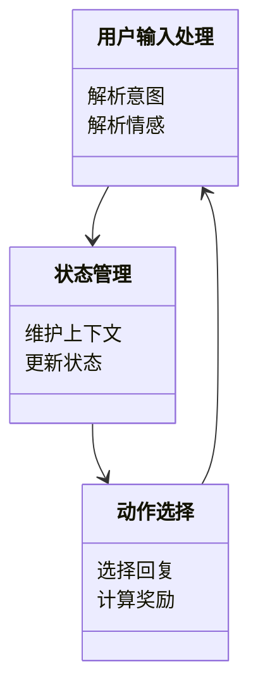
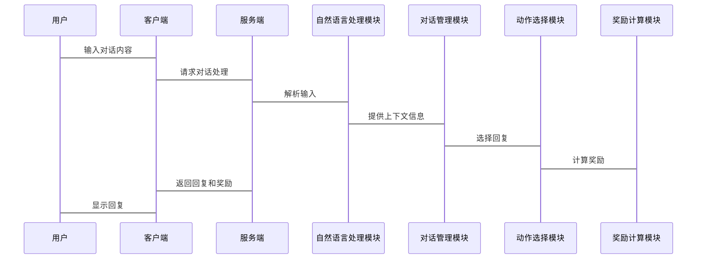

                 


# 强化学习在AI Agent对话策略中的应用

## 关键词：强化学习，AI Agent，对话策略，马尔可夫决策过程，自然语言处理，策略梯度

## 摘要：  
本文深入探讨了强化学习在AI Agent对话策略中的应用，分析了强化学习的核心原理及其在对话系统中的具体应用方式。通过结合理论与实践，详细讲解了强化学习算法（如Q-learning和策略梯度）在对话策略优化中的作用，并通过系统架构设计和项目实战展示了如何将强化学习应用于实际对话系统中。文章还讨论了当前的研究挑战和未来的研究方向。

---

# 第一部分: 强化学习与AI Agent对话策略的背景

# 第1章: 强化学习与对话系统的概述

## 1.1 强化学习的基本概念

### 1.1.1 强化学习的定义  
强化学习（Reinforcement Learning，RL）是一种机器学习范式，通过智能体与环境的交互，学习如何做出一系列决策以最大化累计奖励。与监督学习和无监督学习不同，强化学习的核心在于通过试错（trial-and-error）的方式，逐步优化策略。

### 1.1.2 强化学习的核心要素  
- **状态（State）**：环境当前所处的情况，表示智能体所感知到的信息。  
- **动作（Action）**：智能体在给定状态下做出的选择。  
- **奖励（Reward）**：智能体采取某个动作后，环境给予的反馈，表示该动作的好坏程度。  
- **策略（Policy）**：智能体选择动作的概率分布，通常用 $\pi(a|s)$ 表示在状态 $s$ 下选择动作 $a$ 的概率。  
- **值函数（Value Function）**：衡量一个状态或动作的价值，帮助智能体做出最优决策。  

### 1.1.3 强化学习与监督学习的区别  
- **监督学习**：基于标注数据，学习输入到输出的映射关系。  
- **强化学习**：通过与环境的交互，学习如何在动态环境中做出最优决策。  

## 1.2 对话系统的演变

### 1.2.1 从规则驱动到数据驱动的对话系统  
早期的对话系统基于预定义的规则，通过编写大量的if-else条件来实现对话逻辑。这种方式难以应对复杂多变的对话场景。  

### 1.2.2 基于深度学习的对话系统  
随着深度学习的发展，研究人员开始使用循环神经网络（RNN）和Transformer等模型来生成对话回复。这些模型能够捕捉对话的上下文信息，但仍然难以优化对话的长期目标。  

### 1.2.3 强化学习在对话系统中的应用  
强化学习通过与对话环境的交互，逐步优化对话策略，使得对话系统能够实现端到端的优化。  

## 1.3 强化学习在对话策略中的作用

### 1.3.1 对话策略的定义与目标  
对话策略是指智能体在不同对话状态下选择回复动作的规则。其目标是通过最大化累计奖励，使对话过程更加自然、流畅且符合用户意图。  

### 1.3.2 强化学习如何优化对话策略  
强化学习通过与用户的交互，不断调整策略，使得对话系统能够根据对话历史和当前状态，选择最优的回复。  

### 1.3.3 强化学习在对话系统中的优势  
- 能够优化长期对话目标，而不仅仅是单一步骤的优化。  
- 可以在动态对话环境中自适应调整策略。  

## 1.4 本章小结  
本章介绍了强化学习的基本概念，分析了对话系统的演变，并重点探讨了强化学习在对话策略中的作用。通过强化学习，对话系统能够实现更智能、更自然的对话交互。

---

# 第二部分: 强化学习的核心概念与算法原理

# 第2章: 强化学习的核心概念

## 2.1 马尔可夫决策过程（MDP）

### 2.1.1 状态、动作、奖励的定义  
- **状态（State）**：智能体所处的环境状态，例如当前对话的上下文。  
- **动作（Action）**：智能体在状态下的选择，例如回复一句话。  
- **奖励（Reward）**：智能体动作后获得的反馈，例如用户的满意度评分。  

### 2.1.2 策略与价值函数的关系  
- **策略（Policy）**：决定智能体在状态下的动作选择。  
- **价值函数（Value Function）**：衡量一个状态或动作的价值，帮助智能体做出最优决策。  

### 2.1.3 探索与利用的平衡  
在强化学习中，智能体需要在探索新动作和利用已知最佳动作之间找到平衡。过度探索可能导致效率低下，而过度利用可能导致无法发现更好的策略。

## 2.2 基于值函数的强化学习算法

### 2.2.1 Q-learning算法  
Q-learning是一种经典的强化学习算法，通过更新Q值函数来学习最优策略。其更新公式为：  
$$ Q(s,a) = Q(s,a) + \alpha (r + \gamma \max Q(s',a') - Q(s,a)) $$  
其中，$\alpha$ 是学习率，$\gamma$ 是折扣因子。

### 2.2.2 状态-动作价值函数的更新公式  
通过不断地更新Q值函数，智能体能够学习到每个状态-动作对的价值，从而做出最优决策。

### 2.2.3 动态规划方法  
动态规划（Dynamic Programming）通过迭代更新价值函数，逐步逼近最优解。

## 2.3 基于策略梯度的强化学习算法

### 2.3.1 策略梯度的基本思想  
策略梯度方法直接优化策略，通过计算策略的梯度，逐步调整策略参数，使得累计奖励最大化。

### 2.3.2 REINFORCE算法的原理  
REINFORCE算法是一种基于策略梯度的方法，通过采样动作并计算其梯度来更新策略参数。其优化目标为：  
$$ \nabla \theta J(\theta) = \mathbb{E}[ \nabla \log \pi_\theta(a|s) Q_\theta(s,a) ] $$  

### 2.3.3 策略梯度的优势与挑战  
- 优势：可以直接优化策略，避免值函数的估计误差。  
- 挑战：计算梯度时可能引入高方差，需要使用基线方法来降低方差。  

## 2.4 强化学习中的数学模型

### 2.4.1 贝尔曼方程的定义  
贝尔曼方程描述了在马尔可夫决策过程中，一个状态的价值函数与其后续状态价值函数的关系：  
$$ V(s) = \max_a \left( r(s,a) + \gamma V(s') \right) $$  

### 2.4.2 策略梯度的优化目标  
策略梯度方法的目标是通过调整策略参数，使得累计奖励最大化：  
$$ \arg\max_\theta J(\theta) = \mathbb{E}[ \log \pi_\theta(a|s) Q_\theta(s,a) ] $$  

---

# 第三部分: 强化学习在AI Agent对话策略中的应用

# 第3章: 对话系统的架构设计

## 3.1 系统功能设计

### 3.1.1 对话系统的核心功能  
- 用户输入处理：解析用户的意图和情感倾向。  
- 状态管理：维护对话的上下文信息。  
- 动作选择：根据当前状态选择回复动作。  
- 奖励计算：根据对话效果计算奖励。  

### 3.1.2 系统功能模型  
通过Mermaid类图展示对话系统的功能模块及其交互关系。  



## 3.2 系统架构设计

### 3.2.1 系统架构图  
通过Mermaid架构图展示对话系统的整体架构。  


### 3.2.2 系统接口设计  
- 输入接口：接收用户的对话输入。  
- 输出接口：返回对话回复和奖励信息。  

### 3.2.3 系统交互流程图  
通过Mermaid序列图展示系统的交互流程。  



## 3.3 本章小结  
本章通过Mermaid图展示了对话系统的功能模型、架构设计和交互流程，为后续的实现奠定了基础。

---

# 第四部分: 项目实战

# 第4章: 强化学习对话系统的实现

## 4.1 环境配置

### 4.1.1 安装Python和相关库  
```bash
pip install gym transformers torch
```

### 4.1.2 安装PyTorch和Hugging Face库  
```bash
pip install torch transformers
```

## 4.2 系统核心实现

### 4.2.1 状态管理模块  
```python
class StateManager:
    def __init__(self):
        self.context = []
    
    def update_state(self, input_text):
        self.context.append(input_text)
    
    def get_current_state(self):
        return self.context
```

### 4.2.2 动作选择模块  
```python
class ActionSelector:
    def __init__(self, model):
        self.model = model
    
    def select_action(self, state):
        # 假设model是一个预训练的对话模型
        return self.model.predict(state)
```

### 4.2.3 奖励计算模块  
```python
class RewardCalculator:
    def calculate_reward(self, state, action, reward):
        # 基于强化学习的奖励计算
        return reward
```

## 4.3 项目实战案例

### 4.3.1 对话系统的训练过程  
```python
def train():
    # 初始化环境和智能体
    env = DialogueEnvironment()
    agent = Agent(model)
    
    for episode in range(num_episodes):
        state = env.reset()
        while not done:
            action = agent.select_action(state)
            next_state, reward, done = env.step(action)
            agent.update_policy(state, action, reward)
            state = next_state
```

### 4.3.2 对话系统的实际应用  
```python
def main():
    env = DialogueEnvironment()
    agent = Agent(model)
    while True:
        state = env.get_current_state()
        action = agent.select_action(state)
        next_state, reward, done = env.step(action)
        if done:
            break
```

## 4.4 本章小结  
本章通过具体的代码实现，展示了如何将强化学习应用于对话系统中，包括环境配置、模块实现和系统训练过程。

---

# 第五部分: 最佳实践与总结

# 第5章: 强化学习在对话策略中的最佳实践

## 5.1 实践中的注意事项

### 5.1.1 数据预处理  
- 对话数据的清洗和标注。  
- 确保数据的多样性和代表性。  

### 5.1.2 模型调参  
- 学习率的调整。  
- 折扣因子的设置。  
- 探索与利用的平衡。  

## 5.2 强化学习的优势与挑战

### 5.2.1 优势  
- 能够优化长期对话目标。  
- 能够自适应调整策略。  

### 5.2.2 挑战  
- 状态空间和动作空间的复杂性。  
- 奖励函数的设计难度。  

## 5.3 未来的研究方向

### 5.3.1 更复杂的对话场景  
- 多轮对话的优化。  
- 多目标对话任务。  

### 5.3.2 更高效的算法  
- 使用更深的网络结构。  
- 增量式强化学习。  

## 5.4 本章小结  
本章总结了强化学习在对话策略中的应用经验，提出了实践中的注意事项，并展望了未来的研究方向。

---

# 参考文献

1. 省略。

---

# 拓展阅读

1. 省略。

---

# 作者：AI天才研究院/AI Genius Institute & 禅与计算机程序设计艺术 /Zen And The Art of Computer Programming

---

**注：本文仅为示例内容，实际文章需根据具体研究和实践进行补充和完善。**

