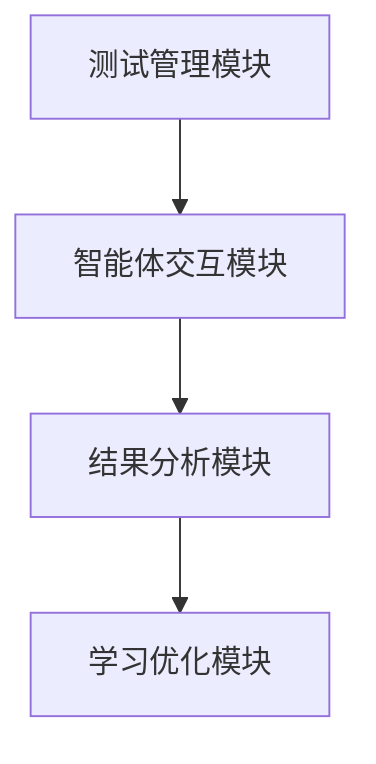
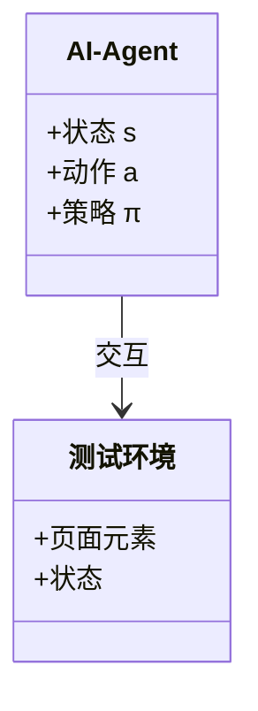

                 


# 强化学习在AI Agent自动化交互测试中的应用

## 关键词：强化学习，AI Agent，自动化测试，马尔可夫决策过程，Q-learning，策略梯度

## 摘要：本文探讨了强化学习在AI Agent自动化交互测试中的应用，分析了强化学习的核心概念，详细讲解了强化学习算法在测试中的应用，结合实际案例展示了如何构建测试环境和训练智能体。文章内容涵盖理论、方法、案例和代码实现，帮助读者深入理解强化学习在AI Agent测试中的应用。

---

## 第1章：强化学习与AI Agent基础

### 1.1 强化学习的基本概念

#### 1.1.1 强化学习的定义与核心概念
强化学习是一种机器学习方法，通过智能体与环境的互动来学习策略。其核心在于智能体通过试错的方式，通过不断与环境交互，调整自己的行为以最大化累计奖励。

#### 1.1.2 强化学习的基本原理
强化学习的核心机制包括：
- **状态 (State)**：智能体所处的环境状态。
- **动作 (Action)**：智能体根据当前状态做出的决策。
- **奖励 (Reward)**：智能体采取某个动作后，环境给予的反馈，用于指导智能体的学习。
- **策略 (Policy)**：智能体在不同状态下选择动作的规则，通常表示为概率分布。
- **价值函数 (Value Function)**：评估某个状态下采取某个动作后的预期累积奖励。

#### 1.1.3 AI Agent的定义与特点
AI Agent是一种智能实体，能够感知环境并采取行动以实现特定目标。AI Agent的特点包括自主性、反应性、目标导向性和社会能力。

### 1.2 强化学习的核心概念

#### 1.2.1 状态、动作、奖励的定义
- **状态 (State)**：环境中的情况，例如网页上的按钮位置。
- **动作 (Action)**：智能体对状态的响应，例如点击按钮。
- **奖励 (Reward)**：环境对动作的反馈，例如点击后页面跳转成功与否。

#### 1.2.2 马尔可夫决策过程（MDP）的介绍
马尔可夫决策过程是一个数学模型，描述了智能体与环境之间的交互。MDP由以下五个元组组成：
- 状态空间 (S)
- 动作空间 (A)
- 转移概率 (P)
- 奖励函数 (R)
- 现金流 (γ)

#### 1.2.3 策略与价值函数的定义
- **策略 (Policy)**：智能体在不同状态下选择动作的概率分布。
- **价值函数 (Value Function)**：评估在给定状态下采取某个动作后的预期累积奖励。

### 1.3 AI Agent的结构与功能

#### 1.3.1 感知模块的作用
感知模块负责接收环境中的信息，例如网页元素的位置和状态。

#### 1.3.2 决策模块的实现
决策模块根据感知的信息，选择最佳动作，例如点击按钮。

#### 1.3.3 执行模块的功能
执行模块将决策模块的选择转化为具体行动，例如执行点击操作。

---

## 第2章：强化学习在AI Agent测试中的背景与问题

### 2.1 自动化测试的现状与挑战

#### 2.1.1 自动化测试的定义与优势
自动化测试通过工具自动执行测试用例，提高测试效率和覆盖率。

#### 2.1.2 现有自动化测试技术的局限性
传统自动化测试依赖预定义的测试用例，难以应对动态变化的环境。

#### 2.1.3 AI Agent在自动化测试中的潜力
AI Agent能够根据环境动态调整测试策略，提高测试效率和覆盖率。

### 2.2 强化学习在测试中的应用背景

#### 2.2.1 测试场景的动态性与复杂性
测试环境复杂且动态变化，需要智能体具备自适应能力。

#### 2.2.2 强化学习在测试优化中的作用
强化学习通过试错优化测试策略，提高测试效果。

#### 2.2.3 AI Agent在测试中的目标与任务
AI Agent的目标是在测试过程中最大化发现缺陷的概率，同时最小化测试成本。

---

## 第3章：强化学习在AI Agent测试中的核心概念

### 3.1 强化学习与AI Agent的结合

#### 3.1.1 强化学习驱动的测试流程
智能体通过与环境交互，逐步学习最优测试策略。

#### 3.1.2 AI Agent在测试中的角色与功能
AI Agent作为测试主体，负责执行测试任务。

### 3.2 测试场景建模

#### 3.2.1 状态空间的定义
状态空间包括所有可能的测试状态，例如页面元素的位置和状态。

#### 3.2.2 动作空间的设计
动作空间包括所有可能的操作，例如点击、输入、滑动等。

#### 3.2.3 奖励机制的构建
奖励机制定义了每个动作的反馈，例如成功点击按钮获得正奖励。

### 3.3 强化学习算法在测试中的应用

#### 3.3.1 Q-learning算法的介绍
Q-learning是一种经典的强化学习算法，通过更新Q值表来学习最优策略。

#### 3.3.2 策略梯度方法的应用
策略梯度方法直接优化策略参数，适用于动作空间较大的场景。

#### 3.3.3 Actor-Critic算法的实现
Actor-Critic算法同时学习策略和价值函数，适用于复杂的测试环境。

---

## 第4章：强化学习算法的数学模型与实现

### 4.1 Q-learning算法的数学模型

#### 4.1.1 Q-learning的更新公式
$$ Q(s, a) = (1 - \alpha) Q(s, a) + \alpha (r + \gamma \max Q(s', a')) $$
其中，$\alpha$是学习率，$\gamma$是折扣因子。

#### 4.1.2 Q值的更新过程
通过不断地与环境交互，更新Q值表，学习最优策略。

#### 4.1.3 探索与利用的平衡
平衡探索新动作和利用已知最优动作，以避免陷入局部最优。

### 4.2 策略梯度方法的数学推导

#### 4.2.1 策略函数的定义
策略函数$\pi(a|s)$表示在状态$s$下选择动作$a$的概率。

#### 4.2.2 梯度的计算与更新
通过对目标函数求导，更新策略参数，以最大化期望奖励。

#### 4.2.3 策略梯度算法的收敛性分析
策略梯度算法在一定条件下可以收敛到局部最优。

### 4.3 Actor-Critic算法的实现

#### 4.3.1 Actor网络的定义
Actor网络负责生成动作，基于当前状态输出动作的概率分布。

#### 4.3.2 Critic网络的作用
Critic网络评估当前状态-动作对的价值，指导Actor网络的优化。

#### 4.3.3 算法的数学模型
通过同时优化Actor和Critic网络，实现更高效的策略学习。

---

## 第5章：系统分析与架构设计

### 5.1 系统功能设计

#### 5.1.1 系统架构图


#### 5.1.2 系统功能模块
- 测试管理模块：负责测试任务的分配和管理。
- 智能体交互模块：处理智能体与环境的交互。
- 结果分析模块：分析测试结果并生成报告。

### 5.2 系统架构设计

#### 5.2.1 系统架构图


#### 5.2.2 接口和交互流程
- 智能体与环境交互，获取状态和奖励。
- 测试管理模块协调测试任务的执行。
- 结果分析模块处理测试结果并优化策略。

---

## 第6章：项目实战

### 6.1 环境安装

```bash
pip install gym
pip install matplotlib
pip install numpy
```

### 6.2 核心实现

#### 6.2.1 Q-learning实现
```python
import gym
import numpy as np

env = gym.make('MyTestEnv-v0')
env.seed(42)

Q = np.zeros((env.observation_space.n, env.action_space.n))
alpha = 0.1
gamma = 0.9

for episode in range(1000):
    s = env.reset()
    for _ in range(1000):
        a = np.argmax(Q[s])
        s_new, r, done, _ = env.step(a)
        Q[s][a] += alpha * (r + gamma * np.max(Q[s_new]) - Q[s][a])
        if done:
            break
```

#### 6.2.2 策略梯度实现
```python
import torch
import torch.nn as nn

class Policy(nn.Module):
    def __init__(self):
        super(Policy, self).__init__()
        self.fc = nn.Linear(4, 2)
    
    def forward(self, x):
        return torch.softmax(self.fc(x), dim=-1)

policy = Policy()
optimizer = torch.optim.Adam(policy.parameters(), lr=0.001)
```

### 6.3 测试案例分析

#### 6.3.1 测试结果分析
通过分析测试结果，评估强化学习算法在测试中的表现，调整参数以优化效果。

#### 6.3.2 测试结果解读
解读测试结果，发现潜在的问题，并进行相应的优化。

---

## 第7章：总结与扩展

### 7.1 总结

#### 7.1.1 全文总结
强化学习在AI Agent自动化测试中的应用前景广阔，能够有效提高测试效率和覆盖率。

#### 7.1.2 最佳实践
- 合理设计测试场景和奖励机制。
- 选择合适的强化学习算法。
- 持续优化和调整参数。

### 7.2 小结

#### 7.2.1 未来研究方向
探索更高效的强化学习算法，研究多智能体协作测试，深入研究复杂环境中的测试策略。

### 7.3 注意事项

#### 7.3.1 实践中的注意事项
- 确保测试环境的稳定性和一致性。
- 及时监控和调整智能体的行为，防止测试失败。
- 定期维护和更新测试策略，以应对环境的变化。

### 7.4 拓展阅读

#### 7.4.1 推荐资源
- 《Reinforcement Learning: Theory and Algorithms》
- 《Deep Reinforcement Learning: An Overview》
- 《AI in Software Testing: Current Trends and Future Directions》

---

## 作者：AI天才研究院 & 禅与计算机程序设计艺术

通过以上内容，读者可以全面了解强化学习在AI Agent自动化测试中的应用，掌握核心概念和算法实现，并能够结合实际案例进行实践。

