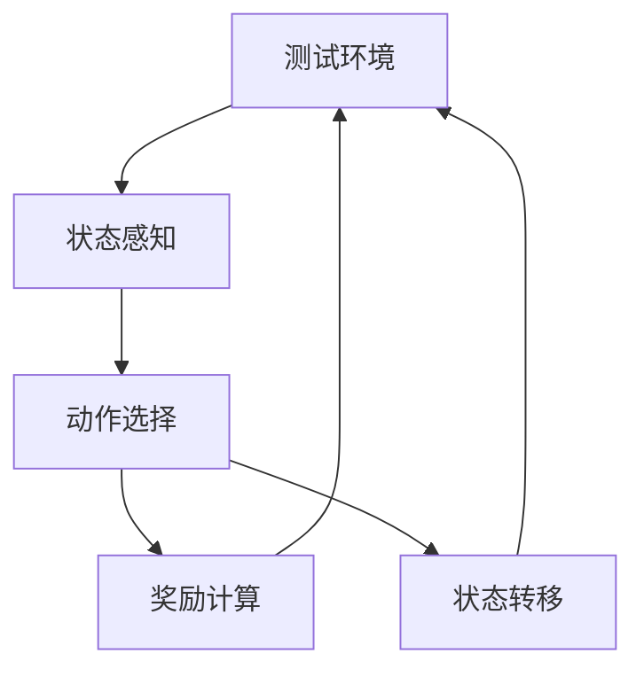

                 


# 强化学习在AI Agent自动化测试中的应用

## 关键词：
强化学习，AI Agent，自动化测试，Q-Learning，Deep Q-Network，系统架构

## 摘要：
本文探讨了强化学习在AI Agent自动化测试中的应用，详细介绍了强化学习的核心算法及其在AI Agent中的作用，分析了AI Agent在自动化测试中的应用场景。通过具体的算法实现和系统架构设计，展示了如何利用强化学习提升AI Agent的自动化测试能力。文章内容包括强化学习与AI Agent的基础知识、强化学习算法的数学模型、AI Agent的系统架构设计、项目实战案例以及未来的发展方向。

---

## 第一部分: 强化学习与AI Agent基础

### 第1章: 强化学习的基本概念

#### 1.1 强化学习的定义
强化学习（Reinforcement Learning，RL）是一种机器学习范式，通过智能体与环境的交互，学习如何采取行动以最大化累积的奖励。与监督学习不同，强化学习不需要明确的标注数据，而是通过奖励机制来指导学习过程。

#### 1.2 AI Agent的基本概念
AI Agent（人工智能代理）是一种能够感知环境并采取行动以实现目标的智能实体。它可以是一个软件程序，也可以是一个物理设备，通过感知和行动与环境交互。

#### 1.3 强化学习与AI Agent的关系
强化学习为AI Agent提供了一种有效的学习方法，使得AI Agent能够在复杂环境中自主决策，实现目标。

---

## 第2章: 强化学习的核心算法

### 2.1 Q-Learning算法
Q-Learning是一种经典的强化学习算法，通过学习状态-动作值函数（Q值）来选择最优动作。

#### 2.1.1 Q-Learning的基本原理
Q-Learning通过以下步骤更新Q值：
1. 状态感知：观察当前状态s。
2. 动作选择：选择一个动作a，并执行该动作。
3. 奖励获取：获得环境返回的奖励r。
4. 状态转移：观察新的状态s'。
5. Q值更新：根据奖励和新状态更新Q(s, a)。

#### 2.1.2 Q-Learning的数学模型
Q-Learning的Q值更新公式为：
$$ Q(s, a) = Q(s, a) + \alpha (r + \gamma \max_a Q(s', a) - Q(s, a)) $$
其中，$\alpha$是学习率，$\gamma$是折扣因子。

#### 2.1.3 Q-Learning的优缺点
优点：简单易实现，适合离线学习。缺点：在连续状态空间中表现不佳。

### 2.2 Deep Q-Network (DQN) 算法
DQN通过深度神经网络近似Q值函数，扩展了Q-Learning的应用范围。

#### 2.2.1 DQN的基本原理
DQN使用两个神经网络：主网络和目标网络。主网络用于选择动作，目标网络用于计算目标值。

#### 2.2.2 DQN的网络结构
主网络和目标网络均为多层感知机（MLP），通过训练使主网络逼近目标网络的权重。

#### 2.2.3 DQN的训练过程
1. 状态输入：输入当前状态s。
2. 动作选择：主网络输出Q值，选择动作a。
3. 奖励获取：执行动作a，获得奖励r。
4. 状态转移：观察新状态s'。
5. Q值更新：更新主网络权重，使其逼近目标网络。

### 2.3 策略梯度算法
策略梯度算法直接优化策略，而不是值函数。

#### 2.3.1 策略梯度的基本原理
策略梯度通过梯度上升方法优化策略参数，使得累积奖励最大化。

#### 2.3.2 策略梯度的数学模型
策略梯度的目标函数为：
$$ J(\theta) = \mathbb{E}_{\tau \sim \pi_\theta} [\sum_t r_t] $$
梯度更新公式为：
$$ \theta_{t+1} = \theta_t + \alpha \nabla_\theta J(\theta) $$

---

## 第三部分: 强化学习在AI Agent自动化测试中的应用

### 第3章: AI Agent在自动化测试中的应用

#### 3.1 AI Agent的测试目标
AI Agent需要通过强化学习，在测试环境中找到最优的测试路径，以发现缺陷。

#### 3.2 测试环境的建模
测试环境可以建模为马尔可夫决策过程（MDP），包括状态、动作、奖励和转移概率。

#### 3.3 强化学习在测试中的作用
通过强化学习，AI Agent能够自适应地选择测试用例，提高测试效率和覆盖率。

### 第4章: 强化学习算法在测试中的实现

#### 4.1 Q-Learning在测试中的应用
通过Q-Learning算法，AI Agent学习测试用例的选择策略，以最大化奖励。

#### 4.2 DQN在测试中的应用
DQN通过深度神经网络建模Q值函数，适用于高维状态空间的测试环境。

### 第5章: 系统架构设计

#### 5.1 系统功能设计
1. 状态感知模块：感知测试环境的状态。
2. 动作选择模块：基于强化学习算法选择测试动作。
3. 奖励计算模块：根据测试结果计算奖励。
4. 状态转移模块：更新测试环境的状态。

#### 5.2 系统架构图


---

## 第四部分: 项目实战

### 第6章: 项目环境与安装

#### 6.1 环境要求
安装Python 3.8及以上版本，安装TensorFlow和Keras库。

#### 6.2 环境安装
```bash
pip install numpy tensorflow keras matplotlib
```

### 第7章: 核心代码实现

#### 7.1 Q-Learning算法实现
```python
import numpy as np

class QLearning:
    def __init__(self, state_space, action_space, alpha=0.1, gamma=0.9):
        self.q_table = np.zeros((state_space, action_space))
        self.alpha = alpha
        self.gamma = gamma

    def choose_action(self, state, epsilon=0.1):
        if np.random.random() < epsilon:
            return np.random.randint(0, self.q_table.shape[1])
        else:
            return np.argmax(self.q_table[state])

    def update_q(self, state, action, reward, next_state):
        self.q_table[state, action] = self.q_table[state, action] + self.alpha * (reward + self.gamma * np.max(self.q_table[next_state]) - self.q_table[state, action])
```

#### 7.2 DQN算法实现
```python
import tensorflow as tf
from tensorflow.keras import layers

class DQN:
    def __init__(self, state_space, action_space, learning_rate=0.001):
        self.state_space = state_space
        self.action_space = action_space
        self.learning_rate = learning_rate

        self.model = self.build_model()
        self.target_model = self.build_model()

    def build_model(self):
        model = tf.keras.Sequential()
        model.add(layers.Dense(64, activation='relu', input_dim=self.state_space))
        model.add(layers.Dense(32, activation='relu'))
        model.add(layers.Dense(self.action_space, activation='linear'))
        model.compile(optimizer=tf.keras.optimizers.Adam(lr=self.learning_rate), loss='mse')
        return model

    def update_target(self):
        self.target_model.set_weights(self.model.get_weights())
```

### 第8章: 测试案例分析

#### 8.1 Q-Learning测试案例
通过模拟一个简单的测试环境，验证Q-Learning算法的有效性。

#### 8.2 DQN测试案例
通过模拟一个复杂的测试环境，验证DQN算法的性能。

### 第9章: 项目总结与优化

#### 9.1 项目总结
总结项目实现的关键点和优化方向。

#### 9.2 优化建议
根据实验结果，提出进一步优化的建议。

---

## 第五部分: 总结与展望

### 第10章: 总结

#### 10.1 强化学习的优势
强化学习为AI Agent提供了自适应的决策能力，能够有效提升自动化测试的效率。

#### 10.2 本文的不足
本文主要介绍了强化学习的基本原理和应用场景，未来需要进一步研究更复杂的测试环境。

### 第11章: 未来展望

#### 11.1 强化学习的新趋势
探索更高效的强化学习算法，如基于Transformer的算法。

#### 11.2 AI Agent的新方向
研究多智能体协作的测试方法，进一步提升测试能力。

---

## 作者：AI天才研究院/AI Genius Institute & 禅与计算机程序设计艺术 /Zen And The Art of Computer Programming

