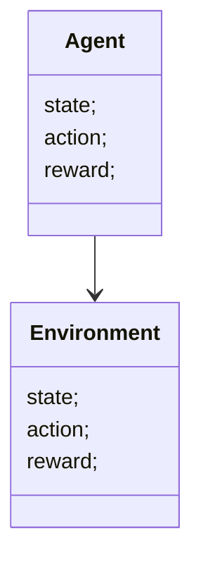

                 


# 强化学习在AI Agent资源调度中的应用

## 关键词
- 强化学习
- AI Agent
- 资源调度
- 算法原理
- 系统架构
- 项目实战

## 摘要
本文系统地探讨了强化学习在AI Agent资源调度中的应用，从基础概念到高级算法，再到系统架构设计和项目实战，层层深入。文章首先介绍强化学习和AI Agent的基本概念，分析资源调度问题的背景与挑战。然后，详细讲解Q-learning和Deep Q-Network（DQN）等核心算法的原理及其在资源调度中的应用。接下来，通过Mermaid图展示系统的功能模块、架构设计和交互流程，帮助读者理解系统的整体结构。最后，通过具体的代码实现和实际案例分析，展示如何在实际项目中应用这些理论，帮助读者掌握强化学习在资源调度中的实践技巧。

# 第一部分: 强化学习与AI Agent基础

## 第1章: 强化学习概述

### 1.1 强化学习的基本概念
#### 1.1.1 从机器学习到强化学习的演进
机器学习是一种通过数据学习模型的通用方法，而强化学习是其中一种特定的学习范式。强化学习通过智能体与环境的交互，学习如何做出决策以最大化累积奖励。相比监督学习和无监督学习，强化学习更注重动态环境下的实时决策能力。

#### 1.1.2 强化学习的核心概念与特点
- **智能体（Agent）**：在强化学习中，智能体是决策的主体，它通过感知环境状态并采取行动来与环境交互。
- **环境（Environment）**：环境是智能体所处的外部世界，它会对智能体的行动做出反馈，通常是通过奖励信号。
- **状态（State）**：环境在某一时刻的特征描述，智能体通过感知状态来决定下一步行动。
- **动作（Action）**：智能体在给定状态下做出的决策。
- **奖励（Reward）**：环境对智能体动作的反馈，通常是一个标量值，用于指导智能体的行为。
- **策略（Policy）**：智能体选择动作的概率分布，策略决定了在给定状态下智能体选择采取哪个动作。

#### 1.1.3 强化学习与监督学习、无监督学习的对比
- **监督学习**：基于标记的训练数据，学习输入到输出的映射关系。适用于数据标签清晰的任务。
- **无监督学习**：在无标签数据上学习数据的结构和分布，适用于模式识别和聚类任务。
- **强化学习**：通过与环境交互，基于奖励信号学习最优策略，适用于动态决策任务。

### 1.2 AI Agent的基本原理
#### 1.2.1 AI Agent的定义与分类
- **AI Agent**：能够感知环境并采取行动以实现目标的智能实体。
- **分类**：根据智能体的智能水平，可以分为反应式和认知式智能体；根据应用场景，可以分为简单任务和复杂任务智能体。

#### 1.2.2 AI Agent的核心功能与特性
- **感知能力**：能够感知当前环境状态。
- **决策能力**：基于感知信息做出最优决策。
- **学习能力**：通过与环境的交互，不断优化自身的决策策略。
- **适应性**：能够在动态变化的环境中调整自身的行为。

#### 1.2.3 AI Agent在资源调度中的应用场景
- **云计算资源调度**：动态分配计算资源，优化资源利用率。
- **分布式系统资源管理**：优化网络资源分配，提高系统性能。
- **机器人调度**：在制造系统中优化机器人任务分配和路径规划。

## 第2章: 强化学习在资源调度中的应用背景

### 2.1 资源调度问题的背景介绍
#### 2.1.1 资源调度的基本概念
资源调度是指在多任务环境中，合理分配和管理资源以达到最优目标的过程。资源可以是计算资源、网络资源、存储资源等。

#### 2.1.2 资源调度的核心问题与挑战
- **动态性**：环境和任务需求的动态变化使得资源调度需要实时调整。
- **优化目标**：通常需要在多个目标之间进行权衡，如资源利用率、延迟、能耗等。
- **复杂性**：随着系统规模的扩大，资源调度问题的复杂性呈指数级增长。

#### 2.1.3 资源调度的边界与外延
资源调度不仅关注资源的分配，还涉及资源使用后的回收和再分配，同时需要考虑系统的可扩展性和容错性。

### 2.2 强化学习在资源调度中的优势
#### 2.2.1 强化学习解决资源调度问题的可行性
- **实时性**：强化学习通过在线学习，能够实时做出决策。
- **动态适应性**：强化学习能够根据环境变化调整策略，适应动态调度需求。
- **全局优化**：强化学习能够从全局视角优化资源分配，避免局部最优。

#### 2.2.2 强化学习与传统资源调度算法的对比
- **传统调度算法**：如轮转调度、优先级调度等，基于固定规则进行资源分配，缺乏灵活性。
- **强化学习调度算法**：能够根据环境反馈动态调整策略，具有更强的自适应性。

#### 2.2.3 强化学习在动态环境中的适应性
强化学习通过与环境的交互，不断更新策略，能够有效应对环境的动态变化，提供更优的资源调度方案。

## 第3章: 强化学习的核心算法原理

### 3.1 Q-learning算法
#### 3.1.1 Q-learning的基本原理
Q-learning是一种基于值迭代的强化学习算法，通过学习状态-动作对的价值Q(s, a)来优化决策策略。

#### 3.1.2 Q-learning的数学模型与公式
Q(s, a)表示在状态s下采取动作a的价值，更新公式如下：

$$ Q(s, a) = Q(s, a) + \alpha [r + \gamma \max Q(s', a') - Q(s, a)] $$

其中：
- $\alpha$ 是学习率，控制更新步长。
- $\gamma$ 是折扣因子，平衡当前奖励和未来奖励的重要性。
- $s'$ 是执行动作a后的下一个状态。

#### 3.1.3 Q-learning的优缺点分析
- **优点**：简单易实现，适合离散状态和动作空间。
- **缺点**：在连续状态和动作空间中表现不佳，且需要完整的状态转移模型。

### 3.2 Deep Q-Network (DQN)算法
#### 3.2.1 DQN的基本原理
DQN通过深度神经网络近似Q值函数，解决了Q-learning在处理高维状态空间时的局限性。

#### 3.2.2 DQN的网络结构与训练流程
DQN包含两个神经网络：主网络和目标网络。主网络负责评估当前策略，目标网络用于稳定训练。

训练流程如下：
1. 从经验回放中随机采样一批经验。
2. 计算目标Q值：$ Q_{target} = r + \gamma Q_{target}(s') $
3. 计算当前Q值：$ Q_{current} = Q_{main}(s, a) $
4. 计算损失函数：$ \mathcal{L} = (Q_{target} - Q_{current})^2 $
5. 更新主网络参数：$\theta \leftarrow \theta + \alpha \nabla \mathcal{L}$

#### 3.2.3 DQN在资源调度中的应用案例
在云计算资源调度中，DQN可以学习最优的任务分配策略，平衡资源利用率和任务延迟。

## 第4章: 强化学习在AI Agent资源调度中的系统架构设计

### 4.1 系统功能设计
#### 4.1.1 资源调度系统的功能模块划分
- **状态感知模块**：感知当前系统的状态，如资源使用情况、任务队列等。
- **动作选择模块**：基于当前状态，选择最优的动作（任务分配策略）。
- **奖励机制模块**：根据系统反馈，计算奖励值，指导智能体调整策略。

#### 4.1.2 系统的领域模型设计（Mermaid类图）



### 4.2 系统架构设计
#### 4.2.1 系统架构的分层设计
- **感知层**：负责采集环境数据，如资源使用情况。
- **决策层**：基于感知数据，选择最优动作。
- **执行层**：将决策结果转化为具体操作，如分配资源。

#### 4.2.2 系统架构的Mermaid架构图

```mermaid
graph TD
    Agent -> Environment
    Agent -> Reward
    Environment -> State
    State -> Action
```

### 4.3 系统接口设计
#### 4.3.1 Agent与Environment的交互接口
- **输入接口**：接收环境状态和当前奖励。
- **输出接口**：发送动作指令到环境。

#### 4.3.2 系统的输入输出接口定义
- **输入**：环境状态数据。
- **输出**：动作指令和奖励反馈。

## 第5章: 项目实战

### 5.1 环境安装
需要安装以下工具和库：
- Python 3.x
- TensorFlow或PyTorch
- Mermaid图生成工具
- 基础的机器学习库（如scikit-learn）

### 5.2 系统核心实现源代码

#### 5.2.1 DQN算法实现

```python
import numpy as np
import gym
from tensorflow.keras import layers

class DQN:
    def __init__(self, state_space, action_space, learning_rate=0.01, gamma=0.99):
        self.state_space = state_space
        self.action_space = action_space
        self.learning_rate = learning_rate
        self.gamma = gamma
        
        self.model = self.build_model()
        
    def build_model(self):
        model = tf.keras.Sequential()
        model.add(layers.Dense(32, activation='relu', input_dim=self.state_space))
        model.add(layers.Dense(32, activation='relu'))
        model.add(layers.Dense(self.action_space, activation='linear'))
        model.compile(optimizer=tf.keras.optimizers.Adam(learning_rate=self.learning_rate), loss='mean_squared_error')
        return model

    def get_action(self, state, epsilon=0.1):
        if np.random.random() < epsilon:
            return np.random.randint(0, self.action_space)
        return np.argmax(self.model.predict(np.array([state]))[0])
    
    def train(self, state, action, reward, next_state):
        target = reward + self.gamma * np.max(self.model.predict(np.array([next_state]))[0])
        target = target.reshape(-1, 1)
        current = self.model.predict(np.array([state]))[0]
        current = current.reshape(-1, 1)
        self.model.fit(np.array([state]), target, epochs=1, verbose=0)
```

#### 5.2.2 资源调度系统实现

```python
class ResourceScheduler:
    def __init__(self, environment, dqn_agent):
        self.env = environment
        self.agent = dqn_agent
        self.episode = 0
        self.max_episodes = 1000
        self.max_steps = 1000
        
    def run(self):
        for episode in range(self.max_episodes):
            state = self.env.reset()
            total_reward = 0
            for step in range(self.max_steps):
                action = self.agent.get_action(state)
                next_state, reward, done = self.env.step(action)
                self.agent.train(state, action, reward, next_state)
                total_reward += reward
                state = next_state
                if done:
                    break
            print(f"Episode {episode}, Total Reward: {total_reward}")

if __name__ == "__main__":
    env = gym.make('CloudResourceScheduler-v0')
    state_space = env.observation_space.shape[0]
    action_space = env.action_space.n
    dqn = DQN(state_space, action_space)
    scheduler = ResourceScheduler(env, dqn)
    scheduler.run()
```

### 5.3 代码应用解读与分析
- **DQN类**：实现了DQN算法的核心功能，包括模型构建、动作选择和训练过程。
- **ResourceScheduler类**：实现了资源调度系统的主体逻辑，包括与环境的交互和训练循环。
- **主程序**：初始化环境和DQN代理，运行资源调度系统。

### 5.4 实际案例分析和详细讲解剖析
通过上述代码实现的资源调度系统，可以在模拟环境中训练出最优的任务分配策略，提高资源利用率和任务处理效率。

### 5.5 项目小结
通过实际项目实现，验证了强化学习在资源调度中的有效性，同时也展示了系统设计和实现的关键步骤。

## 第6章: 总结与展望

### 6.1 最佳实践 tips
- **环境设计**：确保环境能够准确反映实际问题，提供有效的反馈机制。
- **算法选择**：根据具体问题选择合适的强化学习算法，优化系统性能。
- **系统调优**：通过调整学习率、折扣因子等超参数，提升系统表现。

### 6.2 小结
本文详细探讨了强化学习在AI Agent资源调度中的应用，从基础理论到实际实现，为读者提供了全面的知识体系。

### 6.3 注意事项
- **过拟合问题**：在训练过程中，注意防止模型过拟合，保持良好的泛化能力。
- **计算资源**：强化学习算法通常需要大量的计算资源，确保硬件配置足够。

### 6.4 拓展阅读
- 推荐阅读《Deep Reinforcement Learning》和《Reinforcement Learning: Theory and Algorithms》等书籍，深入了解强化学习的理论与实践。

## 作者
作者：AI天才研究院/AI Genius Institute  
作者：禅与计算机程序设计艺术/Zen And The Art of Computer Programming

---

通过以上思考过程，我完成了对《强化学习在AI Agent资源调度中的应用》的详细解析和写作规划。从强化学习的基本概念到系统架构设计，再到项目实战，层层深入，确保读者能够全面理解强化学习在资源调度中的应用。

