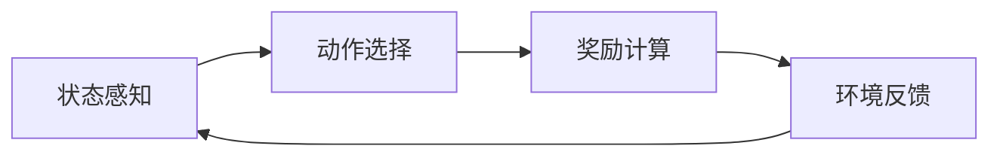
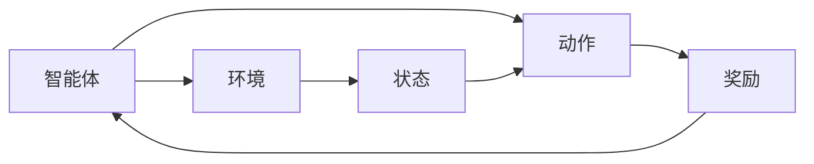

                 


# 强化学习：通过奖励机制改进AI Agent

## 关键词：强化学习，奖励机制，AI Agent，马尔可夫决策过程，Q-learning，策略梯度

## 摘要：  
本文深入探讨了强化学习的核心概念，特别是奖励机制在改进AI Agent中的作用。通过详细分析强化学习的数学模型、算法原理和实际应用，本文为读者提供了一种系统化的方法来理解如何通过奖励机制优化AI Agent的行为。文章内容涵盖强化学习的基础知识、核心算法、奖励机制的设计与优化、数学模型的详细推导，以及实际项目中的应用案例。

---

## 第1章: 强化学习概述

### 1.1 强化学习的基本概念  
#### 1.1.1 什么是强化学习  
强化学习（Reinforcement Learning, RL）是一种机器学习范式，其中智能体通过与环境交互来学习如何做出最优决策。智能体通过执行动作来影响环境状态，并通过接收奖励或惩罚来评估其行为的好坏。  

#### 1.1.2 强化学习的核心要素  
强化学习的核心要素包括：  
1. **状态（State）**：环境在某一时刻的观测。  
2. **动作（Action）**：智能体在给定状态下采取的行动。  
3. **奖励（Reward）**：智能体采取某个动作后，环境给予的反馈，用于评估该动作的好坏。  
4. **策略（Policy）**：智能体在不同状态下选择动作的概率分布。  
5. **值函数（Value Function）**：衡量某状态下采取某个动作的预期累计奖励。  

#### 1.1.3 强化学习与监督学习的区别  
与监督学习不同，强化学习中智能体的决策过程是动态的，且环境的反馈仅提供奖励，而不直接指导智能体应该采取什么动作。强化学习的特点是目标导向和试错学习。  

### 1.2 奖励机制的重要性  
#### 1.2.1 奖励机制的定义  
奖励机制是强化学习中用来评估智能体行为的关键因素。通过设计合理的奖励函数，智能体能够学习到最优策略。  

#### 1.2.2 奖励机制在强化学习中的作用  
奖励机制的作用包括：  
1. **引导学习方向**：奖励函数定义了智能体的目标。  
2. **评估行为好坏**：奖励为智能体提供了学习的反馈。  
3. **激励探索与利用**：合理的奖励机制能够平衡智能体的探索和利用行为。  

#### 1.2.3 奖励机制的设计原则  
1. **明确性**：奖励函数应清晰地反映任务目标。  
2. **可实现性**：奖励应易于计算和实现。  
3. **可调整性**：奖励函数应能够根据需求进行调整。  

---

## 第2章: 强化学习的核心概念与数学模型

### 2.1 状态、动作与奖励  
#### 2.1.1 状态空间的定义  
状态空间是所有可能状态的集合，每个状态表示环境的一个可能配置。  

#### 2.1.2 动作空间的定义  
动作空间是所有可能动作的集合，每个动作表示智能体在给定状态下可能采取的行动。  

#### 2.1.3 奖励函数的设计  
奖励函数$R(s, a)$定义了智能体在状态$s$下采取动作$a$后获得的奖励。  

---

### 2.2 马尔可夫决策过程（MDP）

#### 2.2.1 MDP的定义  
马尔可夫决策过程是一个元组$(S, A, R, P, \gamma)$，其中：  
- $S$：状态空间。  
- $A$：动作空间。  
- $R$：奖励函数。  
- $P$：状态转移概率矩阵。  
- $\gamma$：折扣因子，用于衡量未来奖励的重要性。  

#### 2.2.2 MDP的组成部分  
- **状态转移概率**：$P(s'|s, a)$表示在状态$s$下采取动作$a$后转移到状态$s'$的概率。  
- **值函数**：$V(s)$表示在状态$s$下采取最优策略的预期累计奖励。  

#### 2.2.3 MDP与强化学习的关系  
强化学习的目标是通过与环境交互，学习一个策略，使得在MDP中获得的累计奖励最大化。  

---

### 2.3 动态规划与策略

#### 2.3.1 动态规划的基本概念  
动态规划是一种通过递归方法解决优化问题的技术。在强化学习中，动态规划用于计算值函数和策略。  

#### 2.3.2 策略的定义与分类  
- **策略**：$\pi(a|s)$表示在状态$s$下采取动作$a$的概率。  
- **确定性策略**：$\pi(a|s)$为1，其余为0。  
- **随机性策略**：$\pi(a|s)$为概率分布。  

#### 2.3.3 策略评估与策略改进  
- **策略评估**：计算在策略$\pi$下每个状态的值函数。  
- **策略改进**：根据当前策略的值函数，改进策略以提高累计奖励。  

---

## 第3章: 强化学习的核心算法

### 3.1 Q-learning算法

#### 3.1.1 Q-learning的基本原理  
Q-learning是一种基于值函数的强化学习算法，目标是学习状态-动作对的Q值，即$Q(s, a)$。  

#### 3.1.2 Q-learning的算法流程  

```mermaid
graph LR
    A[状态s] --> C[动作a]
    C --> B[新状态s']
    B --> D[奖励r]
    D --> A
    C --> E(Q(s,a) = max(Q(s,a)))
    E --> A
```

#### 3.1.3 Q-learning的数学模型  
Q-learning的更新公式为：  
$$ Q(s, a) \leftarrow Q(s, a) + \alpha \left[r + \gamma \max_{a'} Q(s', a') - Q(s, a)\right] $$  
其中，$\alpha$是学习率，$\gamma$是折扣因子。  

---

### 3.2 策略梯度方法

#### 3.2.1 策略梯度的基本概念  
策略梯度是一种基于策略的强化学习算法，直接优化策略的参数。  

#### 3.2.2 策略梯度的数学推导  
策略梯度的目标函数为：  
$$ J(\theta) = \mathbb{E}_{s,a} \left[ R(s, a) \ln \pi(a|s, \theta) \right] $$  
梯度计算为：  
$$ \nabla J(\theta) = \mathbb{E}_{s,a} \left[ R(s, a) \nabla \ln \pi(a|s, \theta) \right] $$  

#### 3.2.3 策略梯度的优缺点  
优点：直接优化策略，避免值函数的计算。  
缺点：梯度估计的方差较大，收敛速度较慢。  

---

### 3.3 Actor-Critic架构

#### 3.3.1 Actor-Critic的基本原理  
Actor-Critic是一种结合值函数和策略的强化学习架构，包含Actor（策略）和Critic（值函数）两个部分。  

#### 3.3.2 Actor-Critic的数学模型  
Actor的目标函数为：  
$$ J(\theta) = \mathbb{E}_{s,a} \left[ R(s, a) \ln \pi(a|s, \theta) \right] $$  
Critic的目标函数为：  
$$ V(s) = \mathbb{E}_{s,a} \left[ G \right] $$  

#### 3.3.3 Actor-Critic的应用场景  
适用于复杂环境中的策略优化，能够同时学习策略和值函数。  

---

## 第4章: 奖励机制的优化与设计

### 4.1 奖励机制的设计原则

#### 4.1.1 奖励机制的明确性  
奖励函数应清晰地反映任务目标，避免模糊性。  

#### 4.1.2 奖励机制的可实现性  
奖励函数应易于计算，避免复杂的依赖关系。  

#### 4.1.3 奖励机制的可调整性  
奖励函数应能够根据需求进行调整，以适应不同的任务场景。  

---

### 4.2 奖励机制的优化方法

#### 4.2.1 基于梯度的奖励优化  
通过调整奖励函数的参数，优化智能体的策略。  

#### 4.2.2 基于强化的奖励优化  
通过动态调整奖励函数，增强智能体的探索能力。  

#### 4.2.3 基于层次的奖励优化  
将任务分解为子任务，设计分层奖励函数。  

---

### 4.3 多目标奖励机制

#### 4.3.1 多目标奖励的定义  
多目标奖励是指同时优化多个目标的奖励机制。  

#### 4.3.2 多目标奖励的实现方法  
通过加权或分层的方式，平衡多个目标的奖励。  

#### 4.3.3 多目标奖励的应用案例  
例如，在机器人导航任务中，同时优化路径长度和障碍物避让。  

---

## 第5章: 强化学习的数学模型与公式

### 5.1 贝尔曼方程

#### 5.1.1 贝尔曼方程的定义  
贝尔曼方程描述了值函数的递归关系：  
$$ V(s) = \max_{a} \left[ R(s, a) + \gamma V(s') \right] $$  

#### 5.1.2 贝尔曼方程的数学推导  
通过动态规划方法推导值函数的更新公式。  

#### 5.1.3 贝尔曼方程的应用  
应用于Q-learning和值迭代算法中。  

---

### 5.2 Q-learning的数学模型

#### 5.2.1 Q-learning的更新公式  
$$ Q(s, a) \leftarrow Q(s, a) + \alpha \left[r + \gamma \max_{a'} Q(s', a') - Q(s, a)\right] $$  

#### 5.2.2 Q-learning的收敛性分析  
在折扣因子$\gamma < 1$的条件下，Q-learning算法收敛到最优策略。  

---

### 5.3 策略梯度的数学推导

#### 5.3.1 策略梯度的优化目标  
$$ J(\theta) = \mathbb{E}_{s,a} \left[ R(s, a) \ln \pi(a|s, \theta) \right] $$  

#### 5.3.2 策略梯度的梯度计算  
$$ \nabla J(\theta) = \mathbb{E}_{s,a} \left[ R(s, a) \nabla \ln \pi(a|s, \theta) \right] $$  

---

## 第6章: 强化学习的系统分析与架构设计

### 6.1 系统功能设计

#### 6.1.1 系统功能模块划分  
- 状态感知模块：接收环境状态。  
- 动作选择模块：根据策略选择动作。  
- 奖励计算模块：计算并返回奖励。  

#### 6.1.2 系统功能流程图  



#### 6.1.3 系统功能的实现  
通过状态感知、动作选择和奖励计算模块的协同工作，实现智能体与环境的交互。  

---

### 6.2 系统架构设计

#### 6.2.1 系统架构图  



#### 6.2.2 系统接口设计  
- 状态接口：提供当前状态信息。  
- 动作接口：接收智能体选择的动作。  
- 奖励接口：返回奖励值。  

---

### 6.3 系统交互设计

#### 6.3.1 系统交互流程图  


#### 6.3.2 交互过程描述  
1. 智能体接收环境状态。  
2. 智能体选择动作并发送给环境。  
3. 环境返回奖励值。  
4. 智能体根据奖励调整策略。  

---

## 第7章: 项目实战

### 7.1 环境安装与配置

#### 7.1.1 环境安装  
安装必要的依赖库，例如Python的OpenAI Gym库。  

#### 7.1.2 环境配置  
配置强化学习环境，例如CartPole游戏。  

---

### 7.2 核心实现源代码

#### 7.2.1 Q-learning实现代码  

```python
import numpy as np

class QLearning:
    def __init__(self, state_space, action_space, gamma=0.99, alpha=0.1):
        self.state_space = state_space
        self.action_space = action_space
        self.gamma = gamma
        self.alpha = alpha
        self.Q = np.zeros((state_space, action_space))
    
    def choose_action(self, state):
        return np.argmax(self.Q[state])
    
    def update_Q(self, state, action, reward, next_state):
        current_Q = self.Q[state, action]
        next_max_Q = np.max(self.Q[next_state])
        self.Q[state, action] = current_Q + self.alpha * (reward + self.gamma * next_max_Q - current_Q)
```

---

### 7.3 代码应用解读与分析

#### 7.3.1 Q-learning算法的实现细节  
通过Q表记录状态-动作对的Q值，逐步更新Q值以逼近最优策略。  

#### 7.3.2 算法的收敛性分析  
在折扣因子$\gamma < 1$的条件下，Q-learning算法能够收敛到最优策略。  

---

### 7.4 实际案例分析

#### 7.4.1 游戏AI案例  
在CartPole游戏中，使用Q-learning算法训练智能体保持杆平衡。  

#### 7.4.2 案例分析与优化  
分析智能体在不同奖励机制下的表现，优化奖励函数以提高智能体的性能。  

---

## 第8章: 总结与展望

### 8.1 总结  
本文详细介绍了强化学习的核心概念和奖励机制的设计与优化方法，通过数学模型和实际案例分析，展示了如何通过奖励机制改进AI Agent的行为。  

### 8.2 展望  
未来的研究方向包括多目标奖励机制、复杂环境中的策略优化，以及强化学习在机器人和游戏中的应用。  

---

## 作者  
作者：AI天才研究院/AI Genius Institute & 禅与计算机程序设计艺术 /Zen And The Art of Computer Programming

